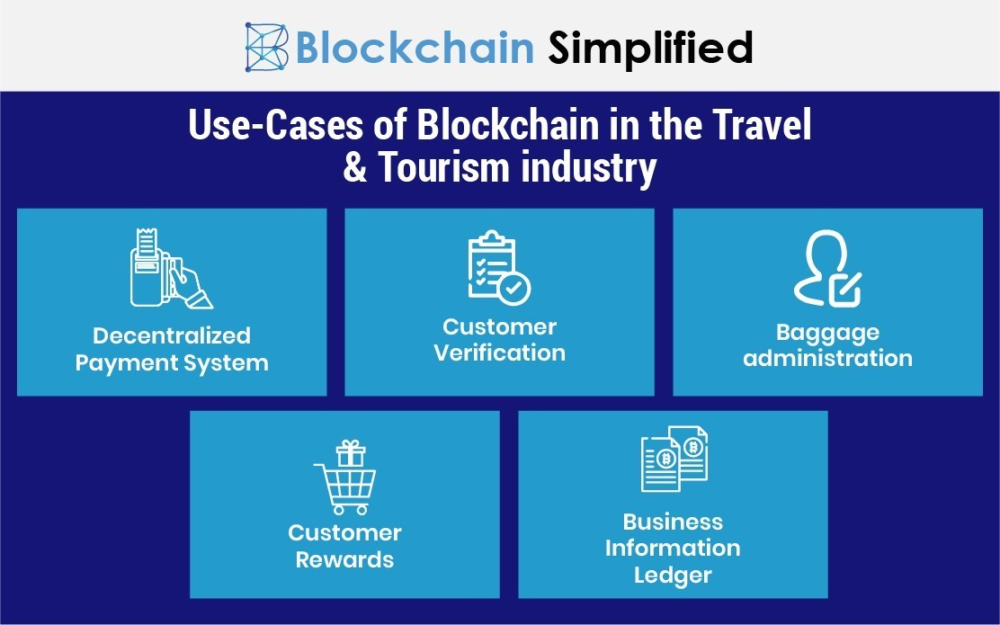

## Table of Contents

## What is blockchain technology and how does it work?

Blockchain technology is like a digital notebook that keeps a record of transactions. It's special because it's not controlled by one person or company. Instead, it's spread out over many computers all over the world. Each page in this notebook, called a "block," is filled with information about different transactions. Once a block is full, it gets added to the notebook, which is called the "chain." This makes it very hard for someone to change or cheat the system because they would need to change the information on all the computers at the same time.

When someone wants to add a new transaction to the blockchain, it gets checked by many computers in the network. These computers use special math problems to make sure the transaction is real and follows the rules. Once it's checked, the transaction gets added to a new block. Each block has a unique code, called a "hash," that connects it to the next block. This way, all the blocks are linked together in a chain, making the information safe and hard to change. This technology is used for things like cryptocurrencies, but it can also be used for other things like tracking goods or keeping medical records safe.

## How can blockchain technology be applied to the travel industry?

Blockchain technology can help make traveling easier and safer. It can be used to keep track of all the steps in a trip, like booking flights, hotels, and tours. With blockchain, all this information is stored in one place that everyone can see but can't change easily. This means if there's a problem, like a flight delay, everyone knows about it quickly and can fix it faster. Also, because the information is safe and can't be changed, travelers can trust that their bookings and payments are secure.

Another way blockchain can help is by making payments simpler and cheaper. When you travel, you often need to pay for things in different countries, which can be tricky and expensive. Blockchain can let you use cryptocurrencies, which are like digital money, to pay for things without needing banks or other middlemen. This can save money and make paying for things faster and easier. Plus, blockchain can help keep your personal information safe when you're traveling, so you don't have to worry about your data being stolen.

## What are the benefits of using blockchain in travel?

Using blockchain in travel can make things easier and more trustworthy. When you book a trip, all the details like flights, hotels, and tours can be kept in one safe place that everyone can see but can't change easily. This means if something goes wrong, like a flight delay, everyone knows about it quickly and can fix it faster. Travelers can trust that their bookings and payments are secure because the information is hard to change.

Another big benefit is that blockchain can make paying for things simpler and cheaper. When you travel, you often need to pay in different countries, which can be tricky and expensive. With blockchain, you can use digital money, or cryptocurrencies, to pay without needing banks or other middlemen. This can save money and make paying for things faster and easier. Plus, blockchain can help keep your personal information safe when you're traveling, so you don't have to worry about your data being stolen.

## Can you name some companies that are using blockchain in the travel sector?

Some companies are using blockchain to make traveling easier and safer. One example is Winding Tree, a company that helps airlines, hotels, and other travel services work together better. They use blockchain to keep all the booking information in one safe place that everyone can see but can't change easily. This helps fix problems like flight delays faster and makes sure travelers' bookings and payments are secure.

Another company is LockTrip, which uses blockchain to let people book hotels and other travel services. They use digital money, or cryptocurrencies, to make paying for things simpler and cheaper. This way, travelers don't need to worry about expensive fees when they pay in different countries. LockTrip keeps all the booking information safe, so travelers can trust that their data won't be stolen.

These are just a couple of examples, but more and more companies are starting to use blockchain in the travel industry. It helps make traveling smoother, more secure, and often cheaper for everyone involved.

## How does blockchain improve security and transparency in travel transactions?

Blockchain makes travel transactions more secure because it keeps all the information in a digital notebook that is spread out over many computers. This means no single person or company can control it. If someone tries to change the information, they would need to change it on all the computers at the same time, which is very hard to do. This makes it safer for travelers because their bookings and payments are protected from being changed or stolen.

Blockchain also makes things more transparent. When you book a trip, all the details are kept in one place that everyone can see but can't change easily. This means if there's a problem, like a flight delay, everyone knows about it quickly. It's easier to fix issues because all the information is clear and open. This helps build trust between travelers and travel companies because everyone can see the same information.

## What are some specific use cases of blockchain in travel?

One way blockchain can be used in travel is for booking flights and hotels. When you book a trip, all the details are stored in a blockchain, which is like a digital notebook that everyone can see but can't easily change. This makes it easier to fix problems like flight delays because everyone knows about them quickly. It also keeps your bookings and payments safe because the information is hard to change or steal. Companies like Winding Tree use blockchain to help airlines, hotels, and other travel services work together better and make sure travelers' information is secure.

Another use case is for making payments easier and cheaper. When you travel, you often need to pay in different countries, which can be tricky and expensive. Blockchain lets you use digital money, or cryptocurrencies, to pay without needing banks or other middlemen. This can save money and make paying for things faster and easier. LockTrip is a company that uses blockchain to let people book hotels and other travel services with cryptocurrencies, keeping the payment process simple and secure.

Blockchain can also help keep your personal information safe while traveling. Because the information is stored in a way that is hard to change, you don't have to worry about your data being stolen. This is important when you're sharing your information with different travel services. By using blockchain, travel companies can make sure that your personal details are protected, making your trip more secure and enjoyable.

## How do blockchain-based loyalty programs work in the travel industry?

Blockchain-based loyalty programs in the travel industry work by letting travelers earn and use rewards in a new way. Instead of using traditional points or miles that are controlled by one airline or hotel, blockchain lets you earn rewards that can be used with many different travel companies. When you book a flight or stay at a hotel, you earn digital tokens that are stored on the blockchain. These tokens are like digital money that you can use to pay for future trips or trade with other travelers. Because the blockchain is safe and hard to change, you can trust that your rewards are secure and won't be lost or stolen.

These programs make it easier to use your rewards because they're not tied to just one company. For example, if you earn tokens from flying with one airline, you can use those tokens to book a hotel or a tour with another company that's part of the same blockchain network. This gives travelers more choices and makes their rewards more valuable. Plus, because everything is stored on the blockchain, it's easy to keep track of your rewards and see how many tokens you have, making the whole process more transparent and fair.

## What challenges do companies face when implementing blockchain in travel?

Companies face some challenges when they want to use blockchain in travel. One big challenge is that blockchain technology is still new and not everyone understands it. This means companies need to spend time and money to teach their workers and customers about how it works. They also need to make sure their computer systems can work with blockchain, which can be hard and expensive. Plus, there are rules and laws about using digital money and keeping data safe that companies need to follow, and these can be different in each country.

Another challenge is that not all travel companies want to work together. Blockchain works best when many companies share information on the same network. But some companies might not want to share their data with others because they worry about losing control or giving away their secrets. This can make it hard to get everyone to join the same blockchain system. Also, if something goes wrong with the blockchain, like a computer problem or a hack, it can be tricky to fix because the information is spread out over many computers.

Even with these challenges, many companies are working hard to use blockchain in travel. They believe it can make traveling easier, safer, and more fun for everyone. By solving these problems, they hope to build a better travel experience using this new technology.

## How does blockchain impact the regulatory environment in travel?

Blockchain can make things trickier for travel companies when it comes to following the rules. Since blockchain uses digital money like cryptocurrencies, companies need to understand and follow different laws about money in each country they work in. These laws can be hard to keep up with because they change a lot and can be different from one place to another. Also, because blockchain keeps information safe and hard to change, companies need to make sure they're following rules about keeping data private and secure. This can be a big challenge, especially when working with many different countries and their rules.

But blockchain can also help make things clearer and easier for regulators. Because all the information is kept in one place that everyone can see, it's easier for regulators to check if companies are following the rules. This can help stop fraud and make sure everyone is playing fair. For example, if there's a problem with a booking or a payment, regulators can look at the blockchain to see exactly what happened. This can help them make better rules and keep the travel industry safe and honest for everyone.

## What future developments can we expect in blockchain applications for travel?

In the future, we can expect blockchain to make traveling even easier and safer. More travel companies might start using blockchain to keep all the trip details in one safe place that everyone can see but can't change easily. This will help fix problems like flight delays faster and make sure travelers' bookings and payments are secure. Also, more travelers might use digital money, or cryptocurrencies, to pay for their trips. This can save money and make paying for things simpler because you won't need banks or other middlemen.

Another thing we might see is more companies working together on the same blockchain network. This will make it easier for travelers to use their rewards with different companies, not just one airline or hotel. For example, you could earn tokens from flying and use them to book a hotel or a tour with another company. This will give travelers more choices and make their rewards more valuable. Plus, as more people learn about blockchain, it will become easier for companies to use it, and they'll find new ways to make traveling better for everyone.

## How do smart contracts enhance the efficiency of travel services?

Smart contracts make travel services work better by automating a lot of the work. They're like digital agreements that do things automatically when certain rules are met. For example, if you book a flight and it gets delayed, a smart contract can automatically give you a refund or rebook your flight without you having to call customer service. This saves time and makes things easier for both travelers and travel companies.

Another way smart contracts help is by making sure everyone follows the rules. They can check that all the details in a booking are correct and that payments are made on time. If something goes wrong, like a hotel overbooking, the smart contract can fix it quickly by finding another room or giving you money back. This makes traveling smoother and more trustworthy because everything is done fairly and automatically.

## What are the potential risks and limitations of using blockchain in the travel industry?

Using blockchain in the travel industry can have some risks and limitations. One big risk is that blockchain technology is still new and not everyone understands it well. This means that if something goes wrong, like a computer problem or a hack, it can be hard to fix because the information is spread out over many computers. Also, because blockchain uses digital money, there are laws about money that companies need to follow, and these laws can be different in each country. This can make it tricky for companies to use blockchain without breaking any rules.

Another limitation is that not all travel companies want to work together. Blockchain works best when many companies share information on the same network, but some might not want to share their data with others because they worry about losing control or giving away their secrets. This can make it hard to get everyone to join the same blockchain system. Plus, setting up and using blockchain can be expensive and take a lot of time, which might stop some companies from using it, even if it could make things better for travelers.

## References & Further Reading

[1]: Pilkington, M. (2016). ["Blockchain Technology: Principles and Applications."](https://papers.ssrn.com/sol3/papers.cfm?abstract_id=2662660) SSRN Electronic Journal.

[2]: Morabito, V. (2017). ["Business Innovation Through Blockchain: The B3 Perspective."](https://www.emerald.com/insight/content/doi/10.1108/FS-09-2018-102/full/html) Springer.

[3]: Nakamoto, S. (2008). ["Bitcoin: A Peer-to-Peer Electronic Cash System."](https://bitcoin.org/bitcoin.pdf)

[4]: Tapscott, D., & Tapscott, A. (2016). ["Blockchain Revolution: How the Technology Behind Bitcoin is Changing Money, Business, and the World."](https://dl.acm.org/doi/10.5555/3051781) Penguin. 

[5]: Christidis, K., & Devetsikiotis, M. (2016). ["Blockchains and Smart Contracts for the Internet of Things."](https://ieeexplore.ieee.org/document/7467408) IEEE Access. 

[6]: Mendling, J., Weber, I., Van Der Aalst, W. M. P., Vom Brocke, J., Cabanillas, C., Daniel, F., ... & Zhu, L. (2018). ["Blockchains for Business Process Management - Challenges and Opportunities."](https://dl.acm.org/doi/10.1145/3183367) ACM Transactions on Management Information Systems.