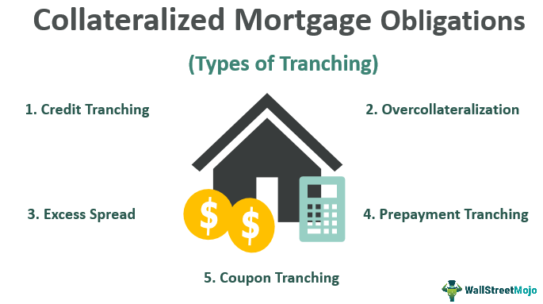

The world of structured finance is both complex and diverse, comprising a wide range of financial instruments and investment strategies tailored to meet varying investor needs. A key instrument within this framework is the collateralized mortgage obligation (CMO). CMOs are sophisticated securities that pool together mortgages and separate them into tranches or segments. These tranches are crafted to satisfy different investor risk preferences and return expectations, thereby allowing market participants to customize their exposure.

One significant aspect of CMOs is the companion tranche, which plays a critical role in managing risks associated with prepayment variabilities. Navigating the dynamics of CMOs and their companion tranches necessitates a deep understanding of their structure and function. When paired with algorithmic trading, these investment strategies can become even more potent. Algorithmic trading, which involves using computer-generated algorithms to execute orders, can significantly refine the process of investing. It provides enhanced accuracy and speed in executing trades, taking into account the complex data patterns inherent in the structured finance market.

Understanding the interplay between CMOs, specifically the nuances of companion tranches, and algorithmic trading can empower investors to make well-informed decisions and improve the performance of their investment portfolios. This article will cover key concepts of CMOs and companion tranches, and demonstrate how algorithmic trading is influencing and optimizing these financial instruments. This knowledge is vital for investors seeking to manage risks effectively and harness potential returns in a rapidly evolving financial landscape.

## Table of Contents

## Understanding CMOs and Tranches

Collateralized mortgage obligations (CMOs) represent a sophisticated form of mortgage-backed securities (MBS) designed to provide investors with varying maturity dates and risk levels. These financial instruments transform the cash flows from a pool of mortgage loans into discrete classes or tranches, each possessing unique characteristics tailored to meet specific investor preferences.

### Structure and Tranche Division

CMOs are structured to separate the risk-return profiles into tranches, thus allowing investors to select based on their risk appetite and investment strategy. The primary tranches found in CMOs include:

1. **Planned Amortization Class (PAC) Tranches:** These offer a stable cash flow schedule by setting specific principal repayment timetables. The predictability reduces both extension and contraction risk, making PAC tranches appealing to conservative investors seeking reliability and consistency in returns.

2. **Targeted Amortization Class (TAC) Tranches:** Similar to PACs, TAC tranches are designed to protect against prepayment risks but to a lesser extent. TACs provide some level of cash flow stability but are more susceptible to interest rate changes than PACs. Investors favor TACs for their moderate unpredictability and potentially higher yields compared to PACs.

3. **Companion Tranches:** Also known as support tranches, companion tranches absorb the excess cash flows not allocated to PAC or TAC tranches. This absorption mechanism protects the upper tranches by taking on the variability in prepayment rates and timing. Due to their volatility and risk exposure, companion tranches generally offer higher yields, attracting investors with a higher risk tolerance.

### Risk Characteristics and Investment Appeal

Each tranche bears distinct risk characteristics and investment appeal:

- **Risk Profiles:** The varying seniority and priority of tranches in a CMO structure expose them to different risk levels. For instance, PAC tranches are safeguarded against prepayment risk and offer predictable returns, making them less risky. In contrast, companion tranches endure the brunt of prepayment variability, thereby carrying higher risk.

- **Investor Attraction:** The diversity in tranche structures enables CMOs to cater to a wide array of investors. Conservative investors may opt for PAC tranches due to their steady return profiles, while aggressive investors seeking higher returns at the expense of increased uncertainty may gravitate towards companion tranches.

This multifaceted approach of CMO structuring by tranches optimizes the alignment between investors' risk preferences and their desired return outcomes, effectively enhancing the CMOs' overall appeal.

## The Role and Importance of Companion Tranches

Companion tranches, often referred to as support tranches, are integral to the stability and functioning of collateralized mortgage obligations (CMOs), particularly in ensuring the consistent flow of payments to the primary tranches, such as planned amortization class (PAC) and targeted amortization class (TAC) tranches. These tranches are engineered to absorb the uncertainties and variabilities in prepayment rates inherent in mortgage-backed securities. Prepayment rates can fluctuate due to various factors such as changes in interest rates or borrower refinancing activities. Without the cushioning effect provided by companion tranches, PAC and TAC tranches would be directly exposed to contraction risk when prepayments exceed expectations and extension risk when prepayments fall short.

The design of companion tranches as a buffer means they bear the brunt of payment variability. When mortgage borrowers prepay their loans faster than anticipated, the excess cash flows are first absorbed by the companion tranches, protecting PAC and TAC tranches from early principal paydowns and maintaining their predetermined amortization schedule. Conversely, in a scenario where prepayments are slower than expected, companion tranches delay receipt of their principal payments, allowing PAC and TAC tranches to receive timely payments according to their sinking fund schedule.

Due to their inherent [volatility](/wiki/volatility-trading-strategies) and higher exposure to prepayment fluctuation risks, companion tranches typically offer higher yields. This risk-return profile makes them attractive to investors who are willing to engage with higher levels of risk for the potential of greater returns. Consequently, companion tranches often find a niche among investors with higher risk appetites or those seeking to diversify their portfolio with assets that provide a higher yield.

For investors, understanding the dynamics of companion tranches involves recognizing the duality of risk and opportunity they present. By closely monitoring prepayment trends and [interest rate](/wiki/interest-rate-trading-strategies) movements, investors can potentially exploit these yield opportunities. Employing advanced analytical tools and predictive models can enhance an investor's ability to manage these risks effectively. This understanding and strategic management of companion tranches can lead to optimized risk-adjusted returns, thus fulfilling the investment objectives of both risk-averse and risk-seeking investors.

## Algorithmic Trading in Structured Finance

Algorithmic trading utilizes computer programs and sophisticated algorithms to execute trades rapidly and efficiently, conforming to predetermined criteria such as timing, price, or quantity. This automated trading approach leverages computational power and vast datasets to enhance decision-making and optimize investment outcomes. In structured finance, specifically concerning collateralized mortgage obligations (CMOs), [algorithmic trading](/wiki/algorithmic-trading) offers several distinct advantages.

Within the context of CMOs, algorithmic trading can be a vital tool in optimizing portfolio allocation and managing the inherent risks of volatile tranches. Volatility in financial markets, particularly in companion tranches of CMOs, requires dynamic risk management and strategic reallocation of assets. By employing algorithms, investors can swiftly adjust their investment portfolios to mitigate risks or capitalize on emerging opportunities. For instance, algorithms can be programmed to identify shifts in interest rates, prepayment speeds, or other factors influencing CMO performance, allowing traders to rebalance their holdings in real-time.

Advanced algorithms also analyze immense amounts of market data to discern trends and identify trading opportunities in CMO markets. Machine learning models, such as decision trees, neural networks, and support vector machines, are frequently used to process historical and real-time data to forecast market movements. These algorithms can detect patterns that may not be observable to human analysts, thereby providing a competitive edge in trading. For example, they can identify correlations between economic indicators and mortgage-backed security performance, helping traders anticipate changes and strategically position their investments.

Algorithmic trading enhances investment strategies for CMOs and companion tranches by enabling precise and timely execution of trades. This precision reduces transaction costs and slippage, ultimately leading to more efficient market operations. Moreover, the ability to process and react to information faster than humanly possible allows investors to capitalize on transient market inefficiencies. Algorithms can be designed to execute high-frequency trading ([HFT](/wiki/high-frequency-trading-strategies)) strategies to exploit small price discrepancies in CMO markets, thereby generating incremental profits through numerous, rapid trades.

In conclusion, algorithmic trading fundamentally transforms the investment landscape for structured finance instruments, such as CMOs. By leveraging the power of advanced computational techniques and data analysis, investors can better navigate the complexities of CMO trading, manage risks more effectively, and enhance the overall performance of their investment portfolios. As technology continues to advance, the role of algorithmic trading in structured finance is poised to expand further, offering new capabilities and opportunities for market participants.

## Conclusion

Investing in structured finance, particularly in collateralized mortgage obligations (CMOs) and their companion tranches, can offer investors a spectrum of returns and risks. By mastering the complex structures of CMOs and utilizing algorithmic trading strategies, investors can effectively manage these risks while maximizing potential returns. Algorithmic trading facilitates the precise and rapid execution of trades and allows portfolio managers to continuously adjust their strategies based on real-time market data and predictions.

The insights presented in this article underscore the pivotal role that companion tranches play within CMOs, highlighting their capacity to absorb volatility and provide stability to more predictable tranches like PAC and TAC. Companion tranches, though volatile, can offer higher yields, appealing to investors who have a higher risk tolerance. 

Moreover, algorithmic trading emerges as a powerful tool in this context, enabling investors to handle the complexity of structured finance products more efficiently. By employing advanced algorithms, traders can conduct granular analyses, identifying subtle market opportunities that may be invisible to human traders. The automation and speed provided by algorithmic trading can be game-changing, optimizing portfolio outcomes and adapting to ever-changing financial landscapes.

In today’s dynamic financial markets, staying informed about the evolving landscape of structured finance and adapting investment strategies accordingly is essential. As the financial industry grows more sophisticated, so too must the strategies employed by investors. Embracing new technologies such as algorithmic trading, alongside an understanding of products like CMOs and tranche structures, is crucial for achieving successful investment outcomes.

## References & Further Reading

[1]: ["The Handbook of Mortgage-Backed Securities"](https://academic.oup.com/book/7943) by Frank J. Fabozzi

[2]: Copper, Gary S., & Farrell, Edward J. (2003). ["Understanding Collateralized Mortgage Obligations."](https://www.copper.org/publications/pub_list/pdf/introduction-to-copper-and-copper-alloys.pdf) CFA Institute Research Foundation.

[3]: ["Algorithmic Trading: Winning Strategies and Their Rationale"](https://books.google.com/books/about/Algorithmic_Trading.html?id=WAlFDwAAQBAJ) by Ernie Chan

[4]: Bennet, Paul, et al. (1999). ["The Role of Companion Bonds in Managing Prepayment Risk."](https://journals.sagepub.com/doi/abs/10.1177/030913259902300203) Federal Reserve Bank of New York Staff Reports.

[5]: ["Fixed Income Analysis"](https://en.wikipedia.org/wiki/Fixed_income_analysis) by Barbara S. Petitt, Jerald E. Pinto, Wendy L. Pirie

[6]: ["Mortgage-Backed Securities: Products, Structuring, and Analytical Techniques"](https://www.amazon.com/Mortgage-Backed-Securities-Structuring-Analytical-Techniques/dp/1118004698) by Laurie S. Goodman and Frank J. Fabozzi

[7]: Varma, Karthik, et al. (2019). ["Algorithmic Trading Strategies for Fixed Income Markets."](https://www.researchgate.net/publication/378548435_Algorithmic_Trading_and_AI_A_Review_of_Strategies_and_Market_Impact) Journal of Financial Markets.