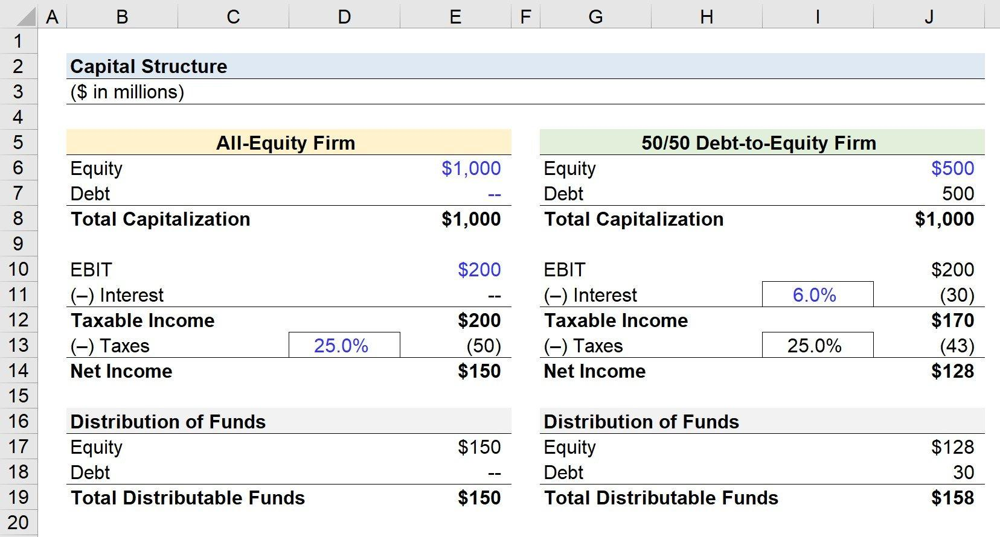

Financial structure refers to the combination of assets, liabilities, and equity that a company utilizes to conduct its operations and achieve its strategic objectives. It serves as a foundational element of an organization’s financial health and determines its ability to withstand market fluctuations and economic shifts. An optimized financial structure is crucial for enhancing a company's valuation, facilitating sustainable growth, and managing risks effectively. It also supports the company in making strategic investment decisions and managing cash flows efficiently.

Capital structure is a central component of a company's financial framework and involves the proportion of debt, equity, and hybrid instruments a company uses to finance its overall activities and expansion. The choice of capital structure can significantly influence the company's financial stability and performance, affecting both its cost of capital and its ability to fund future projects. Key theories, such as the Modigliani-Miller theorem, explore the relationship between capital structure and a company’s value, advocating that under certain conditions, the value of a firm is independent of its capital structure.



Algorithmic trading is a modern finance practice where computer algorithms are used to execute financial transactions at speeds and frequencies impractical for human traders. The development of sophisticated trading algorithms has transformed financial markets, increasing efficiency through rapid order execution, enhanced accuracy, and the ability to handle complex datasets. These trading systems capitalize on mathematical models and automated processes to identify trading opportunities, providing traders with advantages over traditional trading methods.

The objective of this article is to explore the interplay between financial structure, capital structure, and algorithmic trading. By examining how each element interacts, this article will not only highlight the influence of capital structure on algorithmic trading strategies but also consider how algorithmic trading impacts capital and financial structures in trading firms. This exploration will provide insights into the strategic integration of these financial elements, crucial for companies aiming to enhance their financial strategies and operational frameworks.

## Table of Contents

## Understanding Financial Structure

Financial structure refers to the composite framework of a company's financial resources, typically consisting of assets, liabilities, and equity. These elements collectively determine how a business is financed and how it utilizes its financial capital to support its operations and achieve its strategic objectives. 

**Assets** are resources owned or controlled by a company as a result of past transactions or events, which are expected to generate future economic benefits. Assets are typically categorized as current or non-current. Current assets include cash, accounts receivable, and inventory, while non-current assets encompass property, plant, and equipment, as well as intangible assets such as patents and trademarks.

**Liabilities** are the company's obligations arising from past transactions, which are expected to result in an outflow of economic resources. These can be classified as current liabilities, such as accounts payable and short-term debt, and long-term liabilities, which include mortgages, bonds, and long-term leases.

**Equity** represents the residual interest in the company’s assets after deducting liabilities and is commonly referred to as shareholders' equity. It includes components like common stock, retained earnings, and additional paid-in capital.

The equation underpinning the financial structure is:

$$
\text{Assets} = \text{Liabilities} + \text{Equity}
$$

Optimizing a company’s financial structure is of paramount importance, as it influences the firm’s ability to achieve both short-term and long-term objectives. An optimized financial structure can increase returns to shareholders by minimizing the cost of capital and enhancing profitability. Conversely, an imbalanced structure might lead to increased financial risk and reduced flexibility.

A sound financial structure supports a company’s strategy by aligning available financial resources with strategic priorities. For example, a company planning to enter a new market might require a financial structure emphasizing [liquidity](/wiki/liquidity-risk-premium) to support potential upfront costs and uncertainties. A balanced mix of debt and equity can also enhance risk management capabilities, allowing a firm to withstand economic downturns by providing the necessary resilience.

Additionally, a well-structured financial framework supports comprehensive risk management by ensuring that the company maintains adequate liquidity and solvency, thereby reducing the likelihood of financial distress. Companies can tailor their financial structure to their risk tolerance and industry dynamics, enabling them to capitalize on growth opportunities while managing potential downsides.

In conclusion, understanding and optimizing the financial structure are crucial for a company's success. It not only supports robust business strategies but also ensures effective risk management, contributing to sustained financial health and operational efficiency.

## Exploring Capital Structure

Capital structure refers to the mix of a company's long-term sources of financing, which includes debt, equity, and hybrid instruments. This structure is crucial as it determines a company's leverage and cost of capital, impacting its financial health and overall performance.

**Debt** is a borrowed sum with a fixed repayment schedule and interest obligations. Companies often use debt financing to leverage their operations, as interest expenses are tax-deductible, reducing the taxable income. However, excessive debt can lead to a high risk of financial distress.

**Equity**, on the other hand, represents ownership interest in a company. It includes common and preferred stocks, offering no obligatory repayments but often expecting a return in the form of dividends. While equity does not impose a repayment burden, issuing more shares may dilute existing ownership and control.

**Hybrid instruments** are financial tools that exhibit characteristics of both debt and equity. Examples include convertible bonds and preferred shares. These instruments offer flexibility, often allowing companies to tailor their financing strategies to mitigate risks associated with pure debt or equity financing.

The impact of a company's capital structure on its financial health is multifaceted. An optimal capital structure balances the cost of capital against the risk of financial distress to maximize firm value. Companies typically strive to minimize their weighted average cost of capital (WACC), an essential determinant of project valuation.

Various theories shed light on the strategies for selecting an optimal capital structure:

1. **Trade-off Theory**: This suggests that firms balance the benefits of debt, such as tax shields, with the costs of potential financial distress. The trade-off theory proposes that there is an optimal capital structure where these costs and benefits are equilibrated.

2. **Pecking Order Theory**: This theory posits that companies prioritize their sources of financing. They prefer internal financing and, if external funding is necessary, debt is preferred over equity to avoid signaling undervaluation to the market. This behavior is attributed to information asymmetry between a company's management and investors.

Understanding these elements and theories allows financial managers to make informed decisions, tailoring their capital structures to fit the company's strategic goals and market conditions. By leveraging these principles, firms aim to enhance their financial robustness, ensuring both competitive advantage and shareholder value maximization.

## Algorithmic Trading: An Overview

Algorithmic trading, also known as algo trading, is the use of computer algorithms to automate trading activities in financial markets. This method leverages advanced mathematical models and quantitative analyses to execute trades at optimal times, minimizing human intervention. With origins tracing back to the early adoption of computers in financial exchanges in the 1970s, [algorithmic trading](/wiki/algorithmic-trading) has evolved into a cornerstone of modern finance, facilitating trades that are faster and often more efficient than those executed manually.

The basic working principles of algorithmic trading systems revolve around pre-defined criteria and instructions coded into algorithms. These algorithms analyze multiple market variables, such as price, [volume](/wiki/volume-trading-strategy), and time, to determine the most advantageous times to buy or sell securities. Specifically, an algorithmic trading system might be programmed to identify [arbitrage](/wiki/arbitrage) opportunities, execute trades based on statistical patterns, or optimize specific financial metrics like Sharpe ratios.

Here is a simplified example of a basic moving average crossover strategy implemented in Python:

```python
import pandas as pd

# Load your data into a pandas DataFrame
data = pd.read_csv('market_data.csv')

# Calculate short-term and long-term moving averages
short_window = 40
long_window = 100

data['short_mavg'] = data['Close'].rolling(window=short_window, min_periods=1).mean()
data['long_mavg'] = data['Close'].rolling(window=long_window, min_periods=1).mean()

# Generate trading signals
data['signal'] = 0
data['signal'][short_window:] = \
    np.where(data['short_mavg'][short_window:] > data['long_mavg'][short_window:], 1, -1)

# Implement trading orders based on signals
data['positions'] = data['signal'].diff()

# Print the first few entries in the DataFrame to see signals
print(data.head())
```

The advantages of algorithmic trading are manifold. Speed is a critical [factor](/wiki/factor-investing), as algorithms can process vast datasets and execute trades in milliseconds, capitalizing on fleeting market opportunities faster than any human could respond. This speed is complemented by accuracy; algorithms follow the encoded rules precisely, minimizing errors often introduced by human emotional biases and fatigue.

Furthermore, algorithmic trading is adept at handling complex data. In today's data-driven world, financial markets generate immense volumes of information. Advanced algorithms can swiftly sift through this data to identify profitable trading opportunities, including patterns and trends invisible to the human eye.

Algorithmic trading is a critical component of high-frequency trading ([HFT](/wiki/high-frequency-trading-strategies)), where trades occur within fractions of a second to exploit arbitrage opportunities, statistical mispricings, or trend-based predictions. However, while algorithmic trading offers significant benefits, it also poses risks, such as systemic failures or flash crashes, which require robust risk management frameworks. As financial markets continue to innovate, algorithmic trading remains an area of dynamic growth and development.

## The Intersection of Capital Structure and Algorithmic Trading

### The Intersection of Capital Structure and Algorithmic Trading

Capital structure decisions significantly shape a company's approach to algorithmic trading. The capital structure, constituted by the proportion of debt, equity, and hybrid instruments, determines the financial leverage and risk profile a firm is willing or able to assume. For algorithmic trading firms, which rely on high-speed transactions and significant computational resources, accessing capital efficiently becomes paramount.

Algorithmic trading impacts the financial structure of trading firms by necessitating investment in technology and infrastructure, which can be capital-intensive. This focus on technology requires firms to optimize their capital structure to secure financing without excessively increasing their cost of capital. Companies often leverage debt to benefit from tax shields; however, excessive debt raises interest payment obligations and financial risk. Ideally, firms seek a balanced structure that minimizes the weighted average cost of capital (WACC):

$$
\text{WACC} = \frac{E}{V} \cdot R_e + \frac{D}{V} \cdot R_d \cdot (1 - T_c)
$$

Where:
- $E$ is the market value of equity,
- $V$ is the total value of capital (equity + debt),
- $R_e$ is the cost of equity,
- $D$ is the market value of debt,
- $R_d$ is the cost of debt,
- $T_c$ is the corporate tax rate.

The introduction of algorithmic trading can recalibrate financial structures by shifting the emphasis towards equity financing to mitigate the risk of insolvency that high-frequency trading-induced [volatility](/wiki/volatility-trading-strategies) can exacerbate. Moreover, algorithmic trading can improve liquidity, lower transaction costs, and enable quicker adaptations to market changes, enhancing firm value and potentially affecting their equity valuations positively.

However, there are risks associated with integrating algorithmic trading into capital structure strategies. The volatile nature of algorithmic trading might increase the company's overall risk profile, potentially leading to higher beta values and, consequently, a higher cost of equity. Additionally, the reliance on sophisticated trading infrastructure necessitates continued capital investment and operational risk management to prevent technological failures, which could have adverse financial impacts.

Algorithmic trading also brings benefits, such as improved decision-making speed and efficiency, both crucial in dynamically restructuring capital. The ability to rapidly analyze vast datasets allows firms to forecast market movements and adjust their trading strategies promptly. This agility can be used to optimize their capital structure, for instance, by deciding on the timing of debt issuance in favorable [interest rate](/wiki/interest-rate-trading-strategies) environments or equity financing when the market conditions are favorable.

Ultimately, successful integration of algorithmic trading in capital structure management allows firms to enhance strategic flexibility, better manage financial risks, and optimize overall economic outcomes. Companies that effectively align their capital structures with trading innovations typically maintain competitive advantages in financial markets, aiding long-term sustainable growth.

## Case Studies and Real-World Examples

In exploring the integration of capital structure and algorithmic trading, several companies serve as instructive case studies, showcasing both successes and challenges.

### Successful Integration

One notable example is Renaissance Technologies, a [hedge fund](/wiki/hedge-fund-trading-strategies) that has effectively incorporated algorithmic trading within its capital structure. Renaissance is renowned for its [quantitative trading](/wiki/quantitative-trading) strategies, which rely heavily on algorithmic models to predict market movements. By utilizing proprietary algorithms, Renaissance has consistently generated high returns, demonstrating how a well-structured capital base, with a balanced mix of equity and secured debt, can support extensive computational and data processing capabilities. The lessons learned from Renaissance highlight the importance of investing in robust technological infrastructure and maintaining a flexible capital structure to adapt to changing market conditions.

Another example is Goldman Sachs, which has extensively integrated algorithmic trading across its operations. The firm's strategic use of a diverse capital structure, incorporating both equity and complex financial instruments, has allowed it to expand in algorithmic trading. This integration has enhanced its ability to rapidly execute trades with high precision and manage large volumes of transactions efficiently. The key takeaway from Goldman Sachs is the significance of aligning capital resources with technological advancements to maximize trading efficacy and maintain competitive advantage.

### Challenges in Integration

Conversely, Knight Capital Group illustrates the risks associated with improper integration of algorithmic trading into the capital structure. In 2012, a software error in the firm's trading algorithms led to a loss of $440 million in 45 minutes. This incident underscored the critical need for rigorous risk management processes and contingency plans. Knight Capital’s experience underscores the potential pitfalls of heavy reliance on algorithmic systems without comprehensive oversight and the necessity of securing a capital buffer to absorb unforeseen financial shocks.

### Trends and Future Outlook

The intersection of capital structure and algorithmic trading is evolving with several emerging trends:

1. **Increased Automation**: Companies are increasingly automating not only their trades but also their capital allocation decisions. Machine learning models are being adopted to optimize debt and equity allocations, enhancing financial flexibility and responsiveness.

2. **Diversification of Capital Sources**: Firms are exploring diversifying their capital sources to include more venture capital and private equity, facilitating quicker adaptation to technological innovations in trading algorithms. 

3. **Enhanced Regulatory Focus**: As algorithmic trading becomes more pervasive, regulatory bodies are intensifying scrutiny over how firms integrate these systems within their financial structures. Compliance with evolving regulations is becoming a strategic priority, necessitating adjustments in capital planning.

4. **Adaptation to Volatility**: Algorithmic trading firms are placing greater emphasis on capital structures that can withstand increased market volatility. This involves leveraging hybrid instruments that offer both debt-like and equity-like features, providing a buffer against unpredictable trading outcomes.

Looking ahead, companies integrating algorithmic trading into their financial strategies must prioritize a balanced, adaptable capital structure. This alignment will enable them to harness technological advancements while managing associated risks, ultimately sustaining long-term growth and competitiveness in the dynamically evolving financial landscape.

## Conclusion

Analyzing the interplay between financial structure, capital structure, and algorithmic trading reveals significant insights into modern business finance. Financial structure, comprising assets, liabilities, and equity, forms the backbone of a company's finances, dictating how it allocates resources and manages risk. An optimized financial structure supports a company's strategic objectives, ensuring efficient capital allocation and effective risk management.

Capital structure, divided into components like debt, equity, and hybrid instruments, plays a crucial role in determining a company's financial health and performance. Sound capital structure decisions can influence a company's borrowing costs and financial stability, affecting its competitive position. Theories such as the trade-off theory and pecking order theory provide frameworks for these decisions, balancing risk and return.

Algorithmic trading introduces a technological component into finance, enhancing trading speed, accuracy, and the ability to process complex datasets. This efficiency can benefit a firm's financial and capital structure, enabling better liquidity management and optimized debt-equity ratios.

The synthesis of capital structure and algorithmic trading presents new opportunities and challenges. Algorithmic trading has the potential to augment traditional financial and capital management strategies, providing firms with a competitive edge in making informed, data-driven decisions. Companies that effectively integrate algorithmic trading into their financial strategies can achieve improved operational efficiency and financial performance.

However, the integration of algorithmic trading with financial structure requires careful consideration of associated risks, including technological, market, and operational risks. Firms should ensure robust risk management practices and infrastructure to mitigate these risks, safeguarding against potential adverse impacts.

In conclusion, striking a balance between financial structure, capital structure, and algorithmic trading is imperative for contemporary business success. Companies should focus on integrating these elements strategically, using algorithmic trading as a tool to enhance financial decision-making and execution. By embracing technological advancements alongside sound financial management practices, companies can innovate their financial strategies, driving sustainable growth and competitiveness in the evolving financial landscape.

## References

1. Ross, S. A., Westerfield, R. W., & Jaffe, J. (2013). **Corporate Finance** (10th ed.). McGraw-Hill Education. A comprehensive text exploring the core concepts of corporate finance, including financial and capital structures.

2. Modigliani, F., & Miller, M. H. (1958). **The Cost of Capital, Corporation Finance and the Theory of Investment**. *The American Economic Review*, 48(3), 261-297. This foundational article presents the Modigliani-Miller theorem, which forms the basis for much of modern thinking on capital structure.

3. Hull, J. C. (2018). **Options, Futures, and Other Derivatives** (10th ed.). Pearson. An authoritative source on derivatives, algorithmic trading, and risk management strategies.

4. Brunnermeier, M., & Pedersen, L. H. (2009). **Market Liquidity and Funding Liquidity**. *Review of Financial Studies*, 22, 2201-2238. This paper examines the overlaps between market and funding liquidity, providing insights into the implications for algorithmic trading.

5. Gomber, P., Arndt, B., Lutat, M., & Uhle, T. (2011). **High-Frequency Trading**. *Discussion Paper, University of Frankfurt*. This paper reviews the increased prevalence of algorithmic trading, specifically high-frequency trading, discussing both its benefits and risks.

6. Brennan, M. J., & Schwartz, E. S. (1984). **Optimal Financial Policy and Firm Valuation**. *The Journal of Finance*, 39(3), 593-607. An analysis of how optimal financial policies, including capital structure decisions, can impact firm valuation.

7. Pyles, M. K. (2014). **The Basics of Financial Econometrics: Tools, Concepts, and Asset Management Applications**. Wiley. This book provides a foundational understanding of the econometric techniques often used in algorithmic trading systems.

8. Kose, J., & Krishna R. (2009). **Investment-Cash Flow Sensitivity: Constraints or Asset Intangibility?**. *The Review of Financial Studies*, 22(3), 907-937. A discussion on the sensitivity of investment to cash flow, relevant for considering the financial structure of algorithmic trading firms.

9. Chordia, T., Roll, R., & Subrahmanyam, A. (2008). **Liquidity and Market Efficiency**. *Journal of Financial Economics*, 87, 249-268. This article explores how liquidity influences market efficiency, an important consideration in algorithmic trading strategies.

10. Grobys, K. (2020). **Machine Learning Techniques for Algorithmic Trading**. *Journal of Financial Markets and Portfolio Management*, 34(2), 183-202. An exploration of how machine learning is applied in developing sophisticated algorithmic trading systems.

### Further Reading
- **Investopedia**: [Understanding the Capital Structure](https://www.investopedia.com/terms/c/capitalstructure.asp)
- **NerdWallet**: [How Algorithmic Trading Works](https://www.nerdwallet.com/article/investing/algorithmic-trading)
- **Research Gate**: [Algorithmic Trading and High-Frequency Trading](https://www.researchgate.net/publication/256013083_Algorithmic_Trading_and_High-Frequency_Trading)

## References & Further Reading

[1]: Modigliani, F., & Miller, M. H. (1958). ["The Cost of Capital, Corporation Finance and the Theory of Investment."](https://www.jstor.org/stable/1812919) The American Economic Review, 48(3), 261-297.

[2]: Ross, S. A., Westerfield, R., & Jaffe, J. (2013). ["Corporate Finance (10th ed.)."](https://www.mheducation.com/highered/product/corporate-finance-ross-westerfield/M9781260772388.html) McGraw-Hill Education.

[3]: Hull, J. C. (2018). ["Options, Futures, and Other Derivatives (10th ed.)."](https://www.semanticscholar.org/paper/Options%2C-Futures%2C-and-Other-Derivatives-Hull/89bdee500c8623864fc9eb7a471546aa713acc44) Pearson.

[4]: Brunnermeier, M., & Pedersen, L. H. (2009). ["Market Liquidity and Funding Liquidity."](https://www.nber.org/papers/w12939) Review of Financial Studies, 22, 2201-2238.

[5]: Gomber, P., Arndt, B., Lutat, M., & Uhle, T. (2011). ["High-Frequency Trading."](https://www.semanticscholar.org/paper/High-Frequency-Trading-Gomber-Arndt/3d0ba8179934e0a45e85a184d1ec526616e2e213) Discussion Paper, University of Frankfurt.

[6]: Pyles, M. K. (2014). ["The Basics of Financial Econometrics: Tools, Concepts, and Asset Management Applications."](https://onlinelibrary.wiley.com/doi/book/10.1002/9781118856406) Wiley.

[7]: Chordia, T., Roll, R., & Subrahmanyam, A. (2008). ["Liquidity and Market Efficiency."](https://www.sciencedirect.com/science/article/pii/S0304405X07001833) Journal of Financial Economics, 87, 249-268.

[8]: Grobys, K. (2020). ["Machine Learning Techniques for Algorithmic Trading."](https://github.com/kevincdurand1/Machine-Learning-for-Algorithmic-Trading-Second-Edition) Journal of Financial Markets and Portfolio Management, 34(2), 183-202.

[9]: Brennan, M. J., & Schwartz, E. S. (1984). ["Optimal Financial Policy and Firm Valuation."](https://onlinelibrary.wiley.com/doi/10.1111/j.1540-6261.1984.tb03647.x) The Journal of Finance, 39(3), 593-607.

[10]: Kose, J., & Krishna, R. (2009). ["Investment-Cash Flow Sensitivity: Constraints or Asset Intangibility?"](https://www.jstor.org/stable/2951280) The Review of Financial Studies, 22(3), 907-937.