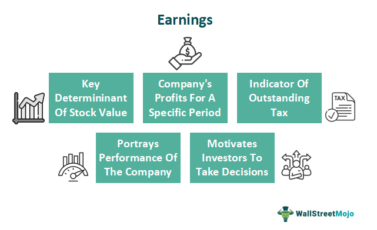

In today's dynamic and fast-paced financial landscape, the intersection of algorithmic trading, company earnings guidance, and financial risk management is vital in crafting effective investment strategies. Algorithmic trading has become a dominant force in the financial markets, utilizing computer programs to execute orders based on predefined criteria, which enhances efficiency and accuracy, yet introduces complexities concerning market dynamics and regulatory compliance. Meanwhile, company earnings guidance serves as a key informational tool, enabling investors to align their expectations with projected financial performance. This practice shapes investor sentiment, influencing trading decisions, and subsequently impacting market volatility.

Understanding the synergy between company earnings guidance and algorithmic trading is essential for investors aiming to refine their investment portfolios while mitigating financial risks. As algorithms increasingly incorporate forward-looking earnings data, the precision of company guidance can significantly impact the securities’ pricing and trading strategies. However, misguidance or overly optimistic projections can lead to abrupt market movements, posing risks to both individual and institutional investors.



Furthermore, the convergence of these elements underscores the importance of robust risk management frameworks, necessary to buffer against potential miscalculations and market disruptions. In response, regulatory bodies such as the Commodity Futures Trading Commission (CFTC) and the Securities and Exchange Commission (SEC) have established comprehensive guidelines to safeguard market integrity and protect investor interests.

This article provides an exploration into the interconnected role these components play within the financial markets, examining their significance, inherent risks, and the evolving regulatory landscape. Recognizing these interactions is pivotal for investors seeking to optimize their strategic approaches in today's complex market environment.

## Table of Contents

## Understanding Company Earnings Guidance

Company earnings guidance is a crucial communication tool employed by public companies to provide their shareholders with an outlook on future financial performance. This informal report typically entails projections related to revenue, net income, and capital expenditures for upcoming quarters or the fiscal year. It serves as a strategic approach to manage market expectations and can significantly influence investor and analyst behavior. 

### Components of Earnings Guidance

Earnings guidance usually comprises several key metrics:

- **Revenue Projections**: This indicates the expected sales or income generated from the company's core business operations. It reflects the company's growth prospects and market positioning.

- **Earnings Forecast**: Often articulated as earnings per share (EPS), this estimation furnishes insights into the company's profitability. It is derived from anticipated revenues after accounting for expenses, taxes, and other financial obligations.

- **Capital Expenditure Plans**: Companies often disclose planned investments in infrastructure, technology, or acquisitions, which can signal long-term strategic priorities.

The dissemination of these projections enables investors and market analysts to adjust their financial models and expectations accordingly, aiding in more informed decision-making regarding stock valuation and trading strategies.

### The Strategic Balance in Guidance

Providing accurate earnings guidance is a delicate exercise for companies, requiring a balance between transparency and prudence. Overly optimistic forecasts that fail to materialize can erode trust and lead to significant market backlash, including potential legal ramifications for misrepresenting financial prospects. Conversely, conservative projections might undervalue a company's potential, influencing stock pricing negatively.

### Legal and Regulatory Implications

Companies must navigate the legal landscape carefully when issuing guidance. The U.S. Securities and Exchange Commission (SEC), for instance, enforces regulations that mandate truthful and complete disclosure, preventing fraudulent claims. Firms issuing guidance must ensure compliance with these rules to deter allegations of market manipulation or misinformation.

### Impact on Market Dynamics

Earnings guidance is a potent driver of market sentiment and stock price [volatility](/wiki/volatility-trading-strategies). For instance, a company announcing higher-than-expected guidance often experiences a favorable market response, with stock prices rising in anticipation of improved financial performance. Conversely, guidance falling short of analyst expectations can lead to sharp declines in stock values.

In conclusion, company earnings guidance plays a pivotal role in the financial markets by shaping the expectations and strategies of investors and analysts. It is essential for companies to provide well-calibrated forecasts to foster transparency and maintain credibility while mitigating potential legal repercussions.

## Algorithmic Trading: An Overview

Algorithmic trading refers to the use of advanced computer algorithms to execute trading orders at speeds and volumes that far exceed human capabilities. This approach has dramatically transformed financial markets by enhancing efficiency and reducing the potential for human error. In its essence, [algorithmic trading](/wiki/algorithmic-trading) involves creating a set of precise instructions for computers to follow, which can include defining the timing, price, quantity, or any other model specific to the trade.

### Efficiency and Speed

One of the primary advantages of algorithmic trading is its ability to [carry](/wiki/carry-trading) out transactions in fractions of a second. This high-frequency trading ([HFT](/wiki/high-frequency-trading-strategies)) capability allows traders to capitalize on even the smallest price discrepancies across markets, thereby enhancing profitability. The use of algorithms removes emotional factors from trading, enabling consistent decision-making processes. This approach ensures that predefined strategies are strictly adhered to, leading to a more systematic investment process.

### Market Manipulation and Compliance Challenges

Despite the advantages, algorithmic trading poses certain challenges and risks. One significant concern is the potential for market manipulation. Algorithms can be designed to execute strategies that may unfairly disadvantage other market participants, such as spoofing or layering, which involve placing orders without the intention of executing them to mislead other traders about market demand or supply.

Moreover, the complexity of algorithmic systems introduces the risk of technical failures, which can lead to substantial financial losses and contribute to market instability. For example, the "Flash Crash" of May 6, 2010, demonstrated how algorithmic trading could exacerbate market volatility, prompting a sudden and severe stock market drop within minutes.

### Regulatory Framework

Recognizing these risks, regulatory bodies like the Commodity Futures Trading Commission (CFTC) and the Securities and Exchange Commission (SEC) in the United States have established regulations to maintain market integrity. The Market Access Rule (SEC Rule 15c3-5), for instance, seeks to control the financial and operational risks associated with direct market access granted to trading firms. Furthermore, Regulation Automated Trading (Reg AT) proposed by the CFTC aims to enhance oversight on automated trading activities by requiring registration of algorithmic trading systems and implementing risk controls.

Through these regulatory frameworks, authorities strive to ensure that algorithmic trading contributes to market efficiency while safeguarding against systemic risks and maintaining a fair trading environment.

## Impact of Company Guidance on Algorithmic Trading

Earnings guidance issued by companies is a pivotal [factor](/wiki/factor-investing) influencing stock prices and trading strategies, particularly within the context of algorithmic trading. Algorithmic trading leverages high-speed computer algorithms capable of executing trades within fractions of a second, making timely and accurate data integration critical. When a company releases earnings guidance, these algorithms quickly incorporate the revised projections into their trading models, which can drive significant market movements.

The integration of earnings guidance data involves algorithms assessing the expected changes in revenue, earnings, and other financial indicators to optimize trading strategies. For instance, if a company announces higher-than-expected earnings guidance, algorithms may adjust their models to increase buying actions, anticipating a rise in the company's stock price. Conversely, lower-than-expected guidance might trigger selling actions to mitigate potential losses.

The impact of company earnings guidance on algorithmic trading is not without risks. Miscalculations or inaccurate forecasts can lead to unexpected market volatility. If a company's earnings guidance does not align with actual performance, it can result in sharp price movements as algorithmic systems adjust their positions rapidly. For example, if guidance overstates future earnings, and subsequent earnings releases show a shortfall, stock prices may drop suddenly, exacerbating losses for automated trading systems that had anticipated positive movements.

In such dynamic scenarios, the role of robust risk management frameworks is emphasized. Ensuring algorithms are equipped to handle unexpected deviations in company guidance can mitigate potential adverse effects on trading outcomes. By continuously refining these trading models and incorporating layers of risk assessment, traders can navigate the complexities introduced by company earnings guidance within algorithmic trading environments effectively.

## Financial Risks and Mitigation Strategies

Both company earnings guidance and algorithmic trading present distinct financial risks that require careful attention from investors and traders to safeguard against potential adverse outcomes. Errors in earnings projections, often stemming from overly optimistic forecasts or unforeseen market conditions, can mislead investors and prompt misguided trading decisions. Such inaccuracies potentially result in significant financial setbacks. Misguided forecasts may cause shifts in investor sentiment, precipitating abrupt stock price movements and subsequent market volatility.

Algorithmic trading, while offering speed and efficiency, introduces unique risks, including technical malfunctions and model inaccuracies, which can trigger substantial financial losses. Algorithms rely on vast datasets and complex models; minor errors in programming or data interpretation can lead to erroneous trades. Additionally, these trading systems are susceptible to "flash crashes," where hyper-fast automated trading causes rapid price reversals, creating turmoil in the financial markets.

To mitigate these risks, implementing strong risk management frameworks is crucial. One effective strategy is stress testing, which involves simulating adverse conditions to evaluate the resilience of trading algorithms and investment portfolios. By identifying potential vulnerabilities, stress testing enables investors to fortify their strategies against unexpected market events. Another vital component of risk management is model validation, ensuring that algorithmic models accurately reflect market realities and perform as intended. This process involves rigorous testing and continuous recalibration to maintain model efficacy.

Python, a widely-used programming language in financial modeling, can aid in stress testing and model validation. Here is a simplified example of a stress testing scenario using Python:

```python
import numpy as np

# Simulate market scenarios
market_changes = np.random.normal(loc=0, scale=1, size=1000)  # Normal distribution
portfolio_value = 1000000  # Initial portfolio value

# Apply stress test
risk_factors = [0.05, 0.1, 0.2]  # different levels of stress
for risk in risk_factors:
    stressed_values = portfolio_value * (1 + market_changes * risk)
    value_at_risk = portfolio_value - np.percentile(stressed_values, 5)
    print(f"Value at Risk (VaR) at {risk*100}% stress level: {value_at_risk:.2f}")
```

This code snippet models potential changes in market conditions and calculates the Value at Risk (VaR) for different stress levels, helping investors understand the potential maximum loss over a given time frame under adverse market conditions.

Comprehensive risk management combining stress testing, model validation, and vigilant monitoring of earnings projections and trading algorithms is essential for reducing the likelihood of systemic financial failures. Investors need these proactive measures to navigate complex financial landscapes effectively, ensuring stability and sustaining positive investment outcomes.

## Regulatory Framework and Compliance

Regulatory oversight plays a vital role in managing the risks associated with algorithmic trading and company guidance, ensuring the stability and integrity of financial markets. In the United States, primary responsibility for overseeing these activities falls to agencies such as the Commodity Futures Trading Commission (CFTC) and the Securities and Exchange Commission (SEC). These regulatory bodies have implemented various rules and guidelines to promote transparency and protect investors.

One of the key regulations enforced by the SEC is the Market Access Rule (Rule 15c3-5). This rule requires brokers and dealers with market access to establish, document, and maintain a system of risk management controls and supervisory procedures. These measures are designed to prevent erroneous or unauthorized orders and to ensure compliance with regulatory requirements. By enforcing the Market Access Rule, the SEC aims to prevent systemic risks that could arise from algorithmic trading mistakes and to maintain orderly trading conditions in the markets.

Similarly, Regulation Automated Trading (Regulation AT) was proposed by the CFTC to enhance the oversight of algorithmic trading on U.S. futures markets. Although not yet finalized, Regulation AT intends to require firms engaged in algorithmic trading to implement pre-trade risk controls, system safeguards, and compliance reporting. This regulation emphasizes the need for robust risk management frameworks that can mitigate the risks of algorithmic trading errors that could lead to market disruptions.

Compliance with these regulations is critical for maintaining market stability and protecting investors. It involves not only adhering to the established rules but also implementing comprehensive internal controls and procedures. Firms engaged in algorithmic trading must continually monitor and adapt their trading systems to comply with the evolving regulatory landscape, ensuring that they are capable of handling extreme market conditions without triggering financial instability.

These regulatory frameworks are essential in fostering a fair and transparent trading environment. They address issues such as market manipulation and information asymmetry, which are potential risks associated with algorithmic trading and company guidance disclosures. By enforcing stringent guidelines, regulators strive to preserve investor confidence and promote the integrity of financial markets, ultimately contributing to a more resilient financial system.

## Future Trends: Innovation and Challenges

As technology evolves, algorithmic trading and company earnings guidance are experiencing significant innovation, contributing to more sophisticated and efficient financial markets. Algorithmic trading is increasingly leveraging [machine learning](/wiki/machine-learning) and [artificial intelligence](/wiki/ai-artificial-intelligence) (AI) to enhance decision-making processes and improve trading accuracy. AI algorithms can analyze vast datasets in real time, identifying patterns and opportunities that human traders might overlook. This capability allows for the development of predictive models that anticipate market movements with greater precision.

However, these advancements pose new challenges, particularly in adapting to regulatory changes and managing the complexities of evolving algorithms. Regulatory bodies are continually updating their guidelines to address the potential risks associated with high-frequency trading, such as market manipulation and systemic failures. Compliance with these regulations requires continuous monitoring and adjustment of trading algorithms, demanding significant resources and technical expertise from financial institutions.

As algorithms become more complex, they also become more opaque, making it difficult for regulators and firms to understand the underlying decision-making processes. This opacity can lead to unintentional biases or errors in trading strategies, potentially resulting in substantial financial losses. Therefore, the development of transparent and interpretable models is crucial to ensure both effectiveness and compliance.

Investors must stay informed about these technological and regulatory developments to effectively utilize algorithmic trading while mitigating associated risks. Engaging with continuous education programs and regulatory updates can help investors and financial professionals keep pace with the changes. Furthermore, implementing strong governance frameworks and regularly validating trading models can help institutions navigate these challenges. By fostering a proactive approach to innovation and regulation, investors can harness the full potential of algorithmic trading and earnings guidance, improving their investment strategies and market outcomes.

## Conclusion

The intricate relationship between company earnings guidance, algorithmic trading, and financial risk management forms a cornerstone of contemporary investment strategies. Earnings guidance provides investors with projected financial performance metrics, assisting them in making informed decisions. When coupled with algorithmic trading, this data fuels rapid decision-making processes, enhancing trading efficiency and potentially increasing returns. However, the symbiotic reliance of these elements also presents significant risks if mismanaged. Accurate comprehension of earnings guidance ensures algorithms respond appropriately to market cues, minimizing volatility and avoiding erroneous trades that could lead to financial loss. 

As the financial landscape continues to evolve, regulatory frameworks, such as those enforced by the Commodity Futures Trading Commission (CFTC) and the Securities and Exchange Commission (SEC), play a pivotal role in mitigating these risks. Compliance with these regulations ensures transparency and protects market integrity, safeguarding investors from systemic disruptions. Vigilance in adapting to regulatory shifts and advancements in trading technologies is critical. Investors are tasked with staying informed and agile, continuously refining their strategies to accommodate both new opportunities and emerging challenges. In doing so, they can optimize their portfolios' performance while effectively managing inherent risks. 

The dynamic triad of earnings guidance, algorithmic trading, and financial risk management requires a balanced approach, combining strategic foresight with robust regulatory adherence. As investors navigate this interplay, their ability to adapt and respond to the continuously changing market conditions will define their financial success.

## References & Further Reading

[1]: Bergstra, J., Bardenet, R., Bengio, Y., & Kégl, B. (2011). ["Algorithms for Hyper-Parameter Optimization."](https://dl.acm.org/doi/10.5555/2986459.2986743) Advances in Neural Information Processing Systems 24.

[2]: ["Advances in Financial Machine Learning"](https://www.amazon.com/Advances-Financial-Machine-Learning-Marcos/dp/1119482089) by Marcos Lopez de Prado

[3]: ["Evidence-Based Technical Analysis: Applying the Scientific Method and Statistical Inference to Trading Signals"](https://www.amazon.com/Evidence-Based-Technical-Analysis-Scientific-Statistical/dp/0470008741) by David Aronson

[4]: ["Machine Learning for Algorithmic Trading"](https://github.com/stefan-jansen/machine-learning-for-trading) by Stefan Jansen

[5]: ["Quantitative Trading: How to Build Your Own Algorithmic Trading Business"](https://www.amazon.com/Quantitative-Trading-Build-Algorithmic-Business/dp/1119800064) by Ernest P. Chan