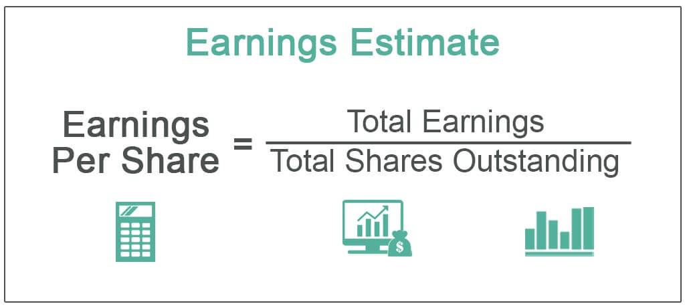

The financial market is an ever-evolving landscape where the measurement of earnings plays a critical role in determining a company's financial health. Earnings reports, usually released on a quarterly basis, provide investors with essential insights into a company's profitability and overall performance. These reports serve as a foundational tool for investors and analysts who seek to make informed decisions by evaluating the financial health and growth potential of companies.

In the digital age, algorithmic trading, or algo trading, has transformed how companies and investors engage with the stock market. Algo trading utilizes computer algorithms to analyze vast amounts of data, enabling the rapid execution of trades that surpasses human capabilities in speed and efficiency. This approach has significantly altered investment strategies, offering new opportunities and challenges in the financial sector.



This article explores the intersection of financial measurements, corporate earnings, and the innovative world of algorithmic trading. While earnings reports provide a snapshot of a company's financial health, the integration of these reports with algorithmic models enhances data-driven investment strategies, potentially leading to more accurate market predictions and optimized trading decisions.

Understanding the synergy between these factors can help investors navigate this dynamic marketplace. By effectively analyzing financial measurements and leveraging algorithmic trading, investors can enhance their decision-making process, identify potential risks, and seize market opportunities. This integrated approach is crucial for those seeking to thrive in today's fast-paced financial environment.

## Table of Contents

## Understanding Financial Measurements and Earnings

Financial measurements are essential as they offer insights into a company's economic well-being and its potential for future growth. Key financial metrics often analyzed include earnings per share (EPS), revenue growth, and net income. Each of these metrics serves as a vital indicator of a company’s market performance.

Earnings per share (EPS) is calculated by dividing a company's net income by its total number of outstanding shares. It reflects the company’s profitability on a per-share basis and is a crucial metric for investors as it indicates how much money a company makes for every share of its stock. The formula for EPS is:

$$
\text{EPS} = \frac{\text{Net Income} - \text{Preferred Dividends}}{\text{Average Outstanding Shares}}
$$

Revenue growth, another significant metric, measures the increase in a company's sales over a specific period. This growth is an indicator of how well a company can increase its customer base and demand for its products or services. Sustained revenue growth can suggest a strong business model and effective management.

Net income, also known as the "bottom line", is the total profit of a company after all expenses, taxes, and costs have been subtracted from total revenue. It is a comprehensive measure of a company's profitability and is used alongside other metrics like EPS to give a fuller picture of financial health. The formula for calculating net income is:

$$
\text{Net Income} = \text{Total Revenue} - \text{Total Expenses}
$$

Earnings reports are typically released on a quarterly basis and provide a snapshot of a company’s financial performance during the reported period. These reports allow investors and analysts to assess whether a company is meeting, exceeding, or falling short of market expectations. Earnings reports are critical for forecasting future performance as they can influence stock prices and investment decisions.

In the context of trading, accurately interpreting these financial measurements can significantly influence investment choices. Investors base decisions on these metrics to anticipate stock price movements and evaluate the potential risks and rewards linked to investments. Understanding these financial measurements aids in constructing a more informed and calculated approach to investing, ultimately aiming to maximize returns and minimize risks.

## The Rise of Algorithmic Trading

Algorithmic trading, often abbreviated as algo trading, is a method of executing trades using automated, pre-programmed trading instructions. These instructions are based on variables like time, price, and [volume](/wiki/volume-trading-strategy), and utilize computer algorithms to make decisions with little to no human intervention. This approach has been transformative in modern trading environments due to its ability to process massive quantities of data rapidly and execute trades across multiple markets and exchanges with precision and speed.

The popularity of [algorithmic trading](/wiki/algorithmic-trading) can be attributed to several of its intrinsic benefits. One of the foremost advantages is its ability to process real-time market data and execute trades at a speed and frequency that a human trader cannot match. This is crucial in financial markets where milliseconds can determine the profitability of a trade. Algorithms can be designed to follow various strategies such as trend-following, where they identify and exploit the [momentum](/wiki/momentum) of asset prices; [arbitrage](/wiki/arbitrage), which involves taking advantage of price discrepancies between different markets or instruments; and market timing, where trades are executed based on predictive models to benefit from expected market movements.

The efficiency of algo trading substantially reduces human errors that can occur due to emotional or psychological factors in trading. For institutional traders, this means an ability to execute large orders without causing significant market impact, thanks to strategies like VWAP (Volume Weighted Average Price) and TWAP (Time Weighted Average Price) that optimize the execution of large trades over a designated period. For retail traders, it offers access to sophisticated trading techniques that were previously the domain of professional traders.

Despite its advantages, algorithmic trading is not without challenges. One significant requirement is the need for robust technological infrastructure, including high-speed internet connections and powerful computational systems. This infrastructure must support the algorithms at every stage of the trading process, from data intake to execution and post-trade analysis. Moreover, the risk of market [volatility](/wiki/volatility-trading-strategies) is amplified in algo trading. Algorithms may react to market variables in unpredictable ways during turbulent market conditions, which can exacerbate price swings and lead to events like flash crashes.

There is also the concern of over-optimization, where algorithms become overly fine-tuned to historical data, resulting in poor real-world performance when market conditions change. Additionally, the complexity and opacity of some algorithmic models can make it difficult for traders and regulators to fully understand and anticipate their behavior, raising regulatory and ethical concerns about transparency and fairness in the markets.

In conclusion, the rise of algorithmic trading represents a significant shift in the financial trading landscape, offering both notable benefits and challenges. As algo trading continues to evolve, it will be important for market participants and regulators to address these challenges while leveraging its potential for greater efficiency and reduced transaction costs. The intersection of technology and trading promises continued innovation, reshaping how markets operate and how strategies are crafted in the future.

## Integrating Financial Measurements with Algo Trading

Financial measurements and earnings data are essential components in the formulation of successful algorithmic trading strategies. These strategies hinge upon the ability to swiftly interpret market signals and execute trades based on a thorough analysis of financial metrics. Algorithms are specifically engineered to process vast quantities of market data, including key financial measurements, with the objective of identifying trading signals that prompt the automatic execution of trades.

The integration of earnings announcements and other financial metrics into algorithmic systems is crucial for enhancing predictive accuracy. Earnings reports, which detail a company's profitability and financial health, are released periodically and have significant implications on a company's stock price. Algorithms, therefore, monitor these announcements to adjust trading strategies accordingly. For example, an unexpected earnings surprise (either positive or negative) could instigate sharp market movements, which algorithms can exploit for profit.

The significant advantage of data-driven trading strategies lies in their ability to efficiently identify lucrative opportunities. Unlike traditional methods, which may rely on manual analysis and decision-making, algorithmic systems can rapidly synthesize and interpret financial data to gain a competitive edge. For instance, by analyzing earnings per share (EPS) trends, revenue growth rates, and other financial indicators, algorithms can adjust positions to capitalize on anticipated stock movements.

However, to leverage financial measurements in algo trading effectively, it is critical to ensure data accuracy and develop adaptable algorithms. Accurate, real-time data is fundamental for algorithms to make informed decisions; any deterioration in data quality can lead to erroneous trading actions. Furthermore, market conditions are constantly changing, and the algorithms must evolve and adapt to these dynamic environments. This adaptability can be achieved through [machine learning](/wiki/machine-learning) techniques, where algorithms learn and adjust from historical data and past performance.

Python, with its robust libraries such as Pandas and NumPy, is frequently used in the development of these trading algorithms. These libraries provide powerful tools for data analysis and manipulation, enabling the efficient handling of financial data.

```python
import pandas as pd
import numpy as np

# Example DataFrame loading earnings and price data
data = pd.DataFrame({'earnings': [2.5, 2.7, 3.0], 'price': [100, 105, 110]})

# Calculate Price-to-Earnings (P/E) ratio
data['pe_ratio'] = data['price'] / data['earnings']

# A simple trading signal: buy if P/E is below a threshold
def trading_signal(row, threshold=20):
    return 'buy' if row['pe_ratio'] < threshold else 'hold'

data['signal'] = data.apply(trading_signal, axis=1)

print(data)
```

In this example, a basic trading signal is defined based on a Price-to-Earnings (P/E) ratio threshold. The algorithm suggests buying if the P/E ratio is below the threshold, demonstrating a simple yet effective data-driven strategy. While straightforward, more sophisticated models may incorporate additional financial measurements and machine learning techniques to boost their effectiveness in real-world scenarios.

## Benefits and Risks of Algorithmic Trading in the Financial Sector

Algorithmic trading, commonly referred to as algo trading, has transformed the financial sector by significantly enhancing trading efficiency and effectiveness. This approach leverages computer algorithms to execute trading strategies at speeds and complexities beyond human capabilities. One of the primary advantages of algorithmic trading is its ability to increase trading efficiency. By automating the execution of trades, algo trading minimizes human error, allowing for more precise and timely transactions. This automation leads to reduced transaction costs as algorithms can execute trades at optimal prices, minimizing bid-ask spreads and taking advantage of lower commission rates offered by electronic trading platforms.

Moreover, algorithmic trading enables the rapid capitalization on market opportunities. Algorithms can analyze vast amounts of market data in real-time to identify trading signals and execute transactions instantly, which is crucial in markets where prices can change in fractions of a second. This capacity to act swiftly on market trends and anomalies can increase profitability significantly.

Algo trading has also democratized access to sophisticated trading tools, making them available to a broader range of market participants rather than just large financial institutions. Retail traders, hedge funds, and smaller financial entities can now employ advanced trading strategies that were previously accessible only to well-resourced entities.

Despite these advantages, algorithmic trading presents several risks and challenges. One of the most notable risks is the potential for flash crashes, which are extremely rapid, deep, and volatile market price movements. Flash crashes are often exacerbated by the mass execution of trades based on algorithms acting on anomalous market signals simultaneously.

Algorithmic errors are another significant risk [factor](/wiki/factor-investing) in algo trading. As algorithms are based on pre-set rules and instructions, any errors in code or logic can result in substantial financial losses. For instance, glitches in the programming or incorrect assumptions about market conditions can trigger unintended trades or inaccurate pricing.

Regulatory concerns also pose challenges to the widespread adoption of algorithmic trading. Regulatory bodies around the world are actively working to ensure fair and transparent trading practices are maintained, which includes monitoring the impact of high-frequency trading on market stability. Compliance with evolving regulations requires ongoing adjustments to algorithms and trading practices.

To mitigate these risks, market participants must implement robust risk management practices. This includes rigorously back-testing algorithms before deployment, continuously monitoring their performance, and maintaining protocols for halting trading in the case of unexpected market conditions or system failures.

Adhering to ethical standards is also crucial, as it not only mitigates risk but also fosters trust and stability within the financial markets. Market participants must ensure their algorithms operate within legal boundaries and do not engage in manipulative or deceptive trading practices.

Balancing the advantages and risks of algorithmic trading is crucial for effectively leveraging this technology alongside financial measurements. While the potential for enhanced profitability and efficiency is significant, a comprehensive understanding of the associated risks, coupled with stringent risk management and ethical practices, will be key to successful implementation in the financial sector.

## Future Trends in Financial Measurement and Algo Trading

The future of financial measurement and algorithmic trading is poised for significant transformation due to advancements in [artificial intelligence](/wiki/ai-artificial-intelligence) (AI) and machine learning (ML). These technologies are expected to enhance the sophistication of algorithms, enabling them to interpret complex financial metrics with greater accuracy and speed. As AI and ML evolve, they will facilitate the development of algorithms capable of processing vast amounts of data in real-time, thus improving decision-making in trading environments.

One key advancement involves the integration of machine learning models, which are trained on historical data to predict future price movements based on patterns identified in financial metrics. Techniques such as natural language processing (NLP) can be employed to analyze textual data sources, like earnings reports and news articles, providing additional context for algorithmic decision-making.

```python
import numpy as np
from sklearn.linear_model import LinearRegression

# A simple example of using linear regression to predict stock prices
# Assume X is a 2D array containing historical financial data
# and y is a 1D array containing corresponding stock prices

X = np.array([[10, 200], [12, 220], [9, 210], [11, 230]])  # Example financial metrics
y = np.array([250, 270, 240, 260])  # Corresponding stock prices

model = LinearRegression()
model.fit(X, y)

future_metrics = np.array([[13, 240]])  # New data for prediction
predicted_price = model.predict(future_metrics)
print(predicted_price)
```

Blockchain technology and decentralized finance (DeFi) platforms are set to play pivotal roles in redefining financial measurement and trading systems. Blockchain's inherent transparency, security, and immutability can facilitate more reliable and accessible financial data, which in turn can be seamlessly integrated into algorithmic trading strategies. DeFi, by providing decentralized and open financial services, has the potential to redefine [liquidity](/wiki/liquidity-risk-premium) and risk management, opening new opportunities for algo traders.

Regulatory developments will also significantly influence the trajectory of algo trading. As governments and financial authorities recognize the growing impact of algorithmic trading, regulatory frameworks are likely to evolve to ensure fair practices, market stability, and robust risk management. New regulations may focus on the accountability of algorithmic decisions and ethical AI use in trading systems, necessitating market participants to stay informed and agile in adapting to regulatory changes.

Staying informed about these trends is essential for market participants looking to harness future opportunities. As technological innovations and regulatory landscapes evolve, market players should adopt continuous learning and adaptation strategies to maintain a competitive edge in the ever-evolving financial ecosystem. Embracing interdisciplinary approaches, combining insights from finance, technology, and regulatory domains, will be crucial in navigating the complexities of future financial markets.

## Conclusion

Understanding the interplay between financial measurements, company earnings, and algorithmic trading is essential in today's fast-paced financial environment. These interrelated components provide investors with the tools needed to refine trading strategies and elevate profitability. By leveraging detailed financial metrics and earnings reports, investors are positioned to identify market trends and opportunities more precisely. Algorithmic trading further enhances this capability by enabling rapid data analysis and execution of trades, minimizing human error.

However, the significant benefits of algorithmic trading come with inherent risks. Stakeholders must remain aware of potential pitfalls such as market volatility and technical malfunctions, which can lead to unforeseen financial losses. Maintaining a robust risk management framework and staying updated with regulatory guidelines are crucial in mitigating these risks.

Investors can effectively harness the synergy between financial measurements and algorithmic trading by adopting cutting-edge technologies and following established best practices. The integration of artificial intelligence and machine learning into these trading systems promises even greater precision and efficiency. As the financial landscape continually evolves, making informed decisions based on comprehensive analysis will be paramount for success. By understanding and adapting to these dynamics, investors can confidently navigate this complex environment and achieve their financial objectives.

## References & Further Reading

[1]: ["Advances in Financial Machine Learning"](https://www.amazon.com/Advances-Financial-Machine-Learning-Marcos/dp/1119482089) by Marcos Lopez de Prado

[2]: ["Machine Learning for Algorithmic Trading"](https://github.com/stefan-jansen/machine-learning-for-trading) by Stefan Jansen

[3]: ["Quantitative Trading: How to Build Your Own Algorithmic Trading Business"](https://www.amazon.com/Quantitative-Trading-Build-Algorithmic-Business/dp/1119800064) by Ernest P. Chan

[4]: Cosma Shalizi. ["Advanced Data Analysis from an Elementary Point of View"](https://www.stat.cmu.edu/~cshalizi/ADAfaEPoV/)

[5]: Bergstra, J., Bardenet, R., Bengio, Y., & Kégl, B. (2011). ["Algorithms for Hyper-Parameter Optimization."](https://dl.acm.org/doi/10.5555/2986459.2986743) Advances in Neural Information Processing Systems 24.

[6]: ["Evidence-Based Technical Analysis: Applying the Scientific Method and Statistical Inference to Trading Signals"](https://www.amazon.com/Evidence-Based-Technical-Analysis-Scientific-Statistical/dp/0470008741) by David Aronson

[7]: Cartea, Álvaro, Jaimungal, Sebastian, & Penalva, Jose. (2015). ["Algorithmic and High-Frequency Trading"](https://assets.cambridge.org/97811070/91146/frontmatter/9781107091146_frontmatter.pdf) Cambridge University Press.