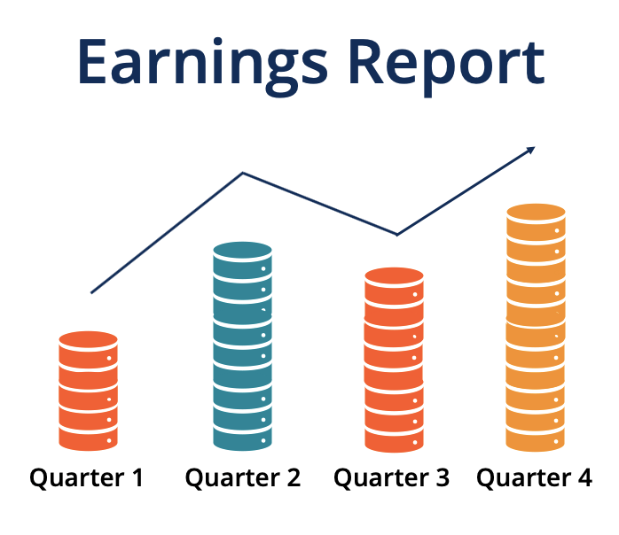

## Table of Contents

## What are company earnings?

Company earnings are the profits a company makes over a certain period, usually a quarter or a year. When a company sells its products or services, it earns money. After paying for things like salaries, rent, and other costs, the money left over is the earnings. These earnings show how well the company is doing financially. Investors and analysts look at these earnings to decide if they should buy, sell, or hold the company's stock.

Earnings are important because they help people understand a company's health. If a company has high earnings, it means the company is making more money than it is spending. This can make the company's stock price go up because more people want to invest in a successful company. On the other hand, if a company has low or negative earnings, it might be struggling, and its stock price could go down. Earnings reports are released regularly, and they can cause big changes in the stock market.

## Why are company earnings important?

Company earnings are important because they show how much money a company is making after paying for all its costs. This is like looking at a report card for the company. If the earnings are high, it means the company is doing well and making more money than it spends. This makes people who own the company's stock happy because it shows the company is healthy and successful.

Earnings also help people decide if they want to buy, sell, or keep the company's stock. If a company's earnings are good, more people might want to buy its stock, which can make the price go up. But if the earnings are bad, people might sell the stock, and the price could go down. So, earnings reports can cause big changes in the stock market, and everyone pays attention to them.

## How often are company earnings reported?

Company earnings are usually reported every three months, which is called a quarter. This means there are four earnings reports in a year, one for each quarter. Most companies follow this schedule, but some might report earnings at different times if they have special reasons.

These quarterly reports are important because they give the latest update on how well the company is doing. Investors and people who follow the stock market look at these reports to see if the company is making more money or if it's having problems. The reports can make the company's stock price go up or down depending on what the earnings show.

## What is an earnings report?

An earnings report is a document that a company puts out to tell everyone how much money it made in a certain time, usually a quarter of a year. It shows how much money the company got from selling its stuff, how much it spent on things like salaries and rent, and how much money it has left over, which is called the earnings. This report helps people see if the company is doing well or if it's having problems.

Earnings reports are important because they help people decide if they want to buy, sell, or keep the company's stock. If the earnings are good, it means the company is making more money than it spends, and this can make the stock price go up. But if the earnings are bad, it might mean the company is struggling, and the stock price could go down. People who invest in the stock market watch these reports closely because they can cause big changes in the market.

## What are the key components of an earnings report?

An earnings report is like a detailed summary of how a company did over a certain time, usually three months. The first key part of the report is the revenue, which is the total amount of money the company made from selling its products or services. This is important because it shows how well the company is at making sales. Another important part is the expenses, which are all the costs the company had to pay, like salaries, rent, and supplies. When you take the expenses away from the revenue, you get the earnings, also called net income or profit. This tells you if the company made more money than it spent.

The second key part of an earnings report is the earnings per share (EPS). This is calculated by dividing the net income by the number of shares the company has. EPS is important for people who own the company's stock because it shows how much profit each share made. A higher EPS usually means the company is doing well, and it can make the stock price go up. The report also includes a comparison to what analysts expected the earnings to be. If the actual earnings are higher than expected, it's good news, and the stock price might go up. If they're lower, it can be bad news, and the stock price might go down.

## How do analysts predict company earnings?

Analysts predict company earnings by looking at a lot of information about the company and the market. They study the company's past earnings reports to see how it did before. They also look at what the company is saying about its future plans and any news that might affect it. For example, if a company is planning to launch a new product, analysts might think that could bring in more money. They also pay attention to the economy and what other companies in the same industry are doing. All this information helps them make a guess about how much money the company will make.

Sometimes, analysts use math models to help with their predictions. These models can be complicated, but they basically take all the information the analysts have and turn it into a number that says what the earnings might be. Analysts also talk to people who work at the company or follow the industry closely to get more insights. By putting all these pieces together, they come up with an earnings estimate. This estimate is important because when the real earnings come out, people compare them to the estimate to see if the company did better or worse than expected.

## What is earnings per share (EPS) and how is it calculated?

Earnings per share (EPS) is a way to figure out how much money a company made for each share of its stock. It tells you how much profit each piece of the company is worth. If you own a share of the company's stock, EPS shows how much of the company's earnings you get to claim for that share.

To calculate EPS, you take the company's total earnings, which is also called net income or profit, and divide it by the total number of shares the company has. For example, if a company made $10 million in profit and has 5 million shares, the EPS would be $10 million divided by 5 million, which equals $2 per share. This number is important because it helps investors see if the company is making more or less money per share over time, and it can affect the stock price.

## How do company earnings affect stock prices?

Company earnings can have a big impact on stock prices. When a company reports its earnings, people who invest in the stock market look at those numbers to see if the company is doing well. If the earnings are higher than what people expected, it's good news. It means the company is making more money than people thought, and this can make more people want to buy the stock. When more people want to buy, the price of the stock usually goes up.

On the other hand, if the earnings are lower than expected, it can be bad news. It might mean the company is not doing as well as people hoped, and this can make some people want to sell their stock. When more people want to sell, the price of the stock can go down. So, earnings reports can cause big changes in stock prices because they give important information about how the company is doing.

## What is the difference between GAAP and non-GAAP earnings?

GAAP stands for Generally Accepted Accounting Principles. It's a set of rules that companies in the United States have to follow when they report their earnings. GAAP earnings are the official numbers that show how much money a company made, following all these rules. These rules make sure that all companies report their earnings in the same way, so it's fair and easy to compare them.

Non-GAAP earnings are different because they don't have to follow all those GAAP rules. Companies can use non-GAAP earnings to show their profits in a way that they think is more useful or clearer. They might leave out some costs or add in some things that GAAP doesn't allow. This can make the earnings look better, but it can also be confusing because different companies might do it differently. Investors need to be careful and understand what's included or left out when looking at non-GAAP earnings.

## How can investors use earnings data to make investment decisions?

Investors can use earnings data to make smart choices about buying, selling, or keeping a company's stock. When a company reports its earnings, investors look at the numbers to see if the company is making more money than expected. If the earnings are good, it means the company is doing well, and this can make the stock price go up. Investors might decide to buy more of the stock because they think it will keep going up. On the other hand, if the earnings are bad, it might mean the company is struggling, and the stock price could go down. In this case, investors might sell their stock to avoid losing money.

Earnings data also helps investors compare different companies. By looking at the earnings per share (EPS), investors can see how much profit each share of the company is making. This helps them decide which company is a better investment. For example, if one company has a higher EPS than another, it might be a better choice. Investors also look at trends over time. If a company's earnings are growing, it's a good sign that the company is getting stronger and might be a good long-term investment. By using earnings data, investors can make more informed decisions and hopefully make more money.

## What are some common earnings manipulation techniques?

Sometimes, companies try to make their earnings look better than they really are. One way they do this is by playing with the timing of when they record their sales or costs. For example, a company might count sales from the next quarter in the current quarter to make it look like they made more money. They might also delay recording some costs until later, so their current earnings look higher. This is called "income smoothing" because it makes their earnings look more steady and less risky.

Another way companies manipulate earnings is by changing how they value their inventory or assets. They might use a method that makes their inventory seem worth more than it really is, which can make their earnings look better. Companies might also use one-time gains or losses to their advantage. For example, they might sell an asset and count that money as part of their regular earnings, even though it's not from their normal business. These tricks can make it hard for investors to see the true financial health of the company.

## How do global economic conditions impact company earnings?

Global economic conditions can have a big impact on company earnings. When the world economy is doing well, people and businesses have more money to spend. This can mean more sales for companies, which can lead to higher earnings. For example, if the economy is growing, people might buy more cars, clothes, or travel more, which is good for companies in those industries. On the other hand, if the global economy is struggling, like during a recession, people might spend less money. This can lead to fewer sales and lower earnings for companies.

Different parts of the world can also affect each other. If one big country's economy is doing badly, it can hurt companies in other countries too. For example, if the U.S. economy slows down, it might mean fewer American tourists visiting Europe, which can hurt the earnings of European hotels and restaurants. Also, changes in currency values can impact earnings. If a company sells products in different countries, a strong currency in one country can make their products more expensive and harder to sell in other countries, which can lower their earnings.

## What is Understanding Financial Performance?

Financial performance is a crucial indicator of a company's ability to effectively utilize its resources to generate revenues. It encompasses several metrics that offer insights into the operational efficiency and market competitiveness of a business. These metrics include revenue, net income, earnings per share (EPS), and return on investment (ROI).

1. **Revenue**: Revenue is the total income generated from the sale of goods or services related to the company's primary operations. It's the starting point of financial analysis and often referred to as "top line." A consistent growth in revenue indicates a healthy demand for the company's products or services.

2. **Net Income**: Net income, sometimes called net profit, is the amount of money that remains after all expenses, taxes, and costs have been deducted from total revenues. It reflects the profitability of a company and is sometimes termed as the "bottom line." A higher net income indicates better financial health and efficiency in cost management.

3. **Earnings Per Share (EPS)**: EPS is calculated by dividing the company's net income by the number of outstanding shares. It serves as an indicator of a company's profitability on a per-share basis, offering a useful comparison tool across companies. The basic formula for EPS is:
$$
   \text{EPS} = \frac{\text{Net Income} - \text{Dividends on Preferred Stock}}{\text{Average Outstanding Shares}}

$$

4. **Return on Investment (ROI)**: ROI measures the gain or loss generated relative to the investment's cost. It is often expressed as a percentage and used to compare the efficiency of several investments. The basic formula for ROI is:
$$
   \text{ROI} = \frac{\text{Net Profit}}{\text{Cost of Investment}} \times 100

$$

Financial performance dictates how efficiently a company operates within its industry and its capacity to provide returns to its investors. It also reflects on a company's ability to capitalize on its competitive advantages. Evaluating a company's financial performance involves a comprehensive analysis of its financial statements, including the income statement, balance sheet, and cash flow statement, in conjunction with performance ratios. These ratios provide quantifiable insights into various aspects of business operations, costs, and profitability, enabling stakeholders to make informed decisions.

Overall, a thorough understanding of financial performance is essential for evaluating a company's past results, current operations, and future prospects, which is fundamental for any investment strategy or business decision-making process.

## What is the Significance of Company Earnings?

Company earnings, commonly referred to as net profits, serve as a crucial barometer for assessing the health and viability of a business. Earnings are the bottom line of any income statement, calculated as the difference between total revenues and total expenses incurred during a specific accounting period. The formula for calculating earnings can be expressed as follows:

$$
\text{Earnings} = \text{Total Revenue} - \text{Total Expenses}
$$

This fundamental equation highlights earnings as a reflection of a company's profitability over the designated timeframe. Earnings also play a pivotal role in annual and quarterly financial reporting, offering insights into operational efficiency and financial stability.

The importance of company earnings extends beyond internal assessment—investors and analysts keenly scrutinize these figures to ascertain a company’s performance trajectory and growth potential. Analysts often look for trends such as consistent earnings growth, which can indicate strong management and a sound business model. Furthermore, investors might use earnings to calculate ratios like Earnings Per Share (EPS) to evaluate investment potential, with EPS calculated as:

$$
\text{EPS} = \frac{\text{Earnings}}{\text{Number of Outstanding Shares}}
$$

An EPS increase can be a sign of a company’s improving profitability, which may render the stock more attractive to investors.

Earnings announcements, typically made public quarterly, are significant events that can precipitate marked stock price fluctuations. Positive earnings surprises, where reported earnings exceed expectations, can lead to stock price appreciation as market sentiment becomes bullish. Conversely, earnings below forecasts can lead to stock price declines, reflective of diminished investor confidence.

Given the influence of earnings on investment decisions and market movements, stakeholders closely followed earnings releases. These announcements provide transparency and an official gauge of a company's financial health, enabling informed decision-making within the complex landscape of financial markets.

## References & Further Reading

[1]: Damodaran, A. (2012). ["Investment Valuation: Tools and Techniques for Determining the Value of Any Asset, 3rd Edition"](https://www.wiley.com/en-us/Investment+Valuation%3A+Tools+and+Techniques+for+Determining+the+Value+of+Any+Asset%2C+3rd+Edition-p-9781118011522). John Wiley & Sons.

[2]: Lopez de Prado, M. (2018). ["Advances in Financial Machine Learning."](https://www.amazon.com/Advances-Financial-Machine-Learning-Marcos/dp/1119482089) Wiley.

[3]: Chan, E. P. (2009). ["Quantitative Trading: How to Build Your Own Algorithmic Trading Business."](https://github.com/ftvision/quant_trading_echan_book) Wiley.

[4]: Jansen, S. (2020). ["Machine Learning for Algorithmic Trading: Predictive Models to Extract Signals from Market and Alternative Data for Systematic Trading Strategies with Python"](https://www.amazon.com/Machine-Learning-Algorithmic-Trading-alternative/dp/1839217715). Packt Publishing.

[5]: Aronson, D. R. (2007). ["Evidence-Based Technical Analysis: Applying the Scientific Method and Statistical Inference to Trading Signals."](https://www.amazon.com/Evidence-Based-Technical-Analysis-Scientific-Statistical/dp/0470008741) Wiley.