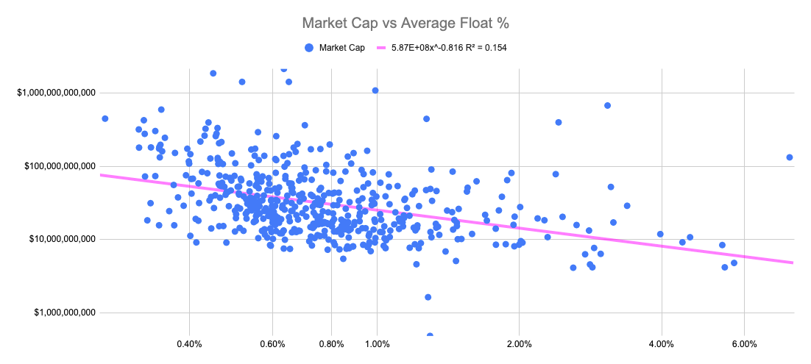

## Table of Contents

## What is a company float?

A company float, often just called a float, is the total number of a company's shares that are available for the public to buy and trade on the stock market. This does not include shares that are owned by company insiders, like executives or major shareholders, who might not want to sell their shares right away. The float is important because it affects how easy or hard it is to buy or sell the company's stock. A larger float means more shares are available, which can make the stock's price more stable because there's more supply.

The size of a company's float can also influence how much the stock price can change in a short period. If a company has a small float, meaning fewer shares are available to trade, even small trades can cause big price changes. This can make the stock more volatile. On the other hand, a company with a large float might see smaller price changes because there are more shares available, making it easier for the market to absorb buying and selling without big swings in price.

## Why is a company float important for businesses?

A company float is important for businesses because it shows how many shares are available for people to buy and sell. When a company has a big float, it means there are a lot of shares out there for trading. This can make the stock price more stable because there's enough supply to meet demand. If a company wants to raise money, a bigger float can make it easier because more people can buy the shares.

On the other hand, if a company has a small float, it means fewer shares are available for trading. This can make the stock price go up and down a lot because even small trades can have a big effect. A small float can be good if the company wants the stock price to grow quickly, but it can also be risky because the price can drop fast too. Knowing the size of the float helps a business plan how to manage its stock and make decisions about raising money or selling more shares.

## How does a company float affect a company's financial health?

A company float can affect a company's financial health by influencing how easily it can raise money. When a company has a big float, it means there are a lot of shares available for people to buy. This can make it easier for the company to sell new shares and get money to grow or pay off debts. A big float can also make the stock price more stable, which can make investors feel more confident about putting their money into the company.

On the other hand, a small float can make things more challenging for a company. With fewer shares available, the stock price can go up and down a lot, which can scare off investors who don't like risk. If the stock price is very volatile, it might be harder for the company to sell new shares to raise money. This can limit the company's options for growth or dealing with financial problems. So, the size of the float is something a company needs to think about when planning its financial future.

## What are the different types of company floats?

There are mainly two types of company floats: public float and insider float. Public float is the number of shares that are available for the public to buy and sell. These are the shares that are traded on the stock market. The public float is important because it shows how much of the company the public can own and trade. A bigger public float means there are more shares for people to buy, which can make the stock price more stable.

Insider float, on the other hand, is the number of shares that are owned by people inside the company, like executives or major shareholders. These shares are not available for the public to buy. Insider float can affect the company's stock price too. If insiders own a lot of shares and decide to sell them, it can change the number of shares available for trading and affect the stock price. Knowing the difference between these two types of floats helps people understand how a company's stock works.

## How is a company float calculated?

A company float is calculated by looking at the total number of shares a company has and then taking away the shares that are owned by insiders. Insiders are people like the company's top bosses or big shareholders who might not want to sell their shares right away. So, to find the float, you start with the total number of shares and subtract the number of shares that insiders own. What's left is the float, which is the number of shares that the public can buy and sell.

The float is important because it shows how many shares are out there for people to trade. If a company has a big float, it means there are a lot of shares for people to buy, which can make the stock price more stable. If the float is small, it means fewer shares are available, and the stock price can go up and down a lot. Knowing the size of the float helps people understand how easy or hard it might be to buy or sell the company's stock.

## What are the common strategies to manage a company float?

Companies can manage their float by doing things like buying back their own shares or selling more shares to the public. When a company buys back shares, it takes those shares out of the public float. This can make the float smaller, which might make the stock price go up because there are fewer shares for people to buy. On the other hand, if a company sells more shares to the public, it makes the float bigger. This can help the company raise money, but it might also make the stock price go down because there are more shares for people to buy.

Another way to manage the float is by controlling how many shares insiders can sell. If insiders own a lot of shares and decide to sell them, it can change the float and affect the stock price. Companies might set rules about when and how insiders can sell their shares to keep the float stable. This helps keep the stock price from going up and down too much. By carefully managing the float, a company can help keep its stock price stable and make it easier to raise money when they need to.

## How does a company float impact cash flow management?

A company float can affect how a company manages its cash flow. When a company has a big float, it means there are a lot of shares for people to buy and sell. This can make it easier for the company to sell new shares and get money when they need it. Having a big float can help a company have more cash on hand, which is important for paying bills, growing the business, or dealing with unexpected costs. If the stock price is stable because of a big float, investors might feel more confident about putting money into the company, which can also help with cash flow.

On the other hand, a small float can make things more challenging. With fewer shares available, the stock price can go up and down a lot. This can scare off investors who don't like risk, making it harder for the company to sell new shares and raise money. If the company can't sell shares easily, it might struggle to manage its cash flow. This can limit the company's options for paying bills, growing, or dealing with financial problems. So, the size of the float is something a company needs to think about when planning how to manage its cash flow.

## What are the risks associated with a high company float?

Having a high company float means there are a lot of shares for people to buy and sell. While this can be good for making the stock price more stable, it can also have some risks. One risk is that the stock price might not go up as fast as a company with a smaller float. When there are more shares available, it can take more buying to make the price go up. This can be a problem for companies that want their stock price to grow quickly.

Another risk is that a high float can make it easier for other people or companies to try to take over the company. If there are a lot of shares out there, someone else might be able to buy enough shares to have a big say in how the company is run. This can be scary for the people who are already in charge of the company. So, while a high float can help with raising money and keeping the stock price stable, it also comes with some risks that companies need to think about.

## How can a company reduce its float time?

A company can reduce its float time by buying back its own shares. When a company does this, it takes shares out of the public float. This makes the float smaller, which means there are fewer shares for people to buy and sell. A smaller float can make the stock price go up because there's less supply. This can be good for the company if it wants the stock price to grow quickly.

Another way to reduce float time is by setting rules for when insiders can sell their shares. Insiders are people like the company's top bosses or big shareholders. If they sell a lot of shares, it can make the float bigger and affect the stock price. By controlling when and how insiders can sell their shares, the company can keep the float smaller and more stable. This helps the company manage its stock price better and makes it easier to raise money when they need to.

## What role does technology play in managing company float?

Technology helps companies manage their float by making it easier to keep track of shares and how they are traded. With computers and special software, companies can see exactly how many shares are out there for people to buy and sell. This means they can quickly know the size of their float and make smart decisions about buying back shares or selling more to the public. Technology also helps with something called real-time data, which means the company can see what's happening with their shares right away. This can help them act fast if they need to change their float to keep the stock price stable or to raise money.

Another way technology helps is by making it easier for companies to communicate with investors. They can use the internet and social media to tell people about their plans to buy back shares or sell more to the public. This can help them manage the float better because more people will know what's going on and might want to buy or sell shares. Plus, technology makes it easier for companies to set up rules about when insiders can sell their shares. They can use special systems to keep track of these rules and make sure everyone follows them, which helps keep the float stable and the stock price under control.

## How do regulatory requirements influence company float management?

Regulatory requirements can have a big impact on how a company manages its float. These rules are made by governments or special agencies to make sure companies are doing things fairly and openly. For example, there might be rules about how much information a company has to share with the public about its shares. These rules can affect how a company decides to buy back shares or sell more to the public. If a company wants to change its float, it has to follow these rules carefully, which can make the process take longer or be more complicated.

Another way regulatory requirements influence float management is through rules about insider trading. Insiders are people like the company's top bosses or big shareholders. There are rules about when and how these insiders can sell their shares. These rules are there to stop insiders from using secret information to make money, which wouldn't be fair to other people who want to buy or sell the company's shares. By following these rules, a company can keep its float stable and make sure everyone has a fair chance to trade the shares. This helps the company manage its float in a way that keeps the stock price stable and builds trust with investors.

## What are some case studies of companies that have effectively managed their float?

One good example of a company that managed its float well is Apple. Apple has a big float, which means there are a lot of shares for people to buy and sell. They have been careful about how they handle their float. For example, Apple has done something called stock buybacks, where they buy their own shares back from the public. This makes the float smaller and can help the stock price go up because there are fewer shares out there. Apple also keeps a close eye on what their insiders are doing with their shares. By setting rules about when insiders can sell, Apple helps keep their float stable and their stock price from going up and down too much.

Another example is Tesla. Tesla used to have a smaller float, which made their stock price go up and down a lot. But they have worked on managing their float better. Tesla did something called a stock split, which means they made each share into more shares but kept the total value the same. This made the float bigger and the stock price more stable because there were more shares for people to buy. Tesla also talks a lot with their investors, using the internet and social media to let people know what they're doing. This helps them manage their float because more people know what's going on and might want to buy or sell shares. By doing these things, Tesla has been able to manage their float better and make their stock price more stable.

## What is the understanding of company shares and stock float?

Company shares represent ownership in a corporation and are a fundamental unit of investment in financial markets. Each share essentially acts as a certificate of ownership, entitling the shareholder to a portion of the company's profits, usually in the form of dividends, and a proportional vote in corporate matters during shareholders' meetings. There are various types of shares, including common and preferred shares, each with differing rights and privileges.

Stock float refers to the number of a company's shares that are available for trading by the public. It is a subset of the company's total outstanding shares. Outstanding shares include all shares issued by the company, encompassing those held by institutional investors and insiders, as well as any restricted shares that are subject to specific holding rules and constraints. The concept of stock float is vital for assessing a stock's [liquidity](/wiki/liquidity-risk-premium), as it indicates how many shares are available for trading without being tied up by long-term investors.

The distinction between outstanding shares and floating shares is pivotal. Outstanding shares represent the total number of shares that a company has issued to date, including both restricted shares and freely tradable shares on the market. Floating shares, on the other hand, are calculated by subtracting restricted shares, which cannot be sold in the public market until certain conditions are met, from the outstanding shares. Specifically, the stock float can be calculated as follows:

$$
\text{Stock Float} = \text{Outstanding Shares} - \text{Restricted Shares}
$$

This formula underscores the notion that not all issued shares contribute to the market's liquidity. Restricted shares are often awarded to insiders, executives, and employees as part of compensation packages and are subject to vesting periods or other restrictions that prevent immediate trading.

Understanding the relationship between outstanding shares and stock float is crucial for investors as it influences the stock's market dynamics. A higher float can lead to increased liquidity, allowing for easier buying and selling of shares, which generally reduces [volatility](/wiki/volatility-trading-strategies). Conversely, a smaller float may result in higher volatility, as fewer shares are available for trading, potentially leading to larger price swings in response to market activity. Investors often examine the float to gauge a company's trading [volume](/wiki/volume-trading-strategy) potential and price stability.

## What is Public Float and What is Its Significance?

Public float is a crucial metric in financial markets, representing the number of a company's shares that are available for public trading. These shares exclude those held by insiders, such as company executives, board members, and employees with insider restrictions, as well as those held in private placements or by government entities. Public float can be calculated using the formula:

$$
\text{Public Float} = \text{Outstanding Shares} - \text{Restricted Shares}
$$

Understanding public float is essential for assessing a stock's liquidity and volatility. Liquidity, in this context, refers to the ease with which a stock can be bought or sold in the market without affecting its price. A higher public float typically indicates greater liquidity because more shares are available for trading, which can result in tighter bid-ask spreads and less price impact when executing large trades. Conversely, a lower public float suggests limited availability of shares, potentially causing higher volatility, as price movements can be more dramatic when fewer shares are traded.

The significance of public float extends to its influence on investor decisions and market valuation. Investors often consider the public float when evaluating a stock's attractiveness. A larger public float may appeal to institutional investors who require assurance of sufficient liquidity for large transactions. Additionally, public float can impact a company's market capitalization and valuation, as companies with a higher float allow broader market participation in their equity.

Moreover, public float can play a pivotal role during corporate events such as buyouts, mergers, or secondary offerings. Companies with a smaller public float might experience more pronounced price reactions to such announcements because the limited share supply can exaggerate changes in demand.

In summary, public float serves as a fundamental component in evaluating a stock's liquidity and potential volatility, significantly influencing investor behavior and market dynamics. Understanding the intricacies of public float enables analysts and traders to make more informed decisions when participating in the financial markets.

## References & Further Reading

1. **"A Random Walk Down Wall Street" by Burton G. Malkiel**  
   This book provides an introduction to the stock market, covering topics such as stock valuation and trading strategies.

2. **"Algorithmic Trading and DMA: An Introduction to Direct Access Trading Strategies" by Barry Johnson**  
   This resource explains [algorithmic trading](/wiki/algorithmic-trading) strategies and includes an analysis of market data, execution speeds, and trading algorithms.

3. **"Quantitative Analysis, Derivatives Modeling, and Trading Strategies" by Yi Tang and Bin Meng**  
   This book discusses the mathematical foundation behind [quantitative trading](/wiki/quantitative-trading) strategies, including algorithms and their practical applications.

4. **Research Paper: "High-Frequency Trading in a Limit Order Book" by Albert J. Menkveld**  
   Published in the Journal of Financial Markets, this paper examines the role and impact of high-frequency trading within the limit [order book](/wiki/order-book-trading-strategies).

5. **Industry Report: "Global Algorithmic Trading Market 2023-2027" by Technavio**  
   This report provides an overview of market trends, growth factors, and key players in the algorithmic trading industry.

6. **"Options, Futures, and Other Derivatives" by John C. Hull**  
   A widely used textbook in finance courses, focusing on derivatives markets and quantitative finance essentials.

7. **"Advances in Financial Machine Learning" by Marcos López de Prado**  
   This book describes [machine learning](/wiki/machine-learning) techniques used in finance, addressing data structures, feature importance, and training models for trading.

8. **Website: Investopedia**  
   Investopedia offers comprehensive articles and tutorials on stock market metrics, trading strategies, and financial concepts. [Website](https://www.investopedia.com)

9. **Academic Journal: "Journal of Financial Economics"**  
   This journal publishes research on financial markets, instruments, and economic behavior, providing insights into theoretical and practical aspects of finance.

10. **Market Data Providers: Bloomberg Terminal and Reuters Eikon**  
    Both platforms supply real-time and historical market data, financial analysis, and news, essential for quantitative trading and analysis.

These resources offer a wide range of information for anyone interested in expanding their knowledge of stock market metrics and algorithmic trading strategies.

