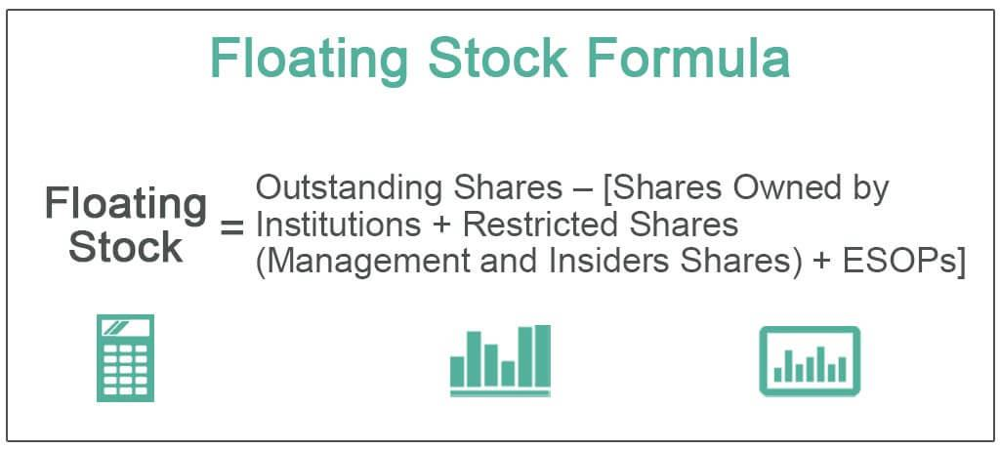

Company shares, stock float, public float, and algorithmic trading are foundational concepts in the financial markets, playing a crucial role in investment and trading strategies. Understanding these terms is essential for investors and traders to make informed decisions and optimize their market activities.

Company shares, also known as equity, represent ownership in a corporation. When a company decides to raise capital, it issues shares that investors can purchase, thereby owning a portion of the company. These shares can be broadly categorized into outstanding shares and floating shares.



The notion of 'stock float' pertains to the number of shares that are available for trading by the general public. It is calculated by subtracting restricted shares—those held by insiders or other controlling interest parties—from the total number of outstanding shares. The formula can be expressed as:

$$
\text{Stock Float} = \text{Outstanding Shares} - \text{Restricted Shares}
$$

Public float is a subset of the stock float which specifically refers to the shares that are not held by insiders, major stakeholders, or anyone else who has a significant state in the company. Public float is significant as it determines the stock’s liquidity and its potential volatility, aspects that are pivotal in assessing market conditions.

Algorithmic trading utilizes computer algorithms to execute a large number of pre-defined instructions aimed at generating profits at a speed and frequency that is impossible for a human trader to match. Algorithmic trading evaluates market conditions by considering elements such as stock float and outstanding shares, which impact stock availability and trading strategies.

A deep understanding of stock float and public float is critical for traders and investors because these metrics influence a stock's liquidity, volatility, and hence, overall market valuation. They play a significant role in shaping trading strategies. An increase in available shares may lead to higher liquidity and lower volatility, thereby affecting traders' strategies.

Moreover, algorithmic trading relies on the availability of accurate and timely float data. The algorithms are designed to capitalize on variations in stock float and outstanding shares. A limited stock float could lead to higher volatility, necessitating advanced trading algorithms to mitigate risks and optimize profit margins.

In conclusion, company shares, stock float, public float, and [algorithmic trading](/wiki/algorithmic-trading) are interlinked components that significantly impact trading strategies and stock market performance. A comprehensive understanding of these terms is invaluable for optimizing trading outcomes in an increasingly complex capital market environment.

## Table of Contents

## Understanding Company Shares and Stock Float

Company shares represent ownership in a corporation and are a fundamental unit of investment in financial markets. Each share essentially acts as a certificate of ownership, entitling the shareholder to a portion of the company's profits, usually in the form of dividends, and a proportional vote in corporate matters during shareholders' meetings. There are various types of shares, including common and preferred shares, each with differing rights and privileges.

Stock float refers to the number of a company's shares that are available for trading by the public. It is a subset of the company's total outstanding shares. Outstanding shares include all shares issued by the company, encompassing those held by institutional investors and insiders, as well as any restricted shares that are subject to specific holding rules and constraints. The concept of stock float is vital for assessing a stock's [liquidity](/wiki/liquidity-risk-premium), as it indicates how many shares are available for trading without being tied up by long-term investors.

The distinction between outstanding shares and floating shares is pivotal. Outstanding shares represent the total number of shares that a company has issued to date, including both restricted shares and freely tradable shares on the market. Floating shares, on the other hand, are calculated by subtracting restricted shares, which cannot be sold in the public market until certain conditions are met, from the outstanding shares. Specifically, the stock float can be calculated as follows:

$$
\text{Stock Float} = \text{Outstanding Shares} - \text{Restricted Shares}
$$

This formula underscores the notion that not all issued shares contribute to the market's liquidity. Restricted shares are often awarded to insiders, executives, and employees as part of compensation packages and are subject to vesting periods or other restrictions that prevent immediate trading.

Understanding the relationship between outstanding shares and stock float is crucial for investors as it influences the stock's market dynamics. A higher float can lead to increased liquidity, allowing for easier buying and selling of shares, which generally reduces [volatility](/wiki/volatility-trading-strategies). Conversely, a smaller float may result in higher volatility, as fewer shares are available for trading, potentially leading to larger price swings in response to market activity. Investors often examine the float to gauge a company's trading [volume](/wiki/volume-trading-strategy) potential and price stability.

## Public Float and Its Significance

Public float is a crucial metric in financial markets, representing the number of a company's shares that are available for public trading. These shares exclude those held by insiders, such as company executives, board members, and employees with insider restrictions, as well as those held in private placements or by government entities. Public float can be calculated using the formula:

$$
\text{Public Float} = \text{Outstanding Shares} - \text{Restricted Shares}
$$

Understanding public float is essential for assessing a stock's liquidity and volatility. Liquidity, in this context, refers to the ease with which a stock can be bought or sold in the market without affecting its price. A higher public float typically indicates greater liquidity because more shares are available for trading, which can result in tighter bid-ask spreads and less price impact when executing large trades. Conversely, a lower public float suggests limited availability of shares, potentially causing higher volatility, as price movements can be more dramatic when fewer shares are traded.

The significance of public float extends to its influence on investor decisions and market valuation. Investors often consider the public float when evaluating a stock's attractiveness. A larger public float may appeal to institutional investors who require assurance of sufficient liquidity for large transactions. Additionally, public float can impact a company's market capitalization and valuation, as companies with a higher float allow broader market participation in their equity.

Moreover, public float can play a pivotal role during corporate events such as buyouts, mergers, or secondary offerings. Companies with a smaller public float might experience more pronounced price reactions to such announcements because the limited share supply can exaggerate changes in demand.

In summary, public float serves as a fundamental component in evaluating a stock's liquidity and potential volatility, significantly influencing investor behavior and market dynamics. Understanding the intricacies of public float enables analysts and traders to make more informed decisions when participating in the financial markets.

## Basics of Algorithmic Trading

Algorithmic trading, often referred to as algo trading, is a method of executing orders using automated and pre-programmed trading instructions that account for variables such as timing, price, and volume. This method leverages the computational power of computers to automatically execute trades at speeds and frequencies that are impossible for human traders. Over recent years, algorithmic trading has become a crucial component of modern financial markets, covering a significant percentage of trades executed on major exchanges.

The core of algorithmic trading involves the use of algorithms to evaluate market conditions, including the analysis of stock floats and outstanding shares. Algorithms are designed to process and interpret vast amounts of financial data, assisting in the decision-making process and execution of trades without human intervention. A key aspect of these algorithms is their ability to evaluate stock metrics like float and outstanding shares. The float represents the number of shares available for trading by the public, which directly impacts liquidity, while outstanding shares include both the public float and restricted shares, providing a comprehensive view of a company's equity.

Algorithms systematically assess these metrics to determine optimal entry and [exit](/wiki/exit-strategy) points in the market. By employing complex mathematical models and statistical analyses, they can predict price movements and identify trading opportunities. For instance, a simple moving average crossover strategy might involve buying when a short-term moving average exceeds a long-term moving average, indicating an upward [momentum](/wiki/momentum). Python code for this strategy might look something like this:

```python
import pandas as pd

# Assuming 'data' is a DataFrame with 'Close' prices
short_window = 40
long_window = 100

signals = pd.DataFrame(index=data.index)
signals['signal'] = 0.0

# Create short simple moving average over short window
signals['short_mavg'] = data['Close'].rolling(window=short_window, min_periods=1, center=False).mean()

# Compute long simple moving average over long window
signals['long_mavg'] = data['Close'].rolling(window=long_window, min_periods=1, center=False).mean()

# Create signals
signals['signal'][short_window:] = np.where(signals['short_mavg'][short_window:] > signals['long_mavg'][short_window:], 1.0, 0.0)   

# Generate trading orders
signals['positions'] = signals['signal'].diff()
```

The primary benefits of algorithmic trading include speed, precision, and efficiency. Algorithms are capable of processing complex calculations and vast datasets in milliseconds, executing trades far quicker than humanly possible. This speed translates directly into market advantages, capturing fleeting opportunities and reducing latency between decision making and order execution.

Precision is another critical benefit, as algorithms can minimize human error, executing trades with increased accuracy according to pre-set rules. This precision ensures that trades are executed at the best possible price and in optimal quantities, enhancing returns.

Efficiency is achieved through the systematic execution of trades. Algorithms can simultaneously monitor multiple markets and execute diversified strategies, saving both time and resources compared to manual trading. Furthermore, the use of algorithms can significantly reduce transaction costs due to the automation and optimization inherent in their design.

Overall, algorithmic trading represents a paradigm shift in trading methodologies, marking a move towards automation, where sophisticated algorithms and computational power play a pivotal role in market dynamics. As financial markets continue to evolve, the reliance on these technologies is expected to grow, transforming how trading is conducted across the globe.

## How Float and Outstanding Shares Influence Algo Trading

Company shares and stock float play a crucial role in algorithmic trading, impacting liquidity, market volatility, and the execution strategies employed by algo traders. Understanding these metrics is vital to optimizing trading algorithms and capturing potential market inefficiencies.

**Impact on Liquidity and Market Volatility**

The float of a stock represents the number of shares available for the public to trade. Higher float generally correlates with greater liquidity, meaning there are more shares available for buying and selling without significantly affecting the stock's price. Conversely, a lower float indicates less liquidity, often leading to higher volatility as even small trades can have a more pronounced effect on the stock price. Algorithmic traders closely monitor these dynamics to exploit opportunities or mitigate risks.

**Algorithmic Reactions to Changes in Float and Outstanding Shares**

Algorithmic trading systems can react quickly to changes in float and outstanding shares. For example, if a company announces a secondary offering or an insider lock-up period expires, the float could increase significantly. An algo trader, recognizing the potential increase in liquidity and alteration in stock dynamics, might adjust their trading model to incorporate these changes.

Python code snippet to demonstrate an algorithm adjusting to changes in float:

```python
class AlgoTrader:
    def __init__(self, float_threshold, volatility_threshold):
        self.float_threshold = float_threshold
        self.volatility_threshold = volatility_threshold

    def assess_market_changes(self, current_float, market_volatility):
        if current_float > self.float_threshold:
            self.adjust_liquidity_strategy(high_liquidity=True)
        elif market_volatility > self.volatility_threshold:
            self.adjust_volatility_strategy(high_volatility=True)

    def adjust_liquidity_strategy(self, high_liquidity):
        if high_liquidity:
            print("Increase trading volume and narrow bid-ask spreads.")

    def adjust_volatility_strategy(self, high_volatility):
        if high_volatility:
            print("Widen bid-ask spreads and reduce position size.")

# Example usage
trader = AlgoTrader(float_threshold=1000000, volatility_threshold=0.05)
trader.assess_market_changes(current_float=1500000, market_volatility=0.03)
```

**Strategies Employed by Algo Traders**

Algorithmic trading strategies take into account not just the static figures of float and outstanding shares but also dynamic changes occurring in real-time. There are several strategies that algo traders employ concerning these metrics:

1. **Market Making**: Leveraging high float, market makers utilize liquidity to profit from the bid-ask spread. Algorithms automatically adjust spreads and order sizes based on float and observed market depth.

2. **Statistical Arbitrage**: Algorithms analyze historical correlations between stocks, which can be impacted by changes in float and outstanding shares. An increase in float might alter these correlations, prompting recalibration of the algorithm to maintain its edge.

3. **Volatility Arbitrage**: For stocks with low float, higher volatility presents opportunities to profit from significant price movements. Algorithms can dynamically adjust trading frequency and position sizes based on measured and anticipated volatility.

4. **Event-Driven Trading**: Significant events such as earnings reports or merger announcements can impact float or lead to changes in outstanding shares. Algorithms are programmed to quickly interpret such events and execute trades contingent on pre-defined criteria.

In summary, the interplay between stock float, outstanding shares, and algorithmic trading is complex. Algo traders must continually refine their strategies, leveraging both current float data and predictions of how changes may emerge in the future. This synthesis of static and dynamic market variables enables precision in execution and optimizes trading performance.

## Benefits and Challenges of Algo Trading with Float Data

Algorithmic trading, utilizing float and outstanding shares data, offers distinct advantages and challenges that influence trading strategies and outcomes. Understanding these aspects is crucial for anyone engaged in modern financial markets.

One significant advantage of using float and outstanding shares in algorithmic trading is enhanced liquidity assessment. The stock float gives traders an idea of the number of shares available for trade, which is critical for gauging market liquidity. High liquidity typically translates to lower transaction costs and less price manipulation risk. Algorithms can efficiently process this information, allowing traders to capitalize on small price differentials and execute high-frequency trading strategies effectively.

The precision of algorithmic trading is another benefit. By continuously monitoring variations in float and outstanding shares, algorithms can adjust trading patterns swiftly, ensuring that strategies remain aligned with current market conditions. This dynamic adjustment capability maximizes returns while minimizing exposure to unfavorable market movements.

However, challenges persist, primarily concerning data accuracy and market volatility. Data inaccuracies in float can lead to erroneous liquidity assessments, impacting trading decisions. Algorithms rely heavily on accurate data inputs; hence, any discrepancies can result in significant financial consequences. Moreover, while algorithms can react to market volatility, they may also exacerbate it. Rapid buy and sell decisions based on fluctuating float data can amplify market swings, leading to greater instability.

Regulatory compliance also presents a significant challenge. Trading algorithms must adhere to financial regulations to avoid penalties and ensure fair market practices. Compliance demands a thorough understanding of regulatory frameworks and constant monitoring, adding an additional layer of complexity for traders.

Ethical considerations are equally important. Algorithmic trading, driven by float data, can inadvertently lead to market manipulation if used to exploit stock shorting or pump-and-dump schemes. Establishing ethical standards and ensuring transparency in algorithmic operations is crucial to maintain market integrity.

In conclusion, leveraging float and outstanding shares in algorithmic trading provides critical liquidity insights and trading precision but also requires meticulous attention to data accuracy, regulatory compliance, and ethical practices. Balancing these factors is essential for traders aiming to optimize performance while safeguarding market stability.

## Case Studies and Real-World Applications

### Case Studies and Real-World Applications

Company float, representing the number of shares available for trading by the public, is a crucial determinant of a stock's market performance. This section investigates into case studies where float has significantly impacted stock behavior and analyses how algorithmic trading leverages float data to optimize trading strategies.

#### Impact of Float on Stock Performance

One notable example involves Tesla, Inc. (NASDAQ: TSLA). Tesla's stock float dynamics have repeatedly influenced its market performance. With CEO Elon Musk holding a substantial percentage of Tesla shares, the public float is relatively smaller compared to its outstanding shares. This limited float contributes to increased volatility, a [factor](/wiki/factor-investing) exploited by traders and algorithms to capitalize on price movements. High volatility can result in significant price changes within short periods, proving advantageous for short-term traders and challenging for long-term investors. 

In another example, consider the case of Amazon.com, Inc. (NASDAQ: AMZN). Despite having a large number of outstanding shares, the company's public float is kept deliberately lower due to founder Jeff Bezos's substantial shareholding. This float restriction can result in liquidity constraints during periods of heightened trading activity, leading to significant price swings.

#### Algorithmic Trading and Float Data

Algorithmic traders systematically analyze float data to inform their strategies. For instance, a study by Frazzini, Israel, and Moskowitz (2012) showcases how algorithms use float-adjusted valuation models to predict price movements and enact trades. The study noted that changes in float could lead to revisions in liquidity expectations, impacting algorithmic models that prioritize efficiency and speed in execution.

Python-based algorithms are commonly used in these scenarios. Here's a basic illustration of how float data can be incorporated into an algorithm to project stock price movements:

```python
import pandas as pd
import numpy as np

# Sample data frame with stock prices and float details
data = {'Date': pd.date_range(start='1/1/2022', periods=5),
        'Stock_Price': [120, 125, 130, 128, 135],
        'Public_Float': [1000000, 990000, 985000, 980000, 975000]}
df = pd.DataFrame(data)

# Calculating price movement based on float changes
df['Price_Change'] = df['Stock_Price'].pct_change()
df['Float_Change'] = df['Public_Float'].pct_change()

# Simple model predicting price movement based on float change
df['Predicted_Movement'] = np.sign(df['Float_Change'] * df['Price_Change'].shift())
print(df[['Date', 'Stock_Price', 'Public_Float', 'Predicted_Movement']])
```

#### Best Practices from Case Studies

Several best practices have emerged from analyzing algorithmic trading alongside float data:

1. **Liquidity Assessment**: Always evaluate the float to understand liquidity risk. Lower float implies potential for high volatility, suitable for strategies aimed at short-term gains.

2. **Monitor Insider Holdings**: Recognize that substantial insider or institution holdings could restrict available float, impacting price stability.

3. **Dynamic Adjustment**: Use algorithms that adapt to real-time changes in float data, allowing for nimble trading decisions.

4. **Risk Management**: Incorporate stringent risk management practices, adjusting positions based on volatility projections informed by float changes.

These case studies and practices highlight the integral role that float data plays in shaping trading strategies and market behavior. As algorithmic trading evolves, understanding and leveraging stock float will continue to provide competitive advantages within financial markets.

## Future Trends and Developments

Algorithmic trading has rapidly evolved in recent years, with Artificial Intelligence (AI) and Machine Learning (ML) playing significant roles in shaping its future. By leveraging these technologies, traders can enhance their ability to predict market movements, optimize trading strategies, and manage risks with greater precision.

AI and ML integrate vast datasets that include not only traditional market data but also new types of information such as social media sentiment, news events, and other non-structured data. These technologies can identify patterns and correlations that are not immediately apparent through conventional analysis. The implementation of AI and ML in trading algorithms has the potential to revolutionize the use of float strategies by providing more accurate predictions about price movements and liquidity.

One of the advancements in trading technology is the development of more sophisticated algorithms capable of dynamic learning, enabling them to adapt to changing market conditions in real-time. These adaptive algorithms can continuously improve their decision-making process by learning from past trades and adjusting their strategies. For example, [reinforcement learning](/wiki/reinforcement-learning), a type of ML, allows algorithms to learn optimal trading strategies through trial and error by receiving feedback from the market.

Python code that implements a basic reinforcement learning algorithm for trading might look like this:

```python
import numpy as np

class TradingEnv:
    def __init__(self):
        self.state = np.random.rand(10)
        self.done = False

    def step(self, action):
        reward = self._take_action(action)
        self.state = np.random.rand(10)
        self.done = np.random.choice([True, False])
        return self.state, reward, self.done

    def _take_action(self, action):
        # define reward function based on action
        return np.random.rand()

    def reset(self):
        self.state = np.random.rand(10)
        self.done = False
        return self.state

env = TradingEnv()
state = env.reset()

for _ in range(100):
    action = np.random.choice([0, 1, 2])
    next_state, reward, done = env.step(action)
    if done:
        state = env.reset()
    else:
        state = next_state
```

The potential impact of these advancements on float strategies is significant. As these technologies become adept at predicting changes in float data — such as increases in outstanding shares due to new stock issuance or decreases due to buybacks — they can allow traders to optimize their positions accordingly. These predictions can lead to more effective execution of trades with minimal market impact, better capital allocation, and improved risk management.

Furthermore, the evolving methodologies associated with float and trading are likely to drive changes in market dynamics. Markets may become more efficient as algorithmic strategies based on AI and ML reduce [arbitrage](/wiki/arbitrage) opportunities. However, this could also lead to increased competition among traders as more participants employ advanced technologies. Additionally, the increased use of float data in algo trading may lead to higher liquidity in stocks with substantial public float, but it could also result in augmented volatility in less liquid stocks.

In conclusion, the integration of AI and ML in algorithmic trading marks a transformative shift in how traders approach float strategies. As trading technologies continue to advance and become more sophisticated, they will likely redefine market dynamics, offering both opportunities and challenges in terms of liquidity, volatility, and market efficiency.

## Conclusion

Understanding the concepts of float and outstanding shares is crucial for both investors and traders who seek to navigate the complexities of modern financial markets effectively. These metrics significantly influence stock liquidity, volatility, and ultimately, market valuation. The stock float, specifically, represents the portion of a company's shares that are available for trading among the general public. It offers insights into the stock's potential price movement and liquidity, making it an essential consideration for trading strategies, particularly those involving algorithmic trading.

The dynamic nature of the stock market necessitates a commitment to continuous learning and adaptation. As market conditions change, so too must the approaches employed by investors and traders. This adaptability ensures responsiveness to changes in stock availability and the subsequent impacts on trading strategies. Algorithmic trading, powered by sophisticated algorithms and real-time data analysis, thrives on the understanding and strategic use of float data. By leveraging this data, traders can enhance trading efficiency, precision, and speed, gaining a competitive edge in fast-paced environments.

Strategically utilizing float data allows traders to optimize their trading performance, making informed decisions that align with their investment objectives. Understanding the nuances of float and outstanding shares provides a foundational framework that supports the development of robust trading strategies, ultimately contributing to improved market performance. Continual education and staying abreast of technological advancements will ensure that traders not only keep pace with the evolving market landscape but also capitalize on new opportunities that arise from changes in stock availability and trading methodologies.

## References & Further Reading

1. **"A Random Walk Down Wall Street" by Burton G. Malkiel**  
   This book provides an introduction to the stock market, covering topics such as stock valuation and trading strategies.

2. **"Algorithmic Trading and DMA: An Introduction to Direct Access Trading Strategies" by Barry Johnson**  
   This resource explains algorithmic trading strategies and includes an analysis of market data, execution speeds, and trading algorithms.

3. **"Quantitative Analysis, Derivatives Modeling, and Trading Strategies" by Yi Tang and Bin Meng**  
   This book discusses the mathematical foundation behind [quantitative trading](/wiki/quantitative-trading) strategies, including algorithms and their practical applications.

4. **Research Paper: "High-Frequency Trading in a Limit Order Book" by Albert J. Menkveld**  
   Published in the Journal of Financial Markets, this paper examines the role and impact of high-frequency trading within the limit [order book](/wiki/order-book-trading-strategies).

5. **Industry Report: "Global Algorithmic Trading Market 2023-2027" by Technavio**  
   This report provides an overview of market trends, growth factors, and key players in the algorithmic trading industry.

6. **"Options, Futures, and Other Derivatives" by John C. Hull**  
   A widely used textbook in finance courses, focusing on derivatives markets and quantitative finance essentials.

7. **"Advances in Financial Machine Learning" by Marcos López de Prado**  
   This book describes [machine learning](/wiki/machine-learning) techniques used in finance, addressing data structures, feature importance, and training models for trading.

8. **Website: Investopedia**  
   Investopedia offers comprehensive articles and tutorials on stock market metrics, trading strategies, and financial concepts. [Website](https://www.investopedia.com)

9. **Academic Journal: "Journal of Financial Economics"**  
   This journal publishes research on financial markets, instruments, and economic behavior, providing insights into theoretical and practical aspects of finance.

10. **Market Data Providers: Bloomberg Terminal and Reuters Eikon**  
    Both platforms supply real-time and historical market data, financial analysis, and news, essential for quantitative trading and analysis.

These resources offer a wide range of information for anyone interested in expanding their knowledge of stock market metrics and algorithmic trading strategies.

