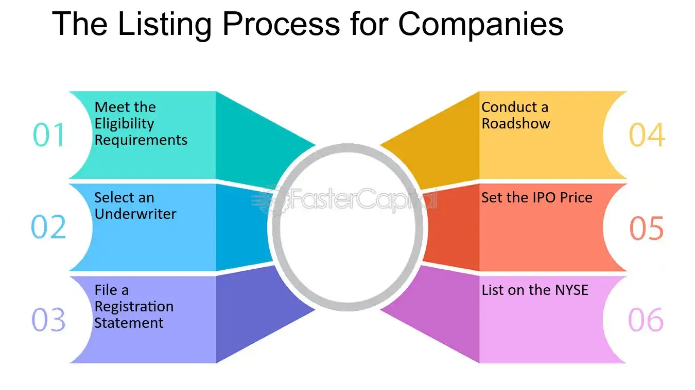

## Table of Contents

## What is a company listing?

A company listing is when a company's shares are made available for the public to buy on a stock exchange. This process is also known as an Initial Public Offering (IPO). When a company lists, it means that anyone can buy a part of the company by purchasing its shares. This can help the company raise money to grow or pay off debts.

Listing on a stock exchange can bring many benefits to a company. It can increase the company's visibility and credibility, making it more attractive to investors and customers. It also allows the company to raise more capital in the future if needed. However, listing also comes with more rules and regulations that the company must follow, which can be challenging.

## Why would a company want to list on a stock exchange?

A company might want to list on a stock exchange to get more money. When a company lists, it can sell shares to the public. This money can help the company grow bigger, start new projects, or pay off debts. It's like getting a big loan, but instead of paying it back, the company gives a piece of itself to the people who buy the shares.

Listing on a stock exchange can also make a company look more important and trustworthy. When people see a company's name on a stock exchange, they might think it's a good and stable business. This can attract more customers and investors. But, being listed means the company has to follow a lot of rules and share a lot of information, which can be hard work.

## What are the different types of stock exchanges where a company can list?

There are many types of stock exchanges around the world where a company can list its shares. Some of the most well-known ones are the New York Stock Exchange (NYSE) and the NASDAQ in the United States. In Europe, there's the London Stock Exchange (LSE) and the Frankfurt Stock Exchange. In Asia, the Tokyo Stock Exchange and the Hong Kong Stock Exchange are very popular. Each of these exchanges has its own rules and requirements for companies that want to list there.

Stock exchanges can also be divided into two main types: national and regional. National stock exchanges, like the NYSE or the LSE, are big and cover the whole country. They have lots of big companies listed on them. Regional stock exchanges are smaller and focus on a specific area, like a state or a province. They might have fewer and smaller companies listed. Some countries also have specialized exchanges, like ones just for technology companies or for smaller businesses.

Choosing the right stock exchange depends on what the company wants to achieve. If a company wants to be seen by lots of investors from around the world, it might choose a big national exchange. But if it wants to focus on a specific area or type of investor, a regional or specialized exchange might be better. Each exchange has its own benefits and challenges, so companies need to think carefully about where to list.

## What are the basic requirements for a company to get listed?

To get listed on a stock exchange, a company needs to meet some basic requirements. First, the company needs to be a certain size. This means it should have enough money, employees, and business activity. The exact size can be different for each stock exchange, but they all want to make sure the company is big enough to handle being public. Also, the company needs to have been around for a while, usually a few years, to show it's stable and not just a new idea.

Second, the company needs to follow the rules of the stock exchange it wants to join. This includes having a certain number of shareholders and making sure enough of its shares are available for the public to buy. The company also needs to share a lot of information about its finances and business plans. This helps investors understand what they're buying into. The company will need to keep sharing this information regularly, even after it's listed.

Lastly, the company needs to pay some fees and go through a process to get listed. This process can take a few months and involves working with lawyers, accountants, and sometimes special advisors. The company will need to prepare a big document called a prospectus, which tells everyone about the company and what it plans to do with the money it raises. Once all these steps are done and the stock exchange agrees, the company can finally list its shares and start trading.

## How does the initial public offering (IPO) process work?

When a company wants to go public and list its shares on a stock exchange, it starts with the initial public offering (IPO) process. First, the company hires investment banks to help with the IPO. These banks do a lot of work, like figuring out how much the company is worth and how many shares to sell. They also help the company make a big document called a prospectus. This document tells everyone about the company, its finances, and what it plans to do with the money from the IPO. The company then sends this prospectus to the stock exchange and a government agency, like the Securities and Exchange Commission (SEC) in the U.S., to get approval.

Once the prospectus is approved, the company sets a date for the IPO. On that day, the company's shares start trading on the stock exchange. The price of the shares can go up or down based on what investors think about the company. The money from selling the shares goes to the company, which can use it to grow or pay off debts. After the IPO, the company is now public, which means it has to follow a lot of rules and share information regularly with its shareholders and the public.

## What are the costs associated with listing a company?

Listing a company on a stock exchange can be expensive. First, there are the fees for the investment banks that help with the IPO. These banks charge a lot of money for their services, which can be a big part of the total cost. The company also has to pay lawyers and accountants to help prepare all the documents needed for the IPO. These professionals can be pricey too. Finally, the stock exchange itself charges a fee for listing the company's shares. All these costs can add up to a lot of money.

After the IPO, there are more costs to think about. The company has to spend money to follow all the rules and regulations of being a public company. This means hiring more people to keep track of all the information the company has to share with the public. The company also has to pay for regular reports and audits to make sure everything is correct. These ongoing costs can be a big part of the company's budget, but they are important for staying listed on the stock exchange.

## What are the ongoing obligations of a listed company?

After a company lists on a stock exchange, it has to follow many rules. It needs to tell the public a lot about its business, like how much money it makes and spends. The company has to share this information in regular reports, usually every three months and once a year. These reports help investors understand how the company is doing. The company also has to tell people about big changes, like if it wants to buy another company or if something important happens.

The company also has to have its finances checked by special accountants called auditors. These auditors make sure the company's numbers are correct and that it's following the rules. This can be expensive, but it's important to keep the company honest. The company also needs to have meetings with its shareholders, where they can ask questions and vote on important decisions. All these things take time and money, but they help the company stay listed on the stock exchange and keep investors happy.

## How can a company prepare for the listing process?

To prepare for listing on a stock exchange, a company needs to start by getting its finances in order. This means making sure all the money records are correct and up-to-date. The company should also work with good accountants and lawyers who know about the listing process. These professionals can help the company understand all the rules and get ready for the big document called a prospectus. The prospectus tells everyone about the company and what it plans to do with the money from the IPO. It's important to take time to make this document clear and honest so investors trust the company.

The company also needs to think about its business plan and how it will grow after going public. It should have a clear idea of what it wants to do with the money it raises from the IPO. The company might need to make changes to its business to be ready for being public, like improving how it shares information or setting up a team to handle all the new rules. It's a good idea to talk to other companies that have already listed to learn from their experiences. Getting ready for listing takes a lot of work, but it can help the company do well once it's on the stock exchange.

## What are some common challenges faced during the listing process?

One common challenge during the listing process is making sure all the financial information is correct and complete. This can be hard because the company has to share a lot of details about its money and business plans. If there are any mistakes, it can delay the whole process or even stop it. The company also needs to work with investment banks, lawyers, and accountants, which can be expensive and take a lot of time. Sometimes, these professionals might disagree on how to do things, which can make the process even harder.

Another challenge is figuring out the right price for the shares. The company wants to sell its shares for a good price, but if it asks for too much, investors might not want to buy them. If the price is too low, the company might not get enough money. It's a tricky balance, and the company has to do a lot of research and talk to investors to get it right. Also, the company has to follow a lot of rules from the stock exchange and the government. These rules can be complicated and change often, so the company needs to stay on top of them to avoid problems.

## Can you provide examples of successful company listings?

One example of a successful company listing is when Google went public in 2004. Google sold its shares on the NASDAQ stock exchange. The company raised a lot of money, and the price of its shares went up a lot after the IPO. This helped Google grow bigger and start new projects. People liked how Google shared information and followed the rules, which made investors trust the company.

Another example is Alibaba's IPO in 2014. Alibaba listed its shares on the New York Stock Exchange. It was one of the biggest IPOs ever, and the company raised a huge amount of money. Alibaba used this money to grow its business and become even more successful. The company did a good job of explaining its plans to investors, which helped make the IPO a big success.

## How do different countries' regulations affect the listing process?

Different countries have their own rules for listing a company on a stock exchange. These rules can make the process easier or harder, depending on where the company wants to list. For example, in the United States, the Securities and Exchange Commission (SEC) has strict rules about what information a company has to share before it can go public. This can make the process take longer and cost more money. In other places, like some countries in Europe, the rules might be less strict, which can make it easier and faster for a company to list its shares.

These different regulations also affect how much a company has to share with the public after it's listed. In the U.S., a listed company has to give regular reports about its money and business plans. This keeps investors informed but can be a lot of work for the company. In some other countries, the rules might not be as strict, so the company might not have to share as much information. This can be easier for the company but might make investors less sure about the company's future.

## What advanced strategies can companies use to maximize the benefits of listing?

To get the most out of listing, a company can use some smart strategies. One way is to pick the right stock exchange that fits the company's goals. For example, if the company wants to reach investors all over the world, listing on a big exchange like the NYSE or NASDAQ can help. The company can also use the IPO to tell a good story about its future plans and why it's a good investment. This can make investors excited and help the share price go up.

Another strategy is to use the money from the IPO wisely. The company should have a clear plan for how it will use the money to grow bigger or start new projects. This can make investors feel good about their choice to buy the shares. The company can also keep talking to investors after the IPO, sharing updates and good news. This helps build trust and can make the share price stay strong or even go up more.

## What are common strategies in algorithmic trading?

Algorithmic trading employs a variety of strategies to capitalize on fluctuations in financial markets. These strategies rely on sophisticated algorithms to identify trading opportunities and execute transactions with precision and speed. Some of the most prevalent strategies include [trend following](/wiki/trend-following), mean reversion, and Volume Weighted Average Price (VWAP), each with its unique approach to exploiting market movements.

### Trend Following

Trend following strategies are designed to detect and capitalize on sustained market trends. These strategies rely on statistical indicators such as moving averages, moving average convergence divergence (MACD), and the relative strength index (RSI) to identify potential entry and [exit](/wiki/exit-strategy) points. Traders using this strategy buy assets that are trending upward and sell those trending downward, assuming that the current trend will persist. The objective is to minimize the lag in response time between the identification of a trend and the execution of trades.

A simple implementation of a moving average crossover in Python might look like this:

```python
import pandas as pd

def moving_average_strategy(df, short_window=40, long_window=100):
    """Generates buy/sell signals based on moving average crossover strategy."""
    # Calculate moving averages
    df['short_ma'] = df['Close'].rolling(window=short_window, min_periods=1).mean()
    df['long_ma'] = df['Close'].rolling(window=long_window, min_periods=1).mean()

    # Signal generation
    df['signal'] = 0.0
    df['signal'][short_window:] = np.where(df['short_ma'][short_window:] > df['long_ma'][short_window:], 1.0, 0.0)

    # Calculate positions
    df['position'] = df['signal'].diff()

    return df
```

### Mean Reversion

Mean reversion strategies operate on the principle that asset prices tend to revert to their historical average or mean levels over time. This approach is typically employed in markets where assets exhibit cyclical behavior or revert to a mean state after extreme movements. Investors using mean reversion might buy undervalued assets expected to rise back to the average price and sell overvalued assets anticipated to decrease.

The z-score is a common measure used in mean reversion strategies:

$$
z = \frac{(P - \mu)}{\sigma}
$$

Where:
- $P$ is the current price of the asset,
- $\mu$ is the historical mean of the asset's price,
- $\sigma$ is the standard deviation of the asset's price.

### Volume Weighted Average Price (VWAP)

VWAP strategies involve executing large orders with minimal impact on market prices by distributing trades over a set time period. The VWAP is calculated by dividing the total dollar amount traded by the total [volume](/wiki/volume-trading-strategy):

$$
VWAP = \frac{\sum (P_i \times Q_i)}{\sum Q_i}
$$

Where:
- $P_i$ is the price at which each trade is executed,
- $Q_i$ is the quantity of each trade.

Traders use VWAP to achieve better pricing for large orders, as the strategy helps in executing incremental trades that average closer to the VWAP, thereby reducing market impact.

These strategies exemplify the diverse array of techniques utilized in algorithmic trading to enhance trading performance and optimize execution. Each method is tailored to specific market conditions and trader preferences, providing a toolkit for effectively navigating the complexities of financial markets.

## References & Further Reading

[1]: ["Advances in Financial Machine Learning"](https://www.amazon.com/Advances-Financial-Machine-Learning-Marcos/dp/1119482089) by Marcos Lopez de Prado

[2]: ["Evidence-Based Technical Analysis: Applying the Scientific Method and Statistical Inference to Trading Signals"](https://www.amazon.com/Evidence-Based-Technical-Analysis-Scientific-Statistical/dp/0470008741) by David Aronson

[3]: ["Machine Learning for Algorithmic Trading"](https://github.com/stefan-jansen/machine-learning-for-trading) by Stefan Jansen

[4]: ["Quantitative Trading: How to Build Your Own Algorithmic Trading Business"](https://github.com/LucindaYa/quant-resources/blob/master/Quantitative%20Trading%20How%20to%20Build%20Your%20Own%20Algorithmic%20Trading%20Business.pdf) by Ernest P. Chan

[5]: U.S. Securities and Exchange Commission. ["Guide to Initial Public Offerings"](https://www.sec.gov/about/reports-publications/investorpubsbegininvesthtm)

[6]: Hendershott, T., Jones, C. M., & Menkveld, A. J. (2011). ["Does Algorithmic Trading Improve Liquidity?"](https://onlinelibrary.wiley.com/doi/full/10.1111/j.1540-6261.2010.01624.x) The Journal of Finance, 66(1).