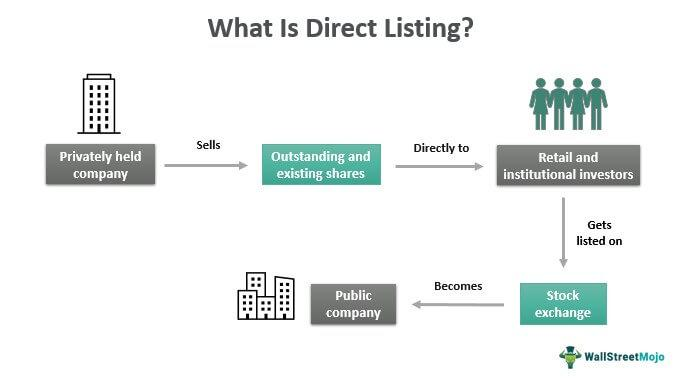

In the complex and dynamic world of finance, understanding the intricacies of company listing on stock exchanges and the role of algorithmic trading is essential for investors and businesses. Stock exchanges serve as pivotal platforms where companies can raise capital by offering shares to the public, thus contributing to the broader economic growth. A public listing process involves stringent criteria and regulations to ensure that companies have the necessary financial stability and governance structures, fostering investor confidence and market integrity.

Algorithmic trading, on the other hand, revolutionizes the way trades are executed in the market. By utilizing pre-programmed trading instructions, it facilitates rapid decision-making and execution, minimizing human errors and removing emotional biases. The interplay between company listings and algorithmic trading shapes market dynamics by affecting liquidity, volatility, and price discovery processes.



This article aims to equip readers with a comprehensive understanding of stock exchange listing requirements, the strategic advantages of complying with these criteria, and the multifaceted impact of algorithmic trading on stock market operations. Whether a company is considering going public or an investor is looking to refine trading strategies, mastering these concepts is vital for success in today's financial markets.

By the end of this article, readers will possess the essential knowledge to navigate the challenges and opportunities presented by public listings and algorithmic trading, positioning themselves effectively in the competitive financial landscape.

## Table of Contents

## Understanding Stock Exchange Listing Criteria

Listing criteria are the defined standards a company must meet to list its shares on a stock exchange. These standards are essential to maintain market integrity and ensure investor protection by promoting transparency and stability in the stock market. By imposing stringent listing requirements, exchanges can cultivate an environment where investors trust the listed entities, knowing they meet specific benchmarks.

Key listing requirements frequently revolve around financial metrics, corporate governance standards, and liquidity measures.

1. **Financial Metrics**: Among the fundamental criteria are financial performance metrics, which could include:
   - A minimum level of pre-tax earnings.
   - Net tangible assets.
   - Revenue thresholds or cash flow benchmarks.

    For instance, the New York Stock Exchange (NYSE) mandates a minimum market value for publicly held shares and certain earnings metrics. In contrast, the Nasdaq Stock Market may require companies to meet either earnings thresholds or market capitalization levels. These financial criteria are intended to verify that a company possesses sufficient financial resources and stability to operate as a publicly-traded entity.

2. **Corporate Governance Standards**: Exchanges impose requirements that encourage good corporate governance, ensuring that companies align their practices with the interests of shareholders. Such standards may include:
   - A majority of independent board members.
   - Audit committees.
   - Shareholder voting rights and disclosures.

    These governance criteria are crucial for fostering ethical business practices and protecting investor interests.

3. **Liquidity Measures**: Liquidity is vital for active and efficient market participation. Stock exchanges often have liquidity requirements such as:
   - A minimum number of shareholders.
   - A stipulated number of shares outstanding.
   - Daily or monthly average trading volumes.

    These measures create an environment where market participants can trade shares with minimal impact on the stock’s price, encouraging a vibrant trading atmosphere.

Meeting these criteria is pivotal for companies aspiring to be listed on a major stock exchange, as adherence not only reflects financial robustness but also boosts investor confidence. Companies listed on these exchanges benefit from heightened visibility and the ability to attract a wider pool of potential investors, which translates into improved access to capital. 

Overall, these standards help uphold the quality and integrity of the stock market, ensuring that listed companies are well-prepared to engage with public investors and comply with regulatory requirements, thus enhancing the overall ecosystem for all market stakeholders.

## Benefits of Meeting Listing Requirements

Companies that successfully meet stock exchange listing requirements gain numerous benefits, significantly impacting their growth and operational strategy. One of the primary advantages is the increased visibility and access to capital that comes with listing on a major stock exchange. This elevated profile not only enhances a company’s credibility within the financial community but also makes it more attractive to potential investors. Greater visibility can lead to an expanded investor base, providing a more diverse source of funding for the company.

Listing on a stock exchange also facilitates the raising of capital through new stock issuances. A public listing provides companies with the opportunity to issue additional shares, which can be an effective tool for generating funds needed for expansion and development projects. By accessing a wider pool of investors, companies can secure the financial resources necessary to pursue strategic initiatives, such as entering new markets or expanding operational capabilities.

Furthermore, being a listed entity enables companies to offer stock options as a form of employee compensation. Stock options align the interests of employees with those of the company by providing them with a stake in its success. This form of compensation can be particularly appealing to high-potential talent, serving as an incentive for employees to contribute to the company’s long-term growth and success. Additionally, stock options can play a crucial role in talent retention, helping companies maintain a competitive edge in their respective industries.

Overall, fulfilling stock exchange listing requirements opens up a plethora of strategic opportunities for companies, enhancing their ability to grow, finance new initiatives, and attract and retain key talent. These benefits are essential for companies aiming to compete effectively in the global marketplace.

## Stock Market Requirements Across Different Exchanges

Each stock exchange enforces distinct criteria for company listings, embodying their unique operational strategies and market philosophies. These criteria are designed to ensure that listed companies possess adequate financial strength and operational competence, thereby safeguarding market integrity and maintaining investor confidence.

The New York Stock Exchange (NYSE), renowned for its rigorous standards, mandates specific financial and governance benchmarks. Companies aspiring to list on the NYSE must meet a minimum threshold for market value, alongside demonstrating consistent earnings stability. Typically, this includes having a global market capitalization of at least $200 million and tangible assets of $100 million. Moreover, they require robust governance structures, such as a minimum number of board members classified as independent.

Conversely, the Nasdaq Stock Market operates a tiered listing system, catering to different segments of the corporate spectrum. The Nasdaq Global Select Market represents its upper echelon, demanding substantial capitalization and financial performance measures, including cumulative pre-tax earnings over a three-year period or a minimum revenue threshold. Meanwhile, the Nasdaq Capital Market is tailored for smaller growth companies, featuring more lenient requirements to encourage innovative businesses with potential.

These differentiated listing demands serve to uphold the quality and reliability of the exchanges. By imposing firm criteria, stock exchanges mitigate the risk of listing financially precarious entities, thereby reducing the likelihood of investor losses and promoting stable market conditions. The differences in the procedures highlight the exchanges' commitment to fostering environments that prioritize transparency and robustness in financial practices, benefiting both companies and investors worldwide by offering tailored opportunities to engage with public markets.

## Algorithmic Trading: Overview and Technical Requirements

Algorithmic trading, often referred to as algo trading, employs computer algorithms to execute trades according to predefined parameters, ensuring rapid decision-making and transaction execution. This methodology significantly reduces emotional biases present in manual trading, thus improving precision and operational speed—both critical in today's high-velocity markets.

For successful [algorithmic trading](/wiki/algorithmic-trading), robust technical setups are essential. This encompasses high-performance computing systems capable of handling substantial data processing in minimal time. Advanced software platforms enable the implementation of complex algorithms and strategies efficiently, thus ensuring trades are executed at optimal conditions.

Knowledge in programming languages, particularly Python, is a fundamental requirement in developing, [backtesting](/wiki/backtesting), and implementing trading strategies. Python's extensive library ecosystem, including libraries like NumPy, pandas, and SciPy, offers powerful tools for data analysis, which is crucial in the development of effective algo trading models.

Here's a basic example in Python illustrating a simple moving average crossover strategy, a common algorithmic trading strategy:

```python
import pandas as pd
import numpy as np

# Function to calculate moving averages
def calculate_moving_averages(prices, short_window, long_window):
    signals = pd.DataFrame(index=prices.index)
    signals['price'] = prices
    signals['short_ma'] = prices.rolling(window=short_window, min_periods=1).mean()
    signals['long_ma'] = prices.rolling(window=long_window, min_periods=1).mean()
    signals['signal'] = 0.0
    signals['signal'][short_window:] = np.where(signals['short_ma'][short_window:] > signals['long_ma'][short_window:], 1.0, 0.0)
    signals['positions'] = signals['signal'].diff()
    return signals

# Example usage
prices = pd.Series([120, 122, 121, 123, 125, 126, 127, 130, 131, 132])
signals = calculate_moving_averages(prices, short_window=3, long_window=5)
print(signals)
```

Access to quality market data is another cornerstone of effective algorithmic trading. Accurate data ensures that the strategies developed and backtested reflect true market conditions, thereby increasing the chances of success when the strategies are employed in live trading. The combination of high-caliber technical infrastructure, comprehensive data sets, and astute programming skills equips traders to harness the full potential of algorithmic trading in pursuit of their financial objectives.

## Common Strategies in Algorithmic Trading

Algorithmic trading employs a variety of strategies to capitalize on fluctuations in financial markets. These strategies rely on sophisticated algorithms to identify trading opportunities and execute transactions with precision and speed. Some of the most prevalent strategies include [trend following](/wiki/trend-following), mean reversion, and Volume Weighted Average Price (VWAP), each with its unique approach to exploiting market movements.

### Trend Following

Trend following strategies are designed to detect and capitalize on sustained market trends. These strategies rely on statistical indicators such as moving averages, moving average convergence divergence (MACD), and the relative strength index (RSI) to identify potential entry and [exit](/wiki/exit-strategy) points. Traders using this strategy buy assets that are trending upward and sell those trending downward, assuming that the current trend will persist. The objective is to minimize the lag in response time between the identification of a trend and the execution of trades.

A simple implementation of a moving average crossover in Python might look like this:

```python
import pandas as pd

def moving_average_strategy(df, short_window=40, long_window=100):
    """Generates buy/sell signals based on moving average crossover strategy."""
    # Calculate moving averages
    df['short_ma'] = df['Close'].rolling(window=short_window, min_periods=1).mean()
    df['long_ma'] = df['Close'].rolling(window=long_window, min_periods=1).mean()

    # Signal generation
    df['signal'] = 0.0
    df['signal'][short_window:] = np.where(df['short_ma'][short_window:] > df['long_ma'][short_window:], 1.0, 0.0)

    # Calculate positions
    df['position'] = df['signal'].diff()

    return df
```

### Mean Reversion

Mean reversion strategies operate on the principle that asset prices tend to revert to their historical average or mean levels over time. This approach is typically employed in markets where assets exhibit cyclical behavior or revert to a mean state after extreme movements. Investors using mean reversion might buy undervalued assets expected to rise back to the average price and sell overvalued assets anticipated to decrease.

The z-score is a common measure used in mean reversion strategies:

$$
z = \frac{(P - \mu)}{\sigma}
$$

Where:
- $P$ is the current price of the asset,
- $\mu$ is the historical mean of the asset's price,
- $\sigma$ is the standard deviation of the asset's price.

### Volume Weighted Average Price (VWAP)

VWAP strategies involve executing large orders with minimal impact on market prices by distributing trades over a set time period. The VWAP is calculated by dividing the total dollar amount traded by the total [volume](/wiki/volume-trading-strategy):

$$
VWAP = \frac{\sum (P_i \times Q_i)}{\sum Q_i}
$$

Where:
- $P_i$ is the price at which each trade is executed,
- $Q_i$ is the quantity of each trade.

Traders use VWAP to achieve better pricing for large orders, as the strategy helps in executing incremental trades that average closer to the VWAP, thereby reducing market impact.

These strategies exemplify the diverse array of techniques utilized in algorithmic trading to enhance trading performance and optimize execution. Each method is tailored to specific market conditions and trader preferences, providing a toolkit for effectively navigating the complexities of financial markets.

## Impact of Algorithmic Trading on Stock Market Dynamics

Algorithmic trading plays a crucial role in shaping the dynamics of modern stock markets. By employing computer algorithms to execute trades based on predefined conditions, it enhances [liquidity](/wiki/liquidity-risk-premium) and operational efficiency but also introduces new risks.

One of the primary impacts of algorithmic trading is the reduction in bid-ask spreads, which facilitates efficient price discovery. The narrowing of spreads is achieved through increased market activity and competition among trading firms, which collectively contribute to creating more stable market conditions. Enhanced liquidity ensures that market participants can buy or sell large volumes of stock with minimal price disruption, thereby boosting overall market efficiency.

High-frequency trading ([HFT](/wiki/high-frequency-trading-strategies)), a prominent subset of algorithmic trading, executes a significant number of trades at extraordinarily rapid speeds. While HFT contributes to liquidity and price efficiency, it can also lead to heightened market [volatility](/wiki/volatility-trading-strategies). The rapid execution of large volumes of trades means that any errors or discrepancies in algorithmic strategies can quickly amplify market turbulence, potentially resulting in flash crashes. A notable instance of such a crash occurred on May 6, 2010, when the U.S. stock market experienced a sudden and severe drop in prices within minutes, known as the Flash Crash.

In response to the potential risks introduced by algorithmic and high-frequency trading, regulators have implemented guidelines aimed at ensuring fair trading practices and maintaining market integrity. These measures often include circuit breakers, which temporarily halt trading during extreme volatility to prevent panic selling, and stringent reporting requirements to improve transparency in trading activities. Moreover, regulators work closely with exchanges to monitor trading patterns and ensure compliance with established rules, thus safeguarding the market from manipulative strategies that could distort pricing and harm investor confidence.

By balancing the benefits of liquidity and efficiency with the need for stability and regulatory oversight, algorithmic trading continues to be an integral component of the financial markets while posing challenges that require ongoing vigilance and adaptation.

## Conclusion

Stock exchange listing criteria and algorithmic trading are fundamental components that shape modern financial markets, offering significant advantages while presenting certain challenges. Listing requirements serve to maintain market integrity and ensure investor protection, providing a structured framework that companies must adhere to for public listings. These criteria ensure that only financially stable and well-governed companies participate in the markets, fostering transparency and boosting investor confidence.

Algorithmic trading, on the other hand, revolutionizes trading operations by enabling enhanced execution speed and efficiency. Through the use of sophisticated computer algorithms, traders can execute decisions rapidly, minimizing emotional biases and improving precision. However, this technological advance also introduces challenges, such as increased market volatility and the potential for flash crashes, particularly with high-frequency trading.

For companies, understanding and meeting stock exchange listing criteria is essential for a successful public offering. Listing on a major exchange not only elevates a company's profile and credibility but also provides access to capital for growth and expansion. Conversely, for investors, effectively leveraging algorithmic trading necessitates a continuous adaptation of strategies and technology. This includes maintaining a robust technical setup and keeping abreast of software developments and market conditions.

Staying informed about stock exchange listing criteria and the dynamics of algorithmic trading is vital for navigating the evolving landscape of stock trading. As both companies and investors seek success in a competitive financial environment, a thorough understanding of these elements will help in capitalizing on opportunities and mitigating risks inherent in the modern market.

## References & Further Reading

[1]: ["Advances in Financial Machine Learning"](https://www.amazon.com/Advances-Financial-Machine-Learning-Marcos/dp/1119482089) by Marcos Lopez de Prado

[2]: ["Evidence-Based Technical Analysis: Applying the Scientific Method and Statistical Inference to Trading Signals"](https://www.amazon.com/Evidence-Based-Technical-Analysis-Scientific-Statistical/dp/0470008741) by David Aronson

[3]: ["Machine Learning for Algorithmic Trading"](https://github.com/stefan-jansen/machine-learning-for-trading) by Stefan Jansen

[4]: ["Quantitative Trading: How to Build Your Own Algorithmic Trading Business"](https://github.com/LucindaYa/quant-resources/blob/master/Quantitative%20Trading%20How%20to%20Build%20Your%20Own%20Algorithmic%20Trading%20Business.pdf) by Ernest P. Chan

[5]: U.S. Securities and Exchange Commission. ["Guide to Initial Public Offerings"](https://www.sec.gov/about/reports-publications/investorpubsbegininvesthtm)

[6]: Hendershott, T., Jones, C. M., & Menkveld, A. J. (2011). ["Does Algorithmic Trading Improve Liquidity?"](https://onlinelibrary.wiley.com/doi/full/10.1111/j.1540-6261.2010.01624.x) The Journal of Finance, 66(1).