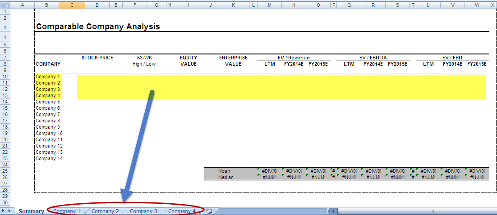

In the modern financial landscape, understanding the intrinsic and market value of assets is critical for investment success. This article explores the key concepts of investment strategy, focusing on Comparable Company Analysis (CCA), financial analysis, and how algorithmic trading integrates these insights.

CCA involves evaluating a company's worth by comparing it with similar businesses in the same industry. This practice not only offers a method to assess a company's market value but also provides a benchmark for strategic investment decisions. By analyzing comparable firms, investors can obtain insights into relative performance metrics and valuation multiples, aiding in the identification of potential investment opportunities.



Financial analysis further assists investors by offering metrics to determine whether an asset is undervalued or overvalued. It encompasses a wide range of quantitative and qualitative evaluations, including the analysis of balance sheets, income statements, and cash flow statements. These analyses yield key indicators such as price-to-earnings (P/E) ratios, return on equity (ROE), and debt-to-equity ratios, which facilitate informed investment decisions.

Algorithmic trading, meanwhile, leverages advanced models to automate decision-making processes based on market data and financial analysis. This methodology utilizes computational algorithms to identify trading signals and execute trades at optimal prices and times, minimizing human error. Algorithms can incorporate various inputs, including historical price data, trading volume, and volatility measures, to manage risk and capitalize on market inefficiencies.

Together, these methodologies form a cohesive strategy for informed and efficient market participation. By integrating CCA, financial analysis, and algorithmic trading, investors can enhance their ability to evaluate asset value, make strategic investment decisions, and navigate the complexities of today's financial markets more effectively. This combined approach ensures a robust framework for optimizing investment outcomes aligned with fundamental and technical market insights.

## Table of Contents

## Overview of Valuation Methods

Valuation methods are fundamental instruments for assessing the economic value of an asset or a company, facilitating informed decision-making in investment and finance. These methods each have distinct applications and are chosen based on the specific context of the analysis at hand.

The Discounted Cash Flow (DCF) analysis is a widely used valuation method that estimates the value of an investment based on its expected future cash flows. These cash flows are projected into the future and then discounted back to their present value using a specified discount rate, typically reflecting the cost of capital. The formula for DCF is given by:

$$
DCF = \sum_{t=1}^{n} \frac{CF_t}{(1 + r)^t}
$$

where $CF_t$ represents the cash flow in year $t$, $n$ is the total number of periods, and $r$ is the discount rate. DCF analysis is especially useful for valuing companies with predictable cash flows, offering a detailed insight into the intrinsic value of an asset.

Comparable Company Analysis (CCA) provides a relative valuation by examining the financial metrics of similar businesses within the same industry. Through this method, comparative metrics such as the Price-to-Earnings (P/E) ratio, Enterprise Value to EBITDA (EV/EBITDA), and others are utilized to benchmark the target company's market value against its peers. This approach offers an immediate snapshot of how a company is valued in the market context, thus providing crucial insights for strategic decision-making.

Market multiples are another prevalent quick-reference valuation tool that enables investors and analysts to assess how a company is being valued relative to its competitors. The most common multiple utilized is the P/E ratio, calculated as:

$$
\text{P/E Ratio} = \frac{\text{Market Price per Share}}{\text{Earnings per Share}}
$$

This ratio provides a comparative measure of the price investors are willing to pay per unit of earnings, thereby offering insights into market sentiment and investment attractiveness in relation to other firms.

Deciding on the suitable valuation method is contingent upon the specific circumstances surrounding the company or investment opportunity. Factors such as industry sector, growth prospects, capital structure, and market conditions all play a critical role in determining the appropriate valuation approach. While each method carries its strengths and limitations, deploying them judiciously can yield a comprehensive understanding of a company's fair market value.

## Steps in Conducting a Comparable Company Analysis

To perform a Comparable Company Analysis (CCA), follow a structured approach that begins with identifying a peer group and culminates in estimating the target company's market value. This process involves several key steps:

1. **Identify a Peer Group**: Start by selecting a group of companies within the same industry or that share similar characteristics with the target company. These peers should be comparable in terms of size, business model, market dynamics, and geographical presence. The objective is to ensure that the companies chosen offer a fair benchmark for comparison.

2. **Collect and Adjust Financial Data**: Gather relevant financial information from the selected peer group, focusing on essential documents such as balance sheets, income statements, and cash flow statements. This data must be standardized, considering any one-time items or accounting anomalies that could skew comparisons. Adjustments may include aligning fiscal years and removing non-recurring revenue or expenses.

3. **Select and Calculate Relevant Valuation Multiples**: Choose appropriate financial multiples that reflect the value of companies in a specific sector. Commonly used multiples include Price-to-Earnings (P/E), Enterprise Value-to-EBITDA (EV/EBITDA), and Price-to-Book (P/B) ratios. Calculate these multiples for the companies in the peer group to establish an industry benchmark:
$$
   \text{P/E Ratio} = \frac{\text{Market Price per Share}}{\text{Earnings per Share}}

$$
$$
   \text{EV/EBITDA} = \frac{\text{Enterprise Value}}{\text{Earnings Before Interest, Taxes, Depreciation, and Amortization}}

$$
$$
   \text{P/B Ratio} = \frac{\text{Market Price per Share}}{\text{Book Value per Share}}

$$

4. **Apply Multiples to the Target Company**: Using the valuation multiples derived from the peer group, estimate the market value of the target company. This is achieved by applying the average or median multiples to the corresponding financial metrics of the target company:
$$
   \text{Estimated Market Value (P/E)} = \text{Peer Group Average P/E} \times \text{Target's Earnings per Share}

$$
$$
   \text{Estimated Enterprise Value (EV/EBITDA)} = \text{Peer Group Median EV/EBITDA} \times \text{Target's EBITDA}

$$

5. **Assess Valuation Contextually**: Evaluate the resulting valuation by considering current market conditions and company-specific factors. Economic trends, regulatory changes, and unique business strategies of the target company should be factored in to ensure a comprehensive analysis. Additionally, cross-checking with other valuation methods may provide a better-rounded perspective.

By systematically executing these steps, investors can leverage Comparable Company Analysis to assess market value effectively, helping guide strategic investment decisions.

## Advantages and Limitations of CCA

Comparable Company Analysis (CCA) is a valuation method that capitalizes on market-based insights to evaluate a company's worth. Its inherent advantages and limitations make it a widely used, yet cautiously approached tool in financial analysis.

One of the primary advantages of CCA is its market-driven perspective, providing users with a practical tool for real-time valuation. By comparing a company to its industry peers, CCA offers a snapshot of how the market values similar businesses, which can inform immediate investment decisions. This technique is relatively straightforward to implement and understand, making it accessible to a wide range of investors. The process involves selecting relevant valuation multiples such as Price-to-Earnings (P/E), Enterprise Value to EBITDA (EV/EBITDA), and Price-to-Book (P/B) ratios. These benchmarks serve as clear reference points for evaluating a company's market valuation against its competitors, aiding in identifying whether a company is under- or over-valued relative to industry norms.

Despite its benefits, CCA has several limitations. A key drawback is the subjectivity involved in selecting the pool of comparable companies. The choice of peers can significantly influence the outcome of the analysis, as companies with differing business models, geographic markets, or growth stages might skew the relative valuation. Furthermore, discrepancies in accounting practices and financial reporting among companies can lead to inconsistencies in financial data, impacting the reliability of the derived multiples.

Market [volatility](/wiki/volatility-trading-strategies) poses another challenge, as fluctuating market conditions can affect short-term valuations, making CCA less reliable during periods of economic instability. Consequently, evaluations based solely on market comparisons may require adjustments to account for transient market factors. Incorporating complementary valuation methods such as Discounted Cash Flow (DCF) analysis or asset-based approaches can help mitigate these issues, offering a more robust and stable valuation framework.

In summary, while CCA offers a practical, market-aligned methodology for company valuation, its effectiveness depends on careful selection of comparables and consideration of external market dynamics. Strategically integrating this tool with other valuation methods can enhance its utility and accuracy in diverse investment scenarios.

## Algorithmic Trading: Bridging Analysis and Execution

Algorithmic trading automates the execution of trades utilizing complex financial models and extensive market data analysis. By implementing quantitative models, these algorithms scrutinize variables such as price trends, trade volumes, and market volatility to make informed trading decisions. For instance, a common quantitative model employed in [algorithmic trading](/wiki/algorithmic-trading) is the Moving Average Crossover, where short-term and long-term moving averages are computed to identify potential buying or selling opportunities. The logic can be articulated through a simple Python code snippet:

```python
import numpy as np

def moving_average(data, window_size):
    return np.convolve(data, np.ones(window_size)/window_size, mode='valid')

# Example data
prices = [110, 112, 113, 115, 117, 119, 120]

# Calculate short-term and long-term moving averages
short_term = moving_average(prices, window_size=2)
long_term = moving_average(prices, window_size=4)

# Determine buy (short_term > long_term) or sell (short_term < long_term) signals
signals = ['Buy' if s > l else 'Sell' for s, l in zip(short_term, long_term)]
```

The primary benefits of algorithmic trading include significantly reducing human error and exploiting market inefficiencies almost instantaneously. These algorithms are programmed to perform trades based on pre-set criteria, thus eliminating the impulsive decision-making often associated with human traders.

Furthermore, algorithmic systems operate continuously, offering the ability to execute trades 24/7. This uninterrupted functionality ensures traders can respond to opportunities in global markets irrespective of time zones, thereby enhancing overall trading efficiency. Through the continuous analysis of market conditions and swift reaction to new data, algorithmic trading remains a key component in modern investment strategies, bridging the gap between theoretical financial analysis and real-world trading execution.

## Integration of Valuation and Algo Trading

Integrating valuation models with algorithmic trading empowers market participants to adapt their trading strategies in real-time based on comprehensive financial data analysis. This combination leverages fundamental valuation approaches like Discounted Cash Flow (DCF) and Comparable Company Analysis (CCA) to inform algorithm-driven trading decisions. By aligning trading algorithms with these valuation methods, traders can optimize trade execution and portfolio management, ensuring that decisions reflect both market dynamics and intrinsic value assessments.

Algorithms play a pivotal role in merging valuation insights with trading execution. For instance, a trading algorithm can be calibrated to incorporate the output of a DCF model, which estimates a company's intrinsic value through discounted future cash flows. The algorithm can compare this intrinsic value with current market prices to identify undervalued or overvalued opportunities, thereby informing buy or sell decisions. Similarly, CCA provides a framework for valuing a company in relation to its industry peers, allowing algorithms to dynamically adjust positions based on relative valuations.

Python and other programming languages are instrumental in this integration process, particularly for fetching and processing financial data. Python libraries such as `pandas` and `numpy` facilitate the handling and manipulation of large datasets, while `scikit-learn` and `statsmodels` offer robust tools for implementing quantitative models. Here is an example of a simple Python script that uses real-time financial data to assess valuation discrepancies:

```python
import pandas as pd
import numpy as np
import yfinance as yf  # For more datasets, visit: https://paperswithbacktest.com/datasets

# Fetch the stock data
stock_data = yf.download('AAPL', start='2023-01-01', end='2023-12-31')

# Calculate the moving average as a simple indicator
stock_data['20_day_MA'] = stock_data['Close'].rolling(window=20).mean()

# Define a simple trading strategy based on valuation and price trends
def trading_strategy(stock_data, intrinsic_value):
    signals = []
    for index, row in stock_data.iterrows():
        if row['Close'] < intrinsic_value and row['Close'] < row['20_day_MA']:
            signals.append('Buy')
        elif row['Close'] > intrinsic_value:
            signals.append('Sell')
        else:
            signals.append('Hold')
    return signals

# Assume theoretical intrinsic value for demonstration
intrinsic_value = 150.00
stock_data['Signals'] = trading_strategy(stock_data, intrinsic_value)
print(stock_data[['Close', '20_day_MA', 'Signals']])
```

This example script employs historical data from Yahoo Finance to compute a 20-day moving average as a proxy for [momentum](/wiki/momentum) analysis. It implements a basic strategy incorporating intrinsic value assumptions to generate buy or sell signals based on the current price levels relative to both intrinsic value and market trends.

Integrating valuation and algorithmic trading provides a data-driven framework to capitalize on valuation anomalies. By processing financial data efficiently and executing trades algorithmically, traders can reduce the latency between analysis and action, thus exploiting opportunities that manual methods might miss. This integration, therefore, enhances the precision and effectiveness of trading activities in today's fast-paced financial markets.

## Conclusion

Integrating Comparable Company Analysis (CCA) and various valuation methods with algorithmic trading forms a robust framework that significantly enhances strategic investment. This synthesis allows for more precise and informed trading decisions, facilitating improved market efficiency. By utilizing both advanced financial analysis and automation, investors can better manage and navigate the complexities inherent in contemporary financial markets. The integration of algorithmic trading with traditional valuation approaches such as CCA ensures that trading strategies are continuously aligned with fundamental valuations, while simultaneously exploiting market inefficiencies in real-time.

This approach leverages the strength of different methodologies: CCA provides a market-oriented perspective by benchmarking against peers, while algorithmic trading introduces data-driven automation into the execution process. Through the continuous analysis of market data, algorithms can adjust trading strategies dynamically to reflect real-time conditions, thereby optimizing portfolio performance.

Advanced computational techniques, particularly those found in Python, enable traders to automate the fetching and processing of financial data. For instance, Python's powerful data manipulation libraries like pandas can be used to streamline data collection and analysis processes. This enables the development of robust trading algorithms that can act on valuation discrepancies quickly and efficiently.

The efficiency gained from such an integrated approach can not only mitigate risks associated with human error but also capitalize on opportunities that may arise due to market volatility or inefficiencies. Ultimately, this combination of traditional valuation methods and cutting-edge trading technology empowers investors to make well-informed investment decisions, thereby improving their competitive edge in the financial markets.

## References & Further Reading

Investopedia: Comparable Company Analysis provides a thorough overview of one of the most common valuation methods, offering insights into how this method is used to assess a company's relative market position by comparing it with industry peers. This resource is valuable for understanding the baseline procedures and considerations involved in Comparable Company Analysis (CCA).

McKinsey & Company: Valuation: Measuring and Managing the Value of Companies is a comprehensive guide on various methods utilized to value a business, including Discounted Cash Flow (DCF) and CCA. The book is a fundamental resource for anyone looking to understand the intricacies of financial valuation, making it essential reading for refining investment strategies and understanding company value drivers.

Chan, E.: Quantitative Trading: How to Build Your Own Algorithmic Trading Business offers practical guidance on setting up and operating a trading business that capitalizes on algorithmic strategies. The book provides detailed instructions and insights on constructing algorithms that leverage financial models for executing trading strategies efficiently and effectively, providing a crucial link between financial analysis and trade execution.

De Prado, M. L.: Advances in Financial Machine Learning explores innovative techniques and methodologies for applying [machine learning](/wiki/machine-learning) to financial markets, including the development of predictive models and automated trading strategies. This work is critical for traders and analysts looking to incorporate advanced data-driven techniques into their analyses and trading operations.

Jansen, S.: Machine Learning for Algorithmic Trading presents an in-depth examination of how machine learning can enhance algorithmic trading. This book covers the practical application of programming languages, notably Python, in collecting and processing market data, developing trading strategies, and optimizing execution. The insights provided are crucial for effectively integrating machine learning with traditional valuation models for enhanced investment performance.

