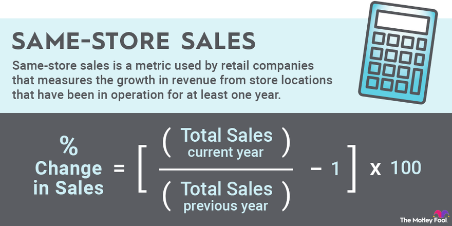

## Table of Contents

## What are comparable store sales?

Comparable store sales, often called "comp sales" or "same-store sales," are a way to measure how well a store is doing by comparing its sales to the same time last year. This method looks at stores that have been open for at least a year. It helps businesses see if they are growing or if their sales are going down, without being affected by new store openings or store closures.

By focusing on stores that have been around for a while, companies can get a clear picture of their performance. For example, if a store's sales went up this year compared to last year, it might mean that customers are happier or that the store is doing a better job at selling its products. On the other hand, if sales went down, it could signal that the store needs to make some changes. This measure is very important for big companies with many stores, like retail chains, because it helps them understand how well they are doing overall.

## Why are comparable store sales important for businesses?

Comparable store sales are important for businesses because they show how well a store is doing over time. By comparing sales from the same stores year after year, businesses can see if they are getting better at selling their products or if they need to make changes. This helps them understand if customers are happier or if they need to improve their services. It's like a report card for the store that tells the business if it's doing a good job or not.

This measure is especially useful for big companies with lots of stores. It helps them see the overall health of their business without being confused by new stores opening or old stores closing. If the sales in the same stores go up, it's a good sign that the business is growing. If they go down, it might mean the business needs to try new things to bring customers back. Knowing this helps businesses make smart choices about what to do next.

## How do you calculate comparable store sales?

To calculate comparable store sales, you need to compare the sales of stores that have been open for at least a year. First, you look at the sales for a specific period, like a month or a quarter, from the current year. Then, you compare those sales to the sales from the same period in the previous year, but only for the stores that were open during both times. The difference between these two numbers, usually shown as a percentage, tells you if the sales went up or down.

For example, if a store made $100,000 in sales last March and $110,000 this March, the comparable store sales growth would be 10%. This means the store did better this year than last year. If a company has many stores, they add up all the sales from the stores that have been open for at least a year and compare those totals year over year. This gives them a big picture of how their business is doing, without being affected by new stores opening or old ones closing.

## What is the difference between same-store sales and comparable store sales?

Same-store sales and comparable store sales are often used to mean the same thing. They both look at how sales have changed in stores that have been open for at least a year. This helps businesses see if they are doing better or worse than the year before, without counting new stores or closed stores.

The main difference between the two terms is how they are used in different places or industries. Some companies might prefer to say "same-store sales" while others use "comparable store sales." But no matter what they are called, they both measure the same thing: the change in sales from one year to the next in stores that have been around for a while.

## Can you provide an example of how to calculate comparable store sales?

Let's say a store made $50,000 in sales last June and $55,000 in sales this June. To find out the comparable store sales growth, you compare the sales from this year to last year. You see that the sales went up by $5,000. To turn this into a percentage, you divide the increase ($5,000) by last year's sales ($50,000) and then multiply by 100. This gives you a 10% increase in comparable store sales.

Now, imagine a company has three stores that have been open for more than a year. Last year in July, these stores together made $150,000. This year in July, the same three stores made $165,000. To find the comparable store sales growth for the company, you subtract last year's total ($150,000) from this year's total ($165,000), which gives you $15,000. Then, you divide $15,000 by $150,000 and multiply by 100 to get a 10% increase in comparable store sales for the company.

## What factors can affect comparable store sales?

Many things can change how well a store does from one year to the next. One big factor is the economy. If people have more money, they might buy more things, which can make sales go up. But if times are tough and people are worried about money, they might spend less, and sales could go down. Another thing that can affect sales is what the store is selling. If the store starts selling things that people really want, like new gadgets or popular clothes, sales might go up. But if the store keeps selling the same old things that people aren't excited about anymore, sales might drop.

The competition around the store can also make a difference. If new stores open nearby that sell the same things, people might start shopping there instead, which can hurt the store's sales. Also, how the store treats its customers matters a lot. If the store is friendly and helpful, people might want to come back and buy more. But if the store doesn't take care of its customers, they might go somewhere else. Finally, things like the weather or big events can change how much people shop. For example, if it's really cold outside, fewer people might come to the store, and sales could go down.

## How often should businesses report comparable store sales?

Businesses usually report comparable store sales every three months, which is called a quarter. This helps them keep track of how they are doing throughout the year. Some bigger companies might even report these numbers every month to keep a closer eye on their sales. By doing this often, businesses can quickly see if they need to make changes or if things are going well.

Reporting comparable store sales regularly also helps investors and other people who are interested in the business. They can see if the company is growing or if it's having problems. This information can be very important for making decisions about buying or selling stocks or other investments. So, it's good for businesses to share these numbers often to keep everyone informed.

## What are the challenges in accurately measuring comparable store sales?

Measuring comparable store sales can be hard because there are many things that can change the numbers. For example, if a store changes its size or moves to a new place, it can be tricky to compare sales from before and after the change. Also, if the store starts selling new things or stops selling old things, the sales numbers might not be the same as last year. Another problem is if there are big sales or discounts at different times each year. This can make it hard to see if the store is really doing better or if people are just buying more because of the deals.

Another challenge is that things outside the store can affect sales, like the weather or big events happening nearby. If it's raining a lot one year but not the next, the number of people coming into the store might be different. Also, if there's a big event like a festival or a holiday, more people might shop, which can make the sales numbers go up for that time. All these things can make it hard for businesses to know if they are really doing better or if outside things are changing the numbers.

## How do seasonal variations impact comparable store sales?

Seasonal variations can really change how well a store does from one year to the next. For example, if a store sells a lot of winter clothes, it might do better in the winter months than in the summer. If last winter was really cold and this winter is warm, people might not buy as many winter clothes this year. This can make it look like the store is doing worse, even if it's not the store's fault. So, when looking at comparable store sales, businesses need to think about how the seasons might be different from year to year.

Another thing to consider is holiday shopping. Stores often see a big jump in sales during times like Christmas or Black Friday. If these holidays fall on different days each year, it can affect how much people buy. For example, if Black Friday is closer to the end of the month one year, people might wait to buy things until the next month. This can make the sales numbers for that month look different, even if the store is doing the same as last year. Businesses need to remember this when they compare their sales from one year to the next.

## What role does store expansion or closure play in comparable store sales analysis?

When a business looks at comparable store sales, they only count the sales from stores that have been open for at least a year. This means that if a company opens new stores or closes old ones, those changes don't affect the numbers. If a business just opened a new store, its sales won't be part of the comparable store sales until next year. The same goes for a store that closed; its sales from last year won't be counted this year. This helps the business see if the stores they've had for a while are doing better or worse than before.

Store expansion or closure can still have a big impact on the overall health of a business, though. If a company is opening a lot of new stores, it might mean they are growing and trying to reach more customers. But these new stores won't show up in the comparable store sales right away. On the other hand, if a company is closing stores, it might mean they are having problems, but the sales from those closed stores won't be part of the comparable store sales anymore. So, while store expansion or closure doesn't directly change the comparable store sales numbers, it can tell a bigger story about how the whole business is doing.

## How can businesses use comparable store sales data to improve performance?

Businesses can use comparable store sales data to see if they are doing better or worse than last year. If they see that sales are going up, it means their stores are doing a good job. They can keep doing what they are doing, like selling popular products or giving good customer service. But if sales are going down, it's a sign that something needs to change. Maybe they need to sell different things, have more sales, or make the store a nicer place to shop. By looking at the numbers, businesses can figure out what is working and what isn't.

If a business sees that sales are up in some stores but down in others, they can learn from the stores that are doing well. They might find out that certain products are more popular in some places, or that some stores have better ways of selling things. Then, they can try to make all their stores more like the ones that are doing well. This helps the whole business get better. Comparable store sales data is like a report card that helps businesses make smart choices to improve their performance.

## What advanced metrics can be derived from comparable store sales data for expert analysis?

From comparable store sales data, businesses can figure out more advanced numbers like the sales growth rate. This shows how much sales have gone up or down from last year to this year, usually as a percentage. If a store's sales went up by 5% this year, that's the sales growth rate. This number helps businesses see if they are getting better at selling things over time. They can also look at the average transaction value, which tells them how much people are spending each time they buy something. If this number goes up, it might mean people are buying more expensive things or more items at once.

Another important number is the customer traffic, which shows how many people are coming into the store. If more people are coming in but sales aren't going up, it might mean the store needs to do a better job at selling things to the people who visit. Businesses can also look at the sales per square foot, which tells them how much money they are making for each part of the store. This can help them decide if they are using their space well or if they need to change how the store is set up. All these numbers together give a fuller picture of how the store is doing and what it can do to get better.

## How do you calculate comparable store sales?

The calculation of comparable store sales is a critical task in retail analysis, focusing on evaluating the revenue performance of stores that have been operational for at least a year. This ensures a consistent basis for comparison by eliminating the variability introduced by new store openings or closures. The basic formula used to calculate comparable store sales growth is as follows:

$$
\text{Comparable Store Sales Growth} (\%) = \left( \frac{\text{Current Period Sales} - \text{Prior Period Sales}}{\text{Prior Period Sales}} \right) \times 100
$$

This formula provides the growth percentage, allowing analysts to assess how well a store is doing in comparison to the same period in the previous year. It offers a transparent view of organic growth by isolating sales changes at established stores.

When performing this analysis, several key factors must be taken into consideration. First, it is essential to exclude any revenue from newly opened or closed stores within the calculation period. This exclusion maintains the integrity of the comparison, ensuring that the metric reflects true growth rather than expansion effects.

Moreover, adjustments should be made for external influences that could skew the results. One common example is the impact of promotional activities or major events that might temporarily inflate sales. Analysts often adjust the raw sales data to account for these variables, providing a clearer picture of underlying sales trends.

Considering these elements ensures that the comparable store sales metric remains a reliable indicator of existing store performance, crucial for stakeholders making informed business decisions.

## References & Further Reading

[1]: ["Retail Marketing Strategy: Delivering Shopper Delight"](https://archive.org/details/retailmarketings0000berk) by Constant Berkhout

[2]: ["Algorithmic Trading: Winning Strategies and Their Rationale"](https://www.wiley.com/en-us/Algorithmic+Trading%3A+Winning+Strategies+and+Their+Rationale-p-9781118460146) by Ernie Chan

[3]: ["Data Science for Business: What You Need to Know about Data Mining and Data-Analytic Thinking"](https://www.amazon.com/Data-Science-Business-Data-Analytic-Thinking/dp/1449361323) by Foster Provost and Tom Fawcett

[4]: ["Impact of Algorithmic Trading in Developed and Emerging Market Conditions"](https://wjaets.com/sites/default/files/WJAETS-2024-0054.pdf) Journal of Banking & Finance, Alireza Chemmanur, Tharsis Lorraine Silva, & Fei He.

[5]: ["Building a Data-Driven Organization: Practical Advice from the Trenches"](https://www.amazon.com/Creating-Data-Driven-Organization-Practical-Trenches/dp/1491916915) by Carl Anderson