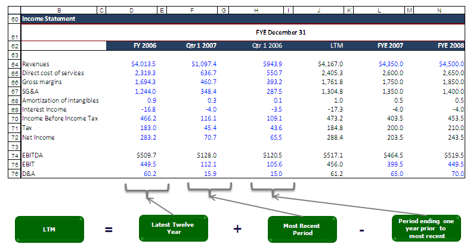

In the fast-paced world of finance, professionals employ a variety of sophisticated techniques to assess the value of assets, make informed investment decisions, and optimize trading strategies. Asset valuation lies at the core of these endeavors, providing critical insights into both the intrinsic worth and the market perception of financial assets. This article focuses on three key areas in financial strategy: valuation methods, the use of comparables in financial analysis, and algorithmic trading.

Valuation methods are crucial for investors, analysts, and traders as they help determine the fair value of an asset or company. By utilizing approaches such as Discounted Cash Flow (DCF), Precedent Transactions, and Comparable Company Analysis (Comps), market participants can discern whether an asset is overvalued, undervalued, or fairly priced. Each technique offers unique insights depending on factors like a company's life stage, the industry it operates in, and the availability of financial data. 



Comparable Company Analysis, or Comps, is particularly popular among these methods. It involves comparing the financial metrics of a target company with those of similar companies in the same industry. This approach reflects real-time market conditions and provides a practical benchmark for asset valuation, making it valuable for equity analysts and investors alike.

In recent years, algorithmic trading has emerged as a transformative force, automating the execution of trades based on financial analysis and real-time market signals. By leveraging advanced quantitative models, algorithmic trading systems identify and exploit market opportunities with speed and precision, significantly enhancing trading efficiency and reducing the potential for human error.

This article will explore how these interconnected themes influence financial strategies. Understanding these components is essential for navigating the intricate and volatile landscapes of modern financial markets. Within this context, we will examine the Comparable Company Analysis technique, a prevalent method for asset valuation, and assess how algorithmic trading utilizes financial analysis to capitalize on market opportunities.

## Table of Contents

## Overview of Valuation Methods

Valuation is essential for making informed investment decisions, whether concerning an acquisition, investment entry, or strategic planning. It involves determining the present value of an asset or a company to guide financial decision-making. Various valuation methods are employed, each with distinct advantages suited to different situations. Among them, Discounted Cash Flow (DCF), Precedent Transactions, Market Multiples, and Comparables Analysis are the most prevalent.

Discounted Cash Flow (DCF) analysis is a widely used intrinsic valuation method that calculates the present value of expected future cash flows. It is based on the principle that the value of a business is equal to the sum of its future cash flows, discounted back to their present value using a discount rate. The discount rate typically reflects the company's weighted average cost of capital (WACC), taking into account the time value of money and the risk associated with the cash flows. The formula for DCF is:

$$
\text{DCF} = \sum \left( \frac{CF_t}{(1 + r)^t} \right)
$$

where $CF_t$ denotes the cash flow at time $t$, and $r$ is the discount rate.

Precedent Transactions involve analyzing similar historical deals within an industry to estimate the value of a company under consideration. This approach assumes that past transaction values provide a relevant benchmark, considering similarities in industry behavior and market conditions. It is useful for mergers and acquisitions where precedent data can provide insights into premium expectations and strategic value.

Market Multiples, or multiple-based valuation, employs key financial metrics to assess the value of a company relative to others in the industry. This approach utilizes ratios such as the Price-to-Earnings (P/E) ratio, Enterprise Value to EBITDA (EV/EBITDA), and Price-to-Book (P/B) ratios. These multiples provide a snapshot of how the market values similar companies, offering a comparative lens for valuation.

Comparables Analysis, often linked to Market Multiples, involves selecting a peer group of companies comparable in size, industry, and growth potential. The company's valuation is then assessed against this group's average market valuation metrics. This relative valuation framework can offer quick and real-time market insights.

Choosing the appropriate valuation method relies on various factors, including the company’s life stage, the industry it operates in, and the availability of financial data. For instance, DCF is typically more suited for established companies with predictable cash flows, while Market Multiples and Comparables Analysis are often employed when assessing start-ups or firms with less predictable earnings. Additionally, Precedent Transactions are particularly informative when valuing companies for acquisition purposes, integrating market sentiment reflected in earlier deals.

In essence, each valuation method provides unique insights and, when applied appropriately, can significantly enhance the accuracy and robustness of financial assessments. Combining these methods can also offer a more balanced valuation perspective, minimizing the inherent limitations of relying on a single approach.

## Comparable Company Analysis (Comps)

Comparable Company Analysis, commonly known as comps, is a relative valuation method frequently employed in financial analysis to assess a company's value by comparing it with similar entities. The primary principle of this technique is to evaluate a company's worth using the market valuation metrics of peer companies that share similar operational characteristics and industry classifications. This approach is grounded in the belief that companies with comparable business models and financial structures should be fairly valued relative to each other under similar market conditions.

Key metrics used in comparable company analysis include Price-to-Earnings (P/E), Enterprise Value to EBITDA (EV/EBITDA), and Price-to-Book (P/B) ratios. These financial ratios offer insights into how the market values companies relative to their earnings, enterprise value in relation to the operational earnings, and book value, respectively. 

- **Price-to-Earnings (P/E) Ratio**: This is calculated as the market price per share divided by earnings per share (EPS). It indicates how much investors are willing to pay for a dollar of the company's earnings. 
$$
  \text{P/E Ratio} = \frac{\text{Market Price per Share}}{\text{Earnings per Share (EPS)}}

$$

- **Enterprise Value to EBITDA (EV/EBITDA)**: This metric compares the enterprise value (EV) of a company to its earnings before interest, taxes, depreciation, and amortization (EBITDA). It gives a perspective on the overall market value in relation to its operational profitability and is particularly useful for comparing companies with different capital structures.
$$
  \text{EV/EBITDA} = \frac{\text{Enterprise Value (EV)}}{\text{EBITDA}}

$$

- **Price-to-Book (P/B) Ratio**: This is calculated as the market value of equity divided by the book value of equity. It signifies the market's valuation of a company relative to its book value and is commonly used in industries where assets are a key driver of earnings.
$$
  \text{P/B Ratio} = \frac{\text{Market Value of Equity}}{\text{Book Value of Equity}}

$$

The comps method is esteemed for its ability to provide a real-time reflection of market conditions and industry sentiments, thereby offering a reliable benchmark for determining value. Unlike intrinsic valuation methods that focus on a company's inherent need for future cash flows, Comps provide an immediate lens into how the market perceives similar companies, thereby giving practical insights for investment decisions. This real-time market mirroring can be especially useful in rapidly changing sectors, where swift valuation adjustments are necessary.

In practice, executing a robust comparable company analysis involves selecting an appropriate set of comparable companies that share attributes with the subject company, gathering their most recent market data, and adjusting for any anomalies that might skew the comparability. This systematic approach ensures a grounded and practical view of a company's value in relation to its industry peers.

## Steps in Conducting a Comparable Company Analysis

Conducting a Comparable Company Analysis (Comps) involves several critical steps. Firstly, identifying a peer group is essential to provide a relevant benchmark for valuation. The peer group should be comprised of companies sharing similar characteristics, such as operating within the same industry, having comparable size based on revenue or market capitalization, exhibiting similar growth rates, and displaying analogous levels of profitability. This ensures that the selected companies reflect the industry's dynamics and economic environment pertinent to the company under analysis.

The next step involves gathering and adjusting financial data. Analysts typically extract this data from financial statements, which include the balance sheet, income statement, and cash flow statement, as well as from market data sources such as stock exchanges and industry reports. Financial data must be adjusted for non-recurring items, differences in accounting practices, and seasonal variations to ensure uniformity and comparability across the selected companies.

Once the financial data is prepared, the selection and calculation of relevant valuation multiples is conducted. Commonly used multiples include Price-to-Earnings (P/E) ratio, which is calculated as:

$$
\text{P/E Ratio} = \frac{\text{Market Value per Share}}{\text{Earnings per Share}}
$$

Another prevalent multiple is the Enterprise Value to EBITDA (EV/EBITDA) ratio:

$$
\text{EV/EBITDA} = \frac{\text{Enterprise Value}}{\text{EBITDA}}
$$

where Enterprise Value (EV) is the sum of market capitalization, debt, minority interest, and preferred shares, minus total cash and cash equivalents. These multiples provide insights into how the market values comparable peers in relation to their earnings and operational profitability.

Finally, analysts apply these multiples to the target company's corresponding metrics to estimate its current market value. For instance, if the average P/E ratio of the peer group is 15x, and the target company has an earnings per share of $2, its estimated market price per share would be $30. Similarly, using an EV/EBITDA multiple helps estimate the enterprise value of the target company, facilitating comprehensive valuation in the market context. By systematically executing these steps, Comparable Company Analysis offers a dynamic, market-reflective approach to asset valuation.

## Advantages and Limitations of Comps

The comparable company analysis (comps) method is widely valued in financial analysis for its ability to provide a market-driven, relative perspective on valuing companies. It is favored for its straightforward approach and ease of communication among investors and analysts. This valuation technique allows for the evaluation of a company's worth by referencing the market valuation metrics of similar peer companies, such as Price-to-Earnings (P/E) ratios, Enterprise Value to EBITDA (EV/EBITDA), and Price-to-Book (P/B) ratios. These metrics give analysts a practical benchmark, reflecting real-time market conditions and industry sentiments.

Despite its straightforward approach, the comps method has inherent limitations. One major challenge is the subjectivity involved in selecting appropriate comparables. Determining which companies truly represent a peer group requires careful consideration of various factors, such as industry categorization, company size, growth rates, and profitability. This subjective selection process can lead to biased results if not executed with diligence.

Additionally, discrepancies in accounting practices among peer companies present another limitation. Different companies might follow varied accounting methodologies due to regional regulations or internal policies, leading to inconsistencies in financial data. These discrepancies can distort the valuation metrics, potentially leading to misleading comparisons and valuations.

Market [volatility](/wiki/volatility-trading-strategies) further complicates the comparables method. Fluctuations in the stock market, driven by economic cycles, geopolitical events, or sudden shifts in investor sentiment, can skew the perceived value derived from comps. During periods of high volatility, the metrics used might not accurately represent a company's true value, emphasizing the risk of relying solely on comparables.

To mitigate these limitations, it is essential to combine the comps method with intrinsic valuation techniques, such as the Discounted Cash Flow (DCF) analysis. DCF valuations focus on a company's projected cash flows and intrinsic growth potential, grounding the analysis in fundamental financial health and long-term performance expectations. By integrating the relative perspective of comps with the intrinsic insights from DCF, analysts can achieve a more robust and comprehensive valuation, providing a well-rounded view crucial for informed investment decisions.

## Algorithmic Trading: Bridging Analysis and Execution

Algorithmic trading, commonly referred to as algo trading, represents a significant advancement in trading technology, automating and streamlining the process of executing trades. This approach uses computer algorithms to conduct trades based on pre-set criteria or financial models. These algorithms analyze a vast array of data to identify promising trading opportunities, executing trades at speeds and levels of precision that are beyond human capability.

The heart of [algorithmic trading](/wiki/algorithmic-trading) lies in its use of quantitative models, which are mathematical frameworks that assess market data to evaluate potential trades. These models take into account a range of inputs, such as price trends, [volume](/wiki/volume-trading-strategy), and volatility, to forecast price movements and identify entry and [exit](/wiki/exit-strategy) points for trades. The goal is to enhance the overall execution of trades by optimizing timing and volume, thus securing more favorable prices.

A significant advantage of algorithmic trading is its ability to reduce human error. Traditional trading often involves decisions made quickly under stress, which can result in mistakes or inconsistencies. Algorithms, devoid of emotional bias, operate strictly based on data and predefined strategies, ensuring consistent and objective execution. This reduction in human involvement also means that transactions can be conducted around the clock without the need for human oversight.

In addition to minimizing errors, algo trading is adept at exploiting market inefficiencies. Markets often exhibit short-lived price discrepancies created by lagging reactions to new information. Algorithms can detect these anomalies rapidly and execute trades before the market corrects itself, generating profits from these fleeting opportunities.

To illustrate, consider a simple moving average crossover strategy, a common algorithmic trading strategy. In this model, an algorithm might buy a stock when a short-term moving average, such as a 20-day average, crosses above a long-term moving average, like a 50-day average, and sell when the reverse occurs. In Python, this could be implemented as follows:

```python
def moving_average_crossover(prices, short_window=20, long_window=50):
    short_mavg = prices.rolling(window=short_window, min_periods=1).mean()
    long_mavg = prices.rolling(window=long_window, min_periods=1).mean()

    signals = pd.DataFrame(index=prices.index)
    signals['signal'] = 0.0

    signals['signal'][short_window:] = np.where(short_mavg[short_window:] > long_mavg[short_window:], 1.0, -1.0)

    return signals
```

This code calculates short and long-term moving averages and generates buy or sell signals depending on their relative positions. Such quantitative strategies underpin the power of algorithmic trading, highlighting its ability to process and react to market data automatically and efficiently.

Overall, the integration of algorithmic trading into financial strategies represents a transformative approach, harnessing technology to increase efficiency, accuracy, and profitability in trading activities.

## Integration of Valuation and Algo Trading

Automated trading systems have revolutionized the financial landscape by merging valuation insights with algorithmic strategies, enabling more precise and timely trade decisions. This synergy allows these systems to interpret real-time data effectively, crucial for adapting to the ever-changing dynamics of financial markets. 

By integrating valuation models, such as the Discounted Cash Flow (DCF) or Comparable Company Analysis, into algorithms, traders can estimate asset values dynamically. This integration ensures that trading strategies remain aligned with fundamental valuations rather than relying solely on historical price patterns or technical indicators. For example, algorithms can incorporate real-time updates in a company's financial metrics or peer group valuations to adjust trading signals instantly.

In practice, the integration is often realized through the following mechanism: algorithms devised in programming languages like Python can continuously pull financial data from APIs (such as Bloomberg or Yahoo Finance). These algorithms are programmed with valuation equations or metrics that process this data. The Python code snippet below illustrates a simplified example of fetching data and updating trade signals based on a fundamental valuation metric, such as Price-to-Earnings (P/E) ratio:

```python
import requests

def get_market_data(symbol):
    # Assume this function fetches real-time market data for a given symbol
    response = requests.get(f"https://api.marketdata.com/{symbol}")
    return response.json()

def calculate_valuation_metric(data):
    # Example: Calculate a valuation metric, say P/E ratio
    earnings = data['earnings']
    price = data['price']
    return price / earnings if earnings else None

def update_trade_signal(symbol):
    data = get_market_data(symbol)
    if data:
        pe_ratio = calculate_valuation_metric(data)
        # Example threshold for triggering a trade signal
        trade_signal = 'buy' if pe_ratio and pe_ratio < threshold else 'sell'
        print(f"Trade Signal for {symbol}: {trade_signal}")

# Example usage
symbol = 'AAPL'
threshold = 15  # This could be an average P/E ratio of the sector
update_trade_signal(symbol)
```

This integration significantly boosts the capability of traders to manage portfolios effectively. It allows the dynamic rebalancing of portfolios, optimizing returns by seizing market opportunities exposed through valuation discrepancies. Additionally, algorithms can mitigate risk by executing stop-loss orders or hedging strategies based on refined data analysis. Such innovations cater to both reducing human error and maximizing the exploitation of fleeting market inefficiencies, leading to enhanced financial performance and strategic superiority in trading operations.

## Conclusion

Combining comprehensive financial valuation methods with algorithmic trading can significantly enhance decision-making capabilities in financial markets. Valuation techniques such as Comparable Company Analysis, Discounted Cash Flow, and Market Multiples offer foundational insights into asset worth. By incorporating these methods, investors and analysts gain a nuanced understanding of a company's value relative to its peers and intrinsic financial health. This foundational knowledge is critical when devising investment strategies and optimizing portfolios.

Furthermore, the effective use of comparables in financial analysis provides a market-driven benchmark that reflects current industry conditions and sentiments. When used alongside algorithmic trading systems, the data derived from comparables enables traders to make informed decisions swiftly. Algorithmic trading utilizes sophisticated quantitative models and a vast array of market data to execute trades with speed and precision. This automation reduces human error, enhances execution efficiency, and capitalizes on market inefficiencies that may not be apparent to human traders.

As financial markets continue to evolve, the integration of traditional valuation methods with cutting-edge algorithmic trading systems offers a distinct competitive advantage. This combination allows for timely adjustments to portfolio strategies and efficient risk management, adapting to real-time market conditions and shifts in valuations. Ultimately, leveraging these advanced tools positions investors and traders to harness market opportunities effectively, paving the way for more successful investment strategies in an ever-changing financial landscape.

## References & Further Reading

[1]: McKinsey & Company. (2016). ["Valuation: Measuring and Managing the Value of Companies."](https://www.mckinsey.com/capabilities/strategy-and-corporate-finance/our-insights/valuation-measuring-and-managing-the-value-of-companies) John Wiley & Sons, Inc.

[2]: Damodaran, A. (2012). ["Investment Valuation: Tools and Techniques for Determining the Value of Any Asset, 3rd Edition."](https://books.google.com/books/about/Investment_Valuation.html?id=5SRHAAAAQBAJ) John Wiley & Sons.

[3]: Hull, J. C. (2018). ["Options, Futures, and Other Derivatives, 10th Edition."](https://www.semanticscholar.org/paper/Options%2C-Futures%2C-and-Other-Derivatives-Hull/89bdee500c8623864fc9eb7a471546aa713acc44) Pearson.

[4]: Chan, E. (2009). ["Quantitative Trading: How to Build Your Own Algorithmic Trading Business."](https://github.com/ftvision/quant_trading_echan_book) John Wiley & Sons.

[5]: De Prado, M. L. (2018). ["Advances in Financial Machine Learning."](https://www.amazon.com/Advances-Financial-Machine-Learning-Marcos/dp/1119482089) John Wiley & Sons.

[6]: Benninga, S. (2014). ["Financial Modeling, Fourth Edition."](https://mitpress.mit.edu/9780262027281/financial-modeling/) MIT Press.

[7]: Fabozzi, F. J. (Ed.). (2020). ["Handbook of Quantitative Finance and Risk Management."](https://link.springer.com/book/10.1007/978-0-387-77117-5) Springer.

[8]: Jansen, S. (2020). ["Machine Learning for Algorithmic Trading: Predictive models to extract signals from market and alternative data for systematic trading strategies with Python."](https://www.amazon.com/Machine-Learning-Algorithmic-Trading-alternative/dp/1839217715) Packt Publishing.

[9]: Murphy, J. J. (1999). ["Technical Analysis of the Financial Markets: A Comprehensive Guide to Trading Methods and Applications."](https://archive.org/details/technicalanalysi0000murp) Penguin.