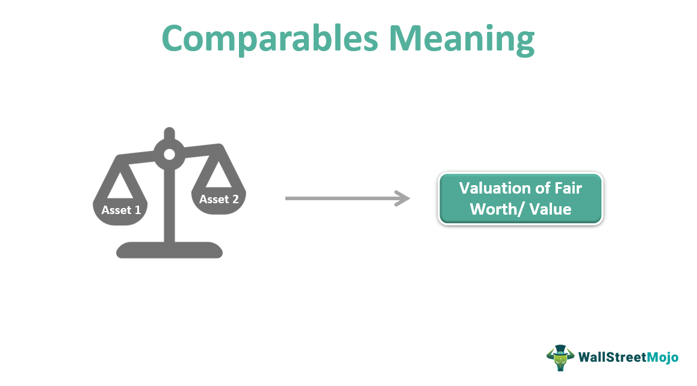

The world of finance is rapidly evolving, with technology serving as a cornerstone in the transformation of various industries. Real estate finance, a vital segment within the financial sector, is currently experiencing a significant convergence with algorithmic trading methodologies. This development is reshaping how transactions and valuations are approached, leading to remarkable efficiencies and innovations.

A key element in both real estate and financial trading is the concept of comparables, often referred to as "comps." In real estate, comparables are essential for determining property values by assessing similar properties within a market. This practice enables more precise property valuations, which are critical for buyers, sellers, and investors. Similarly, in financial trading, using historical data and market comparables allows for more informed trading decisions and risk assessments.



This article explores the interplay between real estate finance, comparables, and algorithmic trading. The integration of these domains offers the potential to harness advanced algorithms for enhanced decision-making and operational efficiency. By leveraging their respective strengths, these areas promise to provide more accurate valuations and optimize transaction processes, significantly impacting the real estate market and the broader financial landscape.

## Table of Contents

## Understanding Real Estate Finance and Comparables

Real estate finance is a complex field that primarily deals with the acquisition and management of financial resources necessary for real estate transactions and investments. It involves various forms of financing, including mortgage financing, real estate investment trust (REIT) financing, and private equity. The financial strategies employed in real estate finance aim to maximize the return on investment while mitigating risks associated with property valuation and market fluctuations.

A critical aspect of real estate finance is the use of comparables, often referred to as 'comps.' Comparables are essential for determining the value of properties by comparing them with similar ones that have been recently sold in the same area. This comparative analysis is crucial for both buyers and sellers, as it provides a market-based perspective on property values. The accuracy and relevance of these comparables significantly impact the valuation process, influencing pricing strategies and investment decisions.

The process of valuing properties using comparables typically involves the selection of similar properties based on criteria such as location, size, condition, and date of sale. Analysts then adjust the sale prices of these comparables to account for differences in property characteristics, arriving at an estimated market value for the subject property. This method of valuation, although traditional, can pose challenges in terms of data accuracy and availability.

Understanding market trends is integral to effective real estate finance. Accurate trend analysis enables investors and financial professionals to make informed decisions about property investments. Market trends provide insights into various factors, such as interest rates, economic indicators, and demographic shifts, which can all affect real estate values.

Modern technology is vastly reshaping how analyses in real estate finance are conducted, enhancing both the reliability and speed of these processes. Advanced data analytics and [machine learning](/wiki/machine-learning) algorithms are now increasingly utilized to process large datasets more efficiently and to identify patterns that were previously undetectable. Such technological advancements facilitate more precise property valuations and trend analyses, reducing the potential for human error and increasing confidence in financial decisions.

For instance, machine learning models can process vast amounts of historical real estate data to identify subtle patterns and trends. These models can predict future property valuations by considering a multitude of variables simultaneously. Python, a versatile programming language, is often used to implement such models due to its robust libraries like scikit-learn for machine learning, Pandas for data manipulation, and Matplotlib for data visualization.

```python
import pandas as pd
from sklearn.ensemble import RandomForestRegressor
from sklearn.model_selection import train_test_split
from sklearn.metrics import mean_squared_error

# Sample data preparation
data = pd.read_csv('real_estate_data.csv')
X = data.drop('property_value', axis=1)  # Features
y = data['property_value']  # Target variable

# Splitting data into training and testing sets
X_train, X_test, y_train, y_test = train_test_split(X, y, test_size=0.2, random_state=42)

# Random Forest Model
model = RandomForestRegressor(n_estimators=100, random_state=42)
model.fit(X_train, y_train)

# Predictions
predictions = model.predict(X_test)

# Model evaluation
mse = mean_squared_error(y_test, predictions)
print(f'Mean Squared Error: {mse}')
```

The integration of such technologies in real estate finance streamlines the valuation process, offering enhanced accuracy and efficiency. This technological progression ensures that real estate finance continues to evolve, meeting the demands of a dynamic and fast-paced market environment.

## Algorithmic Trading: An Overview

Algorithmic trading, commonly referred to as algo trading, utilizes complex algorithms to make trading decisions, executing trades at speeds and frequencies that are impossible for a human trader. These algorithms are designed to analyze comprehensive datasets, identifying optimal trading opportunities by assessing multiple parameters simultaneously. This process not only minimizes the potential for human error but also allows for trades to be executed in microseconds, thereby capitalizing on favorable market conditions before they change.

In financial markets, algo trading is extensively used across various asset classes, including equities, commodities, and foreign exchange ([forex](/wiki/forex-system)). The primary advantage of [algorithmic trading](/wiki/algorithmic-trading) lies in its ability to handle large volumes of trades, in high-frequency trading scenarios, while maintaining a consistent decision-making process that is free from emotional biases.

As algorithmic trading begins to penetrate the real estate sector, its benefits become evident in the form of improved trading efficiency and precision in property valuation. By automating the analysis of comparables—an essential method in determining property values—algorithms can offer more accurate valuations by systematically considering a multitude of variables such as location, market trends, and property-specific characteristics.

The adaptability of algorithms to incorporate evolving datasets makes them especially suited for integration with real estate finance, a field that is increasingly reliant on data-driven insights. For example, by using machine learning algorithms, real estate trends can be predicted with increased accuracy. Python, as a programming language, offers numerous libraries such as NumPy and pandas which are powerful for data manipulation and analysis. A basic implementation might look like this:

```python
import pandas as pd
import numpy as np

# Example data: historical prices, interest rates, etc.
data = pd.DataFrame({
    'property_id': [1, 2, 3],
    'price_last_year': [250000, 200000, 300000],
    'growth_factor': [1.05, 1.04, 1.06]
})

# Calculate estimated current values
data['estimated_value'] = data['price_last_year'] * data['growth_factor']
print(data)
```

In these scenarios, algorithmic models can enhance accuracy and reliability, providing stakeholders with detailed insights and thus facilitating informed decision-making. As the integration of technology progresses, algorithmic trading holds significant potential to transform how real estate finance operates, bridging the gap between traditional real estate valuation and modern trading methodologies. This intersection is poised to refine the mechanisms of asset valuation and trading strategy development, ultimately optimizing the real estate market's operational aspects.

## The Synergy between Real Estate Finance, Comparables, and Algo Trading

Both real estate finance and algorithmic trading are intricate areas that rely on precise data handling and interpretation. Accurate data serves as the backbone for informed decision-making in both sectors. In real estate, comparables or 'comps' are used extensively to value properties by evaluating similar assets. However, these valuations can sometimes be inconsistent due to human error or subjective judgments. Algorithmic trading offers a solution to these challenges by standardizing and streamlining the comparables process.

Algorithms, with their capability for high-speed and complex data analysis, can enhance the comparables methodology in real estate finance. By employing algorithms, real estate professionals can ensure more accurate property valuations. This is achieved through the elimination of biases and errors associated with human interpretation of data. An algorithm can quickly assess large datasets, analyze various factors that influence property values, and produce consistent and reliable outputs.

Moreover, by refining comparables analysis, algorithmic trading can significantly improve investment decisions and risk management within the real estate market. For instance, algorithms can identify undervalued or overvalued properties by comparing them against a comprehensive set of parameters in the real estate market. This approach helps investors to make better-informed decisions regarding buying, selling, or holding properties.

The synergy between real estate finance and algo trading also promises optimization of transaction times and pricing strategies. Quick and accurate data processing allows for the swift execution of transactions, offering competitive pricing and efficient asset management. Algorithms can dynamically adjust pricing based on real-time market conditions, helping stakeholders to attain optimal pricing strategies.

With the rise of technology-driven platforms, we are witnessing the development of comprehensive financial solutions that integrate real estate finance, comparables, and algorithmic trading. These platforms utilize advanced technologies like big data analytics, machine learning, and [artificial intelligence](/wiki/ai-artificial-intelligence) to provide holistic solutions for property valuation, transaction management, and investment strategy development. By combining real estate data with algorithmic precision, these platforms offer enhanced analytics, better insights, and streamlined operations.

In conclusion, the integration of algorithms in real estate finance through the enhancement of comparables analysis is not merely a technological upgrade but a paradigm shift towards more efficient, accurate, and strategic asset management.

## Benefits and Challenges of Integrating Algo Trading in Real Estate

Integrating algorithmic trading into real estate finance offers several compelling benefits and presents unique challenges. The introduction of algo trading technologies into real estate finance facilitates accelerated data processing, significantly enhancing the scalability of real estate investments. By automating processes, real estate markets can achieve reductions in transactional costs and improved [liquidity](/wiki/liquidity-risk-premium). This efficiency is achieved through high-speed data analysis and decision-making capabilities, which reduce the time and resources required for transactions.

However, the incorporation of algorithmic trading is not without its challenges. One primary concern is data security risk. As vast amounts of sensitive data are handled, ensuring its security becomes imperative to prevent unauthorized access and breaches. Moreover, there is a risk of potential algorithm biases, as algorithms may inadvertently perpetuate existing biases in the data they are trained on. Addressing these biases requires careful algorithm design and continuous monitoring and updating of the models used.

Technological barriers can also pose significant challenges to the effective integration of algo trading into real estate. The need for robust infrastructure to support real-time data processing and the implementation of sophisticated algorithms is crucial. Additionally, adapting these technologies to the unique characteristics and slower transaction cycles of real estate compared to traditional financial markets may require innovative solutions.

To manage these advanced technologies effectively, transparent regulatory frameworks are essential. These regulations must be designed to oversee the use of algorithmic systems, ensuring compliance with financial standards and the protection of consumer interests. The development of such frameworks is a complex task, requiring input from a range of stakeholders.

Successful integration hinges on a multidisciplinary approach, which involves collaboration among finance professionals, data scientists, and real estate experts. This approach ensures that the technological solutions are both financially viable and tailored to the unique attributes of real estate markets. By leveraging the expertise of these diverse fields, the potential benefits of algo trading in real estate can be fully realized while mitigating associated risks.

## Future Trends and Opportunities

The future landscape of real estate finance is increasingly intertwined with technological advancements, promising transformative changes. Innovations in machine learning and artificial intelligence (AI) are poised to enhance algorithmic performance within this sector significantly. These technologies can process vast amounts of data with unprecedented speed and accuracy, allowing for more sophisticated models that predict market trends and valuations. For instance, machine learning algorithms can analyze historical data patterns to predict future real estate price fluctuations, contributing to more informed investment strategies.

The advent of real-time property valuation is also on the horizon, offering enhanced decision-making processes for investors and real estate professionals. With the integration of AI-driven analytics, stakeholders can access up-to-the-minute property valuations that reflect current market conditions. This capability not only facilitates more accurate investment appraisals but also enables rapid responses to market shifts, providing a competitive advantage in a dynamic market environment.

Blockchain technology holds the potential to streamline and secure property transactions, addressing long-standing issues related to fraud and inefficiencies. By utilizing decentralized ledger systems, blockchain ensures transparency, immutability, and security in property record-keeping and transactions. Smart contracts, a facet of blockchain technology, can automate and enforce contractual agreements, reducing the need for intermediaries and significantly lowering transaction costs.

The evolving technological landscape offers numerous opportunities across various sectors. Investors stand to benefit from enhanced due diligence processes and improved investment accuracy, reducing risk and improving profitability. Real estate firms can leverage these technologies to optimize operations, improve client service delivery, and capture emerging market opportunities. Furthermore, technology developers are presented with a burgeoning market for creating tailor-made solutions that address specific needs within real estate finance, paving the way for collaborative innovation across industries.

As the integration of technology in real estate finance continues to advance, stakeholders must focus on collaboration and adaptability. By fostering partnerships between technology developers, financial experts, and real estate professionals, the sector can unlock new efficiencies and opportunities, ensuring sustainable growth and competitiveness in an increasingly digital economy.

## Conclusion

The integration of real estate finance, comparables, and algorithmic trading marks a significant milestone in the evolution of the financial sector. This convergence offers the potential to redefine asset valuation by utilizing advanced data analytics and machine learning techniques to process vast amounts of information more accurately and efficiently than traditional methods.

Algorithmic trading, with its ability to analyze market trends and execute trades at optimal conditions, brings a new level of precision to real estate finance. By standardizing the comparables method through automation, it reduces human error and subjectivity, leading to improved investment strategies. This technological advancement aids in optimizing the real estate market by enhancing liquidity and reducing transaction costs.

Despite the undeniable benefits, challenges such as data security, algorithmic biases, and the need for sophisticated infrastructure remain. Nevertheless, the efficiency, accuracy, and cost-effectiveness of integrating technology into real estate finance drive this evolutionary process forward.

Stakeholders, including investors, financial analysts, and real estate firms, must adapt to these technological innovations to maintain competitive advantage. As machine learning and artificial intelligence continue to evolve, the synergy between these fields will undoubtedly expand, further transforming the landscape of real estate finance and offering significant opportunities for growth and development.

## References & Further Reading

[1]: ["The Essentials of Real Estate Investment, 9th Edition"](https://www.amazon.com/Essentials-Estate-Investment-David-Sirota/dp/1427720517) by David Sirota

[2]: ["Real Estate Principles: A Value Approach"](https://www.amazon.com/Real-Estate-Principles-Mchill-hill-Insurance/dp/0077836367) by David C. Ling and Wayne R. Archer

[3]: ["Machine Learning in Finance: From Theory to Practice"](https://link.springer.com/book/10.1007/978-3-030-41068-1) by Matthew F. Dixon, Igor Halperin, and Paul Bilokon

[4]: ["Real Estate Market Analysis: Methods and Case Studies"](https://www.amazon.com/Real-Estate-Market-Analysis-Methods/dp/0874203651) by Deborah L. Brett and Adrienne Schmitz

[5]: Narang, R. K. (2013). ["Inside the Black Box: A Simple Guide to Quantitative and High Frequency Trading."](https://onlinelibrary.wiley.com/doi/book/10.1002/9781118662717) Wiley.

[6]: ["Real Estate Finance and Investments: Risks and Opportunities"](https://www.amazon.com/Real-Estate-Finance-Investments-Opportunities/dp/0974451835) by Peter Linneman

[7]: Parker, D., & Lee, D. (2019). ["FinTech and the Disruption of Real Estate."](https://www.researchgate.net/publication/324119771_On_the_Fintech_Revolution_Interpreting_the_Forces_of_Innovation_Disruption_and_Transformation_in_Financial_Services) Palgrave Macmillan.