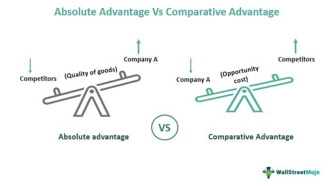

In economics, the concepts of comparative advantage and absolute advantage are foundational in understanding international trade dynamics. Comparative advantage, introduced by British economist David Ricardo in the early 19th century, refers to a country's ability to produce a particular good at a lower opportunity cost compared to others. This theory suggests that even if one nation holds an absolute advantage in producing all goods more efficiently, mutual benefits can still be achieved by specializing in products where they hold a comparative advantage and trading with others.

Absolute advantage, first conceptualized by Adam Smith, refers to the capacity of a country to produce a good more efficiently than any other country. It emphasizes resource efficiency and productivity. In scenarios where absolute advantage prevails, nations with superior production capabilities can dominate industries, yet they miss the nuanced benefits that comparative advantage offers, particularly in promoting diverse economic participation through trade.



These economic theories underpin vital strategies and policy decisions in international trade, affecting global economic relationships. By enabling countries to specialize and trade, they promote global efficiency, increased GDP outcomes, and the availability of a variety of goods for consumers worldwide. Although these concepts originate in historical economic theory, they are also relevant in today's rapidly evolving financial landscapes.

Algorithmic trading, a process that employs algorithms to execute trading decisions, has become synonymous with modern financial markets. It leverages sophisticated mathematical models and high-frequency trading strategies to make decisions at speeds and frequencies that are impossible for human traders. This form of trading enhances market efficiency by minimizing human emotions and capitalizing on market inefficiencies at microscopic time scales.

Integrating economic theories with algorithmic trading paradigms offers a nuanced approach for optimizing trading strategies. By harnessing insights from comparative and absolute advantage, algorithmic trading systems can potentially develop more robust frameworks for decision-making. This integration could involve monitoring opportunity costs and market conditions to assess where a trading strategy might offer relative or absolute advantages.

As we proceed through this article, the relationship between these longstanding economic theories and contemporary algorithmic trading practices will become evident. They not only enhance the understanding of trade dynamics but also equip traders with analytical tools to navigate complex financial ecosystems effectively.

## Table of Contents

## Understanding Comparative Advantage

Comparative advantage is a fundamental economic principle that was first articulated by the 19th-century economist David Ricardo. This concept serves as a cornerstone in international trade theory and underscores the benefits of specialization and trade based on the relative efficiency of production. 

### Definition and Origin

Comparative advantage explains how countries or entities can gain from trade by specializing in producing goods for which they have a lower opportunity cost than their trading partners. This principle is distinct from absolute advantage, where an entity can produce more output with the same resources than another. Ricardo introduced comparative advantage in his landmark book "On the Principles of Political Economy and Taxation," where he posited that even if a country does not have an absolute advantage in producing any good, it can still benefit from trade by focusing on goods where it has a comparative advantage.

### Opportunity Cost and Specialization

The concept of opportunity cost is central to understanding comparative advantage. Opportunity cost refers to the value of the best alternative forgone when a choice is made. In the context of comparative advantage, countries evaluate the opportunity costs of producing various goods to determine which products they should specialize in. By allocating resources to the production of goods with the lowest opportunity cost, countries can maximize efficiency and economic welfare. 

### Practical Examples

To illustrate, consider two countries: Country A and Country B. Country A can produce either 10 units of wine or 5 units of cloth in a day, while Country B can produce either 6 units of wine or 12 units of cloth in the same time. Although Country B has an absolute advantage in producing cloth, it has a comparative advantage in producing wine since the opportunity cost of producing one more unit of wine (0.5 units of cloth) is lower than Country A's opportunity cost (1 unit of cloth). Thus, it is beneficial for Country B to specialize in wine and for Country A to specialize in cloth, thereby gaining mutual benefits through trade.

```python
# Example calculation of comparative advantage using Python
country_a_wine = 10  # units per day
country_a_cloth = 5  # units per day
country_b_wine = 6   # units per day
country_b_cloth = 12 # units per day

# Opportunity cost for Country A
opportunity_cost_a_wine = country_a_cloth / country_a_wine
opportunity_cost_a_cloth = country_a_wine / country_a_cloth

# Opportunity cost for Country B
opportunity_cost_b_wine = country_b_cloth / country_b_wine
opportunity_cost_b_cloth = country_b_wine / country_b_cloth

# Comparative advantage
def comparative_advantage():
    if opportunity_cost_a_wine < opportunity_cost_b_wine:
        wine_advantage = "Country A"
    else:
        wine_advantage = "Country B"

    if opportunity_cost_a_cloth < opportunity_cost_b_cloth:
        cloth_advantage = "Country A"
    else:
        cloth_advantage = "Country B"

    return wine_advantage, cloth_advantage

wine, cloth = comparative_advantage()
print(f"Comparative advantage in wine: {wine}, in cloth: {cloth}")
```

### Role of Opportunity Cost

The theory of comparative advantage fundamentally relies on opportunity costs, demonstrating that economic efficiency is not about producing everything at the lowest absolute cost but rather at a lower relative cost. This approach encourages entities to trade, creating a win-win scenario where economies can enjoy a greater variety of goods and services and higher levels of welfare.

In summary, the principle of comparative advantage promotes the idea of specialization based on opportunity costs, allowing countries and entities to engage in mutually beneficial trade. It remains a vital concept in shaping international trade policies and economic strategies.

## Exploring Absolute Advantage

Absolute advantage is a key concept in international trade theory, first defined by the Scottish economist Adam Smith in his seminal work, "The Wealth of Nations," published in 1776. Absolute advantage refers to the ability of a country, individual, or firm to produce more of a good or service than competitors using the same amount of resources. Essentially, it means that an entity can produce goods more efficiently, leading to higher output with fewer resources.

Absolute advantage is distinct from comparative advantage, another crucial economic concept introduced by David Ricardo. While absolute advantage focuses on the efficiency of producing a specific output, comparative advantage emphasizes the relative efficiency in producing goods compared to others, considering opportunity costs. A country may not have an absolute advantage in producing any goods but still benefit from trade by specializing in goods where it has a comparative advantage.

Real-world examples of absolute advantage can be seen in various industries. For instance, Saudi Arabia possesses an absolute advantage in oil production due to its abundant natural reserves and advanced extraction techniques, allowing it to produce oil more efficiently than many other nations. Similarly, countries like Brazil have an absolute advantage in coffee production because of favorable climate conditions and vast experience in cultivating coffee beans. 

However, assessing trade benefits solely through the lens of absolute advantage has its limitations. Focusing exclusively on absolute productivity can overlook the gains achievable through specialization and trade based on comparative advantage. For instance, if countries only traded based on absolute advantages, many potential trade relationships that could enhance global efficiency and welfare might be neglected. Absolute advantage does not account for opportunity costs, which can lead to suboptimal allocation of resources globally.

In conclusion, while absolute advantage provides valuable insights into production efficiency, it is crucial to consider comparative advantage to fully understand the dynamics and benefits of international trade. These concepts together form a comprehensive framework for analyzing trade relationships and crafting effective economic policies.

## Comparative vs. Absolute Advantage in Modern Economies

In the landscape of global trade, the concepts of comparative and absolute advantage serve as fundamental principles guiding economic interactions among nations. Comparative advantage, a theory proposed by David Ricardo, posits that countries can benefit from trade by specializing in the production of goods for which they have the lowest opportunity cost. This means that even if a nation does not hold the most efficient (absolute) means of producing any good, it can still engage in beneficial trade by focusing on industries where it stands at a relative advantage compared to its trading partners.

Absolute advantage, introduced by Adam Smith, refers to the ability of a country to produce a good more efficiently (i.e., using fewer resources) than another country. While absolute advantage emphasizes direct efficiency in production, comparative advantage highlights the strategic allocation of resources to maximize trade benefits, even when absolute efficiency is absent.

The implications of these theories are significant for shaping trade policies and international economic relations. Governments often utilize these concepts to determine which industries should receive investment and protection, facilitating more favorable terms of trade. Comparative advantage encourages nations to recognize where their possible gains from trade lie, potentially leading to diversified economic structures and increased economic welfare. Absolute advantage can inform policy decisions to enhance industries where a nation already excels, thereby strengthening its competitive position in global markets.

Examining real-world examples, several nations have successfully harnessed these principles. Japan, with its limited natural resources, has focused on industries such as electronics and automobile manufacturing, where it holds a comparative advantage due to its skilled labor force and technological expertise. Meanwhile, Saudi Arabia leverages its absolute advantage in oil production, owing to its abundant natural reserves, reinforcing its position as a major energy exporter.

Trade agreements often incorporate these economic principles to align mutual benefits among participant countries. For instance, the North American Free Trade Agreement (NAFTA), now succeeded by the United States-Mexico-Canada Agreement (USMCA), integrates the comparative advantages of the member nations to enhance trade efficiency and economic integration. The agreement allows for tariff reductions and establishes mechanisms for labor and environmental standards, encouraging each country to capitalize on its strengths.

In conclusion, comparative and absolute advantage remain crucial frameworks in understanding modern trade dynamics. By informing trade policies and international agreements, these theories guide nations in strategically managing their economic resources to optimize gains from global trade.

 to Algorithmic Trading

Algorithmic trading refers to the use of computer algorithms to manage trading decisions in financial markets. These algorithms, which can range from simple to complex mathematical models, are programmed to execute trades based on pre-defined criteria such as timing, price, or [volume](/wiki/volume-trading-strategy). Algorithmic trading has become an integral part of today's financial markets, accounting for a significant portion of trading activity on global exchanges. 

The primary benefits of [algorithmic trading](/wiki/algorithmic-trading) include enhanced efficiency and speed. Algorithms can process vast amounts of data swiftly, allowing traders to capitalize on market movements in fractions of seconds. This rapid decision-making process is crucial in high-frequency trading ([HFT](/wiki/high-frequency-trading-strategies)), where speed is a competitive advantage. Additionally, algorithms minimize human errors and emotional biases, leading to more consistent trading outcomes.

Economic theories provide foundational insights that shape algorithmic trading strategies. Concepts like [arbitrage](/wiki/arbitrage), market efficiency, and risk management are pivotal in algorithm design. For instance, the Efficient Market Hypothesis (EMH) suggests that asset prices fully reflect all available information, influencing strategies that seek to exploit mispricings in these apparently efficient markets. Economic theories related to price discovery, supply and demand dynamics, and even macroeconomic indicators contribute to the development of sophisticated trading algorithms aimed at maximizing returns and mitigating risks.

Key players in the algorithmic trading landscape include investment banks, hedge funds, proprietary trading firms, and [quantitative trading](/wiki/quantitative-trading) firms. These entities leverage algorithmic trading to enhance their market strategies and achieve operational efficiencies. Moreover, sectors such as equities, [forex](/wiki/forex-system), commodities, and fixed income markets have witnessed significant algorithmic trading penetration. In the equities market, for example, algorithms are deployed to handle everything from small-scale retail trades to large institutional trades, optimizing execution costs and managing market impact.

The intersection of technology and finance through algorithmic trading exemplifies the dynamic evolution of global markets. As algorithms become increasingly sophisticated, the integration of economic theories into their frameworks will likely become more profound, driving innovation and efficiency in trading practices worldwide.

## Integrating Economic Theories with Algorithmic Trading

Integrating economic theories such as comparative and absolute advantage into algorithmic trading strategies provides a nuanced approach to maximizing returns and optimizing trading decisions. These economic principles can inform strategies by emphasizing resource efficiency and opportunity cost analysis, which are crucial elements of advanced trading models.

Comparative advantage, primarily revolving around the concept of opportunity costs, suggests allocating resources where they are most efficiently used. In algorithmic trading, this translates into the allocation of computational resources and capital towards trades that offer the best trade-off between risk and return. For instance, trading strategies can be optimized by analyzing the historical performance and [volatility](/wiki/volatility-trading-strategies) of different asset classes, thus allocating more resources to those with a demonstrated track record of efficient returns relative to risk. This mirrors the economic principle of focusing on the production of goods with the lower opportunity cost, thereby maximizing efficiency.

To implement this concept, consider a simple Python-based example:

```python
import numpy as np
import pandas as pd

def calculate_sharp_ratio(returns, risk_free_rate=0.01):
    """
    Calculate the Sharpe Ratio for a series of returns.
    """
    excess_returns = returns - risk_free_rate
    return np.mean(excess_returns) / np.std(excess_returns)

returns_a = pd.Series([0.02, 0.04, 0.01, 0.03, -0.02])
returns_b = pd.Series([0.05, 0.02, 0.03, 0.01, 0.04])

sharpe_a = calculate_sharp_ratio(returns_a)
sharpe_b = calculate_sharp_ratio(returns_b)

better_investment = 'A' if sharpe_a > sharpe_b else 'B'
print(f"Allocate resources to investment {better_investment}")
```

In this script, the Sharpe Ratio, a measure of risk-adjusted return, is calculated for two investment options. The investment with the higher Sharpe Ratio is selected, reflecting a better use of capital according to comparative advantage principles.

Absolute advantage, on the other hand, involves recognizing the inherent efficiency of certain trading strategies or algorithms over others. Algorithms that can process trades with lower latency or that can execute a higher volume of data analysis per second may hold an absolute advantage. Thus, deploying algorithms with the highest efficiency in performing specific tasks can yield superior performance. For example, a high-frequency trading (HFT) algorithm might possess an absolute advantage in executing trades based on short-term price anomalies due to its superior speed and computational power.

However, integrating these economic theories into practical algorithmic trading is not devoid of challenges. One significant limitation is the dynamic nature of financial markets, which can render static models based on past efficiencies obsolete. The assumption that historical opportunities will persist may lead to inefficient resource allocation in rapidly changing market environments. Moreover, the oversimplification of economic theories when applied to the complex patterns of financial markets can result in suboptimal trading decisions.

In summary, while comparative and absolute advantage offer valuable insights into optimizing trading strategies through efficient resource allocation and capitalizing on inherent efficiencies, the dynamic and often unpredictable nature of financial markets necessitates continuous model adaptation and validation to sustain a competitive edge.

## Future Trends and Conclusion

As we look towards the future, the integration of economic theories with algorithmic trading is poised to be profoundly influenced by advancements in technology and computational capabilities. Emerging technologies such as [machine learning](/wiki/machine-learning), [artificial intelligence](/wiki/ai-artificial-intelligence) (AI), and quantum computing are expected to enhance the sophistication, efficiency, and scope of trading strategies. Machine learning algorithms, for example, have the potential to analyze vast datasets more effectively, identify nuanced patterns, and adapt trading strategies based on predictive analytics, effectively applying the principles of comparative and absolute advantage in real-time trading environments. 

Quantum computing, though still in its nascent stages, promises exponential increases in computation speed and capability. This can lead to more refined optimization of trading algorithms, potentially incorporating complex economic models that govern trade and market behaviors. When adequately integrated, such technology could leverage opportunity cost calculations dynamically, enabling traders to optimize decisions not only across financial markets but also across different economic sectors that are influenced by global trade policies rooted in comparative and absolute advantage.

Key takeaways regarding the intersection of these economic theories with algorithmic trading include the recognition that algorithmic strategies can benefit from the nuanced understanding of trade-offs implied by comparative advantage. Algorithms that account for a country's or sector's opportunity costs could potentially predict resource allocations more accurately, enhancing trade efficiency and market stability. Furthermore, absolute advantage principles could guide algorithms in identifying and capitalizing on scenarios where certain entities have superior operational efficiencies, augmenting the strategic insights derived from economic theory.

In conclusion, as global markets become increasingly sophisticated, the relationship between economics and technology continually evolves. This evolution underscores the importance of integrating foundational economic theories with advanced trading technologies to foster a more interconnected and efficient global market landscape. By aligning algorithmic trading strategies with the principles of comparative and absolute advantage, financial markets could witness more robust, transparent, and informed decision-making processes, ultimately driving economic growth and innovation.

## References & Further Reading

[1]: Ricardo, D. (1817). ["On the Principles of Political Economy and Taxation."](https://www.econlib.org/library/Ricardo/ricP.html) John Murray, London.

[2]: Smith, A. (1776). ["An Inquiry into the Nature and Causes of the Wealth of Nations."](https://archive.org/details/inquiryintonatur01smit_0/) Methuen & Co. Ltd.

[3]: Lopez de Prado, M. (2018). ["Advances in Financial Machine Learning."](https://www.amazon.com/Advances-Financial-Machine-Learning-Marcos/dp/1119482089) John Wiley & Sons.

[4]: Chan, E. P. (2008). ["Quantitative Trading: How to Build Your Own Algorithmic Trading Business."](https://github.com/ftvision/quant_trading_echan_book) John Wiley & Sons.

[5]: Jansen, S. (2020). ["Machine Learning for Algorithmic Trading: Predictive models to extract signals from market and alternative data for systematic trading strategies with Python, 2nd Edition."](https://www.amazon.com/Machine-Learning-Algorithmic-Trading-alternative/dp/1839217715) Packt Publishing.

[6]: Aronson, D. R. (2006). ["Evidence-Based Technical Analysis: Applying the Scientific Method and Statistical Inference to Trading Signals."](https://www.wiley.com/en-us/Evidence+Based+Technical+Analysis%3A+Applying+the+Scientific+Method+and+Statistical+Inference+to+Trading+Signals-p-9780470008744) John Wiley & Sons.

[7]: Bookstaber, R. (2007). ["A Demon of Our Own Design: Markets, Hedge Funds, and the Perils of Financial Innovation."](https://rpc.cfainstitute.org/en/research/financial-analysts-journal/2007/a-demon-of-our-own-design-markets) Wiley.

[8]: Bodie, Z., Kane, A., & Marcus, A. J. (2014). ["Investments."](https://www.mheducation.com/highered/product/investments-bodie-kane/M9781264412662.html) McGraw-Hill Education.