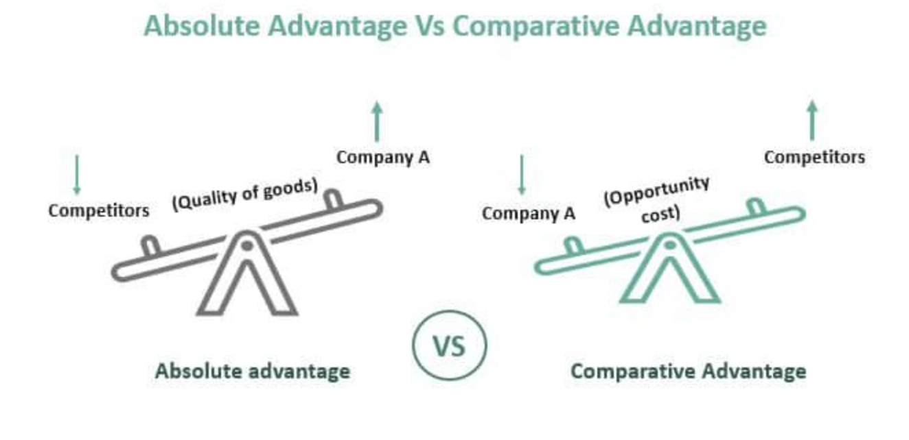

## Table of Contents

## What is the basic definition of comparative advantage?

Comparative advantage is an economic concept that explains why countries can benefit from trading with each other, even if one country is better at producing everything. It means that a country should focus on making the things it can produce more efficiently compared to other countries, and then trade those products for things that other countries can make more efficiently.

For example, imagine Country A can produce both cars and computers, but it is especially good at making cars. Country B can also produce cars and computers, but it is better at making computers. According to comparative advantage, Country A should focus on making cars and Country B should focus on making computers. Then, they can trade with each other. This way, both countries end up with more cars and computers than they would have if they tried to produce everything themselves.

## What is the basic definition of absolute advantage?

Absolute advantage is an economic idea that explains when one country can produce a good or service more efficiently than another country. It means that a country can make something using fewer resources, like time, labor, or materials, compared to another country. For example, if Country A can produce wheat with less effort and fewer resources than Country B, then Country A has an absolute advantage in wheat production.

This concept is important because it helps countries decide what they should produce and trade. If a country has an absolute advantage in a certain product, it makes sense for that country to focus on making that product and then trade it with other countries. This way, everyone can benefit from getting goods produced more efficiently. However, absolute advantage is different from comparative advantage, which looks at the relative efficiency of producing different goods within a country.

## How do comparative advantage and absolute advantage differ?

Comparative advantage and absolute advantage are two important ideas in economics, but they focus on different things. Absolute advantage is about how well a country can make something compared to another country. If a country can produce a good using fewer resources, like less time or fewer workers, than another country, it has an absolute advantage in that good. For example, if Country A can make cars faster and with fewer workers than Country B, Country A has an absolute advantage in car production.

Comparative advantage, on the other hand, looks at which goods a country can produce more efficiently compared to other goods within its own economy. It's not about being the best at making something compared to other countries, but about being relatively better at making one thing compared to another thing at home. Even if a country is not the best at producing anything, it can still benefit from trade by focusing on what it does best compared to other things it can make. For instance, if Country A is better at making cars than computers, but Country B is better at making computers than cars, both countries can gain by specializing and trading with each other.

In summary, absolute advantage is about being the best at producing a specific good compared to other countries, while comparative advantage is about being relatively better at producing one good compared to another within your own country. Both concepts help explain why countries trade and how they can benefit from it, but they look at different aspects of production efficiency.

## Can you provide a simple example to illustrate comparative advantage?

Imagine there are two friends, Anna and Ben. Anna can bake 10 cookies or make 5 drawings in an hour. Ben can bake 6 cookies or make 3 drawings in an hour. Anna is better at both baking and drawing than Ben, so she has an absolute advantage in both activities. However, Anna is especially good at baking cookies compared to drawing, while Ben is relatively better at drawing compared to baking.

To use their time in the best way, Anna should focus on baking cookies, and Ben should focus on making drawings. If Anna spends an hour baking, she can make 10 cookies. If Ben spends an hour drawing, he can make 3 drawings. By specializing, Anna and Ben can trade with each other. For example, Anna could give Ben 8 cookies in exchange for 3 drawings. This way, Anna ends up with 2 cookies and 3 drawings, and Ben ends up with 8 cookies and no drawings. Both are better off than if they had tried to do everything themselves.

## Can you provide a simple example to illustrate absolute advantage?

Imagine there are two farmers, Sam and Tom. Sam can grow 10 apples or 5 oranges in a day. Tom can grow 6 apples or 3 oranges in a day. Sam is better at growing both apples and oranges than Tom. This means Sam has an absolute advantage in both fruits. He can produce more apples and more oranges using the same amount of time.

Because Sam is better at growing both fruits, he should focus on the one he can grow the most of. In this case, Sam can grow more apples than oranges compared to Tom. So, Sam should grow apples, and Tom should grow oranges. By doing this, they can trade with each other and both will have more fruits than if they tried to grow everything themselves.

## How does the concept of opportunity cost relate to comparative advantage?

Opportunity cost is what you give up when you choose to do one thing instead of another. It's important in understanding comparative advantage because it helps figure out which goods a country should make and trade. Comparative advantage says a country should focus on making the things it can produce more efficiently compared to other things it could make. By looking at opportunity cost, we can see which products have the lowest cost in terms of what else could be made with the same resources.

For example, imagine a country can make either cars or computers. If making a car means giving up the chance to make two computers, the opportunity cost of a car is two computers. If another country can make a car but only gives up one computer, the second country has a lower opportunity cost for making cars. According to comparative advantage, the first country should focus on making computers because it's better at that compared to making cars. By understanding opportunity costs, countries can decide what to specialize in and trade, which helps them use their resources in the best way possible.

## What role does specialization play in leveraging comparative advantage?

Specialization is key to using comparative advantage well. It means a country focuses on making the things it's best at compared to other things it could make. By doing this, a country can produce more of that good than if it tried to make everything. For example, if a country is good at growing wheat but not as good at making cars, it should grow more wheat and let another country that's better at making cars do that. This way, both countries can trade and get more of what they need.

When countries specialize based on their comparative advantage, they can use their resources better. This leads to more goods being made overall. When they trade these goods with other countries, everyone can have more of everything. It's like how in a team, if each person does what they're best at, the team does better overall. Specialization helps countries work together to make the most of what they have.

## How do countries benefit from trading based on comparative advantage?

When countries trade based on comparative advantage, they can get more of the things they need or want. This happens because each country focuses on making the things it's best at compared to other things it could make. For example, if one country is really good at growing wheat but not so good at making cars, it can grow a lot of wheat and trade it for cars from another country that's better at making cars. This way, both countries end up with more wheat and more cars than if they tried to make everything themselves.

Trading like this also helps countries use their resources better. Instead of spending time and effort on things they're not as good at, they can focus on what they do best. This means they can make more of their best products and then trade them for other things. In the end, everyone gets more of what they need, and the whole world can have more goods and services. It's like how a team works better when everyone does what they're best at.

## Can a country have an absolute advantage in all goods but still benefit from trade?

Yes, a country can have an absolute advantage in all goods and still benefit from trade. This might sound strange, but it's because of something called comparative advantage. Even if a country is the best at making everything, it should focus on making the things it's especially good at compared to other things. For example, if a country can make both cars and computers, but it's way better at making cars, it should make more cars and trade them for computers from another country that's good at making computers.

By doing this, the country can use its time and resources better. Instead of making everything, it can make more of what it's really good at and then trade for the rest. This way, both countries end up with more of everything than if they tried to make it all themselves. So, even if a country is the best at everything, it can still get more stuff by trading with others based on what they're each best at.

## How do economists measure comparative and absolute advantages?

Economists measure absolute advantage by looking at how much of a good a country can produce with the same amount of resources as another country. For example, if Country A can make 100 cars with the same amount of resources that Country B uses to make only 80 cars, then Country A has an absolute advantage in making cars. It's all about comparing the total output of goods between countries to see who can make more with the same resources.

Comparative advantage is a bit trickier because it's about the opportunity cost of making one good compared to another within the same country. Economists calculate this by figuring out how much of one good a country has to give up to make another good. For instance, if Country A can make either 100 cars or 50 computers, the opportunity cost of making 100 cars is 50 computers. If Country B can make either 80 cars or 60 computers, the opportunity cost of making 80 cars is 60 computers. Even though Country A is better at making both, it should focus on making cars because it gives up fewer computers to do so, while Country B should focus on computers. By comparing these opportunity costs, economists can see where each country has a comparative advantage.

## What are the limitations or criticisms of the theories of comparative and absolute advantage?

The theories of comparative and absolute advantage have some limitations and criticisms. One big criticism is that they assume countries will always trade freely, but in the real world, there are often trade barriers like tariffs and quotas that can mess things up. These theories also assume that resources can move easily within a country, but in reality, moving workers or factories from one industry to another can be hard and take a long time. Another problem is that these theories don't take into account things like different levels of technology or the fact that countries might not have the same kinds of resources to start with.

Another criticism is that these theories focus a lot on making and trading goods, but they don't pay much attention to services, which are a big part of modern economies. Also, they assume that trade will always make everyone better off, but sometimes it can hurt certain groups of people, like workers in industries that can't compete well. Critics also say that these theories don't consider the impact of trade on the environment or how it might affect income inequality within countries. So, while comparative and absolute advantage are useful ideas, they don't tell the whole story about how trade works in the real world.

## How have comparative and absolute advantage theories evolved in the context of modern global trade?

In the world of modern global trade, the ideas of comparative and absolute advantage have changed a bit to fit today's economy. These theories used to focus mostly on trading goods like wheat and cars, but now, services like banking and software are a big part of trade too. Also, technology has changed a lot. Countries can now use new tech to make things faster and better, which can shake up who has an advantage in making certain things. Trade agreements and rules between countries have also become more complicated, which can affect how much countries can benefit from their advantages.

Another big change is that global trade now involves more than just countries trading with each other. Big companies that work all over the world play a huge role too. These companies can move their factories and workers to different countries to take advantage of lower costs or better technology. This means that the old ideas of comparative and absolute advantage need to think about how businesses and their choices affect trade. Even though these theories still help explain why countries trade, they have to consider more things now, like how trade can affect the environment and how it might make some people richer while others struggle.

## References & Further Reading

[1]: Ricardo, D. (1817). ["On the Principles of Political Economy and Taxation."](https://www.econlib.org/library/Ricardo/ricP.html) John Murray, London.

[2]: Smith, A. (1776). ["An Inquiry into the Nature and Causes of the Wealth of Nations."](https://archive.org/details/inquiryintonatur01smit_0/) Methuen & Co. Ltd.

[3]: Lopez de Prado, M. (2018). ["Advances in Financial Machine Learning."](https://www.amazon.com/Advances-Financial-Machine-Learning-Marcos/dp/1119482089) John Wiley & Sons.

[4]: Chan, E. P. (2008). ["Quantitative Trading: How to Build Your Own Algorithmic Trading Business."](https://github.com/ftvision/quant_trading_echan_book) John Wiley & Sons.

[5]: Jansen, S. (2020). ["Machine Learning for Algorithmic Trading: Predictive models to extract signals from market and alternative data for systematic trading strategies with Python, 2nd Edition."](https://www.amazon.com/Machine-Learning-Algorithmic-Trading-alternative/dp/1839217715) Packt Publishing.

[6]: Aronson, D. R. (2006). ["Evidence-Based Technical Analysis: Applying the Scientific Method and Statistical Inference to Trading Signals."](https://www.wiley.com/en-us/Evidence+Based+Technical+Analysis%3A+Applying+the+Scientific+Method+and+Statistical+Inference+to+Trading+Signals-p-9780470008744) John Wiley & Sons.

[7]: Bookstaber, R. (2007). ["A Demon of Our Own Design: Markets, Hedge Funds, and the Perils of Financial Innovation."](https://rpc.cfainstitute.org/en/research/financial-analysts-journal/2007/a-demon-of-our-own-design-markets) Wiley.

[8]: Bodie, Z., Kane, A., & Marcus, A. J. (2014). ["Investments."](https://www.mheducation.com/highered/product/investments-bodie-kane/M9781264412662.html) McGraw-Hill Education.