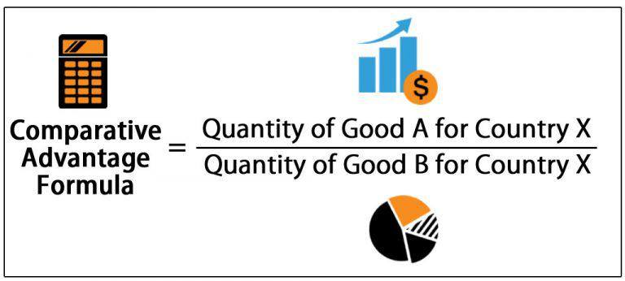

The global economy operates as an intricate network of trade relationships, heavily influenced by core economic principles such as comparative and absolute advantage. These principles, endemic to economic theory, are essential for understanding the dynamics of international trade and the subsequent emergence of specialized markets across the world. Comparative advantage, as introduced by David Ricardo, and absolute advantage, as postulated by Adam Smith, represent two foundational concepts that explain how nations benefit from trade based on their respective efficiencies and opportunity costs.

In essence, these principles guide nations in determining which goods to produce and trade, thereby maximizing their economic potential and enhancing global productivity. Comparative advantage enables countries to specialize in the production of goods for which they have the lowest opportunity cost, even if they do not hold an absolute advantage in producing those goods. This specialization forms the bedrock of international trade benefits, allowing for a more efficient allocation of resources worldwide.



Furthermore, with the advent of technological advancements, particularly in algorithmic trading, these foundational principles are being re-examined and applied in new contexts. Algorithmic trading, which utilizes complex algorithms to make swift financial trading decisions, is significantly transforming international markets. It optimizes the trading process, enhances market efficiency, improves liquidity, and adds transparency, all while posing potential risks that require careful management.

Understanding how these economic theories apply in today's rapidly evolving digital economy allows us to better grasp their effects on global trade efficiency and innovation. As international trade continues to grow and evolve, recognizing the roles of comparative and absolute advantage, alongside technological integration, remains crucial for navigating the contemporary global economic landscape.

## Table of Contents

## The Theory of Comparative Advantage

The concept of comparative advantage is a foundational principle in the field of international trade, providing insights into how countries can engage in mutually beneficial trade relationships. Despite the presence of absolute advantage, where one country can produce all goods more efficiently than another, comparative advantage demonstrates that nations can still benefit from specializing in the production of goods where they have the lowest opportunity cost.

Economist David Ricardo introduced this concept in the early 19th century to demonstrate that even if a country holds no absolute advantage in any area, it can still benefit from trade by focusing on its comparative strengths. Ricardo's theory emphasizes opportunity cost — the cost of forgoing the next best alternative when making a decision. By specializing in goods for which they have the lowest opportunity cost, countries can enhance their economic welfare and the overall productivity of the global market.

For example, consider two countries, the United States and China, engaged in trade. Suppose the U.S. is more efficient at producing both airplanes and textiles compared to China. However, the opportunity cost of producing airplanes in the U.S. is lower than that of textiles when compared to China. Conversely, China's opportunity cost of producing textiles is lower than that of producing airplanes. In this scenario, according to the principle of comparative advantage, the U.S. should specialize in airplanes and China should specialize in textiles. By doing so, both countries maximize their efficiencies and gain from trade, even if one country has an absolute advantage in producing all goods involved.

Ricardo’s comparative advantage theory is mathematically represented by opportunity cost calculations, which guide trade decisions. The formula for opportunity cost in producing good A in terms of good B can be expressed as:

$$
\text{Opportunity Cost of A} = \frac{\text{Resources required to produce A}}{\text{Resources required to produce B}}
$$

This calculation helps countries determine which goods to specialize in to optimize economic outcomes.

In today's global economy, the theory of comparative advantage remains highly relevant. Global trade dynamics are often influenced by countries leveraging their comparative advantages to reach new markets and boost economic growth. In the context of the U.S. and China, trade relations are built upon the premise that both nations can prosper by focusing on their economic strengths, despite occasional tensions and trade disputes. 

Comparative advantage fosters a more interconnected global economy where specialization leads to increased productivity, innovation, and economic development. As countries continue to navigate complex trade environments, the application of comparative advantage theory serves as a guiding principle for forming strategic partnerships and navigating international markets.

## Comparative vs. Absolute Advantage

Absolute advantage, conceptualized by Adam Smith, occurs when a country can produce a good more efficiently than another, using fewer resources. It highlights a clear measure of a country's productivity by comparing the input required for production. For example, if Country A can produce 10 units of a product using the same resources that Country B uses to produce 5 units, Country A has an absolute advantage in producing that product.

On the other hand, comparative advantage, introduced by David Ricardo, is centered on opportunity cost, which is the trade-off of the next best alternative when making a decision. A country has a comparative advantage in producing a good if it can do so at a lower opportunity cost than another country, even if it does not have an absolute advantage. This principle suggests that countries benefit from trade by specializing in goods where they hold a comparative advantage, thereby increasing overall economic efficiency and welfare. 

To illustrate, consider two countries, Country X and Country Y, producing two goods: cloth and wine. If Country X can produce wine at a lesser opportunity cost relative to cloth than Country Y, then Country X should specialize in wine. Conversely, if Country Y has a lower opportunity cost for cloth than wine production compared to Country X, it should focus on cloth, even though it might not have an absolute advantage in either.

**Differences and Interplay**

Absolute and comparative advantages differ primarily in their focus; the former is about resource efficiency, while the latter is about cost optimization. However, they interplay significantly in international trade, as nations often strategize trade based on their specific advantages. For instance, a country with absolute advantage in multiple goods might still benefit from specializing where it holds a comparative advantage.

**Implications for Trade Specialization**

These economic theories underpin trade specialization, whereby countries allocate resources to industries where they are most efficient (absolute advantage) or give up less (comparative advantage). This specialization enhances global trade by allowing countries to import goods they produce less efficiently and export those they specialize in, thus maximizing economic welfare and resource allocation efficiency.

Consider an example using simple quantitative analysis. Assume two countries, A and B, producing two goods, wheat and rice, with given productive capacities:

- Country A: 4 units of wheat or 8 units of rice
- Country B: 10 units of wheat or 5 units of rice

Though Country B has an absolute advantage in both goods, the opportunity cost is lower for Country A in rice production (0.5 units of wheat per unit of rice, compared to 2 units of rice per unit of wheat for Country B). Hence, Country A should specialize in rice and Country B in wheat, enhancing trade efficiency based on comparative advantage.

```python
# Example of simple Python code to calculate comparative advantage
# Opportunity costs for each country

units_A = {'wheat': 4, 'rice': 8}
units_B = {'wheat': 10, 'rice': 5}

opp_cost_A = {product: units_A['rice' if product == 'wheat' else 'wheat'] / 
              units_A[product] for product in units_A}

opp_cost_B = {product: units_B['rice' if product == 'wheat' else 'wheat'] / 
              units_B[product] for product in units_B}

opp_cost_A, opp_cost_B
```

**Impact on Policies and Trade Agreements**

These principles significantly influence national policies and international trade accords. Governments may craft strategies that foster industries where they have a comparative advantage, using tariffs, subsidies, and trade agreements to protect these sectors and exploit foreign markets. For example, trade agreements often include provisions that promote sectors aligned with a country's comparative strengths, enhancing mutual benefits and economic ties. 

These strategic applications of comparative and absolute advantage are foundational to understanding how countries navigate the complexities of global trade, optimize economic policies, and engage in international commerce effectively.

## The Role of Free Trade

Free trade serves as a practical embodiment of the principle of comparative advantage, enhancing global economic integration and competitiveness. By allowing nations to engage in trade without encountering prohibitive tariffs, quotas, or other barriers, free trade policies enable countries to optimize their economic capabilities. This specialization based on comparative advantage not only bolsters efficiency but also fosters innovation and economic expansion.

Economic theories underline that when countries reduce trade barriers, they effectively enlarge their markets, providing businesses with access to a broader consumer base. This expanded market access incentivizes firms to innovate and increase productivity, driving economic growth. Theories from classical economics, such as those proposed by David Ricardo, support the notion that free trade results in more efficient allocation of resources globally.

Empirical evidence supports these theoretical perspectives, illustrating both the advantages and challenges of free trade agreements. For example, the North American Free Trade Agreement (NAFTA), now succeeded by the United States-Mexico-Canada Agreement (USMCA), historically showed how reducing trade barriers led to increased trade volumes and economic growth in participant countries. However, such agreements can also result in complex outcomes, including job displacement in some sectors due to increased competition from foreign markets.

Large economic blocs and organizations play crucial roles in facilitating international trade. The World Trade Organization (WTO) serves as a global platform for negotiating trade agreements, resolving trade disputes, and overseeing trade policies. Similarly, regional economic blocs like the European Union (EU) and the Association of Southeast Asian Nations (ASEAN) work to implement free trade agreements that benefit member countries by harmonizing regulations and reducing barriers to trade.

In summary, free trade leverages the economic principle of comparative advantage, providing diverse benefits such as enhanced market access, innovation, and economic growth. While challenges such as sectoral job losses and economic disparities exist, the function of major economic organizations in regulating and promoting free trade remains vital to its success and sustainability in the global economy.

## Algorithmic Trading in International Markets

Algorithmic trading, propelled by the rapid progress in technology, has become a dominant element in global financial markets, revolutionizing how trade is conducted. At its core, [algorithmic trading](/wiki/algorithmic-trading) employs sophisticated computer algorithms to execute trading decisions at high speed, optimizing the trading process for efficiency, accuracy, and strategic advantage.

1. **Technology and Economics Intersection**:
   Algorithmic trading represents a confluence of economics and technology in international trade. It leverages computational power to analyze vast quantities of market data, identifying patterns and executing trades that humans could neither comprehend nor perform at a comparable speed. These algorithms can access multiple markets globally, exploiting even minute price differences between them to profit. This strategic leveraging of technology underscores a significant shift in how international trade operates, blending traditional economic principles with cutting-edge technological innovations.

2. **Enhancing Market Efficiency, Liquidity, and Transparency**:
   By automating trading processes, algorithmic trading significantly enhances market efficiency. Algorithms can assess and respond to market conditions within milliseconds, ensuring that trades are executed at optimal prices. This rapid execution contributes to greater [liquidity](/wiki/liquidity-risk-premium), as the [volume](/wiki/volume-trading-strategy) and frequency of trades increase, making it easier for market participants to buy and sell assets without causing significant price changes. Moreover, algorithmic trading brings transparency to trading practices by minimizing human intervention, thus reducing the potential for manipulative actions.

3. **Potential Risks and Regulatory Challenges**:
   Despite its advantages, algorithmic trading presents several risks and regulatory challenges. The very speed and complexity that provide benefits also harbor dangers, such as the potential for market [volatility](/wiki/volatility-trading-strategies). For instance, a poorly designed algorithm can trigger a series of unintended trades, causing significant market disruptions, as seen in the 2010 Flash Crash, where an algorithmic trading malfunction led to a temporary but dramatic drop in U.S. stock prices. Moreover, algorithmic trading can contribute to market fragmentation, as different algorithms might focus on specific market segments, leading to liquidity disparities.

   Regulators face the challenge of crafting policies that mitigate these risks without stifling technological innovation. Ensuring fair market practices while accommodating the rapid pace of technological advancement requires developing sophisticated monitoring and compliance mechanisms. Regulatory frameworks must adapt to the complexities of algorithmic trading by implementing measures such as circuit breakers to halt trading in case of extreme volatility and requiring greater transparency in algorithmic strategies.

In conclusion, algorithmic trading encapsulates the transformative power of technology within international trade, contributing to unprecedented efficiency and transparency but also introducing new complexities and risks. Navigating these dual realities necessitates a balanced approach that harnesses technological capabilities while safeguarding market integrity.

## The Future of International Trade

Global trade is undergoing significant transformations due to rapid technological advancements and evolving economic landscapes. Emerging markets, innovative technologies, and changing trade policies are central to shaping the future of international commerce. As countries adapt to these dynamics, understanding potential trends and challenges becomes critical.

Technological innovations, notably [artificial intelligence](/wiki/ai-artificial-intelligence) (AI) and blockchain, are poised to revolutionize trade processes. AI enhances decision-making efficiency by analyzing vast datasets to uncover market trends and optimize supply chains. For instance, [machine learning](/wiki/machine-learning) algorithms can predict demand fluctuations, allowing businesses to adjust production and distribution accordingly. Blockchain technology, meanwhile, offers a secure, transparent platform for transactions. It can streamline documentation, reduce fraud, and enhance trust among international trade partners by providing irrefutable transaction records.

As technology influences trade, comparative and absolute advantages may shift. Traditional advantages based on resource endowments could become less relevant as technological prowess increasingly defines competitive standing. Countries investing in digital infrastructure and education to cultivate AI expertise and blockchain capabilities might gain new advantages. For example, a nation traditionally strong in manufacturing could transition to a technology leader, influencing its trade strategy and partnerships.

Sustainability and ethical considerations are also becoming integral to global trade frameworks. Consumers and governments alike are demanding more sustainable and ethically-produced goods. Trade policies increasingly reflect these values, encouraging environmentally-friendly practices and fair labor standards. Businesses adopting sustainable practices benefit from enhanced brand reputation and access to new markets prioritizing ethical consumption.

The future of international trade will be characterized by adaptability to technological, economic, and social forces. Nations that strategically leverage technological innovations while prioritizing sustainability are likely to thrive in an evolving trade environment. As such, understanding these trends is essential for stakeholders aiming to navigate the complexities of the global economy.

## Conclusion

Understanding comparative advantage and international trade dynamics is essential for navigating the global economy. Comparative advantage, as a guiding principle, allows countries to specialize in the production of goods for which they have the lowest opportunity cost, thereby enhancing both national and global economic efficiency. This specialization fosters higher economic growth and can lead to an improved quality of life for citizens worldwide by enabling access to a diverse range of goods and services.

The integration of technology, particularly through algorithmic trading, marks a new era of efficiency and complexity in trade. Algorithmic trading, by employing sophisticated algorithms to execute trades at high speed and precision, enhances market liquidity and transparency. This technological advancement not only optimizes trading processes but also provides a platform for analyzing vast datasets to inform better decision-making and risk management strategies.

As international trade continues to evolve, adaptability, innovation, and strategic policy play pivotal roles. Countries must remain agile, continuously adapting to new technological trends and shifting geopolitical landscapes. Innovation drives the development of new goods and services, while strategic policies ensure that the benefits of trade are maximized and equitably distributed.

The principles discussed in this article provide foundational insights into the interconnected world of global trade. By leveraging comparative advantage and embracing technological innovations like algorithmic trading, nations are better equipped to navigate the complexities of the global economy. Understanding and applying these concepts are crucial for fostering economic growth, stability, and enhancing global trade efficiencies. As the world moves forward, an informed approach to trade dynamics will be essential for sustaining economic progress and development.

## References & Further Reading

[1]: Ricardo, D. (1817). ["On the Principles of Political Economy and Taxation."](https://www.cambridge.org/core/books/on-the-principles-of-political-economy-and-taxation/5C17BF2152379956950601EFE05AE14F) John Murray.

[2]: Smith, A. (1776). ["An Inquiry into the Nature and Causes of the Wealth of Nations."](https://archive.org/details/inquiryintonatur01smit_0/) W. Strahan and T. Cadell.

[3]: Dufour, A., & Engle, R. F. (2000). ["The Art of Spotting Trading Patterns in the Volatility of Financial Markets."](https://papers.ssrn.com/sol3/papers.cfm?abstract_id=2346683) Risk Management: Challenge and Opportunity.

[4]: Lopez de Prado, M. (2018). ["Advances in Financial Machine Learning."](https://www.amazon.com/Advances-Financial-Machine-Learning-Marcos/dp/1119482089) John Wiley & Sons.

[5]: Krugman, P. R. (1987). ["Is Free Trade Passé?"](https://www.aeaweb.org/articles?id=10.1257/jep.1.2.131) The Quarterly Journal of Economics.

[6]: WTO. (2015). ["World Trade Report 2015: Speeding up Trade: Benefits and Challenges of Implementing the WTO Trade Facilitation Agreement."](https://www.wto-ilibrary.org/content/books/9789287042200)

[7]: Jansen, S. (2020). ["Machine Learning for Algorithmic Trading: Predictive Models to Extract Signals from Market and Alternative Data for Systematic Trading Strategies with Python."](https://www.amazon.com/Machine-Learning-Algorithmic-Trading-alternative/dp/1839217715) Packt Publishing.

[8]: Rodriguez, A. E. (2012). ["Beyond Ricardo: Evidence of Comparative Advantage Shifts Through Technological Advancements."](https://dave-donaldson.com/wp-content/uploads/2015/12/Costinot_Donaldson_AERPP2012.pdf) Progress in Human Geography.

[9]: Gros, D. (2018). ["Transforming World Trade."](https://academic.oup.com/book/43946) Centre for European Policy Studies.