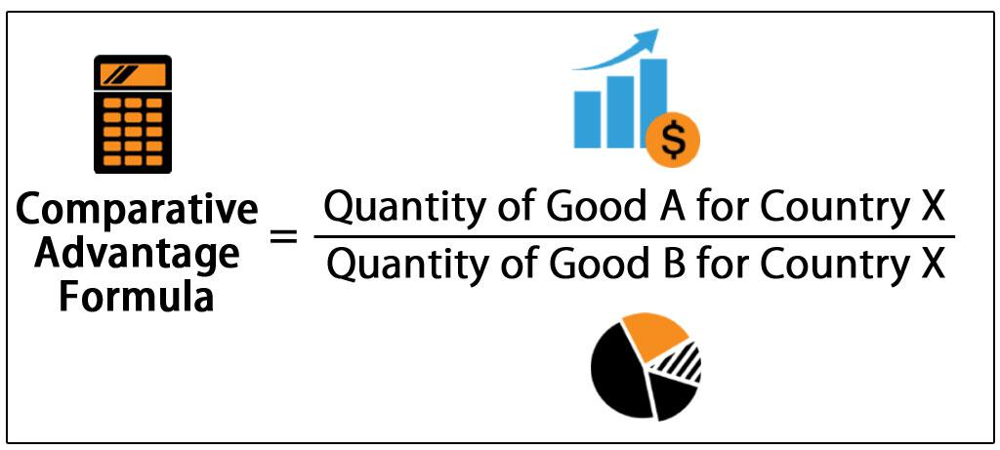

## Table of Contents

## What is the basic definition of comparative advantage?

Comparative advantage is an economic idea that explains why countries trade with each other. It says that countries should focus on making things they are better at compared to other countries. This way, they can produce more of those things with less effort or cost. By doing this, they can trade these goods with other countries for things they are not as good at making.

For example, if Country A can grow bananas more easily than Country B, and Country B can make cars more easily than Country A, both countries benefit by specializing. Country A grows more bananas and trades them to Country B for cars. This makes both countries better off because they are using their resources in the most efficient way possible. This idea helps explain why global trade can make economies grow and improve living standards.

## How does comparative advantage differ from absolute advantage?

Comparative advantage and absolute advantage are two important ideas in economics, but they are different. Absolute advantage is when a country can produce more of a good or service than another country using the same amount of resources. For example, if Country A can make 10 cars with the same resources that Country B uses to make 5 cars, Country A has an absolute advantage in making cars.

Comparative advantage, on the other hand, is about being better at producing one thing compared to another thing. It's not about who can produce the most, but who can produce at a lower opportunity cost. For example, if Country A can make either 10 cars or 20 bananas, and Country B can make either 5 cars or 15 bananas, Country A has a lower opportunity cost for cars (they give up 2 bananas per car) and Country B has a lower opportunity cost for bananas (they give up 1/3 of a car per banana). So, even if Country A is better at making both cars and bananas, they should focus on cars and Country B should focus on bananas. This way, both countries can benefit from trading with each other.

## Can you provide a simple example of comparative advantage in action?

Imagine there are two friends, Sam and Tara. Sam can make 10 pizzas or 5 sandwiches in an hour. Tara can make 6 pizzas or 3 sandwiches in an hour. Even though Sam is better at making both pizzas and sandwiches, they can still benefit from trading with each other because of comparative advantage.

Sam has a lower opportunity cost for making pizzas. For every pizza Sam makes, he gives up half a sandwich. Tara, on the other hand, has a lower opportunity cost for making sandwiches. For every sandwich Tara makes, she gives up 2 pizzas. So, Sam should focus on making pizzas, and Tara should focus on making sandwiches. If Sam makes pizzas and trades them to Tara for her sandwiches, both of them can end up with more food than if they worked alone.

## What are the key assumptions behind the theory of comparative advantage?

The theory of comparative advantage relies on a few important assumptions. First, it assumes that countries have different levels of efficiency in producing goods. This means that one country might be better at making cars while another is better at growing wheat. Second, it assumes that countries can trade with each other freely without any restrictions like tariffs or quotas. This is important because it allows countries to specialize in what they are good at and then trade with others.

Another key assumption is that resources within a country can be moved around easily. For example, workers and machines can switch from making one product to another without any big problems. This helps countries focus on what they are best at. Lastly, the theory assumes that there are no transportation costs or other trade barriers that could make trading less beneficial. These assumptions help explain why countries can benefit from specializing and trading with each other.

## How does comparative advantage affect international trade?

Comparative advantage is a big reason why countries trade with each other. It says that countries should make things they are good at and trade them for things they are not so good at. This makes everyone better off. For example, if one country can grow lots of wheat easily but struggles to make cars, and another country can make lots of cars but struggles to grow wheat, they can trade wheat for cars. This way, both countries can have more wheat and more cars than if they tried to do everything themselves.

When countries follow this idea, it can help their economies grow. They can make more of the things they are good at and sell them to other countries. This can create jobs and make things cheaper for people to buy. But, for this to work well, countries need to be able to trade freely without too many rules or taxes that make trading harder. If they can do this, comparative advantage can lead to more trade and a better life for people in those countries.

## What role do opportunity costs play in comparative advantage?

Opportunity costs are super important in understanding comparative advantage. They help us figure out what a country should make and trade. Opportunity cost is what you give up when you choose to do one thing instead of another. For example, if a country decides to make cars instead of wheat, the opportunity cost is the wheat they could have made instead. By looking at these costs, countries can see which things they are better at making compared to other things.

Comparative advantage says countries should focus on making things where their opportunity cost is lower. This means they give up less of other things to make what they are good at. For example, if one country gives up fewer bananas to make a car than another country, it should make cars and trade them for bananas. This way, both countries can get more of what they want. By using opportunity costs to find their comparative advantage, countries can trade and make their economies grow.

## How can a country determine its comparative advantage?

A country can find out its comparative advantage by looking at what it can make better than other things. It's all about figuring out the opportunity cost, which is what you give up when you choose to make one thing instead of another. For example, if a country can make cars with less effort than growing wheat, it should make cars. They compare how much wheat they have to give up to make a car to how much other countries have to give up. If they give up less wheat than other countries, they have a comparative advantage in making cars.

To do this, countries need to look at their resources like workers, machines, and land. They need to see how well they can use these resources to make different things. If a country has lots of good farmland, it might be better at growing crops than making electronics. By understanding what they can make with the least opportunity cost, countries can focus on those things and trade with others for the things they are not as good at making. This helps them use their resources in the best way possible and grow their economy.

## What are the limitations and criticisms of the theory of comparative advantage?

The theory of comparative advantage has some problems that people talk about. One big issue is that it assumes countries can move their resources around easily. But in real life, moving workers or factories from making one thing to another can be hard and take a long time. Also, the theory doesn't think about things like transportation costs or trade barriers like taxes on imports. These things can make trading less helpful than the theory says it should be. Plus, the theory doesn't look at how trade can affect jobs and wages in different parts of a country, which can be a big deal for people.

Another criticism is that the theory doesn't consider how countries might change over time. If a country starts making one thing because it's good at it, it might not get better at making other things. This can make it hard for them to switch to something new later on. Also, some people worry that focusing too much on what you're good at now might make a country depend too much on other countries for important things. If trade stops for some reason, like a war or a big problem, that can be really bad. So, while comparative advantage can help explain why countries trade, it's not perfect and doesn't cover everything that happens in the real world.

## How has the concept of comparative advantage evolved since its introduction?

Since David Ricardo first talked about comparative advantage in the early 1800s, the idea has grown and changed a lot. At first, it was a simple way to explain why countries should trade with each other. It said that even if one country was better at making everything, it could still benefit by focusing on what it was best at and trading with others. Over time, economists started to look at more things than just how good countries were at making stuff. They started thinking about things like how easy it is to move resources around, the costs of moving goods from one place to another, and how trade can affect jobs and wages.

In the 20th century, new ideas came along that built on the basic idea of comparative advantage. For example, the Heckscher-Ohlin model said that countries should make things that use the resources they have a lot of. This was different from just looking at what they were good at making. Also, people started to think about how technology can change what countries are good at over time. Today, economists also talk about how global supply chains and big companies can change the way comparative advantage works. They look at how countries can work together to make things, instead of just trading finished products. So, while the basic idea of comparative advantage is still important, it's now part of a bigger picture that includes many more things.

## Can comparative advantage be applied to industries within a country, not just between countries?

Yes, comparative advantage can be used to understand how different industries within a country can work together to make the economy better. Just like countries, different regions or industries inside a country might be better at making certain things than others. For example, one part of a country might have lots of farmland and be good at growing crops, while another part might have factories and be good at making machines. By focusing on what they are good at, these different areas can trade with each other and help the whole country.

This idea can help businesses decide what to make and where to make it. If a company in one part of the country can make something more cheaply than a company in another part, it makes sense for them to focus on that product. Then, they can trade with other companies for things they are not as good at making. This can make the whole economy more efficient and help everyone get more of what they need.

## What are the dynamic effects of comparative advantage on economic growth and development?

Comparative advantage can help a country's economy grow and develop over time. When countries focus on making things they are good at, they can make more of those things with less effort or cost. This can lead to more jobs and higher wages in those industries. As countries trade these goods with other countries, they can get things they are not as good at making. This makes people's lives better because they can have more stuff to use and enjoy. Over time, this can help the whole economy grow because businesses can make more money and invest in new things, like better machines or new ways of doing things.

But, there are also some challenges with this. If a country focuses too much on what it's good at now, it might not get better at making other things. This can make it hard for the country to change if something goes wrong, like if other countries stop trading with them. Also, the benefits of trade might not be spread evenly across the country. Some places might get richer while others stay the same or even get poorer. So, while comparative advantage can help a country grow, it's important for leaders to think about how to help all parts of the country and make sure they can change and grow over time.

## How do factors like technology and trade policies influence comparative advantage over time?

Technology and trade policies can change a country's comparative advantage over time. When new technology comes along, it can make it easier and cheaper for a country to make things they were not good at before. For example, if a country gets new farming machines, it might be able to grow more crops with less work. This could change their comparative advantage from making cars to growing food. On the other hand, if a country doesn't keep up with new technology, it might lose its edge in making things it used to be good at. So, staying up-to-date with technology is important for keeping and changing a country's comparative advantage.

Trade policies also play a big role in shaping comparative advantage. If a country puts high taxes on things it imports, it might make more sense for them to start making those things at home instead of trading for them. This can change what they are good at making. Also, if countries work together to lower trade barriers, like taxes on imports, it can help them focus on what they are best at and trade more easily. But, if trade policies change a lot, it can be hard for countries to plan and might make them less sure about what they should focus on. So, trade policies can help or hurt a country's comparative advantage depending on how they are set up.

## References & Further Reading

[1]: Ricardo, D. (1817). ["On the Principles of Political Economy and Taxation."](https://www.econlib.org/library/Ricardo/ricP.html) 

[2]: Samuelson, P. A. (2001). ["International trade and the equalization of factor prices."](https://www.semanticscholar.org/paper/International-trade-and-the-equalisation-of-factor-Samuelson/8c0d07f124fa591ff1d4457751dce04a5e5d4283) Economic Theory.

[3]: Krugman, P. R. (1979). ["Increasing Returns, Monopolistic Competition, and International Trade."](https://www.sciencedirect.com/science/article/pii/0022199679900175) Journal of International Economics.

[4]: Deardorff, A. V. (1980). ["The General Validity of the Law of Comparative Advantage."](https://www.jstor.org/stable/1833142) Journal of Political Economy.

[5]: Carney, J. (2010). ["What Sparked the Flash Crash?"](https://www.npr.org/2015/04/25/402136396/who-or-what-crashed-the-market-in-a-flash-in-2010) CNBC. 

[6]: Lopez de Prado, M. (2018). ["Advances in Financial Machine Learning."](https://www.amazon.com/Advances-Financial-Machine-Learning-Marcos/dp/1119482089) Wiley.

[7]: Aldridge, I. (2013). ["High-Frequency Trading: A Practical Guide to Algorithmic Strategies and Trading Systems."](https://www.wiley.com/en-us/High+Frequency+Trading%3A+A+Practical+Guide+to+Algorithmic+Strategies+and+Trading+Systems%2C+2nd+Edition-p-9781118343500) Wiley.

[8]: Chan, E. (2008). ["Quantitative Trading: How to Build Your Own Algorithmic Trading Business."](https://github.com/ftvision/quant_trading_echan_book) Wiley.