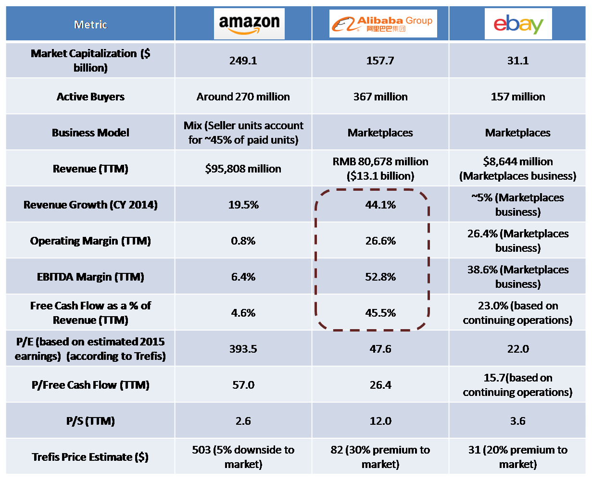

## Table of Contents

## What are Amazon and eBay?

Amazon is a big online store where you can buy many different things like books, clothes, and electronics. People like it because it's easy to use and they deliver things quickly. You can also read reviews from other buyers to help you decide what to buy. Amazon started as a place to buy books, but now it sells almost everything.

eBay is another online place where you can buy and sell things, but it's different from Amazon. On eBay, people can sell their own things to other people. You can find new and used items, and sometimes you can bid on things in an auction. This means you can try to buy something for a lower price by competing with other buyers. eBay is good for finding unique or hard-to-find items.

## How do Amazon and eBay differ in their business models?

Amazon's business model is like a big online store where they sell things directly to you. They have their own products and also let other sellers use their website to sell things too. Amazon makes money by selling these products and by charging other sellers to use their website. They also have special services like fast shipping with Amazon Prime, which people pay for. This makes Amazon a one-stop shop where you can find almost anything you need.

eBay's business model is different because it's more like a marketplace where people can sell their own stuff to other people. eBay doesn't own the products; they just provide a place for people to buy and sell. They make money by charging fees when items are sold and sometimes for listing items. On eBay, you can find new and used things, and you can even bid on items in auctions, which can be fun and help you get a good deal. This makes eBay great for finding unique or hard-to-find items.

## What are the key features of Amazon's platform?

Amazon's platform is known for being easy to use. You can find almost anything you need, from [books](/wiki/algo-trading-books) to electronics to clothes. They have a big search bar at the top of the page where you can type what you're looking for, and it will show you lots of options. Amazon also has a feature called "Recommendations" that suggests things you might like based on what you've bought or looked at before. This makes shopping easier because it helps you find new things you might enjoy.

Another key feature of Amazon is their fast shipping. If you sign up for Amazon Prime, you get free and fast delivery on many items. This is really helpful if you need something quickly. Amazon also lets you read reviews from other buyers. These reviews can help you decide if a product is good or not. Plus, Amazon has a feature called "Subscribe & Save" where you can get regular deliveries of things like shampoo or pet food at a lower price, which is great for saving money and time.

## What are the key features of eBay's platform?

eBay's platform is all about letting people buy and sell things to each other. It's like a big online marketplace where you can find all sorts of items, from new gadgets to old collectibles. One cool thing about eBay is the auction system, where you can bid on items and try to get them for a lower price. This makes shopping more exciting because you can compete with other buyers. eBay also has a feature called "Buy It Now," which lets you buy things right away without bidding, which is handy if you don't want to wait.

Another key feature of eBay is the feedback system. After you buy or sell something, you can leave feedback about the other person. This helps build trust because you can see if someone is good to buy from or sell to. eBay also lets you search for items easily with filters like price, location, and condition. This makes it simple to find exactly what you're looking for. Plus, eBay has a feature called "eBay Stores," where sellers can set up their own little shops on the site, making it easier to find all their items in one place.

## How do the user experiences on Amazon and eBay compare?

When you use Amazon, it feels like walking into a big, well-organized store. Everything is easy to find because the website is simple and clear. You type what you want in the search bar, and Amazon shows you lots of choices. If you have Amazon Prime, you can get things really fast, which is great if you need something quickly. Plus, Amazon's reviews help you decide if a product is good or not. The whole experience is smooth and makes shopping easy and quick.

On eBay, it's more like going to a big market where everyone is selling their own stuff. It can be fun because you can find unique things and even bid on them in auctions. This makes shopping more exciting, but it can also take more time because you have to wait for auctions to end. eBay's feedback system helps you trust the people you're buying from or selling to. The website is a bit more complicated than Amazon's, but it's still easy to use once you get the hang of it. Overall, eBay gives you a different kind of shopping adventure.

Both Amazon and eBay have their own special features that make them different. Amazon is great for quick and easy shopping, while eBay is more about finding unique items and enjoying the thrill of bidding. Which one you like better might depend on what you're looking for and how you like to shop.

## What are the fee structures for sellers on Amazon versus eBay?

On Amazon, sellers have to pay different kinds of fees. There is a referral fee, which is a percentage of the item's price. This fee is usually between 8% and 15%, depending on what you're selling. If you use Amazon's shipping services, you'll also have to pay for that. There's a fee called Fulfillment by Amazon (FBA), which can cost money based on the size and weight of your items. Plus, if you want to list a lot of items, there might be a monthly fee for that too. So, selling on Amazon can get a bit expensive, but it's worth it because a lot of people shop there.

On eBay, the fees are a bit different. When you list an item, you might have to pay a small fee, but it's usually free for the first so many items you list each month. When your item sells, eBay takes a final value fee, which is a percentage of the total price including shipping. This fee is usually around 10% to 12.5%. If you choose to use eBay's extra features, like making your listing look nicer, you might have to pay more. Overall, eBay's fees can be a bit less than Amazon's, especially if you're selling smaller, less expensive items.

## How do Amazon and eBay handle shipping and logistics?

Amazon has a big system for shipping and logistics called Fulfillment by Amazon (FBA). When you sell things on Amazon and use FBA, you send your items to Amazon's warehouses. Amazon takes care of storing, packing, and shipping your items to buyers. They also handle returns and customer service. This makes it easier for sellers because they don't have to worry about shipping. Amazon's fast shipping, especially with Amazon Prime, is a big reason why people like to buy from them. They have warehouses all over the world, so they can get things to customers quickly.

eBay's approach to shipping and logistics is different. On eBay, sellers are usually in charge of their own shipping. This means sellers have to pack and send out the items themselves. They can choose to use any shipping company they want, like USPS, UPS, or FedEx. eBay gives sellers tools to help them print shipping labels and track packages, but the sellers do most of the work. This can be good for sellers who want more control over their shipping, but it can also be more work for them. Buyers on eBay might have to wait a bit longer for their items because shipping depends on the seller.

## What are the differences in product offerings between Amazon and eBay?

Amazon has a huge selection of products. You can find almost anything you need, from everyday things like books, clothes, and electronics to more special items like furniture and groceries. Amazon sells its own products, like the Amazon Echo, and also lets other companies sell their stuff on the website. This means you can find both new and used items. Because Amazon is so big, they have a lot of the same products from different sellers, which can help you find the best price.

eBay is different because it's more like a big marketplace where people can sell their own things. You can find new items, but eBay is really good for finding used or unique things that you might not see in regular stores. People often sell collectibles, vintage items, and hard-to-find stuff on eBay. There are also auctions where you can bid on items, which can be fun but might take longer to get what you want. So, if you're looking for something special or want to try to get a good deal, eBay might be the place for you.

## How do customer service and support differ between Amazon and eBay?

Amazon has a strong focus on customer service. They want to make sure you're happy with your shopping experience. If you have a problem with an order, you can easily contact their customer service team through their website, by phone, or even through live chat. Amazon is known for being quick to help with returns and refunds, especially if you're an Amazon Prime member. They also have a lot of information and guides on their website to help you with any questions you might have about shopping or using their services.

eBay's customer service works a bit differently. Since eBay is more like a marketplace where people sell their own stuff, they don't handle the products directly. If you have a problem with an item, you usually need to talk to the seller first. eBay has a system to help with this, like messaging the seller or opening a case if there's a big problem. eBay's customer support team can help if you can't solve the issue with the seller, but it might take a bit longer than with Amazon. They also have help pages and guides on their website, but the experience can vary because it depends on the seller you're dealing with.

## What are the global reach and international selling capabilities of Amazon and eBay?

Amazon has a big global reach. They sell things in many countries like the United States, Canada, the UK, Germany, France, Italy, Spain, Japan, and more. If you want to sell on Amazon, you can use their service called "Amazon Global Selling" to reach customers all over the world. Amazon takes care of a lot of the hard stuff like shipping and customer service, which makes it easier for sellers to sell internationally. They also have different websites for different countries, so people can shop in their own language and currency.

eBay also has a strong presence around the world. They operate in many countries including the United States, UK, Germany, Australia, and many more. eBay makes it easy for sellers to list their items on different country sites with a feature called "Global Shipping Program." This program helps with international shipping and customs, so sellers don't have to worry about all the details. Buyers can find things from all over the world, but they might have to wait a bit longer for their items because shipping depends on the seller.

## How do Amazon and eBay approach data privacy and security?

Amazon takes data privacy and security very seriously. They have rules about how they use your information and they try to keep it safe. Amazon uses things like encryption to protect your data when you shop on their website. They also have a privacy policy that explains what they do with your information. If you have any worries about your data, you can contact Amazon's customer service team. They want to make sure you feel safe when you're shopping with them.

eBay also cares a lot about keeping your information private and secure. They use security measures like encryption to protect your data when you buy or sell things on their site. eBay has a privacy policy too, which tells you how they use your information. If you're worried about your data, you can reach out to eBay's customer support. Because eBay is a marketplace where people sell their own stuff, they also encourage sellers to be careful with buyers' information.

## What advanced strategies can sellers use to optimize their listings on Amazon and eBay?

On Amazon, sellers can use several strategies to make their listings better. One important thing is to use good keywords in the title and description of the product. This helps people find your item when they search for it. Another good idea is to have clear and high-quality pictures of what you're selling. People like to see what they're buying. Also, getting good reviews from buyers is really helpful. You can do this by making sure your customers are happy with their purchase. Amazon also has a feature called "Amazon Advertising" where you can pay to have your product show up higher in search results. This can help more people see your item.

On eBay, sellers can also do things to make their listings stand out. Using the right keywords in your title and description is key, just like on Amazon. Good pictures are important too, because they help buyers see exactly what they're getting. On eBay, you can use the "Buy It Now" option or set up an auction. Sometimes, starting an auction at a low price can attract more bidders and help you get a good price. eBay also has a feature called "Promoted Listings," where you can pay to have your item show up higher in search results. This can help more people see your listing and increase your chances of making a sale.

## What is the financial analysis of eBay?

eBay's role as a marketplace platform has established it as a distinct entity in the e-commerce sector, with a unique business model that sets it apart from its competitors. This distinction has been integral in maintaining profitability even amidst intense industry competition. In 2022, eBay reported a revenue of approximately $10 billion. While this figure indicates a slower growth trajectory compared to Amazon's expansive financial growth, it underscores eBay's stable approach within its niche marketplace.

A notable aspect of eBay’s financial structure is its gross margin, which stood at an impressive 75.7% in 2022. This high gross margin is indicative of eBay's effective cost management and its ability to convert revenue into profits more efficiently than many of its peers in the online retail industry. Gross margin is calculated as follows:

$$
\text{Gross Margin} = \left( \frac{\text{Revenue} - \text{Cost of Goods Sold}}{\text{Revenue}} \right) \times 100
$$

The efficiency of eBay's marketplace model, which primarily involves facilitating transactions between buyers and sellers rather than holding inventory, contributes significantly to its financial health. This model allows eBay to keep costs low, essentially acting as a platform that collects fees rather than incurring the substantial operational costs experienced by traditional retailers.

eBay's strategic focus on enhancing sales revenue and user engagement also plays a crucial role in its financial sustainability. By constantly innovating the user experience and leveraging data analytics, eBay ensures repeat engagement and prolonged user interaction, which directly bolsters sales revenue. The platform's user engagement strategies, coupled with efficient transaction processes, aid in maintaining a loyal customer base, which is vital for steady revenue streams.

Moreover, eBay’s business model supports a sustainable financial structure by aligning revenue generation methods with user engagement metrics. This alignment enhances predictability in revenue flows and allows for strategic investment in growth opportunities. By focusing on user engagement, eBay not only boosts its revenue but also strengthens its marketplace position, allowing it to navigate through competitive industry landscapes effectively.

## References & Further Reading

[1]: Lee, I., & Lee, K. (2012). ["The Use of Financial Accounting Information in Algorithmic Trading."](https://www.sciencedirect.com/science/article/pii/S2214635021001210) Journal of Business Economics and Management.

[2]: ["Amazon Unbound: Jeff Bezos and the Invention of a Global Empire"](https://www.amazon.com/Amazon-Unbound-Invention-Global-Empire/dp/1982132612) by Brad Stone

[3]: ["The Everything Store: Jeff Bezos and the Age of Amazon"](https://www.amazon.com/Everything-Store-Jeff-Bezos-Amazon/dp/0316219282) by Brad Stone

[4]: Khan, M.L., & Vong, J. (2014). ["Ebay: A Platform Business Model"](https://www.sciencedirect.com/science/article/pii/S0747563216306513) IS at the Business Innovation Interface: Learning To Innovate.

[5]: ["Platform Revolution: How Networked Markets Are Transforming the Economy"](https://www.amazon.com/Platform-Revolution-Networked-Markets-Transforming/dp/0393249131) by Geoffrey G. Parker, Marshall W. Van Alstyne, & Sangeet Paul Choudary