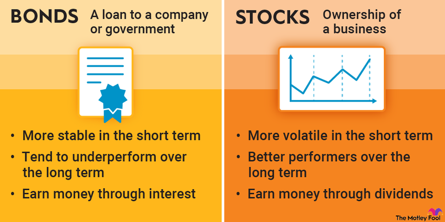

## Table of Contents

## What are stocks and how do they differ from bonds?

Stocks are like pieces of a company that you can buy. When you buy a stock, you own a small part of that company. If the company does well, the value of your stock might go up, and you could make money. But if the company does poorly, the value of your stock might go down, and you could lose money. Stocks can be a way to grow your money over time, but they can also be risky because their value can change a lot.

Bonds are different from stocks. When you buy a bond, you are lending money to a company or the government. In return, they promise to pay you back the money you lent them, plus some extra money called interest, over a certain period of time. Bonds are generally seen as less risky than stocks because they provide a steady income through interest payments, and you get your money back at the end if everything goes as planned. However, the return on bonds is usually lower than what you might get from stocks.

## What are the basic risks associated with investing in stocks versus bonds?

Investing in stocks can be risky because the value of your stocks can go up and down a lot. This is called market risk. If the company you invested in does not do well, the price of its stock can drop, and you might lose money. There's also something called company risk, where problems specific to the company, like bad management or losing money, can make the stock price fall. Stocks can be a good way to grow your money over time, but you need to be ready for the ups and downs.

Bonds are usually less risky than stocks, but they still have risks. One risk is [interest rate](/wiki/interest-rate-trading-strategies) risk. If interest rates go up, the value of your bond might go down because new bonds will offer higher interest rates. There's also credit risk, which means the company or government you lent money to might not be able to pay you back. Bonds are generally safer and provide a steady income, but the returns are usually lower than what you might get from stocks.

## How do the returns on stocks compare to those on bonds over the long term?

Over the long term, stocks usually give you higher returns than bonds. If you look at history, stocks have made more money for people over many years. This is because stocks can grow a lot if the companies do well. But, this also means stocks can be riskier because their value can go up and down a lot.

Bonds, on the other hand, usually give you steady but smaller returns. They are safer because they pay you interest regularly and you get your money back at the end if everything goes well. So, while bonds might not make you as much money as stocks over the long term, they are less likely to lose value suddenly. This makes them a good choice if you want to keep your money safe and get a steady income.

## What role do stocks and bonds play in a diversified investment portfolio?

Stocks and bonds both play important roles in a diversified investment portfolio. Stocks can help your money grow over time. They can go up a lot if the companies do well, but they can also go down if things don't go as planned. By having stocks in your portfolio, you have a chance to make more money, but you also need to be okay with the ups and downs that come with it.

Bonds, on the other hand, help keep your portfolio safe and steady. They give you regular interest payments and return your money at the end if everything goes well. This makes bonds less risky than stocks. By including bonds in your portfolio, you can balance out the risk from stocks and have a steady income. Together, stocks and bonds can help you grow your money while also keeping it safe.

## How does the liquidity of stocks compare to that of bonds?

Stocks are usually more liquid than bonds. This means it's easier and quicker to buy and sell stocks. You can trade stocks on stock exchanges during trading hours, and there are usually a lot of people buying and selling, so you can get your money out fast if you need to. This makes stocks a good choice if you might need your money back soon.

Bonds can be less liquid than stocks. It can take longer to sell a bond, especially if it's not a common one. Some bonds, like government bonds, might be easier to sell, but others, like corporate bonds, might not have as many buyers. This means if you need your money back quickly, you might have a harder time selling your bonds compared to stocks.

## What are the tax implications of investing in stocks versus bonds?

When you invest in stocks, you might have to pay taxes on the money you make. If you sell a stock for more than you paid for it, you have a capital gain, and you'll need to pay taxes on that gain. The tax rate can be different depending on how long you held the stock. If you held it for more than a year, it's called a long-term capital gain, and the tax rate is usually lower. If you held it for less than a year, it's a short-term capital gain, and you'll pay your regular income tax rate on it. Also, if you get dividends from your stocks, you'll need to pay taxes on those too, but the tax rate on qualified dividends is usually lower than your regular income tax rate.

Investing in bonds also has tax implications, but they can be different from stocks. If you buy a bond and hold it until it matures, you'll get interest payments along the way. You'll have to pay taxes on that interest every year at your regular income tax rate. If you sell a bond before it matures and make a profit, that's a capital gain, and you'll pay taxes on it just like with stocks. Some bonds, like municipal bonds, can be tax-free at the federal level, and sometimes at the state level too, which can be a big advantage. But, the interest rates on these bonds are usually lower to make up for the tax break.

## How do interest rate changes affect the performance of stocks and bonds?

When interest rates go up, it can affect stocks and bonds in different ways. For stocks, higher interest rates can make it more expensive for companies to borrow money. This might slow down their growth and lower their profits, which can make stock prices go down. Also, when interest rates rise, people might move their money from stocks to safer investments like bonds that now offer higher returns. This can also push stock prices down. But, if the economy is strong, higher interest rates might not hurt stocks too much because companies can still do well.

For bonds, interest rate changes can have a big impact. When interest rates go up, the price of existing bonds usually goes down. This is because new bonds will be issued with higher interest rates, making the old bonds less attractive. If you want to sell your old bond, you might have to sell it for less than you paid for it. On the other hand, if interest rates go down, the price of existing bonds goes up because they now offer a better return than new bonds. So, bond prices and interest rates move in opposite directions.

## What are the key factors to consider when choosing between stocks and bonds for retirement planning?

When planning for retirement, choosing between stocks and bonds depends on a few key things. First, think about how much risk you're okay with. Stocks can grow your money a lot over time, but they can also go down a lot. This means they're riskier. If you're young and have a long time until you retire, you might be okay with more risk because you have time to wait out the ups and downs. But if you're closer to retirement, you might want to be safer and not lose your money right before you need it. Bonds are usually safer and give you steady income, which can be good if you want to keep your money safe.

Another thing to think about is how much money you want to make. Stocks usually give you higher returns over the long term, which can help your retirement savings grow a lot. But bonds give you less risk and steady income, which can be important if you need money to live on during retirement. You might want to have a mix of both stocks and bonds in your retirement plan. This way, you can grow your money with stocks but also have the safety and steady income from bonds. It's all about finding the right balance for your needs and how comfortable you are with risk.

## How can an investor use stock and bond indices to gauge market performance and make investment decisions?

An investor can use stock and bond indices to see how the market is doing overall. Stock indices, like the S&P 500 or the Dow Jones, show how a group of stocks are doing. If the index goes up, it means the stocks in that index are doing well on average. If it goes down, it means they're not doing so well. Bond indices, like the Bloomberg Barclays US Aggregate Bond Index, show how a group of bonds are doing. If the bond index goes up, it means bond prices are going up, and if it goes down, it means bond prices are going down. By looking at these indices, an investor can get a sense of whether the market is going up or down and make decisions based on that.

Investors can also use these indices to help decide when to buy or sell. For example, if a stock index has been going up for a long time, an investor might think it's a good time to sell some stocks and take some profits. Or, if a bond index goes down because interest rates went up, an investor might decide to buy more bonds because they think the prices will go back up. By keeping an eye on these indices, an investor can see trends and make smarter choices about their investments. It's like using a map to see where you are and where you might want to go next with your money.

## What advanced strategies can be employed to hedge risks when investing in both stocks and bonds?

One way to hedge risks when investing in stocks and bonds is by using options. Options are like contracts that give you the right to buy or sell a stock or bond at a certain price. If you own stocks and are worried about their price going down, you can buy a put option. This option lets you sell your stock at a set price, even if the market price drops lower. It's like insurance for your stocks. For bonds, you can use interest rate swaps to hedge against changes in interest rates. If you think rates will go up and hurt your bond prices, you can swap your bond's fixed interest payments for floating ones, which can help protect you from rising rates.

Another strategy is diversification. This means spreading your money across different kinds of stocks and bonds. If you have all your money in one type of stock or bond, you're taking a big risk. But if you have some money in tech stocks, some in healthcare stocks, and some in government bonds, you're less likely to lose everything at once. If one part of your portfolio goes down, another part might go up and balance it out. You can also use asset allocation, which means deciding how much of your money to put in stocks versus bonds based on how much risk you're okay with. As you get closer to needing your money, like for retirement, you might want to shift more of your money into bonds to keep it safe.

## How do macroeconomic indicators influence the relative performance of stocks and bonds?

Macroeconomic indicators like inflation, unemployment rates, and GDP growth can really affect how stocks and bonds do. When the economy is doing well, with low unemployment and high GDP growth, people feel good about spending money. This can make companies do better, which can push stock prices up. But if inflation starts to go up a lot, it can make people worried. They might think the central bank will raise interest rates to slow down inflation, which can hurt stocks because it makes borrowing more expensive for companies. On the other hand, if the economy is doing badly, with high unemployment and low GDP growth, people might be scared and move their money into safer investments like bonds, which can make stock prices go down.

Bonds are also affected by these indicators, but in different ways. When inflation goes up, the value of the money you get back from bonds goes down, which can make bond prices fall. If the central bank raises interest rates to fight inflation, new bonds will have higher interest rates, making old bonds less attractive and their prices go down. But if the economy is doing badly and interest rates are low, bonds can look more attractive because they give you a steady income and are safer than stocks. So, when you're thinking about investing in stocks or bonds, it's important to keep an eye on these big economic signs to understand how they might affect your investments.

## What are the historical trends in stock and bond market correlations and how might they impact future investment strategies?

Over the years, the way stocks and bonds move together has changed a lot. Sometimes, when stocks go up, bonds go down, and vice versa. This is called a negative correlation. It's good for investors because it means they can balance their risk. If stocks are doing badly, bonds might do well and help keep their money safe. But there have been times when stocks and bonds moved in the same direction, which is called a positive correlation. This can be bad for investors because if both go down, they lose money on both. Looking at history, the correlation between stocks and bonds can change based on what's happening in the economy, like inflation or interest rates.

Understanding these historical trends can help investors plan for the future. If stocks and bonds have been moving in opposite directions for a while, an investor might feel more comfortable putting more money into stocks because they know bonds can help if stocks go down. But if stocks and bonds start moving together, an investor might want to be more careful and not put all their money in one place. They might choose to spread their money out more or look for other kinds of investments to keep their portfolio safe. By keeping an eye on how stocks and bonds have moved together in the past, investors can make smarter choices about where to put their money in the future.

## How do bonds, stocks, and algo trading compare?

In evaluating bonds, stocks, and [algorithmic trading](/wiki/algorithmic-trading), it's essential to understand their differences and how they can enhance an investment strategy. These investment vehicles vary in terms of risk, return, and investment horizon, and their potential roles within a diversified portfolio can be complementary.

**Risk and Return Analysis**

1. **Bonds**: Bonds are generally considered lower-risk investments compared to stocks. They offer fixed income through interest payments and principal return upon maturity. However, their return potential is typically lower. Their risk factors include interest rate fluctuations, credit risk, and inflation. The formula for calculating the yield to maturity (YTM) of a bond is crucial to evaluating its potential return.
$$
   YTM = \frac{C + \frac{{F - P}}{n}}{\frac{{F + P}}{2}}

$$

   Where $C$ is the annual coupon payment, $F$ is the face value, $P$ is the price, and $n$ is the years to maturity.

2. **Stocks**: Stocks present higher risk due to market volatility but also offer the potential for higher returns. The equity ownership aspect adds an element of potential capital appreciation. Stocks' performance can be evaluated through financial ratios and indicators derived from fundamental and technical analyses.

3. **Algorithmic Trading**: Algorithmic trading can offer higher leverage and speed in execution, often optimizing returns through systematic and data-driven strategies. However, its risks lie in system failures and algorithmic errors, requiring substantial technical knowledge and robust algorithms.

**Investment Horizon Considerations**

- **Bonds** are traditionally favored for short to medium-term horizons, providing stability and predictable returns.
- **Stocks** are more suited to long-term horizons, allowing for capital growth and the absorption of market fluctuations over time.
- **Algorithmic Trading** can span any horizon, but its effectiveness is often realized in the short-term due to rapid market movements.

**Complementary Roles in a Portfolio**

- **Bonds** offer stability and income, serving as a buffer against the volatility of equity markets.
- **Stocks** drive the potential for capital growth, essential for increasing the overall portfolio value.
- **Algorithmic Trading** enhances decision-making efficiency and can exploit market micro-movements, adding a dynamic component.

**Investor Profiles and Scenarios**

1. **Conservative Investors**: May prioritize bonds for income and stability while cautiously allocating a minor percentage to stocks.
2. **Aggressive Investors**: Likely favor stocks for growth potential and might incorporate algorithmic trading for additional tactical opportunities.
3. **Tech-Savvy Investors**: May include algorithmic trading due to its technology-driven nature and potential for optimizing returns through sophisticated strategies.

**Considerations for Strategy Development**

Crafting an effective investment strategy requires aligning personal financial goals, risk tolerance, and market understanding with investment choices. For instance, investors nearing retirement may prioritize bonds, while younger, more risk-tolerant individuals might lean towards stocks and algo trading. 

**Hybrid Strategies**

A hybrid strategy involves integrating bonds, stocks, and algorithmic trading to capitalize on each asset's strengths. This approach could involve a static asset allocation, such as a specific percentage in bonds for income and stability, another in stocks for growth, and using algorithmic trading for market-timing opportunities. The balance helps in risk mitigation while maximizing growth potential, adapting to changing market conditions and personal circumstances.

In conclusion, each investment type has unique characteristics that can be strategically combined to optimize portfolio performance across different market conditions and individual risk profiles.

## References & Further Reading

[1]: ["Investing in Bonds For Dummies"](https://www.fool.com/investing/how-to-invest/bonds/) by Russell Wild

[2]: ["Stocks for the Long Run: The Definitive Guide to Financial Market Returns & Long-Term Investment Strategies"](https://www.amazon.com/Stocks-Long-Run-Definitive-Investment/dp/0071800514) by Jeremy J. Siegel

[3]: ["Algorithmic Trading: Winning Strategies and Their Rationale"](https://www.wiley.com/en-us/Algorithmic+Trading%3A+Winning+Strategies+and+Their+Rationale-p-9781118460146) by Ernie Chan

[4]: ["Fixed Income Analysis, CFA Institute Investment Series"](https://www.amazon.com/Fixed-Income-Analysis-Barbara-Petitt/dp/1119850541) by Barbara S. Petitt and Jerald E. Pinto

[5]: ["A Random Walk Down Wall Street: The Time-Tested Strategy for Successful Investing"](https://www.amazon.com/Random-Walk-Down-Wall-Street/dp/0393358380) by Burton G. Malkiel