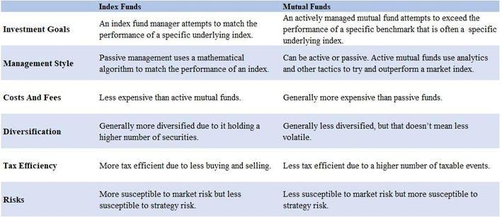

## Table of Contents

## What is an index fund?

An index fund is a type of investment that tries to match the performance of a specific market index, like the S&P 500. Instead of picking individual stocks, the fund buys all the stocks in the index. This makes it easier for people to invest in the overall market without having to choose which stocks to buy.

Index funds are popular because they are simple and usually have lower fees than other types of funds. Since they follow the market, they don't need a lot of people to manage them, which keeps costs down. This makes them a good choice for people who want to grow their money over time without taking big risks.

## How do index funds differ from actively managed funds?

Index funds and actively managed funds are two different ways to invest your money. An index fund tries to copy the performance of a market index, like the S&P 500. It does this by buying all the stocks in that index. This means it's a more hands-off approach because it doesn't need someone to pick and choose which stocks to buy. The goal is to match the market's performance, not to beat it. Because of this, index funds usually have lower fees since they don't need a lot of people to manage them.

On the other hand, an actively managed fund has a manager or a team of people who pick stocks they think will do better than the market. They try to beat the market's performance by making smart choices about which stocks to buy and sell. This means they have to do a lot of research and make many decisions, which can lead to higher fees. The goal is to get a better return than you would get by just following the market, but it's harder to do and doesn't always work out.

In simple terms, if you choose an index fund, you're betting on the overall market to grow over time. If you choose an actively managed fund, you're betting on the fund manager's ability to pick winners. Both have their pros and cons, and it depends on what you're looking for in an investment.

## What are the common types of index funds available to investors?

There are several common types of index funds that investors can choose from. One type is a broad market index fund, which tries to match the performance of a large part of the market, like the S&P 500 or the total stock market. These funds are good if you want to invest in a wide range of companies without having to pick them yourself. Another type is a sector index fund, which focuses on a specific part of the market, like technology or healthcare. These funds let you invest in one industry that you think will do well.

Another common type is a bond index fund, which tries to match the performance of a bond market index. These funds are good if you want to invest in bonds without having to pick them yourself. They can be a safer choice than stock funds because bonds usually don't go up and down as much as stocks. Finally, there are international index funds, which try to match the performance of markets outside of your home country. These funds let you spread your money around the world and can help you take advantage of growth in other countries.

## How do expense ratios affect the performance of index funds?

The expense ratio of an index fund is like a fee you pay every year for owning the fund. It's a percentage of your money that the fund takes to cover its costs. A lower expense ratio means you get to keep more of your money, which can make a big difference over time. For example, if you invest $10,000 in a fund with a 0.1% expense ratio, you'll pay $10 a year. But if the expense ratio is 1%, you'll pay $100 a year. That might not seem like a lot, but over many years, those extra fees can add up and eat into your returns.

Because index funds are designed to follow the market, they usually have lower expense ratios than actively managed funds. This is one of the big advantages of index funds. When you're choosing an index fund, it's a good idea to look at the expense ratio and pick one with a low fee. Over time, a lower expense ratio can help your investment grow more because you're not losing as much to fees. So, when you're thinking about which index fund to invest in, remember that a lower expense ratio can help you keep more of your money and improve your long-term performance.

## What is the tracking error in index funds and why is it important?

Tracking error is how much an index fund's performance differs from the index it's trying to copy. It's like the difference between what the fund does and what the market does. A small tracking error means the fund is doing a good job of matching the market. A big tracking error means it's not matching the market as well. This can happen because of fees, how the fund buys and sells stocks, or other things.

Tracking error is important because it shows how well the index fund is doing its job. If you're investing in an index fund, you want it to follow the market closely. A big tracking error might mean you're not getting the returns you expected. It can also mean you're taking more risk than you thought. So, when you're picking an index fund, it's good to look at the tracking error to see how well it matches the market.

## How does the choice of index (e.g., S&P 500, FTSE, MSCI) impact an index fund's performance?

The choice of index can make a big difference in how an index fund performs. Different indexes have different companies in them, and those companies can do better or worse at different times. For example, the S&P 500 is made up of 500 big companies in the U.S., so if those companies are doing well, an S&P 500 index fund will do well too. But if you pick an index like the FTSE, which focuses on companies in the U.K., the fund's performance will depend on how those companies are doing. So, the index you choose matters because it decides which part of the market your money is in.

Another thing to think about is how the index is made. Some indexes, like the MSCI, cover a lot of different countries and can give you a more global view of the market. This can be good if you want to spread your money around the world. But it also means your fund's performance will depend on what's happening in lots of different places. So, the choice of index not only decides which companies you're investing in but also how much you're spreading your risk. This can change how your index fund does over time.

## What are the tax implications of investing in different types of index funds?

When you invest in index funds, the taxes you have to pay can be different depending on the type of fund you choose. If you invest in a stock index fund, like one that follows the S&P 500, you might have to pay capital gains taxes when you sell your shares for a profit. Also, the fund itself might sell stocks and make a profit, and you'll have to pay taxes on those gains too, even if you didn't sell any of your shares. These are called capital gains distributions, and they can happen every year.

If you invest in a bond index fund, the tax situation can be a bit different. Bond funds usually pay out interest, and you have to pay taxes on that interest every year. The tax rate on this interest income can be higher than the tax rate on long-term capital gains from stocks. So, if you're in a high tax bracket, a bond index fund might mean you pay more in taxes than you would with a stock index fund. It's a good idea to think about your tax situation when picking an index fund to make sure you're not surprised by a big tax bill.

## How do market capitalization weighting and equal weighting strategies differ in index funds?

Market capitalization weighting and equal weighting are two different ways that index funds can be set up. In a market cap weighted index fund, the bigger companies have a bigger part of the fund. For example, if a company is worth a lot more than others in the index, it will make up a bigger piece of the fund. This means that the fund's performance will be more affected by how the big companies do. Most popular index funds, like those tracking the S&P 500, use this method because it's easy and reflects how the market works.

On the other hand, an equal weighted index fund gives the same importance to every company in the index, no matter how big or small they are. So, if there are 500 companies in the index, each one gets 1/500th of the fund. This means that smaller companies can have a bigger impact on the fund's performance than they would in a market cap weighted fund. Equal weighting can be good if you think smaller companies will do better, but it can also be riskier because those companies might not do as well as the big ones.

Both methods have their own pros and cons. Market cap weighting is simple and follows the market closely, but it can be heavily influenced by a few big companies. Equal weighting spreads things out more evenly, which can be good for diversification, but it might not match the market as closely. When picking an index fund, it's a good idea to think about which weighting method fits your investment goals and how much risk you're willing to take.

## What are the considerations for choosing between domestic and international index funds?

When choosing between domestic and international index funds, you need to think about where you want your money to grow. Domestic index funds focus on companies in your own country, like the U.S. if you live there. This can be good if you think your country's economy will do well. It's also easier to understand because you're more familiar with the companies and the news that affects them. But if your country's market goes down, your investment might go down too.

International index funds, on the other hand, let you invest in companies from all over the world. This can be a good way to spread your risk because if one country's market goes down, another might go up. It can also help you take advantage of growth in other parts of the world. But it can be harder to understand what's happening in other countries, and there might be more risks like changes in currency values or political issues. So, you need to think about how much risk you're okay with and if you want to spend time learning about other markets.

In the end, it's a good idea to have a mix of both domestic and international index funds. This can help you balance your risk and take advantage of growth opportunities in different places. It's important to think about your own goals and how much you want to spread your money around before you decide.

## How do sector-specific index funds compare to broad-market index funds in terms of risk and return?

Sector-specific index funds focus on one part of the market, like technology or healthcare. Because they only invest in one area, they can be riskier than broad-market index funds. If the sector they're in does well, you might get higher returns. But if that sector has problems, your investment could go down a lot. For example, if you invest in a tech sector fund and the tech industry has a bad year, your fund will probably do badly too. So, sector-specific funds can give you bigger ups and downs, which means more risk.

Broad-market index funds, on the other hand, spread your money across many different parts of the market. They might follow something like the S&P 500 or the total stock market. Because they're not focused on just one sector, they're usually less risky. If one part of the market goes down, other parts might go up, which can help balance things out. The returns might not be as high as a sector-specific fund when that sector is doing well, but they're usually more stable over time. So, if you want less risk and more steady growth, a broad-market index fund might be a better choice.

## What role do smart beta and factor-based index funds play in a diversified portfolio?

Smart beta and factor-based index funds are special kinds of index funds that try to do better than regular index funds. They use different ways to pick stocks, like focusing on things like size, value, or how much a company's stock price moves around. These factors can help the fund do better than just following the market. So, if you add smart beta or factor-based funds to your portfolio, you might get higher returns than you would with just a regular index fund. They can be a good way to try to beat the market without taking as much risk as you would with an actively managed fund.

Adding smart beta and factor-based funds to your portfolio can also help you spread your money around in different ways. Because they focus on specific factors, they can give you a different kind of diversification than you get with broad-market funds. For example, if you have a fund that focuses on value stocks and another that focuses on small companies, you're not just spreading your money across different sectors, but also across different ways of picking stocks. This can make your portfolio stronger and help you manage risk better. So, smart beta and factor-based funds can be a good addition to a diversified portfolio if you want to try to get better returns and spread your risk in new ways.

## How can advanced investors use index fund data to optimize their investment strategies?

Advanced investors can use index fund data to optimize their investment strategies by analyzing performance metrics like tracking error and expense ratios. By comparing the tracking error of different index funds, investors can see which funds are doing a better job of following their target index. A lower tracking error means the fund is more closely matching the market, which can be important for investors who want to minimize risk. Additionally, looking at expense ratios helps investors find funds with lower fees, which can significantly impact long-term returns. Over time, even small differences in fees can add up, so choosing funds with lower expense ratios can help investors keep more of their money.

Another way advanced investors can use index fund data is by looking at the composition and weighting of the funds. Understanding whether a fund uses market capitalization weighting or equal weighting can help investors decide which funds fit their strategy better. Market cap weighted funds might be influenced more by big companies, while equal weighted funds give smaller companies a bigger role. Investors can also look at sector-specific data to see if certain parts of the market are doing better or worse, and adjust their portfolio accordingly. By using this data, investors can make more informed decisions about which funds to include in their portfolio to achieve their financial goals.

## What are the cost implications?

When considering the cost implications of various investment strategies, it's essential to assess the associated fees and expenses, as these can significantly impact overall investment returns. Index funds and algorithmic trading each have distinct cost structures that reflect their respective operational methodologies.

### Index Funds

Index funds are designed to replicate the performance of a specific market index, such as the S&P 500. As passive investment vehicles, they typically have a straightforward cost structure, primarily centered around management fees. These fees are generally lower than those of actively managed funds due to the reduced need for investment research and active decision-making. The management fee, often known as the expense ratio, is usually a fixed percentage of the fund's assets under management (AUM) and can range from as low as 0.02% to about 0.20% annually, depending on the fund provider and index being tracked [1].

For example, if an index fund has an expense ratio of 0.10%, and an investor has $10,000 invested, the annual cost would be:

$$
\text{Annual Fee} = \$10,000 \times 0.001 = \$10
$$

This low-cost structure is one of the primary attractions of index funds, appealing to investors seeking broad market exposure with minimal fees, thereby helping to preserve net returns over the long term [2].

### Algorithmic Trading

Algorithmic trading employs computer algorithms to automate trading decisions and executions. The cost structure of algorithmic trading is more complex due to the technology and operational expenses involved. Key cost components include:

1. **Technology Infrastructure**: Establishing and maintaining the necessary hardware, software, and network resources can be significant. Costs may include servers, data feeds, and co-location services near major stock exchanges for reduced latency.

2. **Development and Maintenance**: Algorithmic trading strategies require ongoing development, testing, and refinement, which involves hiring skilled personnel such as data scientists, quantitative analysts, and developers. This can lead to substantial labor costs.

3. **Commission Fees**: Each trade executed by the algorithms incurs transaction fees charged by brokers. High-frequency trading strategies, in particular, can generate substantial commission costs due to the large volume of trades executed within short time frames.

These cumulative costs can erode returns, especially if the trading strategy does not consistently outperform the market after expenses. For instance, if a strategy requires an upfront infrastructure setup cost of $50,000 and ongoing monthly expenses of $5,000, these need to be considered when evaluating the strategy's viability.

### Comparative Impact on Returns

The difference in cost structures between index funds and algorithmic trading can significantly affect investment returns. For index funds, the predictable and relatively low fees mean that even modest market gains can yield positive net returns over time. Conversely, algorithmic trading requires substantial initial and ongoing investments, and its fees can quickly accumulate, impacting net profitability if returns are not sufficient to cover these expenses.

Overall, while index funds offer a cost-effective way to achieve market-like returns with minimal ongoing expenses, algorithmic trading has the potential for higher returns but comes with greater financial and operational costs. Investors must weigh these costs against the potential benefits and risks associated with each approach when deciding on their preferred investment strategy.

---

**References:**
1. Vanguard. "Expense Ratios." Available at: https://investor.vanguard.com/mutual-funds/low-cost
2. Fidelity. "What are index funds?" Available at: https://www.fidelity.com/learning-center/investment-products/mutual-funds/index-funds

## References & Further Reading

[1]: Bergstra, J., Bardenet, R., Bengio, Y., & Kégl, B. (2011). ["Algorithms for Hyper-Parameter Optimization."](https://papers.nips.cc/paper/4443-algorithms-for-hyper-parameter-optimization) Advances in Neural Information Processing Systems 24.

[2]: ["Advances in Financial Machine Learning"](https://www.amazon.com/Advances-Financial-Machine-Learning-Marcos/dp/1119482089) by Marcos Lopez de Prado

[3]: ["Evidence-Based Technical Analysis: Applying the Scientific Method and Statistical Inference to Trading Signals"](https://www.amazon.com/Evidence-Based-Technical-Analysis-Scientific-Statistical/dp/0470008741) by David Aronson

[4]: ["Machine Learning for Algorithmic Trading"](https://github.com/stefan-jansen/machine-learning-for-trading) by Stefan Jansen

[5]: ["Quantitative Trading: How to Build Your Own Algorithmic Trading Business"](https://www.amazon.com/Quantitative-Trading-Build-Algorithmic-Business/dp/1119800064) by Ernest P. Chan