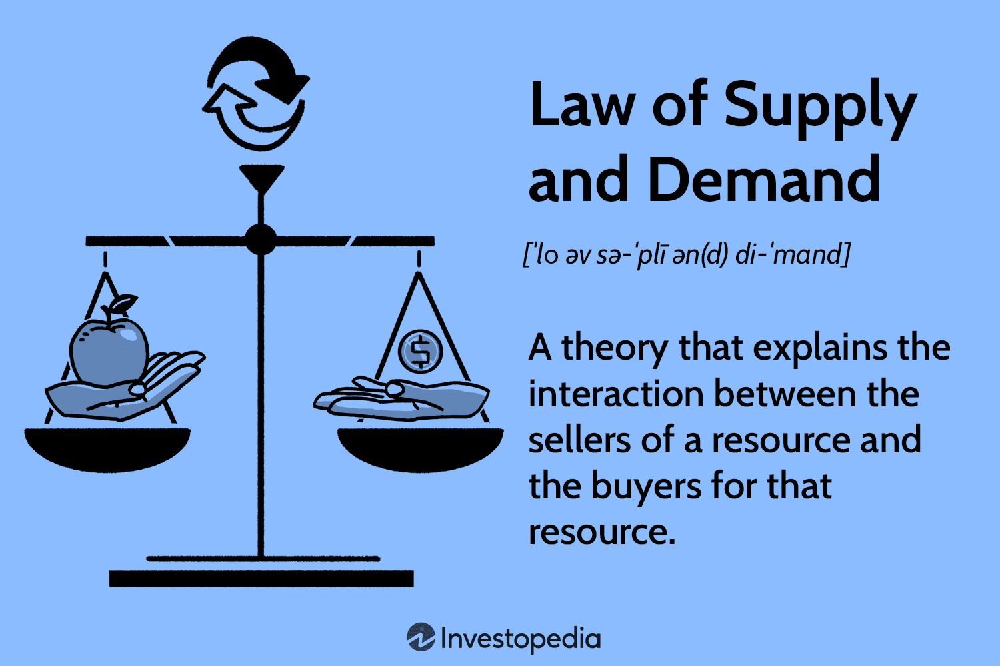

In the evolving landscape of financial markets, supply and demand economics is fundamental in shaping trading strategies. This principle, which dictates the price movement of assets, is critical for understanding market behavior. Supply represents the availability of an asset, while demand indicates the market's interest in acquiring it. These dynamics create price fluctuations, influencing trader decisions and strategies.

Algorithmic trading, a sophisticated approach to executing trades, utilizes computer programs to apply predefined criteria at high velocities. By incorporating supply and demand mathematics, algorithmic trading can discern patterns and capitalize on market opportunities quickly and efficiently. This integration enhances a trader's ability to make informed decisions, providing strategic advantages in executing trades at optimal prices.



Furthermore, this article explores the role of supply and demand within algorithmic trading frameworks and examines its contribution to strategic decision-making. Through leveraging these economic insights, traders are positioned to gain a considerable edge in the competitive financial landscape.

## Table of Contents

## Understanding Supply and Demand Economics

Supply and demand are fundamental concepts in economics that play a crucial role in determining the prices of assets in financial markets. These principles are based on the interactions between what purchasers are willing and able to buy and what sellers are willing and able to sell, given a certain price.

**Supply** refers to the total amount of a specific asset that is available to the market. It is typically influenced by various factors including production capacity, technological advancements, input costs, and the number of suppliers. The law of supply posits that, ceteris paribus, an increase in the price of an asset will lead to an increase in the quantity supplied, as producers are more willing to supply more to take advantage of higher prices. Conversely, a decrease in price usually results in a decrease in the quantity supplied.

**Demand**, on the other hand, refers to consumers' willingness and ability to purchase a given asset at different price levels. The law of demand states that, ceteris paribus, an increase in the price of an asset will lead to a decrease in the quantity demanded, while a decrease in price will lead to an increase in the quantity demanded. Demand is affected by several factors, such as consumer preferences, income levels, substitutes, and complementary goods.

The interaction between supply and demand determines the market price of an asset at the point where the quantity supplied equals the quantity demanded, known as the equilibrium. When there is a surplus (supply exceeds demand), prices tend to decrease until equilibrium is restored. Conversely, when there is a shortage (demand exceeds supply), prices generally rise until equilibrium is achieved.

Traders and investors closely study these dynamics to anticipate changes in market prices and identify potential trading opportunities. By analyzing supply and demand, they can gauge market sentiment and predict price movements, thereby better timing their trades. Understanding these principles helps in decoding price trends, market cycles, and potential reversals.

This economic understanding is crucial for developing effective strategies in trading and investments. By aligning trades with expected changes in supply and demand, market participants can achieve more efficient price discovery and possibly gain a competitive advantage in the financial markets.

## Algorithmic Trading: An Overview

Algorithmic trading encompasses the use of sophisticated computer algorithms designed to execute trades automatically at speeds unattainable by human traders. By relying on predefined criteria, these algorithms are programmed to analyze market data and execute transactions when specified conditions are met. The primary advantage of [algorithmic trading](/wiki/algorithmic-trading) lies in its efficiency and timing, which enable traders to take advantage of fleeting price discrepancies before they disappear.

One significant benefit of algorithmic trading is its ability to minimize human error. By automating trading processes, it reduces the emotional influences that typically affect trading decisions, such as fear and overconfidence. Instead, trades are executed based on objective data analysis and set parameters, ensuring consistency in decision-making.

Various strategies are employed in algorithmic trading, ranging from simple to complex. A widely used approach involves simple technical indicators, such as moving averages, which provide signals based on historical price data. For instance, a basic algorithm might buy a stock when its 50-day moving average surpasses its 200-day moving average, indicating a potential upward trend.

More advanced strategies incorporate complex statistical models and [artificial intelligence](/wiki/ai-artificial-intelligence) (AI) technologies. Statistical [arbitrage](/wiki/arbitrage), for instance, uses quantitative models to identify and exploit price inefficiencies between related financial instruments. AI and [machine learning](/wiki/machine-learning) models learn from historical market data, constantly adapting and refining their predictions to identify trading opportunities. These models can incorporate vast and varied datasets, enabling a deeper understanding of market dynamics and enhancing predictive accuracy.

The integration of market indicators and machine learning models also allows developers to create hybrid strategies, leveraging the benefits of both. These hybrid algorithms can dynamically adjust their parameters based on real-time data, which increases their agility in rapidly changing market conditions.

Algorithmic trading systems require high-speed data processing and superior computational resources due to their reliance on real-time data. This necessitates robust infrastructure, including low latency networks and powerful computing capabilities, enabling them to process large volumes of data swiftly and execute trades in milliseconds.

Overall, algorithmic trading represents a blend of technology and finance, marrying advanced computational methods with market analysis. As data analysis techniques and computing power become increasingly sophisticated, algorithmic trading strategies continue to evolve, offering new opportunities for efficiency and profit in financial markets.

## Integrating Supply-Demand Economics in Algo Trading Strategies

Algorithms used in trading integrate supply-demand economics to more precisely anticipate price movements, a crucial step in developing effective trading strategies. Sophisticated algorithms analyze order flows, price levels, and market [volatility](/wiki/volatility-trading-strategies) to identify trading opportunities. By evaluating order flows, algorithms ascertain the [volume](/wiki/volume-trading-strategy) of buy and sell orders over time, which provides insights into market sentiment and potential price direction. For example, an increase in buy orders compared to sell orders may indicate rising demand for an asset, potentially driving prices higher. Conversely, a predominance of sell orders can signal increased supply and a possible decline in prices.

Price levels, such as support and resistance, are critical in determining entry and [exit](/wiki/exit-strategy) points. Support levels, where demand is strong enough to prevent further price declines, are identified as potential buying opportunities. Resistance levels, conversely, where selling pressure may limit price increases, can signal opportunities to sell or short an asset. Effective use of these levels allows algorithms to execute trades that exploit price reversals or breakouts.

Market volatility is another crucial [factor](/wiki/factor-investing) considered by algorithms. High market volatility often leads to wider price fluctuations, presenting both risks and opportunities. Algorithms quantify this volatility using measures such as the standard deviation of price changes, allowing them to dynamically adjust trading strategies for optimal risk-reward balance.

Machine learning models further enhance these strategies by adapting to new data and refining predictive capabilities. By continuously learning from market data, machine learning algorithms detect patterns and trends that may not be readily apparent through traditional methods. These models employ techniques such as supervised learning for parameter optimization and unsupervised learning to discover underlying market structures.

For instance, a machine learning model might be trained using historical price data and order flows to predict future price movements. The algorithm may utilize a regression model where $Y$ represents future prices, and input features $X$ include past prices, volume, and volatility metrics. The model predicts $Y$ by minimizing the error $E$ between predicted and actual prices:

$$
E = \sum (Y_{\text{predicted}} - Y_{\text{actual}})^2
$$

Python, equipped with libraries like scikit-learn and TensorFlow, is commonly used to implement such models. A basic machine learning model for price prediction might be set up as follows:

```python
from sklearn.model_selection import train_test_split
from sklearn.linear_model import LinearRegression
from sklearn.metrics import mean_squared_error
import numpy as np

# Example data: Historical price, volume, and volatility
X = np.array([[...], [...], ...])
Y = np.array([...])

# Split data into training and testing sets
X_train, X_test, Y_train, Y_test = train_test_split(X, Y, test_size=0.2, random_state=42)

# Initialize and train the model
model = LinearRegression()
model.fit(X_train, Y_train)

# Predict future prices
Y_pred = model.predict(X_test)

# Evaluate the model
mse = mean_squared_error(Y_test, Y_pred)
print(f"Mean Squared Error: {mse}")
```

By combining these computational strategies, algorithms provide traders with tools necessary to make informed trading decisions based on supply-demand economics, ultimately enabling more accurate predictions and successful trade executions.

## Challenges and Risks in Algorithmic Trading

Algorithmic trading faces several significant challenges and risks that can impact its effectiveness and reliability. One of the primary concerns is data inaccuracies. The accuracy of data is crucial because algorithms base their trading decisions on historical and real-time data. Inconsistent or incorrect data can lead to erroneous trades and significant financial losses. Additionally, the vast amounts of data processed by trading algorithms necessitate sophisticated data management techniques to ensure integrity and consistency.

Model overfitting represents another substantial risk. Overfitting occurs when an algorithm is tailored too closely to historical data, capturing noise rather than the underlying market trends. This leads to poor performance in live trading environments, where the market conditions differ from the dataset the model was trained on. To mitigate overfitting, model validation techniques, such as cross-validation and [backtesting](/wiki/backtesting) on out-of-sample data, are essential. Regular updates and retraining of models also help to ensure they remain effective under changing market conditions.

Unexpected market behavior introduces further complexity. Financial markets are influenced by myriad factors, including geopolitical events, economic announcements, and collective investor behaviors, which are often unpredictable. Algorithms must adapt to these factors swiftly to avoid substantial losses. Developing algorithms with adaptive features can help in responding to unprecedented market shifts.

Regulatory changes also pose challenges to algorithmic traders. Financial markets are subject to regulations that ensure fair trading practices and market stability. However, as regulatory environments evolve, algorithms may require modifications to comply with new rules. Non-compliance can result in penalties or trading restrictions. Maintaining compliance requires developers to incorporate adaptability and flexibility in algorithm design, with ongoing monitoring of regulatory updates.

Effective risk management and continuous monitoring are vital to address these challenges successfully. Incorporating risk management protocols such as stop-loss orders and position size limits can reduce potential losses. Continuous monitoring allows for real-time assessment and optimization of algorithm performance, ensuring that it responds appropriately to any anomalies or disruptions in the market.

Combining these strategies ensures a robust and reliable algorithmic trading system, capable of navigating the complex and dynamic landscape of financial markets.

## Future Trends in Algorithmic Trading and Supply-Demand Economics

Advancements in artificial intelligence (AI) and machine learning are poised to significantly enhance algorithmic trading capabilities. These technologies offer improved predictive accuracy by processing vast datasets and identifying subtle patterns that human traders might overlook. Machine learning algorithms, particularly those involving [deep learning](/wiki/deep-learning) and [reinforcement learning](/wiki/reinforcement-learning), are well-suited for making nuanced predictions based on historical data, market sentiments, and real-time news feeds.

Big data analytics is transforming the landscape of supply-demand economics by providing comprehensive insights into market dynamics. With the sheer volume of data generated by modern markets, traditional data processing techniques fall short. Enhanced computing power now allows traders to analyze large-scale data in near real-time, facilitating more informed decision-making processes. For example, using Python's libraries such as Pandas and NumPy for data manipulation, along with machine learning frameworks like TensorFlow and scikit-learn, traders can build robust models for forecasting market trends:

```python
import pandas as pd
from sklearn.model_selection import train_test_split
from sklearn.ensemble import RandomForestRegressor

# Load market data
data = pd.read_csv('market_data.csv')

# Feature selection and preprocessing
X = data[['feature1', 'feature2', 'feature3']]
y = data['asset_price']

# Split data into training and test sets
X_train, X_test, y_train, y_test = train_test_split(X, y, test_size=0.2, random_state=42)

# Train a random forest model
model = RandomForestRegressor(n_estimators=100, random_state=42)
model.fit(X_train, y_train)

# Predict and assess model performance
predictions = model.predict(X_test)
```

Moreover, collaborative efforts among economists, data scientists, and traders are proving crucial in driving innovation in this field. Interdisciplinary collaborations enable the integration of economic theory with advanced data analytics tools, leading to more sophisticated and holistic trading strategies. These partnerships help in refining algorithms to better account for complex market behaviors, regulatory changes, and emerging financial trends.

The integration of AI, big data, and interdisciplinary collaboration is expected to redefine the future of algorithmic trading, making it more adaptive and resilient in rapidly changing markets. As these technologies continue to evolve, they will likely open new frontiers for predicting market behavior, managing risk, and optimizing trading performance.

## Conclusion

The integration of supply-demand economics into algorithmic trading offers substantial strategic opportunities by enhancing decision-making processes with precise market analytics. This fusion allows traders to navigate the complexities of financial markets more effectively, capitalizing on nuances in price fluctuations driven by supply-demand dynamics. Successful application in this domain requires a careful balance between economic expertise and cutting-edge technology. It is essential for traders to have a thorough understanding of market mechanics while leveraging advanced algorithms and computational tools to gain a competitive edge.

Moreover, continuous adaptation to market conditions and regulatory changes is critical for the sustained success of algorithmic trading. Market behaviors are influenced by a myriad of factors including geopolitical events, economic policies, and technological advancements. Adapting to these changes necessitates an agile approach where algorithms are periodically refined to accommodate new data and strategies. Additionally, the regulatory landscape is evolving with increased scrutiny on algorithmic trading practices, requiring compliance with stringent laws to mitigate systemic risks.

To ensure robustness, traders must employ effective risk management strategies and foster an environment of continuous learning and innovation. Collaborating with economists, data scientists, and technologists can cultivate a holistic understanding of market trends and the development of more resilient algorithms. The advancement of AI and machine learning further strengthens these capabilities, providing deeper insights and more adaptable trading models.

Ultimately, the future success of algorithmic trading hinges on the ability to seamlessly integrate economic theory with technological precision while remaining responsive to the dynamic nature of global financial markets. This synergy not only maximizes trading efficacy but also positions traders to better anticipate and shape market movements.

## References & Further Reading

[1]: Bergstra, J., Bardenet, R., Bengio, Y., & Kégl, B. (2011). ["Algorithms for Hyper-Parameter Optimization."](https://dl.acm.org/doi/10.5555/2986459.2986743) Advances in Neural Information Processing Systems 24.

[2]: Lopez de Prado, M. (2018). ["Advances in Financial Machine Learning."](https://www.amazon.com/Advances-Financial-Machine-Learning-Marcos/dp/1119482089) Wiley.

[3]: Aronson, D. (2007). ["Evidence-Based Technical Analysis: Applying the Scientific Method and Statistical Inference to Trading Signals."](https://www.amazon.com/Evidence-Based-Technical-Analysis-Scientific-Statistical/dp/0470008741) Wiley.

[4]: Jansen, S. (2020). ["Machine Learning for Algorithmic Trading."](https://github.com/stefan-jansen/machine-learning-for-trading) Packt Publishing.

[5]: Chan, E. P. (2008). ["Quantitative Trading: How to Build Your Own Algorithmic Trading Business."](https://github.com/ftvision/quant_trading_echan_book) Wiley.