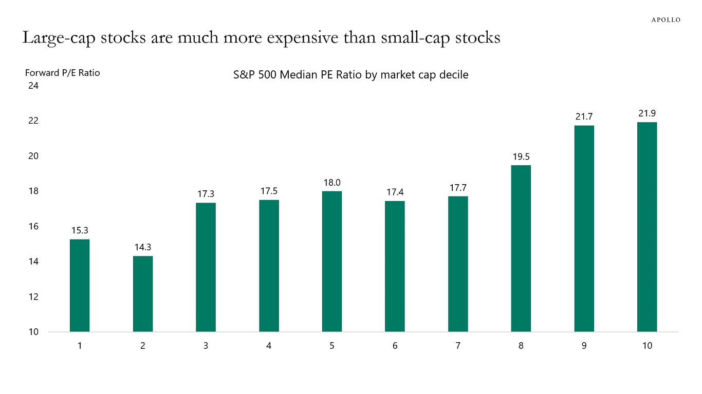

## Table of Contents

## What are small cap stocks and how do they differ from large cap stocks?

Small cap stocks are shares in companies that have a relatively small market capitalization, usually between $300 million and $2 billion. These companies are often younger and have more potential for growth compared to larger, more established companies. Because they are smaller, they can be riskier investments, as they might not have as much financial stability or as many resources as bigger companies. However, this also means that if they do well, the returns for investors can be much higher.

Large cap stocks, on the other hand, are shares in companies with a market capitalization of $10 billion or more. These companies are typically well-known, established businesses with a long history of performance. They tend to be more stable and less risky than small cap stocks because they have more resources and a broader base of operations. While the potential for high growth might not be as great as with small cap stocks, large cap stocks can still offer steady, reliable returns over time.

In summary, the main difference between small cap and large cap stocks lies in their size, stability, and growth potential. Small cap stocks are smaller, riskier, and have higher growth potential, while large cap stocks are larger, more stable, and offer more reliable but potentially lower growth. Investors choose between them based on their risk tolerance and investment goals.

## How can one measure the risk associated with small cap and large cap stocks?

Measuring the risk of small cap and large cap stocks can be done by looking at a few key things. One way is to check the stock's [volatility](/wiki/volatility-trading-strategies), which means how much the stock's price goes up and down. Small cap stocks usually have more ups and downs, making them riskier. Another way is to look at the company's financial health. Small cap companies might not have as much money saved up or as many ways to make money, so they can be riskier if things go wrong. Large cap stocks tend to be less risky because they have more money and more ways to make money, so their stock prices don't swing as wildly.

Another important measure is the beta of a stock, which tells you how much the stock moves compared to the overall market. A stock with a high beta, which is more common with small cap stocks, moves a lot more than the market, making it riskier. A stock with a low beta, often seen with large cap stocks, moves less than the market, making it less risky. Lastly, you can look at the company's track record. Large cap companies usually have a longer history of steady performance, which can make them seem safer. Small cap companies might not have as much history, so it's harder to predict how they will do in the future, adding to their risk.

## What are the historical performance differences between small cap and large cap stocks?

Historically, small cap stocks have often shown higher returns than large cap stocks over the long term. This is because small companies can grow much faster than big ones. For example, a small tech company might become very successful and grow a lot, making its stock price go up a lot. But, this higher potential for growth comes with more risk. Small cap stocks can be more up and down, and they might lose a lot of value if the company doesn't do well. Studies have shown that over many years, small cap stocks have beaten large cap stocks in terms of returns, but they have also had bigger drops during bad times.

On the other hand, large cap stocks have been more stable and less risky. Big companies like Apple or Microsoft have lots of money and many ways to make money, so their stock prices don't swing as wildly. They might not grow as fast as small companies, but they are less likely to lose a lot of value suddenly. Over the years, large cap stocks have given steady returns, which can be good for people who don't want to take big risks. During economic downturns, large cap stocks often do better than small cap stocks because they have more resources to weather tough times.

## What are the key factors that contribute to the risk in small cap stocks?

Small cap stocks are riskier than large cap stocks mainly because they are smaller companies with less money and fewer ways to make money. These companies might not have a lot of cash saved up, so if something goes wrong, they can have a hard time staying afloat. They also might not have as many different products or services, so if one thing doesn't work out, it can hurt them a lot. Plus, because they are smaller, they might not have as much information available about them, making it harder for investors to know if they are a good investment.

Another big [factor](/wiki/factor-investing) is that small cap stocks can go up and down a lot more than large cap stocks. This is because they are more sensitive to changes in the market or the economy. If there's a bit of bad news or a small problem, their stock price can drop a lot. Also, because they are smaller, they might not have as much power to get good deals or borrow money easily, which adds to their risk. All these things together mean that while small cap stocks can grow a lot and make investors a lot of money, they also have a higher chance of losing value quickly.

## How do market conditions affect the risk levels of small cap versus large cap stocks?

Market conditions can really change how risky small cap and large cap stocks are. When the economy is doing well and people feel good about spending money, small cap stocks can do better than large cap stocks. This is because smaller companies can grow fast when things are going well. But, if the market starts to go down or there's a lot of uncertainty, small cap stocks can get hit hard. They don't have as much money saved up or as many ways to make money, so they can lose value quickly when times get tough.

On the other hand, large cap stocks are usually more stable no matter what the market is doing. Big companies have more money and more ways to make money, so they can handle tough times better. If the market goes down, large cap stocks might not lose as much value as small cap stocks. But, when the market is doing really well, large cap stocks might not grow as fast as small cap stocks because they are already big and it's harder for them to keep growing at a fast pace. So, market conditions can make small cap stocks riskier but also more rewarding when things are good, while large cap stocks are safer but might not grow as much.

## What role does diversification play in managing risks associated with small cap and large cap stocks?

Diversification is a way to spread out your money in different investments to lower the risk. When you invest in both small cap and large cap stocks, you're not putting all your eggs in one basket. Small cap stocks can be riskier because they go up and down a lot, but they can also grow a lot when things are good. Large cap stocks are more stable but might not grow as fast. By having some of both, you can balance out the ups and downs. If small cap stocks are doing badly because the market is tough, your large cap stocks might not lose as much value, helping to keep your overall investment safer.

Having a mix of small cap and large cap stocks can also help you take advantage of different market conditions. When the economy is doing well, your small cap stocks might do better and grow a lot, while your large cap stocks keep things steady. But if the market goes down, your large cap stocks might not lose as much value, helping to protect your money. This way, diversification helps you manage risk by making sure you're not too dependent on one type of stock, letting you enjoy the growth of small caps while using large caps to keep things more stable.

## How do liquidity issues impact the risk of investing in small cap stocks compared to large cap stocks?

Liquidity means how easy it is to buy or sell a stock without affecting its price a lot. Small cap stocks usually have less [liquidity](/wiki/liquidity-risk-premium) than large cap stocks. This is because fewer people are buying and selling them, so when you want to sell a small cap stock, you might have to wait longer or sell it for less money than you want. This can make small cap stocks riskier. If you need to get your money out quickly and the market for the stock isn't very active, you might not be able to sell your shares when you want to, or you might have to sell them at a lower price.

Large cap stocks, on the other hand, have a lot more people buying and selling them all the time. This means you can usually sell your shares quickly and at a price close to what you expect. Because large cap stocks are more liquid, they are less risky in this way. If the market goes down and you need to sell, you're more likely to be able to do so without losing a lot of money just because you can't find a buyer. So, liquidity issues make small cap stocks riskier than large cap stocks, especially if you might need to sell your investments in a hurry.

## What are the volatility patterns observed in small cap and large cap stocks over different economic cycles?

Small cap stocks tend to be more volatile than large cap stocks across different economic cycles. When the economy is doing well and growing, small cap stocks can go up a lot because smaller companies can grow faster than big ones. But, when the economy starts to slow down or go into a recession, small cap stocks can drop a lot more than large cap stocks. This is because small companies don't have as much money saved up or as many ways to make money, so they are hit harder by tough times. Investors might also sell small cap stocks first when they get worried about the economy, making their prices go down even more.

Large cap stocks are usually less volatile and more stable over different economic cycles. During good times, large cap stocks might not grow as fast as small cap stocks, but they still go up steadily. And when the economy is not doing well, large cap stocks don't lose as much value as small cap stocks. This is because big companies have more money and more ways to make money, so they can handle tough times better. Investors often see large cap stocks as safer places to put their money during uncertain times, which helps keep their prices more stable.

## How do regulatory changes influence the risk profiles of small cap and large cap stocks?

Regulatory changes can affect small cap and large cap stocks differently. For small cap stocks, new rules can be a big deal. Small companies might not have as much money or people to handle new regulations easily. If a new rule comes out, it might cost them a lot to follow it, or it might make it harder for them to do business. This can make their stock prices go down because investors get worried about how the company will do with the new rules. So, regulatory changes can make small cap stocks riskier because they might not have the resources to deal with them well.

On the other hand, large cap stocks usually handle regulatory changes better. Big companies have more money and people to help them follow new rules. They can also use their size to influence how new regulations are made or to find ways around them. Because of this, new rules might not hurt their business as much. Their stock prices might not go down as much when there are regulatory changes, making them less risky. So, while all companies have to deal with new rules, large cap stocks are usually in a better position to handle them without big problems.

## What advanced statistical methods can be used to perform a comparative risk analysis of small cap and large cap stocks?

To compare the risks of small cap and large cap stocks, you can use a statistical method called regression analysis. This method helps you see how different things, like the size of a company or how the economy is doing, affect stock prices. By looking at a lot of data over time, regression analysis can show you how much more risky small cap stocks are compared to large cap stocks. It can also tell you how much of the ups and downs in stock prices are because of the company's size and how much is because of other things like the economy or interest rates.

Another useful method is called Value at Risk (VaR). This method helps you figure out the most money you could lose on an investment over a certain time, like a day or a month, with a certain level of confidence, like 95%. By using VaR, you can see how much riskier small cap stocks are compared to large cap stocks. Small cap stocks usually have a higher VaR, which means you could lose more money with them than with large cap stocks. This helps investors understand and compare the risks of different types of stocks in a clear way.

## How do sector-specific risks affect the comparative analysis of small cap versus large cap stocks?

Sector-specific risks can change how risky small cap and large cap stocks seem when you compare them. Different sectors, like technology or healthcare, have their own special problems and chances. For example, if you're looking at tech stocks, small cap tech companies might be working on new ideas that could be big hits or big flops. This makes them riskier than big tech companies that already have a lot of products and customers. But if you're looking at a sector like utilities, where things don't change as fast, small cap and large cap stocks might not seem as different in terms of risk.

When you compare small cap and large cap stocks within the same sector, you need to think about how the sector's problems and chances affect each type of company differently. Small cap companies in any sector might not have as much money or as many ways to make money, so they can be hit harder by sector-specific problems. For example, if there's a new rule that makes it harder for companies in a certain sector to do business, small cap companies might struggle more to follow it. But large cap companies in the same sector might have more resources to handle the new rule, making them seem less risky. So, when you're comparing small cap and large cap stocks, it's important to look at how the sector they're in affects their risk.

## What are the implications of behavioral finance on the risk perception and investment decisions in small cap and large cap stocks?

Behavioral finance looks at how people's feelings and thinking can affect how they see risk and make choices about investing. When it comes to small cap and large cap stocks, these feelings can make a big difference. Small cap stocks can seem really exciting because they might grow a lot, but they can also be scary because they go up and down a lot. People might be more likely to buy small cap stocks when they feel good about the economy and want to take chances. But if they're worried, they might sell these stocks quickly, even if it's not the best time, because they don't want to lose money. This can make small cap stocks seem even riskier than they really are.

On the other hand, large cap stocks can seem safer because they don't go up and down as much. People might feel more comfortable putting their money in large cap stocks because they think they're less risky. But sometimes, this feeling of safety can make people too confident. They might not pay attention to signs that a big company could be in trouble, just because it's a big name. So, while large cap stocks might be less risky in some ways, people's feelings can still lead them to make choices that aren't the best. Understanding how feelings affect investment choices can help people make better decisions about small cap and large cap stocks.

## References & Further Reading

[1]: Bergstra, J., Bardenet, R., Bengio, Y., & Kégl, B. (2011). ["Algorithms for Hyper-Parameter Optimization."](https://dl.acm.org/doi/10.5555/2986459.2986743) Advances in Neural Information Processing Systems 24.

[2]: ["Advances in Financial Machine Learning"](https://www.amazon.com/Advances-Financial-Machine-Learning-Marcos/dp/1119482089) by Marcos Lopez de Prado

[3]: ["Evidence-Based Technical Analysis: Applying the Scientific Method and Statistical Inference to Trading Signals"](https://www.amazon.com/Evidence-Based-Technical-Analysis-Scientific-Statistical/dp/0470008741) by David Aronson

[4]: ["Machine Learning for Algorithmic Trading"](https://github.com/stefan-jansen/machine-learning-for-trading) by Stefan Jansen

[5]: ["Quantitative Trading: How to Build Your Own Algorithmic Trading Business"](https://www.amazon.com/Quantitative-Trading-Build-Algorithmic-Business/dp/1119800064) by Ernest P. Chan