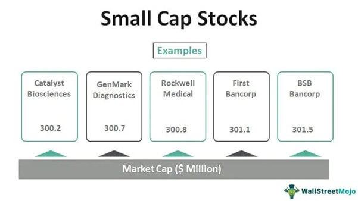

Understanding investment risks is crucial for any investor looking to gain a foothold in the stock market. The stock market, with its inherent volatility, presents a myriad of investment options, each with distinct risk profiles and potential rewards. This article explores the risks associated with investing in small-cap stocks, large-cap stocks, and the role of algorithmic trading. Each category of investment offers unique advantages and challenges, reflecting differences in market capitalization, growth potential, and stability.

Small-cap stocks represent companies with a market capitalization ranging from $300 million to $2 billion. They are often seen as vehicles for rapid growth, offering investors the potential for substantial returns. However, their growth comes with heightened volatility and risk, as these companies may face greater financial instability and operational challenges. In contrast, large-cap stocks belong to well-established companies with market capitalizations typically exceeding $10 billion. These stocks are generally viewed as safer, more stable investments, characterized by slower, more predictable growth.



The focus will be on elucidating these aspects to help investors make more informed decisions. Investors must weigh the faster growth possibilities of small-cap stocks against their instability and the stability of large-cap stocks against their slower growth rates. By understanding these dynamics, investors can tailor their portfolios to align with their risk tolerance and financial goals.

Technological advancements like algorithmic trading also significantly influence the landscape of investments, offering both opportunities and risks. Algorithmic trading employs computer algorithms to execute trades with speed and precision, potentially capitalizing on market fluctuations. While this technology can enhance trading efficiency, it also poses challenges related to market unpredictability and the need for constant strategy refinement. The interplay between traditional stock investment and algorithmic trading underscores the complexities investors face today.

In summary, comprehending the nuances of small-cap and large-cap stock investments, alongside the strategic application of algorithmic trading, can empower investors to navigate the multifaceted stock market more effectively. Through informed decision-making and strategic portfolio management, investors can optimize their investment outcomes amidst the evolving market terrain.

## Table of Contents

## Understanding Small-Cap and Large-Cap Stocks

Small-cap and large-cap stocks represent different segments of the equity market and are distinguished primarily by their market capitalization, which is the total market value of a company's outstanding shares. 

Small-cap stocks are typically defined as companies with a market capitalization ranging from $300 million to $2 billion. These companies are often in the growth phase of their business cycle, which may provide investors with substantial growth opportunities. However, this potential for higher returns comes with increased [volatility](/wiki/volatility-trading-strategies). The relatively smaller size of these companies makes them more susceptible to market fluctuations, economic downturns, and operational challenges. Additionally, small-cap stocks often have lower [liquidity](/wiki/liquidity-risk-premium), meaning there are fewer shares traded on a regular basis, which can make it challenging to execute large buy or sell orders without affecting the stock price.

In contrast, large-cap stocks are usually well-established companies with a market capitalization exceeding $10 billion. These companies often have a significant track record, strong brand recognition, and a global presence. Large-cap stocks are generally perceived as more stable and less volatile compared to small-cap stocks, offering a sense of security to investors. This stability is often linked to their diverse revenue streams and the financial flexibility larger companies possess. However, the trade-off for this stability is typically slower growth, as large-cap companies may have already capitalized on major growth opportunities, leaving less room for rapid expansion. 

Investors typically consider a balance between these two types of stocks based on their risk tolerance, investment goals, and market conditions. A portfolio that includes both small-cap and large-cap stocks can potentially offer a blend of growth and stability, catering to diverse investment strategies.

## Investment Risks: Small-Cap vs Large-Cap Stocks

Small-cap stocks, typically defined by a market capitalization ranging from $300 million to $2 billion, often present significant investment risks primarily due to their lack of liquidity. Low liquidity can lead to difficulties in executing trades quickly, sometimes causing substantial price changes when a large [volume](/wiki/volume-trading-strategy) of shares is traded. This, in turn, can increase the cost of trading and can result in higher bid-ask spreads, affecting overall investment returns.

Another critical risk [factor](/wiki/factor-investing) for small-cap stocks is their limited access to capital. Smaller companies may have fewer financing options available, making them more vulnerable to economic downturns and operational disruptions. This can lead to higher volatility, as these companies may struggle to maintain consistent revenue streams or expand their operations efficiently.

Conversely, large-cap stocks, which are companies with market capitalizations exceeding $10 billion, generally offer more stability due to their established market positions and broader access to capital. These companies are often perceived as safer investments, thanks to their ability to weather economic fluctuations and access various financial resources.

However, this stability may come at the cost of growth potential. Large-cap companies often face challenges in capitalizing on emerging growth opportunities as effectively as smaller, more agile companies. The expansive size and established market presence of large-cap stocks can lead to slower growth rates compared to their small-cap counterparts, which may have more room to expand in niche markets or emerging sectors.

Historically, the greater volatility of small-cap stocks has impacted both their expected returns and predictability. While small-cap stocks have the potential to deliver higher returns due to their growth opportunities, this comes with increased risk. As a result, investors need to weigh the potential for higher returns against the likelihood of increased portfolio volatility. A balanced investment strategy might therefore involve a diversified mix of both small-cap and large-cap stocks to optimize the risk-return profile.

## Algorithmic Trading in the Stock Market

Algorithmic trading involves the use of computer algorithms to execute trading strategies with speed and precision that surpass human capabilities. By automating the trading process, [algorithmic trading](/wiki/algorithmic-trading) mitigates the risk of human error, ensuring more consistent and reliable execution of trades. One significant advantage is the ability to analyze large volumes of market data swiftly, enabling traders to identify patterns and opportunities that may not be immediately evident through manual analysis.

The primary mechanism of algorithmic trading is its algorithm—a defined set of rules that dictate when and how trades should be executed. These rules are based on market signals derived from technical analysis, statistical models, or [machine learning](/wiki/machine-learning) techniques. For instance, a simple moving average crossover strategy can be automated to buy an asset when a short-term moving average crosses above a long-term moving average, and sell when it crosses below.

Algorithmic trading is particularly effective in leveraging the volatility characteristic of small-cap stocks, which are known for more frequent price fluctuations compared to their large-cap counterparts. This volatility can be harnessed through algorithms designed to exploit short-term price movements, thereby creating opportunities for profit. For example, an algorithm might employ a "mean reversion" strategy, which assumes that stock prices will revert to their historical mean over time. In volatile markets, such deviations from the mean are more pronounced, allowing algorithms to capitalize on the subsequent price corrections.

Python, with libraries such as NumPy and pandas, is extensively used to develop and test trading algorithms. Consider this simple Python example that illustrates a moving average crossover strategy:

```python
import pandas as pd

def moving_average_crossover(data, short_window, long_window):
    data['Short_Mavg'] = data['Close'].rolling(window=short_window, min_periods=1).mean()
    data['Long_Mavg'] = data['Close'].rolling(window=long_window, min_periods=1).mean()
    data['Signal'] = 0

    # Generate signals
    data['Signal'][short_window:] = np.where(data['Short_Mavg'][short_window:] > data['Long_Mavg'][short_window:], 1, 0)
    data['Position'] = data['Signal'].diff()

    return data

# Example usage
historical_data = pd.DataFrame({'Close': [ ... ]})  # Assuming this is your historical price data
strategy_data = moving_average_crossover(historical_data, short_window=40, long_window=100)
print(strategy_data[['Close', 'Short_Mavg', 'Long_Mavg', 'Signal', 'Position']])
```

This code computes short and long-term moving averages and generates trading signals based on their crossover, highlighting the ease with which Python can be applied to algorithmic trading.

While algorithmic trading offers numerous benefits, including rapid execution and reduced emotional trading, it also requires sophisticated risk management techniques to address challenges such as market liquidity and slippage. As market conditions evolve, strategies need frequent back-testing and refinement to remain effective.

## Benefits of Algorithmic Trading with Small-Cap Stocks

Algorithmic trading offers significant advantages when dealing with small-cap stocks, primarily due to the volatility and liquidity characteristics inherent in these stocks. Small-cap stocks are known for their price fluctuations, which create numerous trading opportunities that algorithms can exploit efficiently.

Utilizing advanced liquidity models, algorithms can optimize trade execution, thereby minimizing market impact. This is achieved through techniques such as volume-weighted average price (VWAP) and time-weighted average price (TWAP), which help in dispersing large orders over time to diminish price distortion. For example, the VWAP algorithm divides an order into small slices, executing them incrementally, based on the stock's historical trading pattern:

```python
import numpy as np

def vwap(prices, volumes):
    return np.sum(prices * volumes) / np.sum(volumes)

prices = np.array([100, 102, 101, 105])
volumes = np.array([30, 20, 40, 10])
print(vwap(prices, volumes))  # Example output: 101.2
```

Such strategies ensure that trading activities do not significantly alter the market price, which is crucial for small-cap stocks that may suffer from reduced liquidity.

Furthermore, algorithmic strategies enhance portfolio diversification benefits. Given that small-cap stocks have different risk and return profiles compared to large-cap stocks, they offer diversification potential that can reduce portfolio risk. Algorithms can effectively rebalance portfolios by assessing correlations and volatilities among various stocks, automatically adjusting the composition to exploit the most favorable conditions.

In addition, algorithms are capable of adapting rapidly to market changes by utilizing real-time data analysis, thereby allowing traders to capitalize on short-term volatility more effectively than human traders. This capacity to analyze and act on market data swiftly can result in capturing lucrative opportunities that manual trading may miss, contributing to higher potential returns.

Overall, the intersection of algorithmic trading with small-cap stocks provides a robust framework for traders and investors aiming to enhance their trading performance through superior execution strategies and diversification.

## Challenges and Risks of Algorithmic Trading

Algorithmic trading, despite its transformative potential, encounters distinct challenges and risks, particularly when dealing with small-cap stocks. Small-cap stocks, characterized by lower liquidity, are prone to significant price fluctuations. This volatility increases the risk of slippage, which occurs when the execution price of a trade deviates from its expected price due to market movements. In highly volatile environments, such as those often found with small-cap stocks, slippage can erode profitability or amplify losses. 

Adapting trading algorithms to the dynamic market conditions is another significant challenge in algorithmic trading. The stock market is a complex and constantly evolving ecosystem, and algorithms must be agile to maintain their efficacy. This necessitates continuous refinement and evaluation of trading algorithms. Traders and developers need to frequently update models to integrate the most recent market data and trends, ensuring that algorithms remain relevant and competitive.

The refinement process often involves [backtesting](/wiki/backtesting), which assesses the viability of a trading strategy by applying it to historical data. However, this can create a risk of overfitting, where the algorithm becomes too tailored to past data and loses its predictive power for future trading scenarios. To mitigate this, regular updates and real-time data analysis are crucial. Utilizing machine learning techniques can aid in enhancing the adaptability of algorithms by allowing them to learn and evolve based on new market patterns.

Evidence-based risk management strategies are essential when implementing algorithmic trading for small-cap stocks. This involves setting optimal stop-loss limits and employing volatility-adjustment mechanisms to prepare algorithms for unexpected market behavior. Such strategies can help maintain the robustness of algorithmic trading systems, ensuring they can withstand the inherent risks associated with lower liquidity and high volatility.

## Best Practices for Analyzing Investment Risks

Diversification of investments across small-cap and large-cap stocks is essential for managing risk. By distributing investments, investors can reduce exposure to the volatility associated with any single sector or asset class. A balanced portfolio might include a mix of small-cap stocks, known for their growth potential and volatility, and large-cap stocks, valued for stability and consistent returns. This balance helps mitigate risk arising from market fluctuations.

Continuous monitoring and updating of algorithmic models is crucial to ensure alignment with current market conditions. Algorithms that once produced optimal results may become obsolete as market dynamics evolve. To maintain efficacy, algorithmic models should be regularly assessed and refined. This process often involves backtesting strategies against historical data to evaluate performance and making necessary adjustments to adapt to current market trends.

Integration of machine learning and real-time data analysis can significantly enhance the functionality and adaptability of trading strategies. Machine learning algorithms can identify patterns in vast datasets that may not be visible through traditional analysis, allowing for more informed decision-making. For instance, using Python, a basic implementation of a machine learning model for stock prediction could involve libraries like `pandas`, `numpy`, and `scikit-learn`:

```python
import pandas as pd
import numpy as np
from sklearn.model_selection import train_test_split
from sklearn.ensemble import RandomForestRegressor

# Load stock data
data = pd.read_csv('stock_data.csv')

# Prepare features and target
X = data[['feature1', 'feature2', 'feature3']]  # example features
y = data['target']

# Split data into train and test sets
X_train, X_test, y_train, y_test = train_test_split(X, y, test_size=0.2, random_state=42)

# Initialize and train the model
model = RandomForestRegressor(n_estimators=100, random_state=42)
model.fit(X_train, y_train)

# Predict and evaluate
predictions = model.predict(X_test)
```

Real-time data analysis further amplifies trading strategies by ensuring decisions are made based on the latest market conditions. This agility allows traders to respond promptly to market movements, optimizing the timing and execution of trades.

By incorporating these practices, investors can better manage risk and enhance their trading strategies, leveraging the strengths of both human insight and technological advancements to achieve favorable investment outcomes.

## Conclusion

Balancing the risks and rewards of investing in small-cap and large-cap stocks demands careful strategic planning and insightful decision-making. Small-cap stocks offer higher growth potential but come with elevated volatility and risk. Conversely, large-cap stocks provide stability with slower growth prospects. This dichotomy underlines the necessity of a nuanced approach where both opportunities and risks are thoroughly evaluated.

Algorithmic trading introduces a sophisticated method of navigating complex market conditions. It offers the ability to execute trades rapidly and accurately, exploiting market inefficiencies and volatility, particularly in small-cap stocks. Yet, the reliance on algorithms brings its own set of risks, such as the potential for significant price fluctuations and slippage due to low liquidity. Therefore, robust risk management practices are critical when utilizing algorithmic strategies.

Integrating advanced technology with classic investment principles—such as diversification, continuous risk assessment, and market analysis—forms the cornerstone of a well-rounded investment strategy. Diversification across asset classes mitigates individual investment risks and enhances portfolio stability. Continuous monitoring and adaptation of algorithmic models ensure alignment with current market conditions, improving decision-making and potential returns.

In essence, the successful navigation of small-cap and large-cap investment landscapes requires a blend of technological innovation and traditional investment strategies. By marrying diversification with algorithmic tools while maintaining rigorous market analysis, investors can optimize their portfolios to achieve a balance between risk and reward.

## References & Further Reading

[1]: Bergstra, J., Bardenet, R., Bengio, Y., & Kégl, B. (2011). ["Algorithms for Hyper-Parameter Optimization."](https://dl.acm.org/doi/10.5555/2986459.2986743) Advances in Neural Information Processing Systems 24.

[2]: ["Advances in Financial Machine Learning"](https://www.amazon.com/Advances-Financial-Machine-Learning-Marcos/dp/1119482089) by Marcos Lopez de Prado

[3]: ["Evidence-Based Technical Analysis: Applying the Scientific Method and Statistical Inference to Trading Signals"](https://www.amazon.com/Evidence-Based-Technical-Analysis-Scientific-Statistical/dp/0470008741) by David Aronson

[4]: ["Machine Learning for Algorithmic Trading"](https://github.com/stefan-jansen/machine-learning-for-trading) by Stefan Jansen

[5]: ["Quantitative Trading: How to Build Your Own Algorithmic Trading Business"](https://www.amazon.com/Quantitative-Trading-Build-Algorithmic-Business/dp/1119800064) by Ernest P. Chan