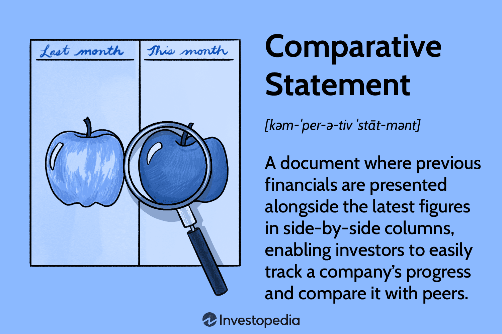

In the fast-paced world of finance and investment, understanding the nuances of financial analysis is crucial for success. Comparative statement analysis, a key tool in financial analysis, allows investors to track a company's progress over time and compare it with peers. This involves the evaluation of financial data, often by placing figures side-by-side over multiple time periods to detect trends and discrepancies. It helps stakeholders gain insights into the operational efficiency and financial stability of a company, driving better investment decisions.

With the rise of algorithmic trading—a method of executing trades using pre-set rules based on timing, price, or quantity—grasping these concepts has become even more relevant. Algorithmic trading relies on automation and analytics to swiftly navigate financial markets, demanding a robust understanding of financial fundamentals and patterns. Comparative analysis enriches these automated systems by providing structured, historical data that can be integrated into trading algorithms to enhance decision-making processes.

This article explores the types of financial statements that provide a comprehensive picture of a company's financial condition, the principles behind comparative statement analysis that empower stakeholders to evaluate performance, and its applications in algorithmic trading. By bridging traditional financial analysis with modern trading technologies, comparative statement analysis remains an indispensable tool for investors aiming to succeed in dynamic financial environments.

## Table of Contents

## Understanding Financial Statements

Financial statements are essential tools for evaluating a company's financial health. They offer a detailed account of an organization's economic activities and overall condition. The key financial statements include the income statement, balance sheet, cash flow statement, and statement of shareholders' equity. Each of these documents serves a distinct function in providing insights into various aspects of a company's financial performance.

### Income Statement
The income statement, also known as the profit and loss statement, details a company's revenues, expenses, and profits over a specific period. It provides insight into the company's operational efficiency and profitability. The formula often used to summarize the income statement is:

$$
\text{Net Income} = \text{Total Revenues} - \text{Total Expenses}
$$

This statement is crucial for understanding the company's ability to generate profit from its operations.

### Balance Sheet
The balance sheet offers a snapshot of a company's financial position at a given point in time. It lists the company's assets, liabilities, and shareholders' equity. The fundamental principle governing the balance sheet is the accounting equation:

$$
\text{Assets} = \text{Liabilities} + \text{Shareholders' Equity}
$$

This equation underscores the balance that must be maintained between what the company owns and what it owes.

### Cash Flow Statement
The cash flow statement tracks the flow of cash into and out of the company over a specific period. It is divided into three main activities: operating, investing, and financing. This statement helps assess the company's [liquidity](/wiki/liquidity-risk-premium), financial flexibility, and overall cash management. Analyzing cash flows can reveal a company's ability to maintain and expand operations, pay debts, and return money to shareholders.

### Statement of Shareholders' Equity
The statement of shareholders' equity shows changes in the interests of the company's shareholders over time. It includes transactions such as issuance of shares, dividend payments, and the repurchase of shares. This statement helps investors understand how business operations and changes in capital structure affect shareholder value.

Understanding these financial statements is the foundational step in financial analysis, providing the necessary data to evaluate a company's performance and make informed investment decisions.

## What is a Comparative Statement?

A comparative statement is a powerful financial tool that summarizes and compares a company's performance across multiple periods. By aligning financial figures from different timeframes side-by-side, it enables a detailed analysis of trends, strengths, and weaknesses. This form of analysis is instrumental in measuring a company's performance against its competitors and within its own historical context. 

To elaborate, when financial figures such as revenue, expenses, assets, and liabilities are compared over several periods, stakeholders can discern trends that would otherwise be overlooked. For example, if a company's revenue consistently increases over several quarters, stakeholders might infer a positive growth trend. Conversely, if expenses surge without a corresponding increase in revenue, this could indicate inefficiencies or emerging financial challenges.

Such analysis allows stakeholders to track changes in a company's financial status and, crucially, to adjust business strategies as needed. By gaining insights into which areas of the business are performing well and which may require improvement, management can make informed decisions to enhance overall performance and competitiveness in the market.

Moreover, comparative statements facilitate benchmarking against industry peers. By comparing key financial metrics with those of competitors, a company can assess its market position and competitive advantage. This level of analysis is essential for strategic planning and can lead to targeted actions to bolster market share, optimize operations, or improve profitability.

The utility of comparative statements lies in their ability to distill complex financial data into a digestible format, equipping stakeholders with the knowledge needed to navigate business challenges and opportunities effectively.

## How Comparative Statements Work

Analysts employ comparative statements to evaluate key financial elements such as revenue, expenses, and cash flow over different periods. This method involves placing financial figures from various timeframes side-by-side, making it easier to observe fluctuations and patterns. By tracking changes in revenue, for instance, analysts can assess a company's sales growth or decline over time. Similarly, examining expenses allows businesses to identify cost-saving opportunities or areas where financial efficiency can be improved. Cash flow analysis provides insight into liquidity and the company’s ability to manage its cash operations effectively.

The use of comparative statements helps in measuring managerial effectiveness. For instance, a consistent increase in net income relative to revenue over sequential periods could indicate successful cost management and strategic business initiatives. Conversely, stagnant or declining figures may prompt a reevaluation of existing strategies or managerial practices.

Furthermore, comparative analysis simplifies the recognition of trends, thereby facilitating more informed decision-making. For example, if a company consistently reports increasing revenue but declining profits, this pattern may signal rising costs that are outpacing revenue growth. Decision-makers can use this information to implement strategies that tackle the cost structure or boost operating efficiencies.

Comparative statements are an essential tool for evaluating new strategies and their impacts over time. By comparing the financial data before and after the implementation of a new strategy, analysts can gauge its effectiveness and make necessary adjustments. This capability makes comparative statements a vital element in the continuous assessment and strategic planning processes within a business.

## Comparative Statement Example and Limitations

Consider a hypothetical company whose cost of goods sold (COGS) has increased over several fiscal years. Through comparative statement analysis, an analyst can create a side-by-side presentation of financial data from different time periods. This analysis can reveal trends in COGS that may necessitate a review of the company's cost structures to improve profitability. For instance, an increase in COGS might indicate rising raw material costs or inefficiencies in production processes, prompting management to investigate potential cost-saving measures or negotiate better supply contracts.

Despite its utility, comparative statement analysis has limitations. One significant constraint arises during periods of substantial corporate changes, such as mergers or acquisitions. These events can dramatically alter a company's financial position, rendering comparisons across periods less meaningful. For example, if a company acquires another business, its financial statements will reflect the integrated entity's position in subsequent periods. This can distort the comparability of financial data because the acquisition may contribute significant new revenues and expenses, unrelated to the organic growth or decline of the original company.

Additionally, adjustments for inflation are often necessary in comparative analyses to make figures truly comparable across time. However, even with such adjustments, other qualitative factors may not fully capture context changes over the analysis period. Hence, analysts must apply careful judgment and consider supplemental qualitative information when interpreting comparative statements in scenarios involving significant corporate restructuring.

Understanding these nuances is vital for accurately assessing a company's financial condition and performance over time. Analysts must also be wary of over-reliance on numerical data, recognizing that the qualitative context in which figures change is equally essential for informed decision-making.

## Algorithmic Trading and Financial Analysis

Algorithmic trading utilizes automated systems to execute trades based on predefined criteria, significantly depending on comprehensive financial analysis. By incorporating comparative financial statements into these algorithms, traders can enhance their ability to make informed, data-driven decisions. This practice involves analyzing patterns from historical data and extrapolating them to predict future stock movements. 

Through comparative statement analysis, algorithms assess key financial metrics across different time frames. For example, an algorithm can be designed to detect trends in a company's revenue, operating income, or net income growth rates over several quarters or years. These trends can signal positive or negative performance trajectories, informing the algorithm when to trigger a buy or sell action.

Furthermore, comparative analysis helps algorithms in measuring a company's performance against industry peers. By examining relative financial metrics, such as price-to-earnings ratios or return on equity, the algorithm can gauge market conditions and competitive positioning. This peer analysis provides a broader market context, enabling the algorithm to execute trades not solely based on a single company's historical data but also on the industry backdrop.

Integrating comparative financial statements into [algorithmic trading](/wiki/algorithmic-trading) is crucial for optimizing trading strategies. It assists in the formulation of complex strategies that adapt to evolving financial environments. For instance, by recognizing a consistent pattern of improved cash flow from operations relative to its industry competitors, an algorithm might increase investment in that company's stock, anticipating future appreciation.

In summary, the integration of comparative financial statement analysis into algorithmic trading frameworks offers a strategic advantage by enabling the anticipation of stock movements and the optimization of trading strategies. This integration bridges traditional financial analysis with advanced trading technology, fostering enhanced predictive capabilities in the dynamic landscape of financial markets.

## Conclusion

In the fast-paced and ever-evolving landscape of finance, the ability to adeptly analyze financial statements remains a cornerstone for investors striving for success. The advent of algorithmic trading has further underscored the importance of these skills. Comparative statement analysis, in particular, provides critical insights into a company's financial health, empowering investors to make informed strategic decisions.

This form of analysis allows investors to track changes in financial performance over time, providing a comprehensive view of a company's trajectory. By juxtaposing current data with historical figures, investors can discern trends, evaluate operational efficiencies, and identify potential areas for improvement. Such insights are invaluable when crafting business strategies or making investment choices.

As financial markets advance, the integration of traditional financial analysis with state-of-the-art trading technologies forms a vital synergy. Algorithmic trading systems, which execute trades based on pre-defined criteria, can benefit significantly from robust financial data analysis. By incorporating comparative statement insights, these algorithms can enhance their predictive capabilities, optimizing trading strategies and potentially improving returns.

The future of finance rests on the seamless integration of meticulous financial analysis and innovative technological solutions. As markets continue to evolve, so too will the tools and techniques that investors employ to stay ahead. Understanding and leveraging this synergy will be key to navigating the complexities of modern finance and achieving sustained success.

## References & Further Reading

[1]: ["Advances in Financial Machine Learning"](https://www.amazon.com/Advances-Financial-Machine-Learning-Marcos/dp/1119482089) by Marcos Lopez de Prado

[2]: ["Evidence-Based Technical Analysis: Applying the Scientific Method and Statistical Inference to Trading Signals"](https://www.amazon.com/Evidence-Based-Technical-Analysis-Scientific-Statistical/dp/0470008741) by David Aronson

[3]: ["Machine Learning for Algorithmic Trading"](https://www.amazon.com/Machine-Learning-Algorithmic-Trading-alternative/dp/1839217715) by Stefan Jansen

[4]: ["Quantitative Trading: How to Build Your Own Algorithmic Trading Business"](https://www.amazon.com/Quantitative-Trading-Build-Algorithmic-Business/dp/1119800064) by Ernest P. Chan

[5]: Penman, S. H. (2013). ["Financial Statement Analysis and Security Valuation"](https://archive.org/details/financialstateme0000penm_m9z7_5thed). McGraw-Hill Education.

[6]: ["Principles of Financial Modelling: Model Design and Best Practices Using Excel and VBA"](https://onlinelibrary.wiley.com/doi/book/10.1002/9781118903933) by Michael Rees

[7]: Murphy, J. J. (1999). ["Technical Analysis of the Financial Markets: A Comprehensive Guide to Trading Methods and Applications"](https://archive.org/details/technicalanalysi0000murp). New York Institute of Finance.