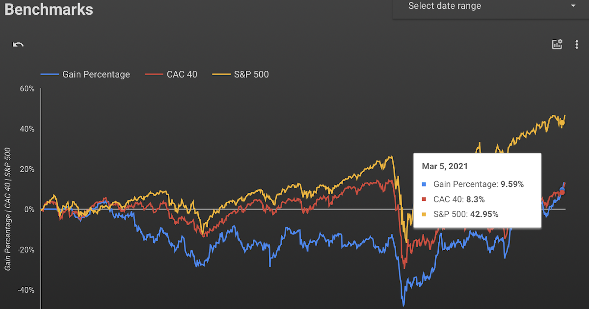

## Table of Contents

## What is a market index and why is it important for comparing investment returns?

A market index is like a big list that tracks the performance of a bunch of stocks or other investments. It gives you a quick way to see how the overall market or a specific part of it is doing. For example, the S&P 500 is a famous index that follows the performance of 500 big companies in the U.S.

Market indexes are important for comparing investment returns because they give you a standard to measure against. If your investments are doing better than the index, you're beating the market, which is great! If they're doing worse, it might be time to rethink your strategy. By comparing your returns to an index, you can see if you're doing well or if you need to make changes to your investments.

## How do you choose the right market index to compare your investments against?

Choosing the right market index to compare your investments against depends on what you're investing in and what you want to achieve. If you're investing in U.S. large companies, the S&P 500 could be a good choice because it tracks 500 of the biggest companies in the U.S. If you're more into tech stocks, you might want to look at the Nasdaq Composite, which focuses on technology and internet companies. The key is to pick an index that matches the type of investments you have.

It's also important to think about your investment goals. If you're looking for long-term growth, you might want to compare your investments to a broad market index like the Dow Jones Industrial Average or the Russell 2000, which tracks smaller companies. On the other hand, if you're interested in specific sectors like healthcare or energy, there are indexes for those too, like the S&P 500 Health Care Sector or the S&P 500 Energy Sector. By choosing the right index, you can get a clear picture of how well your investments are doing compared to the market you're interested in.

## What are some common market indexes used for benchmarking investment performance?

Some of the most common market indexes used for benchmarking investment performance are the S&P 500, the Dow Jones Industrial Average, and the Nasdaq Composite. The S&P 500 is a popular choice because it tracks the performance of 500 of the largest companies in the U.S. It's a good benchmark for investors who have a broad portfolio of large U.S. stocks. The Dow Jones Industrial Average, often just called the Dow, follows 30 big companies and is another widely used index. It's good for getting a quick snapshot of how major U.S. companies are doing.

The Nasdaq Composite is another important index, especially for investors interested in technology and internet companies. It includes all the stocks listed on the Nasdaq stock exchange, which is known for having a lot of tech firms. For those who focus on smaller companies, the Russell 2000 is a great choice. It tracks the performance of 2,000 smaller U.S. companies, giving investors a way to see how this part of the market is doing. By using these indexes, investors can easily compare their own investment returns to see if they're doing better or worse than the market.

## How can beginners use market indexes to evaluate their investment portfolios?

Beginners can use market indexes to evaluate their investment portfolios by comparing their returns to those of a relevant index. For example, if you're investing in a mix of large U.S. companies, you might compare your portfolio's performance to the S&P 500. This helps you see if your investments are doing better or worse than the overall market. If your portfolio is beating the S&P 500, that's a good sign. But if it's lagging behind, you might want to think about changing your investments or talking to a financial advisor.

It's important for beginners to pick the right index to compare against. If you're investing in tech stocks, the Nasdaq Composite would be a good choice because it focuses on technology companies. If you're interested in smaller companies, the Russell 2000 could be a better fit. By choosing an index that matches your investments, you get a clear picture of how well you're doing. This can help you make smarter decisions and adjust your strategy as needed.

## What is the difference between a price return and a total return index?

A price return index only tracks the changes in the prices of the stocks it includes. This means it shows how much the stocks have gone up or down in value, but it doesn't include any money you might get from dividends. For example, if a stock in the index pays out dividends, those payments are not counted in the price return index. This type of index is useful for seeing how the market is doing just based on stock prices.

On the other hand, a total return index includes both the price changes and the dividends paid out by the stocks in the index. So, it gives you a fuller picture of the overall performance of the investments. If a stock pays a dividend, that money is added to the total return, making it a better measure of the actual returns an investor might see. For beginners, using a total return index can be more helpful because it shows the full impact of their investments, including any income from dividends.

## How do market indexes help in understanding the risk and volatility of investments?

Market indexes help investors understand the risk and [volatility](/wiki/volatility-trading-strategies) of their investments by providing a benchmark to measure against. If you look at an index like the S&P 500, you can see how much it goes up and down over time. This gives you an idea of how risky the overall market is. If your investments move a lot more than the index, they might be riskier. On the other hand, if they move less, they might be safer. By comparing your investments to the index, you can get a sense of how much risk you're taking on.

Volatility, which is how much prices go up and down, can also be seen through market indexes. For example, if the Nasdaq Composite, which focuses on tech stocks, is going up and down a lot, it tells you that tech stocks are pretty volatile right now. This can help you decide if you want to invest in tech stocks or if you should look for something less risky. By keeping an eye on the volatility of different indexes, you can better understand the ups and downs of the market and make smarter choices about where to put your money.

## What are the limitations of using market indexes to compare investment returns?

Using market indexes to compare investment returns has some limitations. One big problem is that indexes might not match your investment exactly. For example, if you have a lot of money in small companies, but you compare your returns to the S&P 500, which focuses on big companies, it won't be a fair comparison. Also, indexes don't take into account the fees you pay for your investments. If you're paying a lot in fees, your returns might look worse than the index even if your investments are doing well.

Another limitation is that market indexes don't show the full picture of your investment strategy. They just show how well the market is doing, not how well you're doing with your specific goals. For example, if you're investing for the long term, short-term ups and downs in the index might not matter to you. But if you compare your returns to the index during those short-term dips, it might look like you're doing poorly. So, while indexes are helpful, they're not perfect and you need to think about these limitations when using them.

## How can advanced investors use market indexes to adjust their investment strategies?

Advanced investors can use market indexes to fine-tune their investment strategies by comparing their portfolio's performance against different indexes. For example, if an investor notices that their portfolio is underperforming compared to the S&P 500, they might decide to shift some of their investments into large U.S. companies to better align with the market. On the other hand, if their portfolio is doing well compared to the Nasdaq Composite, it could be a sign that their focus on tech stocks is paying off, and they might decide to keep or even increase their exposure to this sector. By looking at these comparisons, advanced investors can make smarter decisions about where to put their money and how to adjust their holdings.

Another way advanced investors can use market indexes is by analyzing the volatility and risk associated with different sectors or markets. If an investor sees that the Russell 2000, which tracks small companies, is experiencing a lot of ups and downs, they might decide to reduce their exposure to small-cap stocks to lower their overall risk. Conversely, if they see that the S&P 500 is stable and growing steadily, they might increase their investments in large-cap stocks to take advantage of that stability. By keeping a close eye on the performance and volatility of various indexes, advanced investors can adjust their strategies to better manage risk and improve their returns.

## What role do market indexes play in passive vs. active investment strategies?

Market indexes play a big role in both passive and active investment strategies. In passive investing, the goal is to match the performance of a market index, like the S&P 500. Investors do this by buying index funds or ETFs that track the index. This way, they don't have to pick individual stocks and can just ride along with the overall market. It's a simple and low-cost way to invest, and it's popular because it's easy to do and usually works well over the long term.

In active investing, the goal is to beat the market, not just match it. Investors who use this strategy often compare their returns to a market index to see if they're doing better. If they're not beating the index, they might change their investments or try different strategies. Market indexes help active investors see how well they're doing and make decisions about where to put their money. It's a more hands-on approach and can be riskier, but it also gives investors a chance to earn higher returns if they make the right choices.

## How can sector-specific indexes be used to gain insights into particular market segments?

Sector-specific indexes are great tools for understanding how different parts of the market are doing. For example, if you're interested in how tech companies are performing, you can look at the Nasdaq Composite, which focuses on technology and internet companies. By watching this index, you can see if tech stocks are going up or down and how much they're moving around. This can help you decide if you want to invest more in tech or if it's too risky right now. Sector-specific indexes give you a clear picture of what's happening in one area of the market, which can be really helpful for making smart investment choices.

These indexes also help you compare your investments to specific sectors. If you have a lot of money in healthcare stocks, you might compare your returns to the S&P 500 Health Care Sector index. This way, you can see if your healthcare investments are doing better or worse than the overall healthcare market. If they're doing worse, you might want to change your strategy or look for better healthcare stocks. By using sector-specific indexes, you can get a better understanding of how different parts of the market are performing and adjust your investments to match your goals.

## What are the statistical methods used to compare investment returns against market indexes?

To compare investment returns against market indexes, investors often use a few key statistical methods. One common method is calculating the difference between your returns and the index's returns. This is called the "excess return" or "alpha." If your investments are doing better than the index, you have a positive alpha, which means you're beating the market. Another method is looking at the "beta," which shows how much your investments move with the market. A beta higher than 1 means your investments are more volatile than the market, while a beta lower than 1 means they're less volatile.

Another important statistical tool is the "Sharpe ratio." This measures how much return you're getting for the risk you're taking. To calculate it, you subtract the risk-free rate (like what you'd get from a safe investment like a government bond) from your investment return, then divide by the standard deviation of your returns. A higher Sharpe ratio means you're getting more return for the risk you're taking, which is good. By using these methods, investors can get a clearer picture of how well their investments are doing compared to the market and make smarter decisions about their money.

## How do global market indexes influence international investment decisions and portfolio diversification?

Global market indexes, like the MSCI World Index or the FTSE All-World Index, give investors a big picture of how different countries and regions are doing. By looking at these indexes, investors can see if one part of the world is doing better or worse than others. This helps them decide where to put their money. For example, if the MSCI Emerging Markets Index is going up a lot, it might be a good time to invest in countries like Brazil or India. On the other hand, if the FTSE Developed Europe Index is going down, investors might want to take their money out of Europe and put it somewhere else.

These indexes also help investors spread out their investments to lower risk. This is called diversification. If you only invest in one country or region, you're taking a big risk because if that place does badly, you lose a lot of money. But if you use global indexes to guide your investments, you can put your money in different countries and regions. This way, if one part of the world is doing badly, another part might be doing well, and your overall investment stays more stable. By using global market indexes, investors can make smarter choices about where to invest and how to keep their money safe.

## What are Performance Metrics in Benchmarking?

Performance metrics play a crucial role in evaluating and understanding investment and trading strategy performance. Key performance metrics include absolute returns, alpha, beta, Sharpe Ratio, and Sortino Ratio. Each metric offers a different perspective on risk and return, helping investors and algorithmic traders assess how well their strategies are performing relative to predefined benchmarks.

**Absolute Returns** measure the total gain or loss achieved by an investment over a specific period, without accounting for comparison against any benchmark. This metric is fundamental yet provides limited insight into risk-adjusted performance.

**Alpha** ($\alpha$) is a measure of the active return on an investment, gauging performance against a market index or benchmark. It reflects the excess return of a portfolio relative to the return of a benchmark index, calculated as:

$$
\alpha = R_i - (R_f + \beta_i(R_m - R_f))
$$

where $R_i$ is the portfolio return, $R_f$ is the risk-free rate, $\beta_i$ represents beta, and $R_m$ is the market return.

**Beta** ($\beta$) measures a portfolio's sensitivity to movements in the market index. A beta greater than 1 indicates that the portfolio is more volatile than the market, while a beta less than 1 indicates less volatility.

**Sharpe Ratio** provides insight into risk-adjusted returns, considering both the return and the risk-free rate:

$$
\text{Sharpe Ratio} = \frac{R_i - R_f}{\sigma_i}
$$

where $R_i$ is the expected portfolio return, $R_f$ is the risk-free rate, and $\sigma_i$ is the standard deviation of the portfolio's excess return. A higher Sharpe Ratio indicates better risk-adjusted performance.

**Sortino Ratio**, an enhancement of the Sharpe Ratio, focuses on downside risk by isolating negative volatility:

$$
\text{Sortino Ratio} = \frac{R_i - R_f}{\sigma_d}
$$

where $\sigma_d$ is the downside deviation. The Sortino Ratio offers a clearer perspective on performance by weighing only negative deviances from the mean.

**Maximum Drawdown** quantifies the largest peak-to-trough decline in a portfolio, representing the maximum loss an investor might have faced before recovery. This metric aids in understanding the potential risk during extreme market downturns.

**Value at Risk (VaR)** estimates the maximum potential loss in value of a portfolio over a specified time frame with a given confidence level. VaR is widely used to assess the likelihood of facing significant losses.

**Conditional Value at Risk (CVaR)**, also known as Expected Shortfall, provides an average of losses that transcend the VaR threshold, offering a more comprehensive risk assessment.

In [algorithmic trading](/wiki/algorithmic-trading), these metrics are critical for [backtesting](/wiki/backtesting), real-time monitoring, and performance reporting, as they help traders evaluate strategy effectiveness and risk levels. Python libraries such as Pyfolio provide tools for calculating these metrics, enhancing the data-driven decision-making process in algorithmic strategies. These metrics are integral in determining the readiness of a strategy for real-world deployment, ensuring they meet risk and return expectations aligned with specific investment goals.

## References & Further Reading

[1]: ["Advances in Financial Machine Learning"](https://www.amazon.com/Advances-Financial-Machine-Learning-Marcos/dp/1119482089) by Marcos Lopez de Prado

[2]: ["Evidence-Based Technical Analysis: Applying the Scientific Method and Statistical Inference to Trading Signals"](https://www.amazon.com/Evidence-Based-Technical-Analysis-Scientific-Statistical/dp/0470008741) by David Aronson

[3]: ["Machine Learning for Algorithmic Trading"](https://github.com/stefan-jansen/machine-learning-for-trading) by Stefan Jansen

[4]: ["Quantitative Trading: How to Build Your Own Algorithmic Trading Business"](https://www.amazon.com/Quantitative-Trading-Build-Algorithmic-Business/dp/1119800064) by Ernest P. Chan

[5]: Chen, Z., & Gallagher, D. R. (2005). [“The Performance of Australian Managed Funds: Is Market Timing Rewarded?”](https://onlinelibrary.wiley.com/doi/10.1111/j.1467-629X.2005.00146.x) Journal of Business Finance & Accounting, 32(1‐2), 207-244. 

[6]: Fama, E. F., & French, K. R. (1993). ["Common risk factors in the returns on stocks and bonds."](https://www.sciencedirect.com/science/article/pii/0304405X93900235) Journal of Financial Economics, 33(1), 3-56.