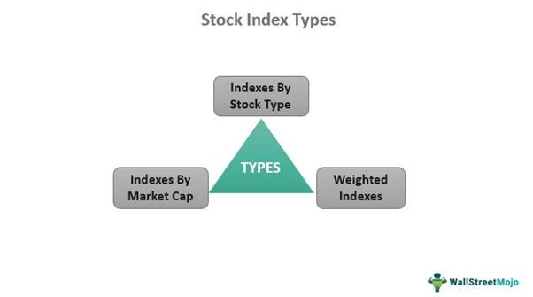

Market indexes are fundamental tools in the world of finance, providing essential benchmarks for investors to assess the performance of their portfolios. These indexes serve as snapshots of market segments, offering a reference point for investment returns. For example, major market indexes like the S&P 500, Dow Jones Industrial Average, and Nasdaq 100 are commonly used as proxies for broader market performance. By comparing their portfolio returns to these benchmarks, investors gain insights into whether they are outperforming or underperforming the market.

Algorithmic trading has emerged as a powerful force in financial markets, leveraging computer programs to execute trades at speeds and frequencies that are impossible for human traders. These algorithms rely on benchmarks to evaluate the effectiveness of various trading strategies. By continuously assessing their performance against market indexes, algorithmic traders can fine-tune their strategies and make informed decisions to optimize returns.

Benchmarking is crucial in the investment landscape, facilitating a clear understanding of performance relative to market standards. It provides a framework for setting expectations and evaluating success. Without appropriate benchmarks, it becomes challenging to determine if the returns achieved align with the risk taken or if they justify the investment decisions made. Thus, selecting an appropriate benchmark is an integral part of the investment process.

This article will explore the intersection of market indexes, investment returns, and algorithmic trading, highlighting how these components interact to influence investment decisions and strategies. By understanding these connections, investors and traders can adopt more refined practices, leveraging benchmarks to enhance strategy performance and achieve better returns in an increasingly complex financial environment.

## Table of Contents

## Understanding Market Indexes

Market indexes are statistical measures that represent the value of a specific segment of the financial market. These indexes are composed of a curated selection of securities, usually stocks, that simulate the performance of a particular market or sector. The primary purpose of market indexes is to provide a benchmark for market performance, offering a snapshot of how the market or its segment is performing.

Major market indexes, such as the S&P 500, Dow Jones Industrial Average (DJIA), and Nasdaq 100, are globally recognized and widely used as benchmarks. The S&P 500, for example, includes 500 of the largest companies in the United States and is often regarded as a reliable indicator of U.S. large-cap stocks' performance. The DJIA, on the other hand, tracks 30 large, publicly-owned companies based in the United States and is price-weighted, emphasizing the influence of high-priced stocks. Meanwhile, the Nasdaq 100 comprises 100 of the largest non-financial companies listed on the Nasdaq Stock Market, with a strong inclination towards the technology sector.

Indexes serve as proxies for broader market performance by mirroring the market's overall movements. They simplify complex market data into an accessible form, enabling investors to grasp market trends, compare market segments, and track economic health efficiently. The calculation of an index often follows a weighted average model, where the influence of each included security can be modified based on market capitalization, price, or other characteristics.

Investors utilize indexes to benchmark the performance of their portfolios. By comparing individual portfolio returns against a relevant index, investors can evaluate whether their investment strategies are successful or underperforming. For example, an investor holding a portfolio of U.S. large-cap stocks might benchmark their performance against the S&P 500 to ascertain their relative success. This benchmarking process is crucial for assessing not only the returns but also the risks associated with specific investment choices.

## Investment Returns and Their Benchmarking

Benchmarking investment returns is a fundamental practice in the financial industry, serving as a vital tool for evaluating the performance of investment portfolios. It involves comparing a portfolio's returns against a standard, known as a benchmark, to assess whether the portfolio is underperforming or outperforming the market. A well-chosen benchmark enables investors to determine if they are achieving their investment objectives and to make informed decisions regarding their portfolio management.

One of the significant challenges faced by investors is that most portfolios tend to underperform against their chosen benchmarks. This underperformance is often attributable to frictional costs, including management fees, transaction costs, and taxes. These costs can erode the net returns, leading to a performance lag relative to the benchmark. As a result, selecting an appropriate benchmark that accurately reflects the investment style and objectives of the portfolio is crucial to minimize the impact of these costs.

Choosing inappropriate benchmarks can result in what is known as benchmark errors. This occurs when the benchmark does not accurately represent the investment style, risk profile, or asset allocation of the portfolio. For instance, comparing a small-cap growth fund against a broad market index like the S&P 500 would likely yield misleading performance assessments, as the benchmark does not align with the fund's investment strategy. Such errors can mislead investors, resulting in incorrect evaluations of portfolio performance and potentially misguided investment decisions.

It is essential to recognize that benchmark errors have significant implications for investment analysis. Misaligned benchmarks can distort performance attribution analysis, which seeks to determine the sources of a portfolio's returns. This distortion can hinder an investor's ability to identify skill-generated returns versus market-driven returns, complicating efforts to improve portfolio management strategies. Additionally, inaccurate benchmarks may lead to incorrect assessments of risk-adjusted returns, affecting portfolio risk management approaches.

To mitigate the risks associated with benchmarking errors, investors should ensure that the selected benchmarks closely align with their portfolio's investment strategies, risk profiles, and asset allocations. This alignment enhances the accuracy of performance evaluation and facilitates more effective investment decision-making. By recognizing the importance of appropriate benchmarks, investors can optimize their portfolios to better achieve their financial objectives while minimizing the influence of frictional costs.

## Algorithmic Trading and Benchmark Analysis

Algorithmic trading refers to the use of computer algorithms and automated systems to execute trading orders, often at speeds and frequencies that are impossible for human traders. This form of trading has seen substantial growth in modern financial markets due to advancements in technology and the availability of large data sets. Algorithmic trading strategies can assess and respond to market conditions efficiently, making them a vital tool for traders seeking to optimize their investment decisions.

### Utilization of Benchmarks in Algorithmic Trading

In [algorithmic trading](/wiki/algorithmic-trading), benchmarks are essential for evaluating the effectiveness of trading strategies. Benchmarks serve as reference points against which the performance of trading algorithms can be compared. The use of benchmarks allows traders to determine whether their strategies are delivering superior returns relative to predefined standards. By analyzing performance against these benchmarks, algorithmic traders can refine their strategies, identify areas for improvement, and ensure consistent adherence to investment goals.

### Types of Benchmarks in Algorithmic Trading

1. **Market Indices**: Major market indices, such as the S&P 500 or Nasdaq 100, are frequently used as benchmarks. These indices provide a broad measure of market performance and are useful for assessing how well a trading strategy performs in comparison to the overall market. The difference between the strategy's return and the index return is often used to calculate alpha, a key metric in investment performance evaluation.

2. **Risk-Free Rate**: The risk-free rate, typically represented by the yield on government securities like U.S. Treasury bills, provides a baseline for measuring excess returns. Algorithms that aim to exceed the risk-free rate must account for trading costs and risk exposure to determine if they truly add value beyond this fundamental level.

3. **Peer Group Performance**: Comparing strategy performance against similar trading strategies or a group of portfolios with similar objectives offers insights into relative performance. This type of benchmarking helps in understanding how well a strategy performs in the context of competitive trading environments.

4. **Custom Benchmarks**: Tailored benchmarks are created to align with the specific objectives and constraints of an algorithmic trading strategy. These custom benchmarks consider unique factors such as leverage levels, sector allocations, or specific asset classes, providing a more precise measure of strategy effectiveness.

### Significance of Benchmarks in Algorithmic Trading

Benchmarks play a critical role in various aspects of algorithmic trading:

- **Performance Measurement**: By providing a standard against which to compare results, benchmarks allow for objective evaluation of trading strategy performance. This is essential for identifying successful strategies and ensuring consistent application of trading principles.

- **Risk Assessment**: Benchmarks assist in quantifying the additional risk taken by trading strategies to achieve returns. Metrics such as alpha and beta, which are derived using benchmarks, help in understanding the risk-return profile of a strategy.

- **Strategy Evaluation**: Benchmarks facilitate the evaluation of algorithmic strategies by highlighting deviations from expected outcomes. They serve as a guide for adjustments that enhance strategy robustness and market adaptability.

In conclusion, benchmarks are integral to the analysis and optimization of algorithmic trading strategies. They offer a framework for performance evaluation, risk management, and strategic planning, thereby enhancing the capability of algorithmic traders to achieve superior investment outcomes.

## Performance Metrics in Benchmarking

Performance metrics play a crucial role in evaluating and understanding investment and trading strategy performance. Key performance metrics include absolute returns, alpha, beta, Sharpe Ratio, and Sortino Ratio. Each metric offers a different perspective on risk and return, helping investors and algorithmic traders assess how well their strategies are performing relative to predefined benchmarks.

**Absolute Returns** measure the total gain or loss achieved by an investment over a specific period, without accounting for comparison against any benchmark. This metric is fundamental yet provides limited insight into risk-adjusted performance.

**Alpha** ($\alpha$) is a measure of the active return on an investment, gauging performance against a market index or benchmark. It reflects the excess return of a portfolio relative to the return of a benchmark index, calculated as:

$$
\alpha = R_i - (R_f + \beta_i(R_m - R_f))
$$

where $R_i$ is the portfolio return, $R_f$ is the risk-free rate, $\beta_i$ represents beta, and $R_m$ is the market return.

**Beta** ($\beta$) measures a portfolio's sensitivity to movements in the market index. A beta greater than 1 indicates that the portfolio is more volatile than the market, while a beta less than 1 indicates less volatility.

**Sharpe Ratio** provides insight into risk-adjusted returns, considering both the return and the risk-free rate:

$$
\text{Sharpe Ratio} = \frac{R_i - R_f}{\sigma_i}
$$

where $R_i$ is the expected portfolio return, $R_f$ is the risk-free rate, and $\sigma_i$ is the standard deviation of the portfolio's excess return. A higher Sharpe Ratio indicates better risk-adjusted performance.

**Sortino Ratio**, an enhancement of the Sharpe Ratio, focuses on downside risk by isolating negative volatility:

$$
\text{Sortino Ratio} = \frac{R_i - R_f}{\sigma_d}
$$

where $\sigma_d$ is the downside deviation. The Sortino Ratio offers a clearer perspective on performance by weighing only negative deviances from the mean.

**Maximum Drawdown** quantifies the largest peak-to-trough decline in a portfolio, representing the maximum loss an investor might have faced before recovery. This metric aids in understanding the potential risk during extreme market downturns.

**Value at Risk (VaR)** estimates the maximum potential loss in value of a portfolio over a specified time frame with a given confidence level. VaR is widely used to assess the likelihood of facing significant losses.

**Conditional Value at Risk (CVaR)**, also known as Expected Shortfall, provides an average of losses that transcend the VaR threshold, offering a more comprehensive risk assessment.

In algorithmic trading, these metrics are critical for [backtesting](/wiki/backtesting), real-time monitoring, and performance reporting, as they help traders evaluate strategy effectiveness and risk levels. Python libraries such as Pyfolio provide tools for calculating these metrics, enhancing the data-driven decision-making process in algorithmic strategies. These metrics are integral in determining the readiness of a strategy for real-world deployment, ensuring they meet risk and return expectations aligned with specific investment goals.

## Algorithmic Tools and Platforms for Benchmarking

Algorithmic tools and platforms are critical for benchmarking in trading, enabling traders to create, test, and deploy automated strategies efficiently. Among the leading platforms supporting these activities are QuantConnect, MetaTrader, and Pyfolio, each offering distinct features aligned with the needs of traders and analysts.

QuantConnect is a cloud-based algorithmic trading platform that allows users to design and test their strategies using historical market data. It supports multiple programming languages, including Python and C#, making it accessible to a broad range of developers. QuantConnect’s Lean Algorithm Framework provides a comprehensive environment for quant research and testing, enabling users to optimize strategies against various benchmarks, such as market indices or risk-adjusted returns. The platform excels in its collaborative environment, fostering community-driven learning and innovation.

MetaTrader, particularly MetaTrader 4 (MT4) and MetaTrader 5 (MT5), is a popular choice for [forex](/wiki/forex-system) and CFD trading. It offers robust analytical tools and supports custom scripts and Expert Advisors (EAs) for automated trading. MetaTrader's Strategy Tester allows users to evaluate the performance of trading algorithms with historical data. It provides insights into metrics like profitability, stability, and risk exposure, aiding traders in refining their benchmarks. MetaTrader’s wide adoption is partly due to its ease of use and extensive support for technical analysis tools, which are crucial for benchmarking trading strategies.

Pyfolio is a Python library specifically designed for portfolio and risk analysis. It offers a suite of tools for creating tear sheets that summarize performance, including statistical analysis of returns, risk metrics, and benchmark comparisons. The library’s ability to integrate seamlessly with other Python-based data analysis tools, such as Pandas and Matplotlib, enhances its utility in the benchmarking process. Pyfolio’s focus on portfolio performance is valuable for traders looking to measure strategy effectiveness against customized benchmarks or peer groups.

These platforms support various applications in executing algorithmic strategies and refining benchmark techniques. QuantConnect and MetaTrader facilitate backtesting and real-time implementation across diverse asset classes. Their backtesting environments provide detailed performance reports that help traders adjust strategies in response to historical performance relative to specific benchmarks.

Real-world applications in algorithmic trading firms have demonstrated the effectiveness of these tools. For instance, QuantConnect is frequently used in hedge funds and proprietary trading firms to conduct complex quantitative research and develop strategies that are benchmarked against major indices like the S&P 500 or custom risk profiles. Similarly, MetaTrader is widely utilized by retail traders and small trading firms to automate trading strategies and compare performance against market indices or other relevant benchmarks in forex trading.

In summary, platforms like QuantConnect, MetaTrader, and Pyfolio offer versatile environments for the testing, execution, and benchmarking of algorithmic trading strategies. Their diverse features cater to the needs of both individual traders and institutional firms, showcasing their essential role in modern trading practices.

## Best Practices and Challenges in Benchmarking

Effective benchmarking is crucial in evaluating investment strategies and ensuring they meet intended objectives. Key best practices, such as continuous monitoring, diversification, and thorough documentation, enhance the robustness of benchmarking analyses.

**Continuous Monitoring**

Investors and traders are advised to regularly assess their chosen benchmarks and compare them against actual portfolio performance. This process enables timely adjustments to strategies as market conditions evolve and ensures that the investment objectives remain aligned with benchmark targets. Continuous monitoring involves the use of analytical tools and software that provide real-time data and insights. 

**Diversification**

Diversification within benchmarking mitigates risks associated with reliance on a single index or metric. By leveraging multiple benchmarks, investors gain a holistic view of performance and can better understand how different elements contribute to overall returns. For instance, benchmarking against not only a broad market index like the S&P 500 but also against specific sector indices can provide clearer insights into sector-specific performance.

**Documentation**

Maintaining detailed records of benchmarking criteria, chosen indices, performance metrics, and rationale behind each selection is essential. Proper documentation ensures transparency, facilitates review processes, and provides a historical record that can be vital when analyzing the efficacy of past decisions.

**Challenges in Benchmarking**

Benchmarking is beset with challenges including data quality, overfitting, and dynamic market conditions, which can skew results and lead to erroneous conclusions.

**Data Quality**

High-quality, accurate data is fundamental for effective benchmarking. Poor data quality can stem from inconsistent data sources, inaccuracies in historical data, or delays in updates. Traders mitigate this by selecting reputable data providers and implementing thorough data validation processes.

**Overfitting**

Overfitting occurs when a model is excessively complex, capturing noise rather than the underlying data pattern. It can lead to benchmarks that falsely appear effective during backtests but fail in real-world applications. To prevent overfitting, practitioners employ techniques such as cross-validation and maintain a balance between model complexity and generalizability.

**Dynamic Market Conditions**

Financial markets are inherently dynamic, characterized by rapid shifts in economic conditions, investor sentiment, and regulatory landscapes. Static benchmarks may not adequately capture these changes, leading to misleading performance assessments. Adaptive benchmarking strategies that periodically reassess benchmark relevance and adjust criteria accordingly are necessary to mitigate this challenge.

**Ethical Standards and Regulatory Compliance**

Adhering to ethical standards and regulatory requirements in benchmarking practices is paramount. These frameworks ensure fairness, protect stakeholders, and maintain confidence in the financial system. Transparency in reporting, compliance with regional financial regulations, and adherence to industry best practices are crucial components of ethical benchmarking. 

By implementing these best practices and addressing potential challenges, investors and algorithmic traders can enhance the accuracy and reliability of their benchmarking, leading to more informed decision-making and optimized investment returns.

## Conclusion

The convergence of market indexes, investment returns, and algorithmic trading represents a significant advancement in the financial industry, providing investors with robust frameworks for evaluating and enhancing their strategies. Market indexes serve as vital indicators of overall market performance, allowing investors to gauge their portfolio returns against standardized benchmarks. Through algorithmic trading, these benchmarks are leveraged in developing sophisticated trading strategies that aim to optimize returns while managing risks effectively.

Benchmarking has become indispensable for improving investment strategies and achieving superior returns. By measuring investment returns against relevant benchmarks, investors can identify areas of underperformance and refine their tactics accordingly. Benchmarking not only facilitates performance evaluation but also aids in risk management and strategy formulation, driving informed decision-making and enhancing portfolio returns.

Looking ahead, the future of algorithmic trading holds substantial promise for refining benchmarking practices further. As technology evolves, algorithmic trading systems will become more adept at processing vast amounts of data with increased accuracy and speed, thereby improving benchmark-based evaluations. This evolution will drive more precise performance assessments, allowing investors and traders to adapt swiftly to dynamic market conditions.

Investors and traders are encouraged to embrace benchmarking tools and practices as indispensable assets in their pursuit of optimized trading and investment results. Utilizing platforms like QuantConnect, MetaTrader, and Pyfolio, investors can harness cutting-edge technologies to backtest strategies, evaluate performance, and ensure that their investments align with their risk and return objectives. By leveraging these resources, investors position themselves to navigate the complexities of modern financial markets with greater precision and confidence.

## References & Further Reading

[1]: ["Advances in Financial Machine Learning"](https://www.amazon.com/Advances-Financial-Machine-Learning-Marcos/dp/1119482089) by Marcos Lopez de Prado

[2]: ["Evidence-Based Technical Analysis: Applying the Scientific Method and Statistical Inference to Trading Signals"](https://www.amazon.com/Evidence-Based-Technical-Analysis-Scientific-Statistical/dp/0470008741) by David Aronson

[3]: ["Machine Learning for Algorithmic Trading"](https://github.com/stefan-jansen/machine-learning-for-trading) by Stefan Jansen

[4]: ["Quantitative Trading: How to Build Your Own Algorithmic Trading Business"](https://www.amazon.com/Quantitative-Trading-Build-Algorithmic-Business/dp/1119800064) by Ernest P. Chan

[5]: Chen, Z., & Gallagher, D. R. (2005). [“The Performance of Australian Managed Funds: Is Market Timing Rewarded?”](https://onlinelibrary.wiley.com/doi/10.1111/j.1467-629X.2005.00146.x) Journal of Business Finance & Accounting, 32(1‐2), 207-244. 

[6]: Fama, E. F., & French, K. R. (1993). ["Common risk factors in the returns on stocks and bonds."](https://www.sciencedirect.com/science/article/pii/0304405X93900235) Journal of Financial Economics, 33(1), 3-56.