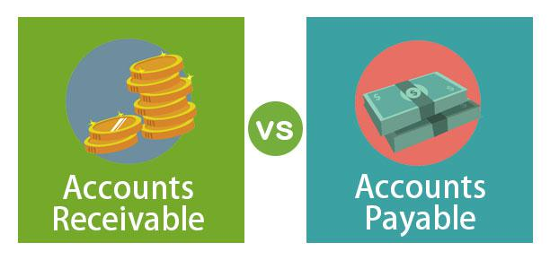

## Table of Contents

## What is the basic definition of accrual accounting?

Accrual accounting is a method of recording financial transactions when they happen, not when money changes hands. This means that if a company provides a service or sells a product, it records the revenue at that time, even if the customer hasn't paid yet. Similarly, if a company receives a service or buys something, it records the expense right away, even if it hasn't paid for it yet.

This method gives a more accurate picture of a company's financial health because it shows income and expenses in the period they occur, not just when payments are made or received. This is different from cash accounting, where transactions are only recorded when cash is actually received or paid out. Accrual accounting is required by generally accepted accounting principles (GAAP) for most businesses, especially larger ones, because it provides a clearer view of a company's financial performance over time.

## What is the basic definition of accounts payable?

Accounts payable is money that a company owes to its suppliers or vendors for goods or services that it has received but not yet paid for. It's like an IOU from the company to the people or businesses it buys things from. When a company gets something it needs to run its business, like supplies or services, it usually gets a bill or invoice. The company records this bill as an account payable, which means it promises to pay the amount owed by a certain date.

This account is important because it helps a company keep track of what it owes and when it needs to pay. It's part of managing the company's cash flow, making sure there's enough money to cover these debts when they're due. Accounts payable is shown on the company's balance sheet as a liability, which means it's something the company has to pay in the future. Keeping good records of accounts payable helps a company maintain good relationships with its suppliers by paying them on time.

## How does accrual accounting differ from cash accounting?

Accrual accounting and cash accounting are two different ways to keep track of a company's money. Accrual accounting records income and expenses when they happen, not when money actually changes hands. So, if a company sells something, it writes down the sale right away, even if the customer hasn't paid yet. The same goes for buying things; the company records the cost as soon as it gets the goods or services, even if it hasn't paid for them yet. This method gives a better picture of how the business is doing over time because it shows all the money coming in and going out in the right periods.

On the other hand, cash accounting is simpler and only records money when it's actually received or paid. So, if a company sells something, it only writes down the sale when the customer pays. And if it buys something, it only records the expense when it pays for it. This method can be easier for small businesses to manage, but it doesn't show the full financial picture. For example, a company might look like it's doing well if it gets a lot of cash in one month, but if those sales were actually made months earlier, the company might not be as healthy as it seems. Accrual accounting is required by many accounting standards, like GAAP, for larger businesses because it provides a more accurate view of a company's financial health.

## What are the key differences between accrual and accounts payable?

Accrual accounting is a way of keeping track of money that focuses on when things happen, not when money moves. It records income when a company earns it, like when it sells something, even if the customer hasn't paid yet. It also records expenses when a company gets something, like supplies, even if it hasn't paid for them yet. This method helps show a true picture of how the business is doing over time because it matches income and expenses to the time they happen.

Accounts payable, on the other hand, is about the money a company owes to others for things it has already received. When a company gets goods or services, it gets a bill and records this as an account payable, which means it has to pay this amount later. This is a part of the company's liabilities, showing what it owes to suppliers or vendors. Accounts payable is a specific kind of expense that is recorded under accrual accounting when the goods or services are received, but it focuses on tracking these debts until they are paid.

In simple terms, accrual accounting is a broader method that includes recording all kinds of income and expenses when they occur. Accounts payable is a specific type of liability within accrual accounting that tracks money the company owes for things it has already received but not yet paid for. While accrual accounting gives a complete view of the company's financial activities, accounts payable is just one piece of that puzzle, focusing on what the company owes.

## How do accruals impact financial statements?

Accruals make financial statements show a truer picture of a company's money situation. When a company uses accrual accounting, it writes down money it earns when it sells something, even if the customer hasn't paid yet. It also writes down money it owes when it gets something, like supplies, even if it hasn't paid for them yet. This means the income statement, which shows how much money the company made and spent, will show all the money coming in and going out in the right time periods. This helps everyone see how well the company is really doing, not just when it gets paid.

Accruals also change the balance sheet, which is like a snapshot of what the company owns and owes at a certain time. On the balance sheet, money the company is owed from customers shows up as accounts receivable, and money the company owes to suppliers shows up as accounts payable. These amounts can make the company look different than if it only counted cash. For example, a company might look like it has a lot of money coming in, but if most of that money is still owed by customers, it might not have as much cash on hand as it seems. This helps people understand the company's real financial health, including how much it can pay its bills and how much it expects to get paid.

## How do accounts payable affect a company's cash flow?

Accounts payable can have a big impact on a company's cash flow. When a company buys things it needs, like supplies or services, it usually gets a bill that it has to pay later. This bill is called accounts payable. If the company has a lot of bills to pay, it means it will need to use more cash to pay them when they're due. This can make the company's cash flow go down because it's spending money to pay off these bills.

On the other hand, if a company can take longer to pay its bills, it can keep more cash on hand for a while. This can help the company's cash flow because it has more money to use for other things, like buying more supplies or paying employees. But, the company still has to pay the bills eventually, so it needs to manage its accounts payable carefully to make sure it has enough cash to cover these expenses when they're due.

## What are the common types of accruals a business might encounter?

A business might come across different kinds of accruals when it uses accrual accounting. One common type is accrued revenue, which happens when a company earns money but hasn't received it yet. For example, if a company finishes a job for a customer in December but won't get paid until January, it records the money it earned in December as accrued revenue. Another type is accrued expenses, which are costs the company has to pay for things it's already used but hasn't paid for yet. If a company gets electricity all month but only gets the bill at the end of the month, it records the cost of the electricity as an accrued expense during the month.

Another type of accrual is prepaid expenses. These are costs the company pays for in advance, like rent or insurance. If a company pays for a year of insurance upfront, it records part of that payment as a prepaid expense each month as the insurance is used. Lastly, there are also unearned revenues, which are payments a company gets before it does the work. For instance, if a customer pays for a service in advance, the company records this money as unearned revenue until it actually provides the service. These different types of accruals help the company show a true picture of its financial situation over time.

## What are the typical processes involved in managing accounts payable?

Managing accounts payable involves a few key steps that help a company keep track of what it owes and pay its bills on time. When a company gets a bill or invoice from a supplier for goods or services it received, it starts by recording this bill in its accounting system as an accounts payable. This means the company now has a record of how much it owes and when it needs to pay. The company then checks the bill to make sure everything is correct, like the amount and the items listed. If everything looks good, the company might approve the bill for payment. If there's a problem, the company might need to talk to the supplier to fix it before paying.

Once the bill is approved, the company schedules it for payment. This means figuring out when the bill is due and making sure there's enough money to pay it on time. The company might use a system to keep track of all its bills and when they need to be paid, so it doesn't miss any. When it's time to pay, the company sends the money to the supplier, usually by check, electronic transfer, or another method. After paying the bill, the company updates its records to show that the bill has been paid, and the accounts payable amount goes down. This whole process helps the company manage its cash flow and keep good relationships with its suppliers by paying them on time.

## How can accruals be used to manipulate earnings, and what are the ethical considerations?

Accruals can be used to manipulate earnings by changing when a company records its income and expenses. For example, a company might record sales earlier than they should to make it look like it made more money in a certain period. Or, it might delay recording expenses to make it seem like it spent less money. This can make the company's financial reports look better than they really are, which can fool people like investors or lenders into thinking the company is doing better than it is. This practice is called earnings management, and it can be used to meet targets or make the company look more profitable.

There are big ethical problems with using accruals to manipulate earnings. It's not honest, and it can hurt people who rely on the company's financial reports to make decisions. For example, if investors think a company is doing well because of these manipulated reports, they might put their money into the company, only to lose it later when the truth comes out. It can also damage the company's reputation and lead to legal trouble if it gets caught. Being honest and clear with financial reporting is important for trust and fairness in business, so companies should use accruals the right way, to show a true picture of their financial health.

## What are the best practices for recording and managing accruals?

The best way to handle accruals is by keeping good records and following a clear process. When a company earns money or owes money, it should write it down right away, even if the money hasn't changed hands yet. This means keeping track of all the bills and sales as soon as they happen. Using a good accounting system can help make this easier because it can keep everything organized and remind the company when it needs to record things. It's also important to check these records often to make sure they're right and to fix any mistakes quickly.

Another important part of managing accruals is to be honest and clear. Companies should always record their money the right way, without trying to make things look better than they are. This means not moving money around just to meet goals or make reports look good. It's also a good idea to have someone else, like an accountant or an auditor, look over the records to make sure everything is done the right way. By doing these things, a company can keep its financial reports true and helpful for everyone who looks at them.

## How do accruals and accounts payable influence a company's tax obligations?

Accruals and accounts payable can change how much tax a company has to pay. When a company uses accrual accounting, it records income and expenses when they happen, not when money changes hands. So, if a company earns money in December but doesn't get paid until January, it still has to pay taxes on that money in the year it was earned, which is December. This can make the company's tax bill higher in one year if it has a lot of income it hasn't been paid for yet.

Accounts payable also affect taxes because they are expenses the company owes but hasn't paid yet. When a company gets a bill for something it used, like supplies, it can record that bill as an expense right away, even if it hasn't paid for it yet. This means the company can lower its taxable income for the year by the amount of the bill, which can make its tax bill smaller. But, the company still has to pay the bill eventually, so it needs to make sure it has enough money to cover these expenses when they're due.

## What advanced techniques can be used to optimize the management of accruals and accounts payable in large corporations?

Large corporations can use advanced techniques to manage their accruals and accounts payable better. One way is by using special software that keeps track of everything automatically. This software can help the company see all its bills and when they need to be paid, so nothing gets missed. It can also help the company plan when to pay its bills to keep more cash on hand. Another technique is to use data analysis to look at patterns in how the company spends money and owes money. This can help the company find ways to pay its bills faster or get better deals from suppliers, which can save money and make the company's cash flow better.

Another important technique is to have a good system for checking and approving bills. Large corporations can have many bills coming in, so it's important to have a clear process for making sure each bill is right and approved before it's paid. This can help stop mistakes and fraud. Also, companies can use something called dynamic discounting, where they pay bills early to get a discount from suppliers. This can save the company money and help it manage its cash better. By using these advanced techniques, large corporations can make sure their accruals and accounts payable are managed well, which helps them keep their finances in good shape.

## References & Further Reading

[1]: ["Accrual Accounting Concepts"](https://www.investopedia.com/terms/a/accrualaccounting.asp) by Financial Accounting Standards Board (FASB)

[2]: ["Accrual Accounting Vs. Cash Accounting"](https://www.investopedia.com/ask/answers/09/accrual-accounting.asp) by Steven Bragg

[3]: ["Advances in Financial Machine Learning"](https://www.amazon.com/Advances-Financial-Machine-Learning-Marcos/dp/1119482089) by Marcos Lopez de Prado

[4]: ["Quantitative Trading: How to Build Your Own Algorithmic Trading Business"](https://www.amazon.com/Quantitative-Trading-Build-Algorithmic-Business/dp/1119800064) by Ernest P. Chan

[5]: ["Machine Learning for Algorithmic Trading"](https://github.com/stefan-jansen/machine-learning-for-trading) by Stefan Jansen

[6]: ["Regulating High-Frequency Trading"](https://www.economicsreview.org/post/should-high-frequency-trading-be-regulated) by Merritt B. Fox, Lawrence Glosten, and Gabriel Rauterberg in Michigan Law Review

[7]: ["Enterprise Resource Planning: Solutions and Management"](https://www.ibm.com/topics/enterprise-resource-planning) by Mandy Chessell, et al.