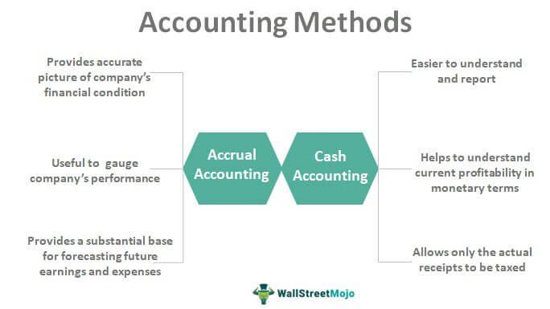

In today's dynamic financial environment, understanding the differences between cash accounting and accrual accounting is essential, particularly when considering their impact on financial reporting and algorithmic trading. Cash accounting, which records transactions only when cash is exchanged, provides a straightforward view of an entity's cash flow, making it easier for businesses to manage immediate financial activities. However, it may not accurately reflect a company's long-term financial health, as it ignores transactions that have been contracted but not yet realized in cash terms.

Conversely, accrual accounting offers a more comprehensive financial picture by recording revenues and expenses when they are incurred, regardless of when the cash is actually received or paid. This method adheres to the matching principle, which aligns expenses with the revenues they generate during the same period, providing stakeholders with a more accurate depiction of financial performance. For businesses employing algorithmic trading strategies, the precision and timeliness of financial data provided by accrual accounting can significantly enhance the efficacy of their algorithms. More reliable financial data allows for the development of more sophisticated trading strategies that can respond swiftly to changing market conditions.



In addition to the operational benefits, aligning accounting practices with regulatory standards such as GAAP (Generally Accepted Accounting Principles) and IFRS (International Financial Reporting Standards) underscores the importance of accurate financial reporting. Regulatory compliance not only fosters trust among investors and other stakeholders but also ensures that businesses are well-prepared to address tax liabilities and other financial obligations in a structured manner.

Understanding these accounting methods, their implications, and strategic benefits is crucial for making informed financial decisions. This article will explore these facets, emphasizing the critical role of accurate financial reporting in today's trading landscape, especially as businesses navigate complex financial environments. By examining the challenges, benefits, and regulatory requirements associated with cash and accrual accounting, we can appreciate their significant impact on both corporate management and trading strategies.

## Table of Contents

## Understanding Accounting Methods

Businesses record their financial transactions using various accounting methods, with cash accounting and accrual accounting being the two main approaches. These methods are pivotal in shaping how a company’s financial health is perceived, influencing decision-making processes in both management and trading activities.

Cash accounting is a straightforward approach where revenues and expenses are recognized only when cash is exchanged. This method provides a clear and immediate view of cash flow, helping businesses monitor their liquid assets with precision. It is particularly used by smaller businesses and individuals due to its simplicity and the fact that it matches cash flow directly with transactions. Under cash accounting, revenue is only recorded when received, and expenses are only recorded when paid. This approach does not account for money owed or owing, which can lead to difficulties in capturing the complete financial picture in transactions extending across accounting periods.

In contrast, accrual accounting records financial transactions at the time they are incurred, regardless of when cash transactions occur. This method aligns with the matching principle, ensuring that expenses are recorded in the same period as the revenues they help generate, thus offering an accurate portrayal of a company’s financial activity. For example, if a company provides a service in December and receives payment in January, the revenue is recorded in December under accrual accounting. This allows for better matching of revenues and expenses, providing a more comprehensive view of operational performance over a period, which is essential for accurate financial analysis and decision-making.

Choosing between these accounting methods significantly impacts financial performance assessments and trading decisions. Cash accounting might provide a clearer short-term picture of cash availability, making it easier to navigate day-to-day operational decisions. However, it lacks the ability to represent longer-term financial commitments or potential future profits, which can impair strategic planning and decision-making for trading strategies.

Accrual accounting, while more complex, offers advantages in representing a business’s financial position more accurately over time. It facilitates informed decision-making by acknowledging the economic realities of transactions, beyond mere cash flow. This comprehensive accounting representation becomes particularly crucial for larger businesses and organizations involved in [algorithmic trading](/wiki/algorithmic-trading), where timely and precise financial data can enhance the development of strategies and compliance with regulatory standards.

Overall, the selection between cash and accrual accounting depends on the nature of the business and its specific financial reporting requirements, each method providing distinct advantages that influence how a company's financial performance is perceived and acted upon.

## Accrual Accounting Explained

Accrual accounting records revenues and expenses at the time they are incurred, rather than when cash transactions occur. This method provides a more accurate depiction of a company's financial position as it reflects the true economic activities of the business. Accrual accounting adheres to the matching principle, which aims to align expenses with the revenues they help generate within the same accounting period. This principle ensures that the financial performance of a company is represented correctly by matching costs related to revenue generation in the timeframe they occur.

The matching principle is a fundamental concept in accrual accounting. It works by recognizing revenues and the associated expenses in the period they occur, rather than when cash is received or paid. For example, if a company delivers a service in December and receives payment in January, the revenue should be recorded in December under accrual accounting because that is when the service was performed.

Key concepts within accrual accounting include accrued revenues and accrued expenses. Accrued revenues are earnings that are recognized in the accounting [books](/wiki/algo-trading-books) before they are received in cash. For instance, consulting fees earned but not yet billed would be considered accrued revenue. Similarly, accrued expenses are expenses that have been incurred but not yet paid in cash. An example is utility bills for electricity consumed in December but paid in the following January.

Accrual accounting ensures financial statements comprehensively reflect all economic activities by incorporating both earned revenues and incurred expenses, regardless of cash flow. This approach allows stakeholders to gain a clear, real-time understanding of a company's financial health and operational efficiency. It contrasts with cash accounting, which could present a distorted view of a company's financial position by only recording transactions once cash changes hands, potentially ignoring outstanding obligations or expected revenues.

## Benefits of Accrual Accounting

Accrual accounting offers a precise depiction of a company's financial performance by capturing economic events at the time they occur, regardless of when cash transactions take place. This approach allows businesses to record revenues when earned and expenses when incurred, providing a more immediate and accurate reflection of financial health than cash accounting. By focusing on economic realities rather than mere cash flows, accrual accounting mitigates the distortion caused by time lags in transactions.

This method offers stakeholders, such as investors, creditors, and management, a comprehensive view of the company’s operations. With an accrual basis, financial statements encapsulate a broader array of transactions, allowing stakeholders to assess the company’s performance and financial position critically. Decision-makers can rely on more consistent and comparable data, facilitating informed strategic choices and resource allocations.

Another significant advantage of accrual accounting is its essential role in forecasting and financial planning. Accurately projected financial statements are crucial for future business planning, and accrual accounting enables companies to anticipate their cash flows more effectively. By recognizing revenues and expenses in the periods they occur, companies can better project future financial performance, identify potential cash shortfalls, and plan for strategic needs such as investments or debt management.

In mathematical terms, the accuracy of accrual statements can be illustrated by the calculation of net income, where:

$$
\text{Net Income} = (\text{Revenue} - \text{Expenses}) + \text{Gains} - \text{Losses}
$$

This formula, when applied under accrual accounting, includes all relevant financial activities for the period in question, thus presenting a more complete picture than cash accounting alone can provide. The accurate reflection of gains and losses ensures that financial statements are reflective of the actual economic activities and trends affecting the business.

In conclusion, the benefits of accrual accounting are manifold, offering a detailed, accurate portrayal of company finances, aiding stakeholders in decision-making, and serving as a vital tool for future financial planning and cash flow forecasting.

## Accrual Accounting in Algorithmic Trading

Algorithmic trading, characterized by its speed and reliance on quantitative models, requires precise and timely financial data. Accrual accounting plays a pivotal role in ensuring that financial information aligns with trading activities. By recording revenues and expenses when they are incurred, rather than when cash transactions occur, accrual accounting provides a detailed view of an entity's economic activities. This is essential for algorithmic trading as it aligns with the matching principle, ensuring financial statements accurately reflect the economic conditions during specific trading periods.

Accrual accounting enhances strategy efficiency by offering a more precise financial picture, crucial for developing and executing algorithmic trading models. It allows traders to integrate comprehensive financial data into their algorithms, ensuring decisions are based on the most relevant and accurate information. Compliance with regulatory standards, such as the Generally Accepted Accounting Principles (GAAP) and International Financial Reporting Standards (IFRS), is crucial for maintaining transparency and trust in financial reporting. Accrual accounting supports this requirement by producing standardized and reliable financial statements.

Furthermore, accrual accounting aids in effective revenue and expense management, allowing algorithmic traders to assess future financial obligations and potential revenue streams. This foresight enables traders to anticipate market movements and adjust their strategies accordingly, enhancing the overall effectiveness of their trading algorithms.

By utilizing accrual accounting, algorithmic trading firms gain a comprehensive understanding of their financial obligations and potential risks. This understanding helps prevent potential disruptions caused by unexpected financial liabilities, ensuring that trading strategies remain robust and aligned with the firm's financial health. As such, accrual accounting is indispensable in algorithmic trading, providing the financial clarity and regulatory compliance necessary for optimal trading performance.

## Challenges and Considerations

Implementing accrual accounting involves significant complexity due to its reliance on estimates, judgments, and sophisticated systems for accurate financial reporting. An essential aspect of accrual accounting is its requirement to record revenues and expenses when they are incurred, necessitating comprehensive and meticulous data management systems. This complexity arises primarily from three interconnected challenges: the potential for financial information manipulation, the necessity for precise financial adjustments, and the necessity to maintain regulatory compliance.

One of the significant challenges is the risk of manipulation in financial reporting. Accrual accounting provides room for subjective judgment, particularly when estimating the timing and value of revenues and expenses. For example, determining allowances for doubtful accounts or estimating warranty liabilities can be subjective, leading to potential manipulation of financial outcomes. This risk necessitates establishing robust accounting policies and procedures to govern estimate practices and ensure that financial statements reflect the true economic activities of a firm accurately.

Another crucial consideration is the need for ongoing precise adjustments to financial data. Accrual accounting requires continuous adjustments to align financial books with economic realities, such as adjusting for prepaid expenses, unearned revenues, or accrued liabilities. These adjustments require sophisticated financial systems capable of tracking and updating financial records in real-time to maintain accuracy and reliability. Implementing these adjustments poses a significant challenge, requiring firms to invest in advanced accounting software and skilled personnel who can effectively manage and operate these systems.

Moreover, ensuring compliance with regulatory standards, such as Generally Accepted Accounting Principles (GAAP) and International Financial Reporting Standards (IFRS), adds another layer of complexity. These standards promulgate strict requirements for the recognition, measurement, and disclosure of financial information, which firms must adhere to when utilizing accrual accounting. Non-compliance can lead to significant repercussions, including fines and damage to the firm's reputation, thus reinforcing the need for strong regulatory knowledge and appropriate financial reporting capabilities.

To address these challenges, firms should focus on establishing strong internal controls, which are vital for preventing financial manipulation and ensuring faithful representation of financial data. These controls should include regular audits, adherence to standardized accounting policies, and continuous training for accounting personnel. Furthermore, the investment in robust financial systems cannot be overstated. These systems should provide enterprises with the capability to collect, process, and report financial data accurately and efficiently, reducing the potential for errors and enabling real-time monitoring of financial transactions.

Additionally, continuous monitoring of accounting practices and financial data is crucial for maintaining accuracy and compliance. This involves regular reviews and updates to both accounting systems and practices in response to changes in regulatory standards or business operations. By prioritizing these considerations, firms can effectively navigate the complexities of accrual accounting, ensuring accurate financial reporting and compliance with relevant regulations. 

```python
# Example of using Python for basic financial adjustment
import numpy as np

# Accrual accounting adjustment for an unearned revenue
def adjust_unearned_revenue(unearned_revenue, revenue_recognized):
    adjusted_revenue = unearned_revenue - revenue_recognized
    return adjusted_revenue

unearned_revenue = 1000  # initial unearned revenue
revenue_recognized = 200  # revenue recognized in the period

adjusted_revenue = adjust_unearned_revenue(unearned_revenue, revenue_recognized)
print(f"Adjusted Unearned Revenue: ${adjusted_revenue}")
```

This simple code snippet demonstrates how an adjustment to unearned revenue might be programmed, highlighting the precision and continual updates required in accrual accounting systems.

## Regulatory Implications

Accrual accounting plays a critical role in ensuring that organizations meet compliance requirements as stipulated by the Generally Accepted Accounting Principles (GAAP) and International Financial Reporting Standards (IFRS). These frameworks mandate that financial reporting be conducted with transparency and reliability, providing stakeholders with a true and fair view of an organization's financial status. This alignment is not only essential for maintaining credibility but also affects how tax liabilities are computed and how portfolios are managed.

By adhering to GAAP and IFRS, companies demonstrate their commitment to accurate financial representation, which is vital for fostering trust among investors, regulators, and other stakeholders. This transparency can lead to improved investor confidence and potentially lower the cost of capital. Furthermore, compliance with these standards is crucial for calculating accurate tax liabilities, as tax regulations often reference accounting standards to define what income is taxable. As such, errors or manipulations in accounting can lead to significant tax penalties or adjustments.

Firms operating in multiple jurisdictions face additional challenges, as they must ensure that their financial reports align with various local and international regulatory requirements. This often involves reconciling different accounting frameworks to present a consistent and accurate financial picture across borders. Achieving this alignment may require sophisticated accounting information systems capable of handling such complexities and ensuring that financial statements meet the diverse reporting requirements.

Furthermore, the implications of regulatory compliance extend into portfolio management. Trustworthy financial reports, grounded in accrual accounting, are crucial for portfolio managers who rely on consistent and comparable data to make informed investment decisions. Discrepancies or errors in reporting may lead to misinformed decisions, adversely impacting investment returns.

In summary, the regulatory implications of accrual accounting extend beyond simple compliance. They influence tax computation, investment decision-making, and the overall perception of organizational integrity. Companies must invest in robust systems and processes to maintain compliance and align with the regulatory expectations set forth by GAAP, IFRS, and local accounting standards in the jurisdictions where they operate.

## Conclusion

Accrual accounting offers numerous strategic advantages by providing a precise reflection of a company's financial health and ensuring compliance with established financial standards. Unlike cash accounting, which only records transactions when cash is exchanged, accrual accounting captures the financial activities when they occur, irrespective of cash flow timing. This approach aligns financial reporting with economic events, thereby offering a more accurate depiction of a company's financial status.

In the context of algorithmic trading, the precision and accuracy of accrual-based financial data significantly enhance decision-making. Algorithmic trading strategies thrive on accurate, timely data to make informed trades. By offering a comprehensive understanding of financial dynamics, accrual accounting ensures that the financial statements reflect the true economic activities and conditions of the company. This accuracy is crucial for developing and executing effective trading algorithms that rely on historical and projected financial performance metrics.

Given its alignment with regulatory expectations and compliance with standards such as Generally Accepted Accounting Principles (GAAP) and International Financial Reporting Standards (IFRS), accrual accounting is essential in modern financial management. These frameworks require consistency and transparency in financial reporting, fostering trust among investors and stakeholders. By adhering to these regulations, businesses not only ensure legal compliance but also enhance their credibility and stability in the financial markets.

Moreover, the strategic benefits of utilizing accrual accounting extend to effective financial forecasting and planning. Accurate financial statements enable businesses to anticipate future cash flows and capital needs, facilitating informed strategic decisions and long-term planning. This capability is particularly important in today's dynamic economic environment, where the capacity to promptly respond to market changes can significantly impact a firm's competitiveness and success.

In conclusion, adopting accrual accounting is not merely about compliance or standard practice. It is a strategic decision that enhances clarity, reliability, and foresight in financial management. By capturing the full spectrum of economic transactions, businesses are better equipped to navigate the complexities of modern financial landscapes, making accrual accounting an indispensable tool in achieving sustainable growth and operational excellence.

## References & Further Reading

Gibson, C. H. "Financial Reporting and Analysis: Using Financial Accounting Information" is a comprehensive guide that delves into the principles of financial reporting and the interpretation of financial statements. This text is particularly useful for understanding the essential aspects of both accrual and cash accounting methods, offering insights into how these accounting practices impact financial decision-making and reporting.

Penman, S. H. "Financial Statement Analysis and Security Valuation" offers an in-depth exploration of the techniques used in analyzing financial statements to assess a company's value. The book is a valuable resource for those interested in understanding how financial data, especially under accrual accounting, informs valuation models and investment strategies.

Johnson, B. "Algorithmic Trading and DMA: An Introduction to Direct Access Trading Strategies" provides a detailed overview of algorithmic trading, including the importance of accurate and timely financial data in developing trading algorithms. The text highlights how accrual accounting supports algorithmic trading by ensuring that financial statements reflect real-time economic activities, which is crucial for making informed trading decisions.

These resources provide foundational knowledge and advanced insights into financial accounting, analysis, and algorithmic trading, bridging the gap between theoretical concepts and practical application in today's financial environment.

