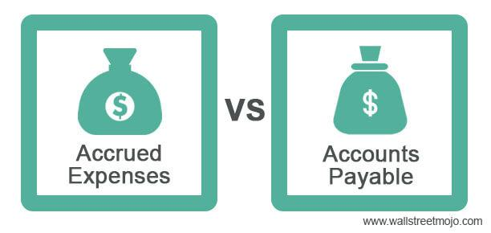

## Table of Contents

## What are accrued expenses?

Accrued expenses are costs that a company has incurred but hasn't paid yet. These expenses are recorded on the company's books before they are actually paid. This helps to match the expenses with the revenues they helped to generate, following the accounting principle of matching.

For example, if a company receives a utility service in December but doesn't get the bill until January, the expense for that utility service would be recorded in December as an accrued expense. This way, the expense is recognized in the same period as the revenue it helped to earn, giving a more accurate picture of the company's financial performance for that period.

## What is accounts payable?

Accounts payable is the money a company owes to its suppliers for goods or services that it has received but not yet paid for. It's like an IOU from the company to its suppliers. When a company buys something on credit, it records this amount as accounts payable on its balance sheet. This helps the company keep track of what it owes and when it needs to pay.

When the company finally pays the supplier, it reduces the amount in accounts payable. This is important for managing cash flow and maintaining good relationships with suppliers. Keeping track of accounts payable helps a company know how much money it needs to set aside to pay its bills on time.

## How do accrued expenses and accounts payable differ in terms of recognition?

Accrued expenses and accounts payable are both types of liabilities, but they are recognized differently. Accrued expenses are costs that a company has used up but hasn't paid for yet. These are recognized before the company gets a bill. For example, if a company uses electricity in December but doesn't get the bill until January, it would record the cost of that electricity as an accrued expense in December. This helps match the expense with the revenue it helped generate in the same period.

On the other hand, accounts payable are recognized when a company receives a bill or an invoice from a supplier. This happens after the company has received goods or services but before it has paid for them. For instance, if a company buys supplies on credit in December and gets an invoice right away, it would record this as accounts payable in December. The key difference is that accounts payable are recognized when the company knows exactly how much it owes, while accrued expenses are estimated and recorded before the company gets the bill.

## Can you explain the timing differences between accrued expenses and accounts payable?

Accrued expenses and accounts payable both mean money a company owes, but they are recorded at different times. Accrued expenses are recorded before the company gets a bill. For example, if a company uses electricity in December but doesn't get the bill until January, it will record the cost of that electricity in December as an accrued expense. This helps the company show the expense in the same month it used the electricity.

Accounts payable, on the other hand, are recorded when the company gets a bill or invoice. If a company buys supplies on credit in December and gets an invoice right away, it will record this as accounts payable in December. The main difference is that accounts payable are recorded when the company knows exactly how much it owes, while accrued expenses are recorded before the company gets the bill, based on an estimate of what it will owe.

## What types of expenses typically fall under accrued expenses?

Accrued expenses often include costs that a company knows it will have to pay but hasn't gotten a bill for yet. Common examples are things like wages for employees, where the work has been done but the paycheck hasn't been issued yet. Another example is interest on loans, where the interest keeps adding up but the company hasn't paid it yet. Also, utilities like electricity or water can be accrued expenses if the company uses them before getting a bill.

These types of expenses are recorded before the company gets the bill to make sure the costs match up with the time when they were used. This helps the company keep its financial records accurate and up-to-date. By recording these expenses early, the company can show a clearer picture of its financial health for each period.

## What types of liabilities are usually classified as accounts payable?

Accounts payable are usually the amounts a company owes to its suppliers for things it bought on credit. This can include stuff like raw materials, inventory, or services the company used but hasn't paid for yet. When a company gets an invoice or bill from a supplier, it records this amount as accounts payable.

These liabilities are different from things like loans or mortgages, which are long-term debts. Accounts payable are more about the everyday purchases a company makes to keep running. It's important for a company to keep track of its accounts payable so it knows when to pay its bills and can manage its cash flow properly.

## How do accrued expenses affect financial statements?

Accrued expenses affect financial statements by showing costs that a company has used but hasn't paid for yet. They are recorded as liabilities on the balance sheet. This means the company's total liabilities go up, which can make the company look like it has less money than it really does. But, it's important because it shows a true picture of how much the company owes at that time.

On the income statement, accrued expenses are also shown as expenses for the period they relate to. This helps match the costs with the money the company made during that time. For example, if a company used electricity in December but got the bill in January, the cost of that electricity would be shown as an expense in December's income statement. This way, the financial statements give a more accurate view of the company's profit or loss for each period.

## How does accounts payable impact a company's cash flow?

Accounts payable impacts a company's cash flow because it shows how much money the company needs to pay out soon. When a company buys things on credit, it doesn't pay right away, so it can use that money for other things in the meantime. This can help the company keep more cash on hand, which is good for its cash flow. But, the company still has to pay these bills eventually, so it needs to plan when to use its cash to cover these expenses.

If a company has a lot of accounts payable, it means it owes a lot of money to suppliers. This can be a problem if the company doesn't have enough cash to pay these bills when they're due. It's important for the company to manage its accounts payable carefully so it can keep its cash flow healthy. By paying bills on time and keeping good relationships with suppliers, a company can make sure it has enough money to keep running smoothly.

## What are the accounting entries for recording accrued expenses?

When a company records an accrued expense, it makes two accounting entries. The first entry is to increase an expense account on the income statement. For example, if the company used electricity in December but hasn't paid the bill yet, it would increase the "Utilities Expense" account. The second entry is to increase a liability account on the balance sheet. Using the same example, the company would increase the "Accrued Utilities Payable" account. These entries show that the company has used up the electricity and owes money for it, even though it hasn't paid the bill yet.

When the company finally pays the accrued expense, it makes another set of entries to reverse the initial recording. The company would decrease the "Accrued Utilities Payable" account on the balance sheet, showing that it no longer owes that money. At the same time, it would decrease the "Cash" account, because it used cash to pay the bill. These entries help keep the company's financial records accurate and up-to-date, showing that the expense has been paid and the cash has been used.

## What are the journal entries for accounts payable?

When a company buys something on credit and gets an invoice, it records this as accounts payable. The first entry is to increase an expense or asset account on the income statement or balance sheet. For example, if the company buys supplies, it would increase the "Supplies Expense" account. At the same time, it increases the "Accounts Payable" account on the balance sheet, showing that it owes money to the supplier.

When the company pays the bill, it makes another set of entries. The company decreases the "Accounts Payable" account on the balance sheet, showing that it no longer owes that money. At the same time, it decreases the "Cash" account, because it used cash to pay the bill. These entries help keep the company's financial records accurate and up-to-date, showing that the expense has been paid and the cash has been used.

## How do businesses manage and control accrued expenses?

Businesses manage and control accrued expenses by keeping good records and making sure they know when these expenses are coming up. They do this by looking at past bills and knowing when they usually get them. For example, if a company knows it uses electricity every month and gets the bill a few weeks later, it can guess how much it will owe and write that down as an accrued expense. This helps the company plan its budget and make sure it has enough money to pay these bills when they come in.

To control accrued expenses, businesses also try to pay their bills on time. This can help them avoid extra fees or interest that might come from paying late. They might set up reminders or use special software to keep track of when bills are due. By doing this, they can make sure they don't forget to pay and keep their financial records accurate. Good management of accrued expenses helps a business run smoothly and keep its money in order.

## What strategies can companies use to optimize their accounts payable processes?

Companies can optimize their accounts payable processes by using technology to automate tasks. Many businesses use special software that helps them keep track of invoices and bills, making sure they don't miss any payments. This software can also help them pay bills faster and more accurately, which can save time and reduce mistakes. By automating these tasks, companies can focus more on other important work and make sure their money is managed well.

Another strategy is to build good relationships with suppliers. If a company has a good relationship with its suppliers, it might be able to negotiate better payment terms. This could mean getting more time to pay bills or getting discounts for paying early. Good communication with suppliers can also help avoid problems like late fees or disagreements over invoices. By working well with suppliers, a company can manage its cash flow better and keep its accounts payable process running smoothly.

## References & Further Reading

[1]: Bergstra, J., Bardenet, R., Bengio, Y., & Kégl, B. (2011). ["Algorithms for Hyper-Parameter Optimization."](https://papers.nips.cc/paper/4443-algorithms-for-hyper-parameter-optimization) Advances in Neural Information Processing Systems 24.

[2]: ["Advances in Financial Machine Learning"](https://www.amazon.com/Advances-Financial-Machine-Learning-Marcos/dp/1119482089) by Marcos Lopez de Prado

[3]: ["Evidence-Based Technical Analysis: Applying the Scientific Method and Statistical Inference to Trading Signals"](https://www.amazon.com/Evidence-Based-Technical-Analysis-Scientific-Statistical/dp/0470008741) by David Aronson

[4]: ["Machine Learning for Algorithmic Trading"](https://github.com/stefan-jansen/machine-learning-for-trading) by Stefan Jansen

[5]: ["Quantitative Trading: How to Build Your Own Algorithmic Trading Business"](https://www.amazon.com/Quantitative-Trading-Build-Algorithmic-Business/dp/1119800064) by Ernest P. Chan