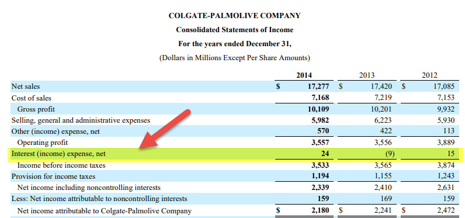

In financial accounting, accrued interest and accrued expenses are fundamental concepts. Accrued interest refers to the interest that has accumulated on a financial instrument, such as a bond or loan, but has not yet been paid or received by the relevant parties. This interest is recognized in financial statements as it is earned or incurred, regardless of when the actual cash transactions occur. Accrued expenses, on the other hand, are expenses that have been incurred but not yet paid. These liabilities are recorded on the balance sheet and are crucial for providing a more accurate picture of a company's financial health by reflecting obligations that need to be settled in the future.

These concepts are vital for financial reporting as they ensure that revenues and expenses are matched with the periods to which they pertain, following the accrual accounting principle. Accrual accounting provides a more comprehensive and realistic depiction of a company's financial situation compared to cash accounting, particularly in complex financial landscapes. Accurate calculations of accrued interest and expenses are pivotal for preparing reliable financial statements, which inform stakeholders and guide strategic financial decisions.



Algorithmic trading represents a significant transformation within the financial markets, utilizing computer algorithms to execute trades based on pre-programmed criteria. The growing importance of algorithmic trading is underscored by its ability to process vast amounts of market data at high speeds, facilitating efficient and effective trade executions that would be difficult to achieve manually.

The purpose of this article is to examine the intersection of accrued interest, accrued expenses, and algorithmic trading. Understanding these components and their interrelationships is crucial for finance professionals and investors, as they play a significant role in financial analysis, strategic investment decisions, and market operations. The article will explore how financial accounting principles, specifically those related to accruals, are integrated into algorithmic trading platforms, enhancing their functionality and accuracy. This understanding is pivotal for those navigating the evolving landscape of financial markets, empowering them to leverage advances in technology and accounting for enhanced financial and investment outcomes.

## Table of Contents

## Understanding Accrued Interest

Accrued interest represents the interest that has been earned but not yet paid or received, and it is a crucial component in financial accounting. This concept is essential when working with financial statements as it ensures that earnings and expenses are recorded in the periods they occur, rather than when cash transactions happen. By adhering to accrual accounting principles, businesses and investors can gain a clearer understanding of a company's actual financial performance.

Accurate calculation of accrued interest is vital for up-to-date and precise financial statements. Any discrepancies in interest calculations can lead to misstated earnings, affecting key financial metrics used by stakeholders to assess a company's financial health. For instance, if accrued interest is underestimated, income could be overstated, potentially misleading investors and analysts who rely on such data for decision-making.

To better understand the application of accrued interest, consider its role in bonds and loans. For a bondholder, accrued interest is the interest that has accumulated since the last payment period but has not yet been paid by the bond issuer. For example, if an investor holds a bond that pays interest semi-annually and decides to sell it before the interest payment date, the buyer must compensate the seller for the interest earned from the last payment date to the transaction date. This ensures that the seller receives the interest they earned while holding the bond.

In the case of loans, accrued interest refers to the interest a borrower accumulates on a loan balance over time, which is yet to be paid. For instance, consider a loan with monthly interest calculations. If a company prepares its financial statements at the end of each month, it must record the interest accrued for that period as an expense, even if payment is not due until later.

Accrued interest affects cash flow and financial performance by impacting the timing of cash receipts and payments. Although accrued interest does not involve immediate cash flow, it reflects future cash obligations or receivables, thus influencing [liquidity](/wiki/liquidity-risk-premium) management. Proper accounting ensures that financial statements accurately reflect a company's obligations and positions, allowing for better cash flow management and planning.

When accounting for accrued interest in diverse financial instruments, several considerations come into play. Each type of financial instrument may have unique attributes and rules governing interest accrual. For example, zero-coupon bonds accrue interest, which is not paid periodically but rather when the bond matures. As such, the accruing of interest must be carefully tracked to ensure accurate financial reporting. Furthermore, interest rates may vary over time, particularly with variable-rate loans, adding complexity to the accrual calculations. 

In summary, understanding accrued interest is crucial for accurate financial accounting. By ensuring precision in its calculation and reporting, finance professionals can provide reliable financial documents that support sound decision-making for both internal and external stakeholders.

## Accrued Expenses: A Closer Look

Accrued expenses are obligations that a company has incurred during a specific period but has not yet paid. These expenses are recognized under the accounting method known as accrual accounting, which requires expenses to be recorded when they are incurred, regardless of when the actual cash outlay occurs. This approach is fundamental in providing an accurate depiction of a company's financial position and performance.

### Differences Between Accrued and Cash Expenses

Accrued expenses differ significantly from cash expenses. Cash expenses are recorded when the actual transaction occurs, meaning the cash has changed hands. In contrast, accrued expenses are recognized before the payment is made, reflecting the company’s future liabilities. The primary significance of this distinction is that accrued expenses ensure that financial statements accurately reflect an organization's liabilities and expenses during a given period, thereby enhancing the reliability of financial reporting.

### Common Examples of Accrued Expenses

In business operations, several types of expenses are commonly accrued. These may include:

1. **Salaries and Wages**: Employees may work during a pay period but are paid after the period concludes, creating an accrual for unpaid salaries.
2. **Interest Expense**: Interest on loans that has been incurred but not yet paid by the end of the accounting period.
3. **Utilities**: Utility expenses such as electricity and water that are incurred in one accounting period but billed in the next.

### Impact on Financial Statements

Accrued expenses impact an organization's balance sheet and income statement. On the balance sheet, accrued expenses are typically listed under current liabilities, indicating amounts owed that will typically be settled within a short period. On the income statement, they are included as part of the total expenses for the period. This treatment ensures that the net income reflects the true expenses associated with generating revenue for that period.

### Recording and Reporting Accrued Expenses

Proper recording and reporting of accrued expenses follow several guidelines. To accurately account for these expenses, companies should:

- Ensure consistent application of accounting principles to maintain comparability across reporting periods.
- Employ detailed records of all transactions and supporting documentation to verify the expenses incurred.
- Recognize expenses systematically using the accrual accounting framework to align with revenue recognition, thus adhering to the matching principle.

The process typically involves journal entries that debit the appropriate expense account and credit the accrued liabilities account. As payments are made, these liabilities are debited, and the corresponding cash account is credited. This systematic approach allows for an accurate portrayal of an organization's financial obligations and profitability over time. 

Understanding and managing accrued expenses is crucial for maintaining the integrity of financial reports and ensuring informed decision-making by management and stakeholders. This practice underpins robust financial reporting and aids in maintaining transparency, thereby fostering investor and stakeholder confidence.

For further reading, consult resources such as the Financial Accounting Standards Board (FASB) guidelines and other authoritative accounting literature to ensure compliance and a comprehensive understanding of accrual accounting practices.

## The Link Between Accrual Accounting and Financial Analysis

Accrual accounting principles are essential for accurate financial analysis as they provide a comprehensive view of an organization's financial health. Unlike cash accounting, which records transactions only when cash changes hands, accrual accounting recognizes economic events when they occur, regardless of the cash flow. This method ensures that revenue and expenses are matched in the period they occur, providing a more accurate picture of financial performance.

Accrued interest and expenses are key components of accrual accounting, allowing analysts to assess a company's financial health by providing insights into its obligations and revenue streams. Accrued interest involves interest expenses that have been incurred but not yet paid, as well as interest income that has been earned but not yet received. This is critical in financial reporting for loans and bonds, where matching interest expense or income to the correct period prevents distortion of financial results. Similarly, accrued expenses represent obligations a business must pay in the future for goods or services already received. Accounting for these ensures liabilities are not understated, impacting the balance sheet and offering a true representation of financial commitments.

For investors and analysts, understanding accrual accounting methods is crucial as they help predict future cash flows and assess profitability and risk. Accrual-based financial statements, such as income statements and balance sheets, offer a clearer view of things like revenue growth trends and expense management. For instance, high accrued expenses might indicate potential liquidity issues, prompting further investigation into an organization's operational efficiency and cash management practices.

Integrating accrual accounting data into financial models involves using various techniques and tools to adjust raw data into insights that predict future performance. Best practices include consistently applying accounting standards to ensure comparability, using software tools for precise calculations, and incorporating sensitivity analyses to account for market [volatility](/wiki/volatility-trading-strategies):

```python
def calculate_accrual_revenue(received_cash, accounts_receivable):
    return received_cash + accounts_receivable

# Example usage
print(calculate_accrual_revenue(10000, 2000))  # Outputs 12000
```

Growing businesses face specific challenges in implementing accrual accounting, primarily due to the complexity of tracking numerous transactions over multiple periods. This complexity often requires significant organizational resources, which can be burdensome for smaller firms. Moreover, businesses expanding into new markets must ensure compliance with international accounting standards, such as IFRS or GAAP, which can differ significantly from local practices. These challenges highlight the need for robust accounting systems and knowledgeable staff to maintain accurate and reliable financial records. Nevertheless, businesses that successfully implement and manage accrual accounting systems can gain significant advantages in forecasting, budgeting, and strategic planning, ultimately contributing to better financial performance and investor confidence.

## Algorithmic Trading: Basics and Benefits

Algorithmic trading, often termed as algo trading, refers to the use of computer algorithms to automate trading processes in financial markets. It has transformed trading by enabling swift decisions based on pre-set criteria without human intervention. This technology is pivotal in modern trading due to its speed, precision, and efficiency. 

Algorithms execute trades by analyzing vast data sets almost instantaneously, identifying trading opportunities that align with their pre-programmed strategies. These could include statistical [arbitrage](/wiki/arbitrage), [market making](/wiki/market-making), or [trend following](/wiki/trend-following). The capacity to execute trades in fractions of a second allows traders to capitalize on thin-margin opportunities not possible through manual trading methods.

The benefits of [algorithmic trading](/wiki/algorithmic-trading) are multifaceted for both retail and institutional investors. It minimizes human errors, reduces transaction costs, and can detect arbitrage opportunities faster than any human trader could. Institutional investors, such as hedge funds and investment banks, leverage algo trading for its scalability and to manage large-[volume](/wiki/volume-trading-strategy) trades with minimal market impact. Retail investors benefit by gaining access to sophisticated trading strategies previously exclusive to institutional players.

Technological advancements continue to shape algo trading. Innovations in [artificial intelligence](/wiki/ai-artificial-intelligence) and [machine learning](/wiki/machine-learning) enable algorithms to evolve by learning from historical data and adjusting strategies dynamically. Cloud computing enhances computational power and data storage capabilities, facilitating more complex analysis and strategy development. 

Several case studies underscore the success of algorithmic trading. For instance, Renaissance Technologies, a [hedge fund](/wiki/hedge-fund-trading-strategies) founded by James Simons, employs mathematical models to trade in financial markets, generating remarkable returns over decades. Similarly, high-frequency trading firms, such as Citadel Securities and Virtu Financial, attribute their market dominance to robust algorithmic strategies that process millions of transactions daily.

In summary, algorithmic trading has redefined how trades are executed in financial markets, offering substantial advantages through improved efficiency, reduced costs, and enhanced decision-making capabilities. As technology progresses, algorithmic trading is poised to become even more integral to trading strategies worldwide.

## Integrating Financial Calculations in Algorithmic Trading

Financial accounting principles, such as accrued interest and expenses, play a pivotal role in the development and function of trading algorithms. By ensuring the accurate representation of financial data, these principles help improve the reliability and effectiveness of algorithmic trading strategies.

**Influence on Trading Algorithms**

Accrued interest and expenses are two critical components that influence the decisions within trading algorithms. Accrued interest refers to the interest that has accumulated on an investment or loan but has not yet been paid. This figure is essential as it helps in accurately determining the present value of fixed-income securities, which in turn informs an algorithm's trading strategy. Accrued expenses, on the other hand, represent liabilities that have been incurred but not yet paid. Accurately accounting for these expenses ensures a realistic assessment of an organization's financial liabilities, aiding in more precise trading decisions.

**Importance of Accurate Financial Data**

The accuracy of financial data is crucial, as even minor discrepancies can lead to significant trading errors. Algorithms depend on the precision of the data inputted into them; incorrect accrued interest calculations, for instance, can skew the assessed value of investments, leading to erroneous buy/sell decisions. Similarly, misreported accrued expenses can distort an entity's financial health, affecting the risk assessments that are crucial for trading algorithms.

**Examples and Code Integration**

Several trading algorithms integrate financial accounting data to enhance trading outcomes. For example, an algorithm may utilize a time series analysis that considers accrued interest to forecast future bond yields. Here's a simple Python snippet demonstrating the calculation of accrued interest and its integration into a trading decision framework:

```python
def calculate_accrued_interest(principal, rate, time_period):
    return principal * (rate / 100) * time_period

principal = 1000  # Investment amount in dollars
rate = 5  # Annual interest rate in percentage
time_period = 0.5  # Half a year

accrued_interest = calculate_accrued_interest(principal, rate, time_period)

# Sample trading decision based on accrued interest
def trading_decision(accrued_interest):
    if accrued_interest > 25:
        return "Buy"
    else:
        return "Hold"

decision = trading_decision(accrued_interest)
```

This example highlights how accrued interest can be calculated and used within a simple trading algorithm to inform trading decisions.

**Impact of Errors in Financial Data**

Errors in financial data can have dramatic consequences in algorithmic trading. A miscalculation or a delay in updating accrued expenses could lead to incorrect assumptions about a company's liability, potentially causing losses. To mitigate these risks, financial data used in algorithms must be validated and updated regularly to reflect the most accurate information.

**Future Trends**

As technology advances, the integration of financial accounting principles with algorithmic trading is expected to become more sophisticated. Machine learning (ML) and artificial intelligence (AI) are anticipated to enhance the ability of algorithms to interpret complex financial data, offering deeper insights and more nuanced trading strategies. We can expect algorithms to autonomously adjust for discrepancies and learn from past errors, thereby further reducing the risk associated with inaccurate financial data.

In conclusion, as financial markets continue to evolve, the integration of financial accounting principles with algorithmic trading will become increasingly crucial. Accurate financial data will remain fundamental to the development of effective trading strategies, making a strong case for continuous technological improvements and education in both fields.

## Challenges and Opportunities

Merging financial accounting data with algorithmic trading presents significant challenges and opportunities, shaping the future of finance. Traders and accountants face the complex task of integrating detailed financial data, such as accrued interest and expenses, into algorithmic models. The precision of accounting data is critical to the accuracy of trading algorithms. Discrepancies or errors in financial data can result in flawed trading strategies, leading to substantial financial loss. Traders must therefore ensure that the algorithms they develop are designed to account for and correct such data anomalies promptly.

Opportunities for innovation abound at the intersection of accounting and technology. By leveraging advanced data analytics and machine learning, financial professionals can enhance the precision and efficacy of algorithmic trading strategies. For instance, real-time data processing and predictive analytics can improve decision-making and enable more dynamic adjustments to trading algorithms. Furthermore, blockchain technology offers potential in ensuring data integrity and transparency, which can significantly enhance trust in automated trading systems.

Regulatory considerations are paramount when integrating financial accounting data with trading algorithms. Regulatory bodies worldwide require that trading activities be transparent and compliant with financial reporting standards. Traders must ensure their algorithms can adapt to changing regulatory environments, complying with guidelines for financial data reporting and record-keeping. This involves incorporating regulatory checks into their trading systems to monitor compliance continuously and mitigate the risk of costly penalties.

The future prospects for automation and AI in financial accounting and trading are promising. Automation can streamline back-office operations, reduce human error, and increase efficiency in financial statement preparation. AI algorithms can analyze vast amounts of data rapidly and identify trading opportunities that may be overlooked by human traders, driving further innovation. As AI continues to evolve, its role in financial decision-making will likely expand, providing more sophisticated tools for traders and accountants.

In conclusion, the evolving landscape of financial markets, characterized by the integration of accrual accounting practices with algorithmic trading, offers both challenges and opportunities. As financial technology advances, professionals must remain vigilant in adapting their practices to keep pace with innovations that can transform the way trading is executed. Continued education and adaptation are essential in navigating this dynamic environment, ensuring that the potential benefits of these technologies are fully realized while mitigating associated risks.

## Conclusion

Accrued interest and expenses play a significant role in financial accounting by ensuring the accurate representation of a company's financial position. Accrued interest refers to the interest that has been earned but not yet received, or incurred but not yet paid. Similarly, accrued expenses are costs that have been incurred but not yet settled in cash. Both concepts ensure that financial statements reflect the true financial health and obligations of a business, making them crucial for investors, analysts, and accountants. Accurate accounting of these items facilitates the proper assessment of an organization's cash flow and financial performance.

Algorithmic trading has transformed modern finance by enhancing efficiency, speed, and precision in trade execution. Algorithms allow traders to process vast amounts of market data and execute trades at speeds and volumes impossible for human traders. This technological advancement is beneficial for both retail and institutional investors, providing opportunities for improved pricing strategies and market analysis.

The integration of financial accounting principles, such as accrued interest and expenses, into algorithmic trading systems is becoming increasingly vital. Ensuring the accuracy and reliability of financial data used in these trading algorithms is essential for developing sound trading strategies. Financial accounting data can influence trading decisions, helping in the prediction of market trends and making informed trades.

Staying informed about advancements in finance and technology is crucial for professionals in the financial sector. The rapid evolution of finance technologies, such as algorithmic trading and automated accounting systems, necessitates continuous learning and adaptation. Finance professionals must keep pace with regulatory changes and new technologies to maintain a competitive edge.

In conclusion, the intersection of financial accounting and algorithmic trading presents both challenges and opportunities. Understanding and effectively integrating these fields can lead to significant advancements and innovations within financial markets. Encouraging ongoing education and adaptability will enable finance professionals to thrive in this dynamic environment, advancing their careers and contributing to the evolution of financial practices.

## References & Further Reading

[1]: FASB. (2023). ["Standards & Guidance."](https://fasb.org/jsp/FASB/Page/SectionPage&cid=1176156316498) Financial Accounting Standards Board.

[2]: Lopez de Prado, M. (2018). ["Advances in Financial Machine Learning."](https://www.amazon.com/Advances-Financial-Machine-Learning-Marcos/dp/1119482089) Wiley.

[3]: Aronson, D. R. (2006). ["Evidence-Based Technical Analysis: Applying the Scientific Method and Statistical Inference to Trading Signals."](https://www.amazon.com/Evidence-Based-Technical-Analysis-Scientific-Statistical/dp/0470008741) Wiley.

[4]: Jansen, S. (2020). ["Machine Learning for Algorithmic Trading."](https://github.com/stefan-jansen/machine-learning-for-trading) Packt Publishing.

[5]: Chan, E. P. (2009). ["Quantitative Trading: How to Build Your Own Algorithmic Trading Business."](https://github.com/ftvision/quant_trading_echan_book) Wiley.