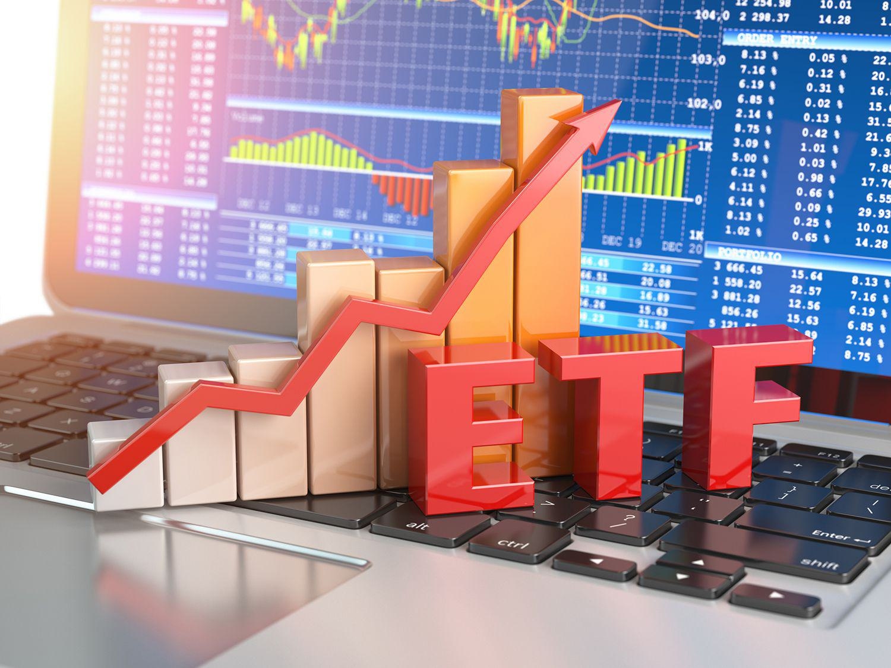

Investment strategies are essential components of financial planning, facilitating informed decision-making in the allocation of assets to achieve long-term financial goals. These strategies encompass a variety of approaches, tailored to accommodate different risk appetites, time horizons, and market conditions, thereby helping investors in maximizing returns while managing risks effectively.

Exchange-Traded Funds (ETFs) are pivotal in investment portfolios, offering a versatile investment vehicle that combines features of mutual funds and individual stocks. An ETF is a type of investment fund and exchange-traded product, meaning it is traded on stock exchanges. ETFs provide diversification by holding a collection of assets, such as stocks, bonds, or commodities, usually aimed to track the performance of a specific index. This inherent diversification reduces unsystematic risk, making ETFs an attractive option for both individual and institutional investors.

Investment strategies can be categorized broadly into active and passive. Active investment strategies involve the frequent buying and selling of securities based on researched predictions to outperform market indices. They necessitate insightful market analysis and portfolio management skills, aiming for higher returns than standard market benchmarks. Conversely, passive investment strategies focus on replicating the performance of market indices with minimal trading. Such strategies are characterized by their simplicity, lower cost, and generally reduced risk due to lesser engagement in market timing activities.

Algorithmic trading, or algo trading, is becoming increasingly prevalent in modern investing. It employs automated software to execute trades at speeds and frequencies that are impossible for human traders. These algorithms, governed by pre-defined criteria such as timing, price, and volume, enable execution of complex strategies, often harnessing big data and machine learning to optimize performance. Algo trading enhances efficiency, provides liquidity, and often results in more accurate and speedy trade executions. Yet, it also introduces challenges, including the potential for increased market volatility and the need for robust technical infrastructure.

This article aims to explore the nuances of active versus passive ETF investing, elucidating their respective benefits, drawbacks, and suitability across different investment contexts. Additionally, it examines how algorithmic trading is shaping the landscape of ETF investing, offering insights into its role in complementing these strategies.

## Table of Contents

## Understanding ETF Investing

Exchange-Traded Funds (ETFs) are investment funds traded on stock exchanges, similar to stocks. ETFs hold assets such as stocks, commodities, or bonds and generally operate with an arbitrage mechanism designed to keep trading close to its net asset value, though deviations can occasionally occur. This mechanism provides investors an efficient way to gain exposure to a variety of asset classes without having to buy each individual component.

ETFs offer several notable benefits. Firstly, diversification is a key advantage; by purchasing an [ETF](/wiki/etf-trading-strategies), investors can gain exposure to a wide array of securities. This can help mitigate the risk associated with investing in individual stocks. Secondly, ETFs are known for their [liquidity](/wiki/liquidity-risk-premium). Given that they are traded on stock exchanges, ETFs can be bought and sold throughout the trading day at market prices, unlike mutual funds, which trade only at the end of the day. Finally, ETFs generally have lower expense ratios compared to mutual funds, partly due to their passive management nature.

There are two primary types of ETFs: active and passive. Passive ETFs aim to replicate the performance of a specific index, such as the S&P 500. These ETFs simply track an index and try to mirror its performance. In contrast, active ETFs are managed by portfolio managers who make investment decisions based on research, forecasts, and experience to outperform the market or a particular benchmark.

Investors often choose ETFs over other investment options for several reasons. Besides the advantages of diversification and liquidity, ETFs provide transparency, as they disclose their holdings on a daily basis. Additionally, the cost efficiency of ETFs, especially passive ones, is a significant [factor](/wiki/factor-investing). The tax efficiency of ETFs, due to their "in-kind" creation and redemption process, also attracts investors. This process minimizes capital gains distributions compared to mutual funds.

In summary, ETFs offer a flexible, cost-effective, and diversified way for investors to participate in the financial markets. They provide the advantages of stock-like trading, allowing for tactical allocation adjustments while maintaining a broad market exposure.

## Active ETF Investing: An In-Depth Look

Active ETF investing involves a strategic approach where fund managers actively select securities to buy and sell with the aim of outperforming a specific benchmark index. Unlike passive ETFs, which aim to replicate the performance of an index, active ETFs are managed with a goal of achieving higher returns through strategic decision-making and market analysis.

The potential benefits of active ETF investing include the possibility of higher returns and more tailored investment strategies. Active fund managers utilize their expertise to identify undervalued securities, take advantage of market inefficiencies, and adjust portfolios in response to macroeconomic trends and other factors. This flexibility can potentially lead to above-average returns, particularly in volatile or inefficient markets where active management might exploit mispricings.

However, active ETF investing comes with its own set of risks and costs. The performance of active ETFs largely depends on the skill of the fund manager, which introduces the risk of human error or misjudgment. Moreover, active management typically incurs higher fees compared to passive alternatives, due to the costs of research, trading, and management. These costs can eat into the fund's returns, making it essential for investors to weigh potential benefits against increased expenses.

Examples of popular active ETFs and their managers include the ARK Innovation ETF (ARKK), managed by ARK Investment Management, which focuses on disruptive innovation across multiple sectors, and the iShares U.S. Treasury Bond ETF (GOVT) managed by BlackRock, which actively manages a portfolio of U.S. government bonds. These active ETFs demonstrate the range of strategies and focuses that can be employed under an active management approach.

## Passive ETF Investing: A Comprehensive Guide

Passive ETF investing is a strategy focused on replicating the performance of a specific index or benchmark. Unlike active investing, where fund managers make decisions to outperform the market, passive investing aims to mirror the returns of a market index as closely as possible. This approach is grounded in the Efficient Market Hypothesis (EMH), which suggests that it is difficult to consistently outperform the market due to its inherent efficiency.

### Advantages of Passive ETF Investing

One of the primary benefits of passive ETF investing is its cost-effectiveness. Since passive ETFs do not require frequent buying and selling of securities, they incur lower transaction costs. Additionally, the management fees for passive ETFs tend to be lower compared to active funds because they do not require the same level of analysis and oversight by fund managers. This cost advantage can significantly impact net returns, especially over extended periods.

Another key advantage is simplicity. Investors in passive ETFs typically have a clear understanding of what they are investing in because these funds are designed to track well-known indices, such as the S&P 500 or the MSCI Emerging Markets Index. This transparency allows for straightforward investment decisions and easier portfolio management.

### Potential Drawbacks

Despite their advantages, passive ETFs also have limitations. One such drawback is limited flexibility. Since passive funds are structured to follow an index, they lack the ability to adapt to market changes or capitalize on short-term opportunities. This inflexibility means investors may miss out on potential gains that active management could exploit.

Tracking error is another potential issue. This occurs when a passive ETF's performance deviates from that of its benchmark index. While many passive ETFs have minimal tracking errors, factors like fees, market impact of trades, and securities lending can cause discrepancies.

### Widely-Used Passive ETFs and Their Benchmarks

Several passive ETFs are widely utilized by investors due to their broad market coverage and reliability. Some of the most common include:

1. **SPDR S&P 500 ETF Trust (SPY)**: This ETF seeks to replicate the performance of the S&P 500 Index, which consists of 500 of the largest U.S. companies. 

2. **Vanguard Total Stock Market ETF (VTI)**: Tracking the CRSP US Total Market Index, this ETF provides exposure to a wide array of U.S. stocks, including small, mid, and large-cap companies.

3. **iShares MSCI Emerging Markets ETF (EEM)**: This ETF aims to mirror the MSCI Emerging Markets Index, offering investors access to equities in developing markets.

4. **Invesco QQQ Trust (QQQ)**: Following the NASDAQ-100 Index, this ETF consists of 100 of the largest non-financial companies listed on the NASDAQ stock exchange.

These ETFs offer investors the ability to gain diversified exposure to various market segments while benefiting from the cost efficiencies and simplicity associated with passive investing.

## Algorithmic Trading in ETF Investing

Algorithmic trading, often referred to as algo trading, leverages computer algorithms to execute trading decisions at speeds and frequencies that are impossible for human traders. These algorithms utilize pre-established criteria to decide on the timing, pricing, and quantity of orders. Traditionally utilized by large institutional investors, algo trading is applied to various securities, including ETFs.

Algo trading complements active ETF strategies by enhancing the decision-making process. Active ETF managers can use algorithms to identify short-term market inefficiencies, executing trades that aim to capitalize on fleeting opportunities. In a passive strategy, algo trading can optimize the tracking of benchmark indices, ensuring that the ETF portfolio closely replicates the intended index with minimal tracking error. This is particularly important for high-frequency and high-[volume](/wiki/volume-trading-strategy) environments.

The primary benefits of [algorithmic trading](/wiki/algorithmic-trading) include speed and precision. Algorithms can swiftly process vast datasets, react to market data instantly, and execute complex strategies without the delay inherent in human operations. This leads to efficient and data-driven decision-making, which can enhance return potentials while mitigating risk. Algorithms can also handle large volumes of trades, capitalizing on minute price discrepancies across markets, known as [arbitrage](/wiki/arbitrage) opportunities.

Despite these benefits, there are inherent challenges and risks in algorithmic trading. Market [volatility](/wiki/volatility-trading-strategies) can exacerbate risks associated with rapid algorithmic transactions, potentially leading to significant financial losses. Additionally, technical failures such as system malfunctions or programming errors can disrupt trading operations. In worst-case scenarios, such failures could contribute to flash crashes—sudden, deep market downturns often exacerbated by high-frequency trading algorithms.

To mitigate these risks, robust risk management protocols and advanced testing of algorithms under various market conditions are crucial. Regular system audits and the implementation of safeguard mechanisms, such as circuit breakers, can further ensure stable operation in tumultuous markets. Moreover, regulatory oversight plays a significant role in monitoring algorithmic strategies to maintain financial market stability.

## Comparing Active vs. Passive ETF Investing

Active and passive ETF investing strategies present distinct characteristics that impact their performance and risk profiles, making each suitable for different investor needs and circumstances. Understanding these differences can help investors select the most appropriate approach for their financial goals.

Active ETF investing involves a management team making decisions about how to allocate or manage fund resources with the goal of outperforming a specific index or benchmark. Managers actively identify investment opportunities, react to market changes, and adjust the fund composition accordingly. As a result, active ETFs can potentially offer higher returns, especially in market environments where skilled management can add value. However, the increased potential for higher returns comes with higher costs due to management fees and increased trading frequency. Additionally, active strategies bear a greater risk of underperformance relative to passive strategies because of the possibility of incorrect market predictions or managerial errors.

Conversely, passive ETF investing aims to replicate the performance of a specific index by investing in securities that form the index. This strategy is generally associated with lower costs, as there is little need for active management and trading is minimized. The risks with passive investing often relate to tracking errors, where the ETF might not perfectly follow its benchmark, and limited flexibility in adapting to market conditions. Despite these limitations, passive strategies typically offer more predictable returns and have historically outperformed most actively managed funds, especially over longer time horizons.

In terms of risk profiles, active ETFs are more suitable for investors with a higher risk tolerance and who are seeking above-market returns, while passive ETFs are preferable for those looking for a cost-effective, straightforward investment that provides market-average returns. Active ETFs may be more suitable during periods of market volatility when skilled management could capitalize on market inefficiencies. On the other hand, passive ETFs are often recommended for investors interested in long-term growth with a lower cost and risk.

The future of ETF investing is likely to see a growing influence of algorithmic trading. Algorithmic solutions can enhance both active and passive strategies by improving execution efficiency, reducing costs, and facilitating more sophisticated data analysis. Active strategies might benefit from algorithmic tools to better identify market trends and optimize trading decisions, while passive strategies could use algorithms to minimize tracking errors and adjust portfolio compositions more effectively.

While both active and passive ETF investing have their merits, the choice between them should consider an investor's individual financial objectives, time horizon, and risk appetite. As technology and algorithmic solutions continue to evolve, they promise to play a significant role in enhancing the efficiency and efficacy of both strategies.

## Making the Right Choice: Factors to Consider

When deciding between active and passive ETF investment strategies, investors face several important considerations that can significantly impact their financial outcomes. Each strategy has its unique characteristics, and the choice largely depends on an individual's financial situation, preferences, and goals.

### Investment Goals, Risk Tolerance, and Time Horizon

1. **Investment Goals**: Investors should begin by defining their financial objectives. Active ETFs may appeal to those seeking to outperform the market through strategic stock selection and timing, while passive ETFs often attract those who prioritize steady, long-term growth by tracking market indices.

2. **Risk Tolerance**: Active ETFs typically involve higher risk due to attempts to achieve excess returns over the benchmark, which may lead to greater volatility. Passive ETFs generally carry lower risk, aligning with the market's overall performance. Understanding one's comfort level with potential losses is crucial in this decision-making process.

3. **Time Horizon**: A longer investment horizon may favor passive strategies, enabling investors to ride out market fluctuations. Conversely, those with shorter timeframes might prefer active management to capitalize on short-term market opportunities, though this approach also presents higher risks.

### Cost, Management Style, and Personal Preferences

1. **Cost Considerations**: Active ETFs often come with higher expense ratios due to active management fees and trading costs, which can erode returns over time. Passive ETFs, known for lower fees, can offer cost-effective exposure to broad market indexes. Investors should weigh these costs against the potential benefits of each strategy.

2. **Management Style**: Active ETFs rely on fund managers to make investment decisions, which can introduce human bias and unpredictability. In contrast, passive ETFs follow a rules-based approach to replicate index performance, offering consistency and transparency. Investors should determine whether they trust in a manager's expertise or prefer the predictability of an index-following strategy.

3. **Personal Preferences**: Some investors enjoy the engagement of assessing market trends and actively seeking outperforming investments, which aligns with active strategies. Others may prefer a more hands-off approach, consistent with passive investing, which requires less frequent monitoring and decision-making.

### Practical Tips for Strategy Alignment

- **Conduct a Cost-Benefit Analysis**: Evaluate the expense ratios and potential returns of both active and passive ETFs. Tools like the Total Expense Ratio (TER) can help quantify how fees impact net returns over time.

- **Assess Historical Performance**: Examine historical data to compare the performance of active versus passive ETFs in similar market conditions. While past performance is not indicative of future results, it can provide insights into the consistency and reliability of each approach.

- **Diversification Needs**: Consider how each ETF type fits within your broader portfolio strategy. Active ETFs might provide targeted exposure to specific sectors or trends, whereas passive ETFs can serve as foundational elements offering broad diversification.

- **Seek Professional Guidance**: Consulting with a financial advisor can offer personalized insights and help you align your investment strategy with your financial situation and long-term objectives.

In conclusion, the decision between active and passive ETF strategies hinges on numerous factors unique to each investor's circumstances. By thoroughly evaluating these aspects, investors can make an informed choice that best supports their overall financial plan.

## Conclusion

In conclusion, the examination of active versus passive ETF investing underscores the necessity for investors to align their investment strategies with their financial goals and risk tolerance. Active investment strategies, while offering the potential for higher returns and tailored management, come with higher costs and risks that include underperformance relative to the market. Meanwhile, passive investing provides the advantages of cost efficiency and simplicity, albeit with constraints such as limited flexibility and potential tracking errors.

The integration of algorithmic trading into ETF investing presents a significant development, offering enhanced speed and data-driven decision-making capabilities. As technology continues to evolve, its role in investment strategies is set to expand, providing new opportunities and challenges for investors. However, the risks associated with algorithmic trading, including market volatility and technical failures, necessitate careful consideration and management.

Investors are encouraged to undertake comprehensive research when selecting between active and passive ETFs, taking into account their specific financial circumstances. Considerations such as investment objectives, risk tolerance, and time horizon should inform strategy selection. Additionally, the influence of cost, management style, and individual preferences on decision-making should not be underestimated.

Ultimately, while technology and algorithmic solutions are reshaping the landscape of modern investing, there remains a critical need for investors to periodically assess their strategies. Employing the guidance of professional financial advisors can provide invaluable insights and support in navigating the complexities of today's investment environment.

## References & Further Reading

[1]: ["Advances in Financial Machine Learning"](https://www.amazon.com/Advances-Financial-Machine-Learning-Marcos/dp/1119482089) by Marcos Lopez de Prado

[2]: ["Quantitative Trading: How to Build Your Own Algorithmic Trading Business"](https://www.amazon.com/Quantitative-Trading-Build-Algorithmic-Business/dp/1119800064) by Ernest P. Chan

[3]: Bodie, Z., Kane, A., & Marcus, A. J. (2019). "Investments." McGraw-Hill Education. 

[4]: ["A Random Walk Down Wall Street: The Time-Tested Strategy for Successful Investing"](https://www.amazon.com/Random-Walk-Down-Wall-Street/dp/0393358380) by Burton G. Malkiel

[5]: Poterba, J. M., & Shoven, J. B. (2002). ["Exchange Traded Funds: A New Investment Option for Taxable Investors"](https://economics.mit.edu/sites/default/files/publications/Exchange-Traded%20Funds%20A%20New%20Investment%20Option.pdf) National Bureau of Economic Research. 

[6]: Hasbrouck, J., & Seppi, D. J. (2001). ["Common factors in prices, order flows, and liquidity"](https://www.sciencedirect.com/science/article/pii/S0304405X0000091X) The Journal of Financial Economics 59, 383-411.

[7]: Sharpe, W. F. (1964). ["Capital Asset Prices: A Theory of Market Equilibrium under Conditions of Risk"](https://onlinelibrary.wiley.com/doi/full/10.1111/j.1540-6261.1964.tb02865.x) The Journal of Finance.