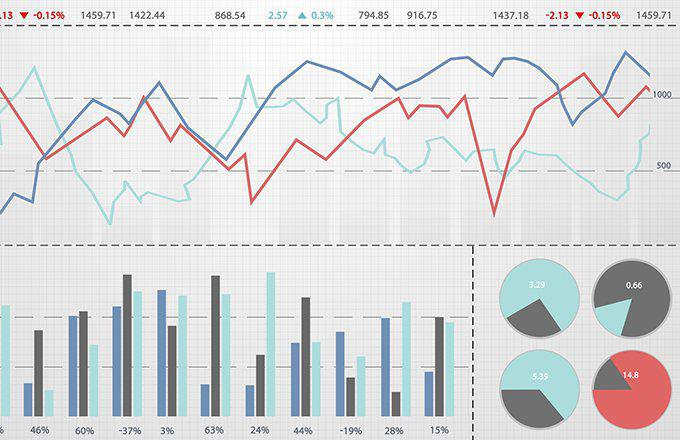

Investing strategies have historically been categorized into passive, active, and, more recently, algorithmic trading. Each approach offers distinct methodologies and advantages, empowering investors to navigate the financial markets strategically. Passive investing, for instance, emphasizes a long-term, buy-and-hold strategy, often utilizing index funds or exchange-traded funds (ETFs) that mirror market indices. This strategy is appealing due to its typically lower fees and reduced risk profile, attracting investors who prioritize stability and simplicity.

Active investing, on the other hand, involves more frequent buying and selling based on prevailing market conditions. This strategy relies heavily on the expertise of analysts and portfolio managers aiming to outperform market averages. Flexibility in active investing allows investors to capitalize on short-term market fluctuations, offering the potential for higher returns albeit with increased risks and fees compared to passive investing.



Algorithmic trading represents a modern frontier in investment strategies, utilizing computer algorithms to automate trading decisions. These algorithms leverage mathematical models and vast amounts of market data to execute trades at speeds beyond human capability. This approach has grown increasingly prevalent with technological advancements and expanded data availability, promising improved efficiency and reduction of human error, albeit with inherent risks such as over-reliance on algorithms and unpredictable market volatility impacts.

Understanding these strategies and their implications for investment decisions is crucial. Market trends and technological advancements continue to redefine these investment approaches, influencing how investors might assess and adopt them to align with their individual goals, risk tolerance, and market conditions. This article offers a comprehensive examination of passive, active, and algorithmic trading, guiding investors in selecting the strategy that best suits their needs and aspirations.

## Table of Contents

## Passive Investing

Passive investing emphasizes a long-term, buy-and-hold strategy. It fundamentally contrasts with strategies that rely on short-term market movements or frequent trading. The core of passive investing involves the use of index funds or exchange-traded funds (ETFs) that aim to replicate the performance of a specific market index, such as the S&P 500 or the FTSE 100. By mirroring the index, these funds inherently follow the general market movement without seeking to outperform it.

This approach typically incurs lower fees compared to active management strategies. The reduced fees are attributable to the less frequent buying and selling of securities, minimizing transaction costs and the need for active portfolio management. The lower management costs are often highlighted as a significant advantage for investors, as cumulative fees can substantially erode investment returns over time.

Diversification is another key benefit of passive investing. Index funds and ETFs are intrinsically diversified, as they contain a broad array of securities across various sectors and industries. This diversification reduces the unsystematic risk, or the risk associated with a particular company or industry, thereby stabilizing the investment portfolio against volatile market swings.

However, while passive investing offers advantages in diversification and cost efficiency, it presents challenges during market downturns. The strategy’s inherent characteristic of mirroring the market means that investors are exposed to the same declines as the broader market. Unlike active managers who might adjust their portfolios in anticipation of or response to market drops, passive investing offers limited flexibility in such situations. Consequently, investors may experience significant value depreciation during economic recessions or financial crises, with minimal recourse to alter their positions.

In conclusion, passive investing is a favored strategy for those who prioritize long-term growth, cost efficiency, and broad market exposure. However, the strategy requires patience and resilience to sustain through periods of market [volatility](/wiki/volatility-trading-strategies), as it primarily relies on the assumption that markets will generally trend upwards over time.

## Active Investing

Active investing is a dynamic strategy involving frequent buying and selling of securities to capitalize on market conditions. Unlike passive investing, where the goal is primarily to mirror market performance, active investing aims to outperform market averages by leveraging opportunities for short-term price fluctuations.

Analysts and portfolio managers play a crucial role in active investing. Their expertise and insights are essential in identifying securities that are mispriced, predicting market trends, and making informed predictions on future market movements. Their objective is to exceed the benchmark indices, such as the S&P 500, by utilizing a variety of techniques, including stock [picking](/wiki/asset-class-picking) and market timing.

One of the distinguishing features of active investing is its flexibility. This strategy allows investors to adapt quickly to changes in the market environment, such as economic shifts or changes in corporate fundamentals. This adaptability can be particularly advantageous in volatile markets, where rapid response is often necessary to capture gains or minimize losses.

However, active investing is not without its challenges. One significant concern is the higher fees associated with active management. These expenses arise from the costs of research, frequent transactions, and the expertise of portfolio managers. Additionally, active strategies entail increased risks due to the reliance on individual decision-making and predictions, which may not always be accurate. The frequent trading inherent in active investing can also lead to higher transaction costs and potential tax liabilities, further eroding potential returns.

Relying on the expertise of analysts and portfolio managers carries both benefits and drawbacks. While seasoned professionals can add significant value through skilled analysis and timely decision-making, there is also the danger of human error or bias. Moreover, studies indicate that many actively managed funds tend to underperform their passive counterparts over extended periods, suggesting that consistent market outperformance is challenging to achieve.

The potential for high returns remains an attractive feature of active investing. By precisely timing market entries and exits, investors can potentially realize substantial profits. Nevertheless, this approach requires a significant time commitment and a willingness to take on more substantial risk, making it suitable for investors with a higher risk tolerance and the ability to withstand potential short-term loss for long-term gain.

In conclusion, active investing offers opportunities for enhanced returns through strategic decision-making and adaptability to market conditions. However, the strategy requires careful consideration of fees, risks, and the expertise of those managing the investments. Portfolio managers and investors alike must be conscious of the balance between seizing short-term gains and achieving consistent long-term performance.

## Algorithmic Trading

Algorithmic trading, often referred to as algo trading, is a method of executing trades using computer algorithms. These algorithms are grounded in mathematical models and are designed to make trading decisions based on predefined criteria, allowing for the rapid execution of orders that would be challenging for human traders to replicate. This automated approach to trading capitalizes on the availability of vast amounts of market data and advanced technology, enabling transactions to be carried out at high speeds and with considerable efficiency.

The core components of [algorithmic trading](/wiki/algorithmic-trading) involve the development and utilization of algorithms capable of analyzing market data to identify signals that trigger trading decisions. These signals are derived from various inputs, such as price, [volume](/wiki/volume-trading-strategy), time, and other market indicators. The objective is to determine the optimal timing, price, and quantity of trades to maximize returns or minimize risk. A simple Python code example to illustrate a basic moving average crossover strategy is as follows:

```python
import pandas as pd

def moving_average_crossover(data, short_window=40, long_window=100):
    data['Short_MA'] = data['Close'].rolling(window=short_window, min_periods=1, center=False).mean()
    data['Long_MA'] = data['Close'].rolling(window=long_window, min_periods=1, center=False).mean()

    data['Signal'] = 0
    data['Signal'][short_window:] = np.where(data['Short_MA'][short_window:] > data['Long_MA'][short_window:], 1, 0)
    data['Position'] = data['Signal'].diff()

    return data

# Example usage:
# df = pd.read_csv('stock_data.csv')
# result = moving_average_crossover(df)
```

The use of algorithms in trading has expanded significantly with advancements in technology and the proliferation of high-frequency trading ([HFT](/wiki/high-frequency-trading-strategies)). HFT is a subset of algorithmic trading characterized by extremely high rates of order execution and short holding periods, allowing firms to exploit minute discrepancies in market prices or [arbitrage](/wiki/arbitrage) opportunities.

One of the primary advantages of algorithmic trading is its potential for efficiency and accuracy, minimizing the emotional and psychological factors that can affect human trading decisions. However, this reliance on algorithms also brings certain risks. Over-reliance on algorithmic models can lead to unforeseen consequences in volatile or illiquid markets, where rapid price changes can trigger a cascade of orders, exacerbating market turbulence. Additionally, errors in the algorithm’s logic or coding can result in significant financial losses.

As algorithmic trading becomes increasingly prevalent, it is essential for traders and firms to continually evaluate and refine their models to adapt to changing market conditions. The effectiveness of an algorithmic trading system depends significantly on the robustness of the underlying model, the quality of the data inputs, and the infrastructure in place to execute trades seamlessly.

## Pros and Cons of Passive Investing

Passive investing is a strategy characterized by its long-term, buy-and-hold nature, predominantly utilizing index funds and exchange-traded funds (ETFs) that emulate market indices. This approach is primarily driven by the desire to minimize fees and risk, while capitalizing on market growth over time. 

Passive investors benefit from significantly lower fees compared to active strategies, mainly due to reduced transaction costs and the absence of active management fees. The lack of frequent buying and selling decreases expenses, making this strategy cost-effective for many. Furthermore, the prolonged holding periods typical of passive investing can enhance tax efficiency. By minimizing transactions, investors can defer capital gains taxes, particularly beneficial in jurisdictions with high tax rates on investments.

The simplicity and transparency of passive investing further increase its appeal. Investors have a clear understanding of what they are invested in, as these funds often mirror well-known indices like the S&P 500 or the FTSE 100. This straightforward approach is attractive to those preferring a "set it and forget it" style, focusing on stable growth rather than short-term market fluctuations.

However, passive investing is not without its drawbacks. One notable disadvantage is its inflexibility during volatile market conditions. Passive investors must ride out market downturns without the ability to make strategic adjustments to their portfolios. This rigidity can be disconcerting during periods of market turmoil.

Additionally, while passive investing provides an advantage in matching market returns, it also inherently limits the potential to outperform them. As these funds are designed to track a market index, investors can expect to achieve the same returns minus any applicable fees. For some, the prospect of consistently matching market returns fails to satisfy higher ambitions for growth potential.

In summary, while passive investing is characterized by lower costs, tax efficiency, and simplicity, it requires acceptance of market fluctuations and the realization that achieving returns beyond the market average is unlikely. Understanding these trade-offs is essential for investors aligning their strategies with financial goals and market conditions.

## Pros and Cons of Active Investing

Active investing involves an approach where investors, analysts, or portfolio managers actively make buy and sell decisions to take advantage of market conditions. This method aims to outperform broader market indices or benchmarks. Below are the primary advantages and disadvantages associated with active investing.

### Potential for Higher Returns

Active investing offers the potential to achieve higher returns compared to passive strategies, primarily through strategic decision-making. Active managers analyze various financial metrics, macroeconomic indicators, and market trends to identify undervalued securities or market inefficiencies. This approach allows them to capitalize on short-term pricing anomalies, which can lead to significant gains if executed correctly.

### Flexibility in Adjusting to Market Conditions

One of the major advantages of active investing is the flexibility to respond swiftly to changing market environments. Active managers can adjust their portfolios based on current economic conditions, geopolitical events, or emerging market trends. This adaptability can be beneficial in volatile markets where rapid shifts in portfolio allocation might mitigate losses or enhance returns.

### High Fees and Transaction Costs

Active investing is typically associated with higher management fees and transaction costs. These fees compensate fund managers and research analysts for their time and expertise in managing the portfolio. Additionally, frequent buying and selling of securities incur transaction costs, which can erode the overall returns of the investment. As a result, the net gains from active investing might be lower than anticipated when these costs are factored in.

### Greater Risk and Uncertainty

Active investing involves a higher degree of risk and uncertainty. Frequent market transactions expose investors to short-term market volatility and potential losses. Moreover, reliance on human judgment and analysis can also introduce biases and errors in decision-making, increasing the potential for adverse outcomes.

### Studies on Long-term Underperformance

Numerous studies have shown that, over the long term, many actively managed funds underperform their passive counterparts. This underperformance is often attributed to the difficulty in consistently making accurate market predictions and the impact of high fees and costs. As a result, some investors are skeptical about the long-term efficacy of active investing strategies compared to passive approaches, which aim to match market returns with lower expenses.

In conclusion, while active investing offers the possibility of higher returns and the ability to quickly adapt to market conditions, it also comes with higher costs and risks. Investors considering this strategy should weigh these factors and consider their risk tolerance and market outlook.

## Comparing Algorithmic Trading with Traditional Investing

Algorithmic trading, often referred to as algo trading, involves the use of computer algorithms to automate investment decisions and trade execution, enabling operations at a speed and efficiency unattainable by human traders. One significant advantage of algorithmic trading is its ability to handle large trading volumes effectively. With its ability to execute transactions within fractions of a second, algorithmic trading can efficiently capitalize on market inefficiencies and sudden changes in price.

However, this advanced trading approach requires a substantial technological infrastructure, comprising high-performance computing systems and sophisticated software. This contrasts with traditional investing, which often relies on human analysis and decision-making. The reliance on technology in algorithmic trading highlights both its strength in processing vast amounts of market data and its vulnerability to technical malfunctions and cyber threats.

One of the potential downsides of algorithmic trading is the risk of misinterpreting market signals. Algorithms depend on predefined rules and historical data; thus, they may fail to respond appropriately to unexpected market events or anomalies. For instance, an algorithm programmed to react to specific market oscillations might trigger trades based on false signals, leading to substantial losses.

The effectiveness of algorithmic trading is highly contingent on the sophistication of the algorithms used and the prevailing market conditions. Simple algorithms might struggle in complex market scenarios, whereas more advanced algorithms could potentially anticipate and exploit opportunities more effectively. Nevertheless, even well-crafted algorithms can yield mixed results due to factors such as market volatility and [liquidity](/wiki/liquidity-risk-premium) constraints.

Ultimately, the choice between algorithmic trading and traditional investing often hinges on the investor's access to resources, technological savviness, and risk tolerance. While algorithmic trading offers the allure of automation and speed, it also introduces unique challenges that require careful management and oversight.

## Blending Investment Strategies

Blending investment strategies offers a robust approach to navigating the complexities of today's financial markets. By integrating passive, active, and algorithmic approaches, investors can craft a diversified portfolio that capitalizes on the various strengths of each strategy while mitigating inherent risks.

The combination of these strategies allows investors to balance risk and reward effectively. Passive investing, with its typically lower fees and market-matching performance, provides a stable foundation. By incorporating active investing, investors have the flexibility to pursue higher returns through strategic market movements and the expertise of fund managers. The introduction of algorithmic trading offers an additional layer of opportunity by leveraging advanced computational models and data analysis to exploit short-term market inefficiencies with speed and precision.

Financial advisors frequently advocate for a blended strategy as it can adapt to changing market conditions and maximize potential gains across different economic cycles. For example, an investor might allocate a portion of their portfolio to passive funds to ensure stable returns and additional parts to active funds or algorithmic strategies to capitalise on high-growth opportunities, pending technological and managerial insights.

In crafting a blended investment strategy, individual investor goals, market outlook, and risk tolerance should guide decision-making. Investors with a long-term horizon and lower risk appetite might favor a larger allocation to passive investments, while those seeking higher returns and possessing a greater risk tolerance might allocate more to active and algorithmic strategies.

To illustrate, consider a Python approach to dynamically adjust allocations based on certain market indicators or personal risk assessment:

```python
def allocate_portfolio(market_trend, risk_tolerance):
    if market_trend == "bullish":
        if risk_tolerance == "high":
            return {"passive": 20, "active": 50, "algorithmic": 30}
        else:
            return {"passive": 50, "active": 30, "algorithmic": 20}
    elif market_trend == "bearish":
        if risk_tolerance == "high":
            return {"passive": 30, "active": 30, "algorithmic": 40}
        else:
            return {"passive": 60, "active": 20, "algorithmic": 20}
    else:
        # Default moderate allocation
        return {"passive": 40, "active": 30, "algorithmic": 30}
```

Ultimately, a blended investment strategy provides a comprehensive framework for investors to achieve their financial objectives while adapting to the dynamic nature of market environments. Through thoughtful allocation and regular reassessment, investors can harness the benefits of each strategy effectively.

## Conclusion

Each investment strategy—passive, active, and algorithmic trading—presents distinct advantages and challenges tailored to various investor objectives. The choice among these strategies should be informed by an investor's personal financial goals, risk tolerance, and the prevailing market conditions. Passive investing, often characterized by its long-term approach and lower fees, is suitable for those seeking stability and market return equivalence. Active investing provides the potential for higher returns by leveraging market fluctuations, but it comes with increased fees and risks. Algorithmic trading offers speed and precision, appealing to those with access to technological infrastructure and a preference for data-driven decision-making.

Investors might find value in blending different strategies to balance risk and harness diverse market opportunities. A mixed approach can potentially enhance portfolio performance by combining the stability and low-cost attributes of passive investing with the dynamic and high-return potential of active or algorithmic methods. This strategy diversification is particularly important in navigating varying market conditions and achieving a well-rounded investment approach.

Continuous evaluation of investment strategies is essential for adapting to changing market environments. Regularly reassessing one's strategies ensures alignment with financial goals and optimizes the potential for long-term success. Strategies that performed well in the past may not necessarily continue to do so, highlighting the importance of ongoing monitoring and adjustment. Through understanding personal objectives and market dynamics, investors can strategically position themselves for sustained growth and success.

## FAQs

What is the main difference between passive and active investing?  
The main difference between passive and active investing lies in the management approach and the frequency of trades. Passive investing aims to replicate market indexes like the S&P 500 by using low-cost index funds or ETFs, typically involving a buy-and-hold strategy with minimal trading activity. In contrast, active investing involves frequent buying and selling of stocks with the goal of outperforming market averages. Active investors rely on market research, portfolio managers, and analysts to make strategic decisions to achieve higher returns, incorporating market timing and individual stock picks.

How does algorithmic trading work?  
Algorithmic trading utilizes computer algorithms to automate trading decisions based on predefined criteria. These algorithms analyze vast amounts of market data using mathematical models to identify trading opportunities and execute trades at high speeds. The process involves leveraging statistical patterns, [machine learning](/wiki/machine-learning), and quantitative analysis to make trades that humans may not notice due to the speed and complexity of calculations. Algorithmic trading is prevalent in high-frequency trading, executing large numbers of orders in fractions of a second to capitalize on small price discrepancies.

Is passive investing less risky than active or algorithmic trading?  
Passive investing is generally considered less risky than active or algorithmic trading due to its focus on diversification and long-term market trends. By investing in index funds that mirror the market, passive investors spread risk across a wide range of assets, reducing exposure to individual stock volatility. On the other hand, active and algorithmic trading involve higher risks as they attempt to outperform the market, requiring accurate market predictions and strategies. The frequent trading in active strategies and reliance on algorithms in algorithmic trading can also lead to increased volatility and potential for higher losses.

Can I combine passive, active, and algorithmic investing strategies?  
Yes, investors can combine passive, active, and algorithmic investing strategies to create a diversified portfolio. Blending these approaches can help capture different market opportunities and balance risk. For instance, investors may use passive funds for stability and long-term growth, active management to capitalize on market inefficiencies, and algorithmic trading to enhance execution speed and exploit short-term market changes. Ultimately, blending strategies should align with individual investment goals, market outlook, and risk tolerance, providing a well-rounded investment approach.

Which strategy is best for long-term returns?  
The best strategy for long-term returns depends on the investor's objectives, market conditions, and risk tolerance. Historically, passive investing has shown consistent performance due to its focus on long-term market trends and lower costs. These factors contribute to tax efficiency and cost savings, which can enhance long-term returns. Conversely, active and algorithmic strategies can potentially deliver higher returns but entail greater risks and higher fees, which may erode gains over time. Investors should assess their financial goals and market outlook to determine the most suitable approach for their long-term investments.

## References & Further Reading

[1]: Malkiel, B. G. (2019). ["A Random Walk Down Wall Street: The Time-Tested Strategy for Successful Investing."](https://yourknowledgedigest.org/wp-content/uploads/2020/04/a-random-walk-down-wall-street.pdf) W.W. Norton & Company.

[2]: Bogle, J. C. (2003). ["Common Sense on Mutual Funds: New Imperatives for the Intelligent Investor."](https://books.google.com/books/about/Common_Sense_on_Mutual_Funds.html?id=vGk00l8PqeMC) Wiley.

[3]: Jensen, M. C. (1968). ["The Performance of Mutual Funds in the Period 1945–1964."](https://onlinelibrary.wiley.com/doi/full/10.1111/j.1540-6261.1968.tb00815.x) Journal of Finance.

[4]: Pardo, R. (2011). ["The Evaluation and Optimization of Trading Strategies."](https://onlinelibrary.wiley.com/doi/book/10.1002/9781119196969) Wiley.

[5]: Narang, R. K. (2013). ["Inside the Black Box: A Simple Guide to Quantitative and High Frequency Trading."](https://onlinelibrary.wiley.com/doi/book/10.1002/9781118662717) Wiley.