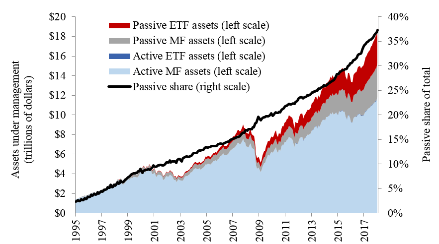

## Table of Contents

## What is active investing?

Active investing is when investors try to do better than the market by picking specific stocks or timing when to buy and sell. They use a lot of research and their own knowledge to make choices. This way of investing takes a lot of time and effort because you have to keep watching the market and making changes to your investments.

People who do active investing might work with a professional, like a fund manager, who makes these decisions for them. The goal is to beat the market's average return, but it's not easy and can be risky. If the choices don't work out, you could lose money. Active investing is different from passive investing, where you just follow the market without trying to beat it.

## What is passive investing?

Passive investing is when you invest your money in a way that follows the market instead of trying to beat it. You usually do this by putting your money into index funds or exchange-traded funds (ETFs) that track a specific market index, like the S&P 500. The idea is to get the same returns as the market, not more. This means you don't need to spend a lot of time picking stocks or trying to guess when to buy and sell. It's simpler and often costs less because you're not paying for someone to actively manage your investments.

One of the big advantages of passive investing is that it's easier to manage. Once you've chosen your funds, you can mostly leave them alone and let them grow over time. This makes it a good choice for people who don't want to spend a lot of time on their investments or who are just starting out. While you might not get the highest returns, you also don't face the same level of risk as with active investing. Over the long term, passive investing can be a steady way to build wealth without the stress of trying to outsmart the market.

## What are the main differences between active and passive investing?

Active investing and passive investing are two different ways to put your money into the stock market. With active investing, you or a professional fund manager try to pick the best stocks and buy and sell them at the right times to beat the market's average return. It takes a lot of research and watching the market closely. Active investing can be riskier because if the choices you make don't work out, you could lose money. It's like trying to be a star player in a game, where you aim to score more points than everyone else.

On the other hand, passive investing is about following the market instead of trying to beat it. You usually invest in index funds or ETFs that copy a market index, like the S&P 500. This means you get the same returns as the market, without trying to do better. Passive investing is simpler and often cheaper because you don't need someone to manage your investments actively. It's like being a steady team player, where you're happy to go along with the flow and grow your money slowly and steadily over time.

## How do the costs of active and passive investing compare?

The costs of active investing are usually higher than those of passive investing. Active investing often involves hiring a professional fund manager who charges fees for their time and expertise. These fees can be a percentage of the money you have invested, and they can add up over time. Also, active investing might mean buying and selling stocks more often, which can lead to more transaction costs. All these costs can eat into your returns, making it harder to beat the market.

Passive investing, on the other hand, is usually cheaper. When you invest in index funds or ETFs, the fees are much lower because there's less work involved. These funds simply track a market index, so there's no need for a fund manager to pick stocks or time the market. The lower fees mean more of your money stays invested and can grow over time. Because of these lower costs, passive investing can be a more cost-effective way to build wealth in the long run.

## What are the typical returns for active versus passive investing?

Active investing aims to beat the market, but it doesn't always work out. Over time, studies show that most actively managed funds don't do better than the market. They might have some good years, but over many years, they often fall short. This is because the costs of active investing, like fees and trading costs, can eat into the returns. So, while you might get lucky and pick a fund that does well, it's hard to do better than the market consistently.

Passive investing, on the other hand, tries to match the market's performance, not beat it. Because it's cheaper, with lower fees and fewer trading costs, more of your money stays invested. Over the long term, this can lead to better returns compared to many actively managed funds. While you won't get rich quick, passive investing can help your money grow steadily over time, which is why many people choose it for their long-term savings goals.

## How does the level of involvement differ between active and passive investing?

Active investing means you have to be really involved. You need to spend a lot of time looking at different companies, reading news, and trying to guess what will happen next in the market. If you work with a fund manager, you might not do all this work yourself, but you still need to keep an eye on how they're doing and make sure they're making good choices. It's like being a coach who has to keep making plays and changing the game plan.

Passive investing is much easier and needs less of your time. Once you pick your index funds or ETFs, you can mostly leave them alone. You don't have to worry about what's happening in the market every day because your investments just follow the market. It's like being a fan who enjoys the game but doesn't need to know all the details about every player and every move.

## What are the tax implications of active versus passive investing?

Active investing can lead to more taxes because you're buying and selling stocks more often. Every time you sell a stock for a profit, you have to pay capital gains tax. If you're doing this a lot, those taxes can add up quickly. Also, if you're getting dividends from the stocks you own, you'll have to pay taxes on those too. So, the more you trade, the more taxes you might have to pay, which can eat into your returns.

Passive investing usually means less tax because you're not trading as much. You're holding onto your investments for a longer time, which can mean you pay less in capital gains taxes. If you hold onto your investments for more than a year, you might even get a lower tax rate on your gains. Plus, if you're investing in index funds or ETFs, they often have fewer taxable events, so you keep more of your money growing over time.

## How does market efficiency impact the choice between active and passive investing?

Market efficiency means how well the prices of stocks show all the information that's out there. If the market is really efficient, it's hard for active investors to beat it because all the good information is already in the stock prices. So, if you think the market is very efficient, you might choose passive investing. This is because it's tough to do better than the market when all the information is already used up in the prices. Passive investing just follows the market, so you don't have to worry about beating it.

On the other hand, if you think the market isn't so efficient, you might like active investing more. You might believe that you can find stocks that are undervalued or that you can predict what will happen next. In a less efficient market, there's more chance to make money by [picking](/wiki/asset-class-picking) the right stocks at the right time. But remember, even if the market isn't totally efficient, it's still hard to beat it, and you'll have to pay more in fees and taxes.

## What role does risk management play in active and passive investing strategies?

Risk management is really important in active investing. When you're trying to pick the best stocks and time the market, you have to think a lot about how much risk you're taking. Active investors might use different tools and strategies to lower their risk, like spreading their money across many different stocks or using stop-loss orders to sell a stock if it drops too much. But because active investing involves more buying and selling, it can be riskier. If you make a wrong guess about a stock or the market, you could lose a lot of money. So, active investors need to keep a close eye on their investments and be ready to change their plans if things aren't going well.

In passive investing, risk management is simpler but still important. When you invest in index funds or ETFs, you're spreading your risk across all the stocks in the index. This is called diversification, and it helps protect you from big losses if one company does badly. But passive investing still has risks, like the whole market going down. You can't do much about this because you're just following the market. So, passive investors manage risk by choosing the right mix of investments, like balancing stocks with bonds, and by sticking to their long-term plan even when the market gets bumpy.

## How do active and passive investing strategies perform during different market conditions?

Active investing can do better in some market conditions, like when the market is going up and down a lot. If you're good at picking stocks, you might be able to find the ones that will do well even when the market is shaky. But it's hard to guess what will happen, and if you get it wrong, you could lose money. Active investing might also do well when the market isn't doing great, because you can move your money around to avoid the worst parts. But it takes a lot of work and skill to do this right.

Passive investing usually does okay no matter what the market is doing, because it just follows the market. When the market goes up, your investments go up too. When the market goes down, your investments go down too. This can be good because you don't have to worry about picking the right stocks or timing the market. But if the whole market is doing badly, like during a big crash, your investments will also lose money. Over a long time, passive investing can still help your money grow, even if it's not as fast as when the market is doing really well.

## What are some advanced strategies used in active investing?

Active investors often use advanced strategies like sector rotation to try to beat the market. Sector rotation means moving money from one part of the market, like technology stocks, to another part, like healthcare stocks, based on what's happening in the economy. For example, if they think the economy is going to grow, they might put more money into stocks that do well when people are spending more, like consumer goods. This strategy needs a lot of research and understanding of how different parts of the economy work together.

Another advanced strategy is using options and other derivatives. Options let investors bet on whether a stock will go up or down without actually owning the stock. This can be risky, but it can also help investors make money even if the market is going down. For example, they might buy a "put option" to make money if a stock they think will drop actually does drop. These strategies can be complicated and need a good understanding of how these financial tools work, but they can give active investors more ways to try to beat the market.

Some active investors also use a strategy called short selling. This means they borrow a stock they think will go down in price, sell it, and then buy it back later at a lower price to return it. If the stock does go down, they make money on the difference. But if the stock goes up instead, they lose money. Short selling can be very risky, but it's another tool that active investors use to try to make money no matter which way the market is moving.

## How can investors blend active and passive investing in their portfolios?

Investors can blend active and passive investing by using both strategies in their portfolio. They might put most of their money into passive investments like index funds or ETFs, which follow the market and don't need a lot of work. Then, they can use a smaller part of their money for active investing, where they try to pick stocks or work with a fund manager to beat the market. This way, they get the steady growth of passive investing while also trying to make extra money with active investing.

Balancing active and passive investing can help manage risk too. By having most of their money in passive investments, investors spread out their risk across the whole market. Then, they can take bigger risks with the smaller part of their money in active investments. If the active investments do well, great! If not, the passive part of the portfolio keeps things stable. This mix can give investors the best of both worlds: the safety of passive investing and the potential for higher returns from active investing.

## References & Further Reading

[1]: Malkiel, B. G. (2019). ["A Random Walk Down Wall Street: The Time-Tested Strategy for Successful Investing."](https://yourknowledgedigest.org/wp-content/uploads/2020/04/a-random-walk-down-wall-street.pdf) W.W. Norton & Company.

[2]: Bogle, J. C. (2003). ["Common Sense on Mutual Funds: New Imperatives for the Intelligent Investor."](https://books.google.com/books/about/Common_Sense_on_Mutual_Funds.html?id=vGk00l8PqeMC) Wiley.

[3]: Jensen, M. C. (1968). ["The Performance of Mutual Funds in the Period 1945–1964."](https://onlinelibrary.wiley.com/doi/full/10.1111/j.1540-6261.1968.tb00815.x) Journal of Finance.

[4]: Pardo, R. (2011). ["The Evaluation and Optimization of Trading Strategies."](https://onlinelibrary.wiley.com/doi/book/10.1002/9781119196969) Wiley.

[5]: Narang, R. K. (2013). ["Inside the Black Box: A Simple Guide to Quantitative and High Frequency Trading."](https://onlinelibrary.wiley.com/doi/book/10.1002/9781118662717) Wiley.