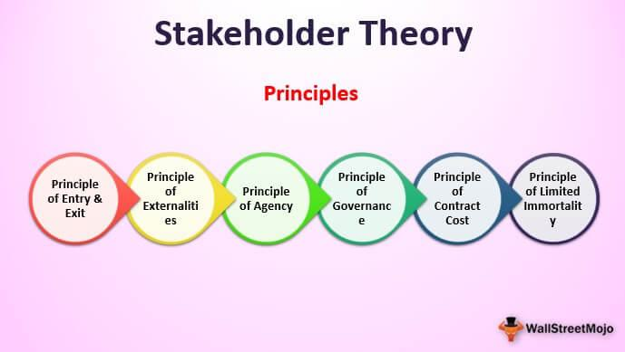

## Table of Contents

## What is Agency Theory?

Agency Theory is a concept in economics and business that explains the relationship between people or organizations, called principals, and the people they hire to do work for them, called agents. The main idea is that there can be conflicts because the goals of the principal and the agent might not be the same. For example, a company owner (principal) hires a manager (agent) to run the business. The owner wants to make the most profit, but the manager might want a higher salary or less work.

To manage these conflicts, the principal sets up rules and incentives to make sure the agent works towards the principal's goals. This can include things like performance bonuses or monitoring systems. However, setting up these systems can be costly and might not always work perfectly. So, the challenge is to find a good balance where the agent is motivated to do what the principal wants, without spending too much on monitoring and incentives.

## What is Stakeholder Theory?

Stakeholder Theory is a way of thinking about how businesses should work. It says that a company should care about all the people and groups that are affected by what it does, not just the people who own it. These groups are called stakeholders, and they include employees, customers, suppliers, the community, and even the environment. The idea is that if a company looks after all these groups well, it will be more successful and last longer.

The theory suggests that companies should balance the needs and interests of all stakeholders, not just focus on making money for shareholders. This means making decisions that are good for everyone involved, even if it means making less profit in the short term. For example, a company might decide to pay its workers more, even if it means less profit, because happy workers can lead to better products and a stronger business in the long run.

## Who are the main proponents of Agency Theory?

The main people who came up with Agency Theory are Michael Jensen and William Meckling. They wrote a very important paper in 1976 called "Theory of the Firm: Managerial Behavior, Agency Costs and Ownership Structure." In this paper, they explained how the relationship between people who own a business and the people who run it can cause problems. They said that owners need to watch over managers and use rewards to make sure managers do what the owners want.

Another important person in Agency Theory is Eugene Fama. He worked with Jensen on another paper in 1983 called "Separation of Ownership and Control." They talked about how big companies are run and how the people in charge need to be watched to make sure they are doing a good job. Fama and Jensen's ideas helped people understand that it's important to have good systems in place to make sure everyone in a company is working towards the same goals.

## Who are the main proponents of Stakeholder Theory?

The main person behind Stakeholder Theory is R. Edward Freeman. He wrote a famous book in 1984 called "Strategic Management: A Stakeholder Approach." In this book, Freeman said that companies should care about all the people and groups that affect or are affected by the business, not just the owners. He believed that if a company looks after all these groups well, it will do better in the long run.

Another important person in Stakeholder Theory is Archie B. Carroll. He worked on ideas about how businesses should act responsibly towards all stakeholders. Carroll's work helped people understand that companies need to balance the needs of different groups to be successful and ethical. Together, Freeman and Carroll's ideas have shaped how many businesses think about their responsibilities to more than just their shareholders.

## What are the key assumptions of Agency Theory?

Agency Theory starts with the idea that people, or [agents](/wiki/agents), who work for others, called principals, might not always do what the principals want. This is because agents have their own goals, like wanting more money or less work, which can be different from what the principals want, like making more profit. For example, a manager might want a bigger office, but the owner wants to save money. This difference in what they want can cause problems.

To deal with these problems, Agency Theory assumes that principals can use different ways to make sure agents do what they want. They can set up rules, watch what agents do, or offer rewards like bonuses. But doing these things costs money and time. So, the theory says that principals need to find a good balance. They need to spend enough to keep agents in line but not so much that it's not worth it. This balance is important for making sure everyone works towards the same goals.

## What are the key assumptions of Stakeholder Theory?

Stakeholder Theory assumes that businesses should care about all the people and groups that they affect or that affect them. This includes everyone from employees and customers to the community and the environment. The theory says that if a company looks after all these groups well, it will do better in the long run. It's like saying that a business isn't just about making money for the owners, but about making sure everyone involved is happy and doing well.

Another key assumption is that all stakeholders have a right to be heard and their interests should be taken into account when making decisions. This means that a company should try to balance the needs of all these groups, even if it means making less profit in the short term. For example, a company might choose to pay its workers more to keep them happy, even if it means less money for the owners right now. The idea is that happy stakeholders will help the company be more successful over time.

## How does Agency Theory address the relationship between principals and agents?

Agency Theory looks at the relationship between people who own a business, called principals, and the people they hire to run it, called agents. The main idea is that these two groups might want different things. For example, the owner might want to make the most profit, but the manager might want a bigger salary or less work. This difference can cause problems because the manager might not do what the owner wants.

To fix these problems, Agency Theory says that owners can use different ways to make sure managers do what they want. They can set up rules, keep an eye on what managers are doing, or give them rewards like bonuses. But doing these things costs money and time. So, the theory says that owners need to find a good balance. They need to spend enough to keep managers in line but not so much that it's not worth it. This way, everyone can work towards the same goals.

## How does Stakeholder Theory consider the interests of various stakeholders?

Stakeholder Theory says that a business should care about all the people and groups it affects or that affect it. These groups are called stakeholders, and they include employees, customers, suppliers, the community, and even the environment. The theory believes that if a company looks after all these groups well, it will do better in the long run. It's not just about making money for the owners, but about making sure everyone involved is happy and doing well.

The theory also says that all stakeholders have a right to be heard and their interests should be taken into account when making decisions. This means a company should try to balance the needs of all these groups, even if it means making less profit in the short term. For example, a company might choose to pay its workers more to keep them happy, even if it means less money for the owners right now. The idea is that happy stakeholders will help the company be more successful over time.

## What are the primary criticisms of Agency Theory?

One big criticism of Agency Theory is that it focuses too much on the owners and managers, and not enough on other people who matter, like employees, customers, and the community. Critics say this can lead to decisions that only help the owners and managers make more money, but hurt other groups. For example, a company might cut worker benefits to save money, which makes the owners richer but the workers unhappy.

Another criticism is that Agency Theory assumes people always act in their own best interest, which might not always be true. Sometimes, people do things because they think it's the right thing to do, not just to get more money or less work. Critics argue that this view of people as only looking out for themselves can lead to a business culture that's too focused on money and not enough on doing what's right.

Lastly, some say that the ways Agency Theory suggests to keep managers in line, like watching them closely or giving them bonuses, can cost a lot of money and time. These costs might not be worth it if they don't really make the business run better. Critics think there might be better ways to make sure everyone in a company works well together, without spending so much on monitoring and rewards.

## What are the primary criticisms of Stakeholder Theory?

One main criticism of Stakeholder Theory is that it can be hard for businesses to balance the needs of all the different groups they affect. Trying to make everyone happy can be tricky and might lead to decisions that don't help the company make money. Some people worry that focusing too much on all these groups might make it hard for the company to stay strong and grow. They think that if a business tries to please everyone, it might end up not pleasing anyone enough, which could hurt the business in the long run.

Another criticism is that it's not always clear how to measure if a company is doing a good job at looking after all its stakeholders. It's easy to see if a company is making money, but it's harder to tell if it's making employees, customers, and the community happy. This can make it tough for businesses to know if they're doing well by Stakeholder Theory. Critics say that without clear ways to measure success, it's hard to know if the effort to care for all stakeholders is really worth it.

## How have Agency Theory and Stakeholder Theory evolved over time?

Agency Theory started in the 1970s when Michael Jensen and William Meckling wrote a paper about the problems that can happen when business owners hire managers to run their company. They said that owners and managers might want different things, like more profit for the owners and more pay for the managers. Over time, people added more ideas to Agency Theory, like how owners can use rules, rewards, and watching over managers to make sure they do what the owners want. But people also started to see that this focus on just owners and managers might not be enough. They began to think about other groups that matter, like employees and customers, which led to new ideas about how to run a business.

Stakeholder Theory came along in the 1980s when R. Edward Freeman wrote a book saying that businesses should care about all the people and groups they affect, not just the owners. He thought that if a company looks after all these groups well, it will do better in the long run. Over time, more people started to agree with this idea and added their own thoughts. They talked about how businesses can balance the needs of all these groups and how it's important to listen to everyone. But some people also pointed out that it can be hard to make everyone happy and that it's tough to know if a company is doing a good job at looking after all its stakeholders. So, Stakeholder Theory kept growing and changing as people learned more about how to run a business in a way that helps everyone.

## In what contexts are Agency Theory and Stakeholder Theory most applicable and why?

Agency Theory is most useful in big companies where the owners, or shareholders, hire managers to run the business for them. This is because in these companies, the owners and managers might want different things. The owners want to make the most profit, but the managers might want more pay or less work. Agency Theory helps the owners figure out ways to make sure the managers do what the owners want, like setting up rules or giving bonuses. It's also used in other situations where one person hires another to do a job, like when a homeowner hires a contractor. In these cases, Agency Theory helps the person hiring make sure the job gets done right.

Stakeholder Theory works best in companies that want to do more than just make money for the owners. It's good for businesses that care about all the people and groups they affect, like employees, customers, and the community. This theory helps these companies make decisions that are good for everyone, not just the owners. For example, a company might choose to pay workers more or use less harmful materials, even if it means less profit right now. Stakeholder Theory is especially useful for companies in industries where being responsible to the community and environment is important, like in food or energy businesses.

## References & Further Reading

[1]: Freeman, R. E. (1984). ["Strategic Management: A Stakeholder Approach"](https://research.monash.edu/en/publications/strategic-management-a-stakeholder-approach) Cambridge University Press.

[2]: Jensen, M. C., & Meckling, W. H. (1976). ["Theory of the Firm: Managerial Behavior, Agency Costs, and Ownership Structure"](https://www.sciencedirect.com/science/article/pii/0304405X7690026X). Journal of Financial Economics, 3(4), 305-360.

[3]: Stout, L. A. (2012). ["The Shareholder Value Myth: How Putting Shareholders First Harms Investors, Corporations, and the Public"](https://papers.ssrn.com/sol3/papers.cfm?abstract_id=2277141) Berrett-Koehler Publishers.

[4]: Pardo, R. (1992). ["Design, Testing, and Optimization of Trading Systems"](https://archive.org/details/designtestingopt0000pard) Wiley.

[5]: Tonello, M. (2007). ["Revisiting Stockholder and Stakeholder Theories"](https://papers.ssrn.com/sol3/papers.cfm?abstract_id=938466) The Conference Board.