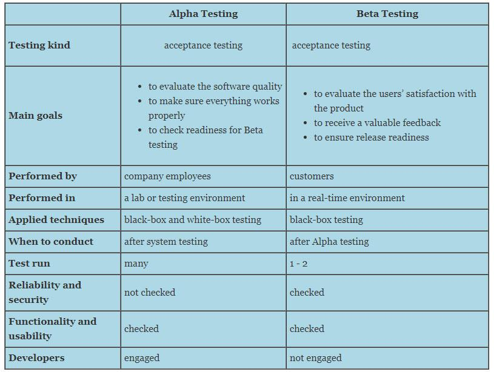

Algorithmic trading refers to the use of computer algorithms to automate trading strategies in financial markets. This method leverages computational power and advanced mathematical models to execute trades at speeds and frequencies that are impossible for human traders. The impact of algorithmic trading on financial markets is profound, significantly increasing market liquidity, reducing transaction costs, and improving the efficiency of price discovery. By enabling rapid execution of trades, algorithmic trading can also help mitigate the risk of human error and bias, making it a preferred tool for many institutional investors and hedge funds.

Central to the success of algorithmic trading strategies is the understanding and application of two key metrics: alpha and beta. These metrics are fundamental in the assessment and management of investments. Alpha represents the excess return of an investment relative to its benchmark, reflecting the value added by a portfolio manager's decisions. Alpha is crucial for investors aiming to achieve superior returns while accounting for the specific level of risk they are willing to assume. In contrast, beta measures the sensitivity of an asset's returns to market movements, thus serving as a gauge of systematic risk. It is essential for assessing an investment's volatility in comparison to the overall market.



The purpose of this article is to explore and differentiate between alpha and beta within the context of algorithmic trading. Understanding these metrics is vital for traders and portfolio managers who seek to optimize their strategies, manage risk effectively, and achieve their investment objectives. This exploration will examine the roles, calculation methods, and applications of alpha and beta, providing insights into how these metrics can be utilized to enhance trading performance in increasingly complex and competitive financial markets.

## Table of Contents

## Understanding Alpha in Algorithmic Trading

Alpha, in the context of algorithmic trading, represents the excess return on an investment relative to a benchmark or market return. It is a critical metric for evaluating the effectiveness of investment strategies and is often considered the value a portfolio manager adds through active management. The core of alpha is its ability to measure performance beyond the risk-adjusted expectations set by the market, distinguishing skillful management from mere market movements.

The calculation of alpha is often undertaken using the Capital Asset Pricing Model (CAPM), which provides a framework for understanding the relationship between the expected return of an asset or portfolio and the systematic risk associated with it. The CAPM formula is expressed as follows:

$$
E(R) = R_f + \beta (R_m - R_f)
$$

Where:
- $E(R)$ is the expected return of the investment.
- $R_f$ is the risk-free rate, typically the yield on government bonds.
- $\beta$ represents the sensitivity of the asset’s returns to the overall market returns, also known as the beta coefficient.
- $R_m$ is the expected market return.

Alpha ($\alpha$) is then calculated as the actual return of the portfolio minus the expected return predicted by CAPM:

$$
\alpha = R_p - [R_f + \beta (R_m - R_f)]
$$

Where:
- $R_p$ is the actual return of the portfolio.

In essence, a positive alpha indicates that the portfolio has outperformed the market, while a negative alpha suggests underperformance. For portfolio managers, alpha is crucial because it isolates the component of returns attributable to active management rather than systemic market movements.

Assessing performance using alpha allows portfolio managers to gauge their investment decisions against predetermined benchmarks. A consistent alpha figure can be indicative of a manager's ability to generate additional returns through skill or superior strategy, as opposed to relying on market movements and risk factors alone. In [algorithmic trading](/wiki/algorithmic-trading), where decisions are often executed using automated systems and complex algorithms, quantifying alpha helps in refining models to enhance future performance by understanding the impact of various trading strategies and adjustments against these benchmarks.

## Understanding Beta in Algorithmic Trading

Beta is a key metric in finance, particularly in the context of algorithmic trading, where it plays a crucial role in assessing investment risk. In quantitative finance, beta ($\beta$) is a statistical measure that evaluates the sensitivity of an asset's returns to the movements of a broader market. Essentially, it provides an understanding of how much an asset's price is expected to move with changes in the market.

### Definition of Beta

Beta is defined as the slope of the line through a regression of data points representing returns of an asset against the returns of the market. A beta greater than one indicates that the asset is expected to amplify the movements of the market, suggesting higher [volatility](/wiki/volatility-trading-strategies) and thus higher risk. Conversely, a beta less than one suggests the asset is less volatile than the market.

### Derivation Using Regression Analysis

Beta is derived through regression analysis, which involves plotting the historical returns of an asset against the returns of a market index, such as the S&P 500. The formula for beta is:

$$
\beta = \frac{\text{Cov}(R_i, R_m)}{\text{Var}(R_m)}
$$

where:
- $R_i$ is the return on the asset,
- $R_m$ is the return on the market,
- $\text{Cov}(R_i, R_m)$ is the covariance between the asset and the market returns,
- $\text{Var}(R_m)$ is the variance of the market returns.

This relationship is typically analyzed using linear regression, where the slope of the line ($\beta$) provides the measure of risk as compared to the market.

Here's a simple Python example to calculate beta using historical return data:

```python
import numpy as np
import pandas as pd
from sklearn.linear_model import LinearRegression

# Example data: returns of a stock and the market
returns_data = {'stock_returns': [0.01, 0.02, -0.01, 0.015, 0.03],
                'market_returns': [0.005, 0.015, -0.005, 0.02, 0.025]}
df = pd.DataFrame(returns_data)

# Reshape data for linear regression
X = df['market_returns'].values.reshape(-1, 1)
y = df['stock_returns'].values

# Perform linear regression
model = LinearRegression().fit(X, y)

# Beta is the slope of the regression line
beta = model.coef_[0]
print("Calculated Beta:", beta)
```

### Role in Volatility Assessment

Beta is instrumental in assessing the volatility of an asset relative to the overall market. If a stock has a beta of 1.3, it means it is 30% more volatile than the market; if the market goes up by 10%, the stock is expected to increase by 13%. Conversely, a beta of 0.8 indicates that the stock is less volatile than the market. This measure helps investors understand and manage risk and is a cornerstone in constructing portfolios that align with specific risk appetites.

In conclusion, beta serves as a critical measure in the toolkit of algorithmic traders for evaluating and managing the risk associated with asset movements relative to market fluctuations.

## Key Differences Between Alpha and Beta

Alpha and beta are critical metrics in evaluating the performance and risk associated with investment strategies, particularly in algorithmic trading. While both metrics serve to assess different dimensions of investment performance, their fundamental focus diverges: alpha emphasizes return, while beta focuses on risk.

Alpha ($\alpha$) represents the excess return on an investment compared to a benchmark index. It is a measure of the active return on an investment, indicating the effectiveness of a trading strategy. Alpha is typically expressed as a numerical value; a positive alpha signifies an investment strategy's ability to outperform the market, while a negative alpha indicates underperformance. The calculation of alpha involves the Capital Asset Pricing Model (CAPM), where it is derived from the formula:

$$
\alpha = R - (R_f + \beta \times (R_m - R_f))
$$

In this formula, $R$ is the expected portfolio return, $R_f$ stands for the risk-free rate, $\beta$ is the beta coefficient (volatility relative to the overall market), and $R_m$ is the expected market return.

Beta ($\beta$) measures an investment's sensitivity to market movements and is leveraged to assess risk. It evaluates how much an investment's returns move in relation to the market. A beta of 1 implies that the investment's price will move with the market. A beta greater than 1 indicates higher volatility than the market, and less than 1 indicates lower volatility. Beta is commonly derived using regression analysis, using historical returns data of an asset compared to the market index.

The key distinction between alpha and beta lies in their application and purpose within trading strategies. Alpha is used to determine the additional value a trading strategy can generate beyond baseline market performance, emphasizing an investor's skill in stock selection. Conversely, beta aids in understanding and managing systematic risk, helping investors construct diversified portfolios that align with their risk tolerance.

Trading strategies employing alpha focus on identifying and capitalizing on market inefficiencies, seeking superior returns by forecasting security prices beyond market expectations. Strategies based on beta, however, are often implemented to manage or mitigate risk through diversification, aiming to match market performance while maintaining a predictable risk profile.

In summary, alpha focuses on excess returns attributable to active management choices, whereas beta evaluates market-related risk. Their calculations serve distinct purposes—alpha gauges the value-added potential of trades above market norms, while beta facilitates risk assessment and diversification strategies. Understanding these metrics is crucial for developing balanced algorithmic trading strategies that effectively optimize both returns and risk.

## Applications of Alpha and Beta in Algorithmic Trading Strategies

Algorithmic trading strategies leverage both alpha and beta to enhance trading performance and manage risks effectively. Alpha is pivotal for traders and portfolio managers seeking to identify and capitalize on skillful investment decisions. By effectively measuring alpha, traders can assess how much a particular asset or strategy outperforms a market benchmark, after accounting for systematic risks. In mathematical terms, alpha can be represented as:

$$
\alpha = R_i - (R_f + \beta (R_m - R_f))
$$

where $R_i$ is the return of the investment, $R_f$ is the risk-free rate, $\beta$ is the beta of the investment, and $R_m$ is the return of the market.

Utilizing alpha, traders aim to make informed decisions about which securities to buy or sell, or which strategies to implement, by focusing on excess returns. This ability to outperform mirrors the effectiveness of investment strategies in identifying mispricings or market inefficiencies.

On the other hand, beta plays a crucial role in informing risk management and portfolio diversification strategies. By measuring an asset's volatility in relation to the wider market, beta helps traders assess the risk exposure of their portfolios. A beta greater than one indicates that the asset's price is more volatile than the market, whereas a beta less than one signifies lower volatility. This understanding aids in calibrating the level of systemic risk associated with investment portfolios, ensuring that traders maintain a balance between risk and return according to their investment objectives.

Combining alpha and beta, traders can optimize trading performance by strategically adjusting portfolios to enhance returns while maintaining acceptable risk thresholds. For example, a high-alpha, low-beta strategy might attract conservative investors seeking strong performance without excessive volatility. Conversely, strategies that balance high alpha with high beta might appeal to those willing to assume more risk for potentially greater gains.

Algorithmic trading software can be developed to automate these strategies effectively, calculating real-time alpha and beta values and making swift trading decisions. Here is a basic example in Python using the pandas library for handling time series data, illustrating how to compute alpha and beta:

```python
import pandas as pd
import numpy as np
from statsmodels.api import OLS

# Example market and asset return data
market_returns = pd.Series([...])
asset_returns = pd.Series([...])
risk_free_rate = 0.01

# Calculate excess returns
excess_market_returns = market_returns - risk_free_rate
excess_asset_returns = asset_returns - risk_free_rate

# Fit linear regression model to derive beta
X = excess_market_returns.values.reshape(-1, 1)
y = excess_asset_returns.values
model = OLS(y, np.column_stack([np.ones(X.shape[0]), X])).fit()
beta = model.params[1]
alpha = model.params[0]

print(f"Alpha: {alpha}, Beta: {beta}")
```

This simplified code demonstrates how traders can estimate alpha and beta from past return data, potentially scaling up to handle more complex datasets and integrate into automated trading systems. By maintaining a dynamic approach that considers both metrics, traders can navigate evolving market conditions and optimize their trading strategies accordingly.

## Alternatives to Alpha and Beta

The evaluation of investment performance traditionally hinges on the metrics of alpha and beta. However, alternative metrics such as the Sharpe Ratio, Sortino Ratio, and Treynor Ratio provide more nuanced insights regarding risk-adjusted returns, investor preferences, and risk environments. These metrics often serve as complementary or substitute measures to alpha and beta, particularly when specific risk adjustments or performance qualifications are necessary.

### Sharpe Ratio

The Sharpe Ratio is one of the most widely used measures for assessing risk-adjusted performance. It is defined as:

$$
\text{Sharpe Ratio} = \frac{R_p - R_f}{\sigma_p}
$$

where $R_p$ is the expected portfolio return, $R_f$ is the risk-free rate, and $\sigma_p$ is the portfolio's standard deviation.

**Application**: The Sharpe Ratio is particularly useful for evaluating the additional return an investor receives for the extra volatility endured. It is frequently favored in environments where the volatility of returns is a primary concern and investors seek a comprehensive measure that considers total risk. By providing a singular metric encompassing both return and volatility, the Sharpe Ratio helps compare the efficiency of different portfolios or investment strategies irrespective of their risk profiles.

### Sortino Ratio

Similar to the Sharpe Ratio, the Sortino Ratio adjusts for downside risk rather than total volatility. It is expressed as:

$$
\text{Sortino Ratio} = \frac{R_p - R_f}{\sigma_d}
$$

where $\sigma_d$ is the standard deviation of negative asset returns (downside deviation).

**Application**: The Sortino Ratio is particularly beneficial when investors are primarily concerned about downside risk, rather than overall volatility. This makes it more aligned with investor sentiment that penalizes underperformance more heavily than overperformance. The Sortino Ratio is often employed by portfolio managers who aim to minimize the probability of losses while chasing returns, making it preferable in bearish market conditions or when the market shows a high degree of negative skewness.

### Treynor Ratio

The Treynor Ratio assesses portfolio performance by examining the return per unit of systematic risk, which is represented by beta. The formula is:

$$
\text{Treynor Ratio} = \frac{R_p - R_f}{\beta_p}
$$

where $\beta_p$ is the portfolio beta, which measures sensitivity to market movements.

**Application**: The Treynor Ratio is well-suited for portfolios that are well-diversified, such that most idiosyncratic risks have been eliminated, and the primary concern is systematic risk. Investors or fund managers using Treynor Ratio emphasize the relationship between excess returns and market risk exposure, making it ideal for evaluating strategies that claim superior market timing abilities.

### Case Studies

**Example 1**: In a bullish market condition, a hedge fund employing long/short strategies might use the Treynor Ratio to adjust portfolio exposure predominantly based on beta, ensuring the returns achieved justify market risk levels.

**Example 2**: A portfolio configured to minimize losses during high-volatility periods might focus on the Sortino Ratio, emphasizing protection from downside risk. This approach could be particularly advantageous during downturns in industries with asymmetric risk profiles.

Integrating these metrics into algorithmic trading strategies allows traders to target specific risk-return goals effectively. While alpha and beta provide foundational understanding, these alternative metrics enable more targeted assessment of risk exposure and investment efficiency, fitting diverse market conditions and investor life-cycle stages.

## Conclusion

In conclusion, understanding the distinct roles and differences between alpha and beta is crucial for effective algorithmic trading. Alpha represents the excess returns achieved over a benchmark, essentially highlighting the skill and strategic acumen of a trader or portfolio manager. It is a measure of performance relative to risk, showcasing the ability to outperform the market through superior decision-making and strategy execution.

On the other hand, beta quantifies an asset's sensitivity to market movements, providing a gauge for systemic risk. It is crucial for evaluating investment risk and understanding how a portfolio or asset will likely react to market fluctuations. Beta helps in constructing diversified portfolios by measuring the volatility relative to the broader market.

Both alpha and beta are integral to formulating and refining trading strategies. While alpha focuses on generating superior returns through informed and insightful investment choices, beta assists traders in managing and mitigating risk through market-responsive strategies. Successful algorithmic trading hinges on the adept application of both metrics, enabling traders to optimize their performance by balancing return potential with risk exposure.

Looking forward, the evolution of trading metrics is an area of intense focus, with the potential to further refine and enhance evaluation techniques. Metrics such as the Sharpe Ratio, Sortino Ratio, and Treynor Ratio already offer alternative insights into performance and risk, while advances in [machine learning](/wiki/machine-learning) and big data analytics promise to yield new methodologies for assessing trading success. These developments will likely provide even more nuanced and comprehensive tools for analyzing and optimizing algorithmic trading strategies, underscoring the ongoing importance of both alpha and beta in the quest for trading excellence.

## References & Further Reading

[1]: Jensen, M. C. (1968). ["The Performance of Mutual Funds in the Period 1945-1964."](https://onlinelibrary.wiley.com/doi/full/10.1111/j.1540-6261.1968.tb00815.x) Journal of Finance, 23(2), 389–416.

[2]: Sharpe, W. F. (1966). ["Mutual Fund Performance."](http://www.stat.ucla.edu/~nchristo/statistics_c183_c283/sharpe__mutual_fund_performance.pdf) Journal of Business, 39(1), 119-138.

[3]: Fama, E. F., & French, K. R. (1992). ["The Cross-Section of Expected Stock Returns."](https://onlinelibrary.wiley.com/doi/abs/10.1111/j.1540-6261.1992.tb04398.x) Journal of Finance, 47(2), 427-465.

[4]: Ross, S. A. (1976). ["The Arbitrage Theory of Capital Asset Pricing."](https://www.sciencedirect.com/science/article/pii/0022053176900466) Journal of Economic Theory, 13(3), 341-360.

[5]: Treynor, J. L. (1965). ["How to Rate Management Investment Funds."](https://onlinelibrary.wiley.com/doi/10.1002/9781119196679.ch10) Harvard Business Review, 43(1), 63-75. 

[6]: ["Quantitative Momentum: A Practitioner's Guide to Building a Momentum-Based Stock Selection System"](https://www.amazon.com/Quantitative-Momentum-Practitioners-Momentum-Based-Selection/dp/111923719X) by Wesley R. Gray and Jack R. Vogel

[7]: ["Active Portfolio Management: A Quantitative Approach for Producing Superior Returns and Controlling Risk"](https://www.amazon.com/Active-Portfolio-Management-Quantitative-Controlling/dp/0070248826) by Richard C. Grinold and Ronald N. Kahn

[8]: Petkova, R., & Zhang, L. (2005). ["Is value riskier than growth?"](https://www.sciencedirect.com/science/article/pii/S0304405X05000929) Journal of Financial Economics, 78(1), 187-202.  

[9]: "Expected Returns: An Investor's Guide to Harvesting Market Rewards" by Antti Ilmanen, (John Wiley & Sons, 2011).