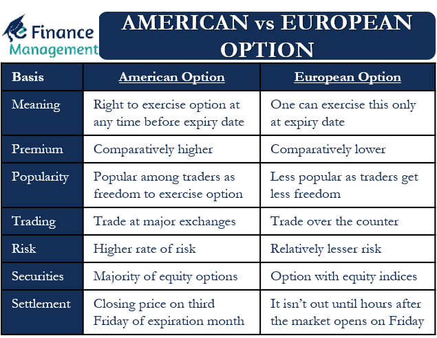

## Table of Contents

## What are American options?

American options are a type of financial contract that give the buyer the right, but not the obligation, to buy or sell an asset at a specific price before a certain date. Unlike European options, which can only be exercised at the expiration date, American options can be exercised at any time up to the expiration date. This flexibility makes them more valuable to investors because they can respond to market changes more quickly.

These options are commonly used for stocks, but they can also be used for other assets like commodities or currencies. People use American options for different reasons, like making money from price changes or protecting their investments from big losses. Because they can be used at any time, they are often more expensive than European options.

## What are European options?

European options are a kind of financial contract that lets you buy or sell something at a set price, but you can only do it on the last day the option is good for. They are different from American options because you can't use them early. People often use European options for things like stocks, but they can also be used for other stuff like gold or money from different countries.

These options are good for people who want to plan ahead and know exactly when they will make a move. Because you can only use them on the last day, they are usually cheaper than American options. This makes them a good choice if you want to save money but still have the chance to make a big move in the future.

## How do the exercise styles of American and European options differ?

The main difference between American and European options is when you can use them. American options let you buy or sell the thing you're trading at any time before the option ends. This means if the price of what you're trading changes a lot, you can act right away. It's like having a ticket that you can use whenever you want before it expires.

On the other hand, European options only let you use them on the very last day they are good for. You can't do anything with them before that day. It's like having a ticket that you can only use on a specific date. Because of this, European options are usually cheaper, but they don't give you the same flexibility as American options.

## What are the key differences in pricing models for American and European options?

The pricing models for American and European options differ mainly because of when you can use them. For European options, you can only use them on the last day they're good for. This makes it easier to figure out their price because you know exactly when they'll be used. The most common way to price European options is with the Black-Scholes model. This model uses things like the current price of what you're trading, how much time is left until the option ends, how much the price might change, and how much interest you could earn if you put your money somewhere else.

American options are trickier to price because you can use them at any time before they end. This means you have to think about all the different times you might want to use the option, not just the last day. Because of this, you can't use the Black-Scholes model the same way. Instead, people often use models like the Binomial model or more complex ones like the Least Squares Monte Carlo method. These models take into account that you might want to use the option early if the price changes a lot, making them more accurate for American options but also more complicated to use.

## Can you explain the concept of early exercise in American options?

Early exercise in American options means you can use your option to buy or sell something before it expires. This is different from European options, where you can only use them on the last day. With American options, if the price of the thing you're trading changes a lot, you might want to use your option early to make money or to avoid losing money.

Deciding when to use your American option early can be tricky. You might want to do it if the price of the thing you're trading goes up a lot, and you can make more money by buying it now than waiting. But you have to be careful because using your option early means you lose the chance to use it later if the price goes up even more. It's like deciding whether to take a smaller win now or wait for a bigger win later, but you might also end up with nothing if the price goes down.

## Why is early exercise typically not optimal for European options?

Early exercise is typically not optimal for European options because you can only use them on the last day they're good for. If you try to use a European option early, it won't work. This means you can't make any moves until the very end, so there's no point in thinking about using it early.

Because you can't use European options early, you don't have to worry about missing out on better chances later. You just wait until the last day and then decide what to do. This makes it easier to plan and know exactly when you'll make your move, without the risk of losing out by acting too soon.

## How does the time value affect the decision to exercise American options?

The time value of an American option is how much it's worth because you can use it at any time before it expires. This value comes from the chance that the price of what you're trading might go up a lot before the option ends. If you use your option early, you lose this time value. So, you need to think about whether the money you could make by using it now is more than the time value you would lose.

For example, if you have an option to buy a stock at $50, and the stock is now at $60, you might think about using your option early to make a $10 profit. But if there's still a lot of time left before the option expires, and you think the stock might go up to $70, it might be better to wait. The time value is the chance that the stock could go up more, so you need to weigh that against the money you could make right now.

## What role does dividend payment play in the valuation of American versus European options?

Dividend payments can make a big difference in how much American and European options are worth. For American options, if the stock you have an option on is going to pay a dividend soon, it might be a good idea to use your option early. This is because when a stock pays a dividend, its price usually goes down by the amount of the dividend. If you can buy the stock just before the dividend is paid, you get the dividend and the stock, which can be more valuable than waiting until the option expires.

For European options, you can't use them early, so dividends don't affect your decision to use the option the same way. But they still matter for how much the option is worth. When pricing a European option, you have to think about any dividends that will be paid before the option expires. The price of the option will be lower if there are big dividends coming up, because the stock price will drop after those dividends are paid.

## How do interest rate changes impact the pricing of American and European options differently?

Interest rates can affect how much American and European options are worth, but in slightly different ways. For American options, higher interest rates can make it more attractive to use the option early, especially if it's a call option. This is because you could take the money you would spend on the stock and put it in a bank to earn interest instead. So, if interest rates go up, the value of American options might go down because people might want to use them early to invest the money elsewhere.

For European options, interest rates also play a big role in their pricing, but you can't use them early. Higher interest rates can make European options less valuable because the money you would use to buy the stock could earn more interest if you kept it in the bank until the option expires. The Black-Scholes model, which is often used to price European options, takes into account the interest rate to figure out how much the option is worth. So, changes in interest rates affect both types of options, but the impact on American options can be more direct because of the possibility of early exercise.

## What are the implications of liquidity and market conditions on American and European options?

Liquidity and market conditions can have a big impact on both American and European options. Liquidity means how easy it is to buy or sell something without changing its price too much. If a market is very liquid, it's easier to trade options, and the prices are usually more stable. For both American and European options, high liquidity means you can get in and out of trades more easily, which can make them more valuable. On the other hand, if the market is not very liquid, it can be harder to trade, and the prices might move around a lot, which can make options less valuable because it's harder to predict what will happen.

Market conditions also affect how much American and European options are worth. If the market is going up a lot, options can become more valuable because people think the prices will keep going up. For American options, good market conditions might make people want to use their options early to take advantage of the rising prices. European options can also become more valuable in a rising market, but you have to wait until the last day to use them. If the market is going down, both types of options might lose value, but American options give you the chance to act early and maybe lose less money.

## How do advanced valuation models like the Binomial model and Black-Scholes model differ in their application to American and European options?

The Black-Scholes model is often used to price European options. It's a math formula that helps figure out how much an option is worth based on things like the current price of the stock, how long until the option expires, how much the stock price might change, and the interest rate. Because European options can only be used on the last day, the Black-Scholes model works well for them. It gives a clear answer about what the option is worth, but it can't be used the same way for American options because it doesn't account for the possibility of using the option early.

For American options, which can be used at any time before they expire, the Binomial model is more useful. This model breaks down the time until the option expires into smaller steps and looks at all the different ways the stock price could change at each step. By doing this, it can figure out the best time to use the option, which is important because American options let you make moves early if it's a good idea. The Binomial model is more complicated than Black-Scholes, but it gives a better picture of how much an American option is really worth because it takes into account the flexibility to use it early.

## What are some strategic considerations for investors choosing between American and European options?

When choosing between American and European options, investors need to think about what they want to do with their money and how much risk they are willing to take. American options let you use them at any time before they expire, which can be good if you think the price of what you're trading might change a lot. If you want to be able to act fast and maybe make more money or avoid big losses, American options might be better for you. But they usually cost more than European options because of this flexibility.

European options, on the other hand, can only be used on the last day they're good for. This can be good if you want to plan ahead and know exactly when you'll make your move. They are usually cheaper than American options, which can be good if you want to save money but still have the chance to make a big move in the future. But you can't respond to big price changes early, so they might not be as good if you want to be able to act quickly.

## What are the differences between European and American options in a comparative analysis?

European options and American options are two primary categories of financial derivatives with distinct characteristics that influence their pricing and trading strategies. The fundamental difference between the two lies in the exercise flexibility: European options can only be exercised at their expiration date, whereas American options can be exercised at any time before or at expiration. This flexibility affects various aspects of their use in trading and impacts the valuation models utilized by traders and investors.

### Pricing and Valuation Differences

The flexibility inherent in American options typically makes them more valuable compared to their European counterparts. This is because the holder of an American option has more opportunities to capitalize on favorable market movements. Consequently, the pricing models for American and European options differ, with the Black-Scholes model commonly used for European options, while more complex methodologies like the Binomial model or simulation methods, such as the Monte Carlo simulation, are often applied to American options.

For example, consider the Black-Scholes formula, which calculates the price of a European call option as follows:

$$
C = S_0 \cdot N(d_1) - X \cdot e^{-rT} \cdot N(d_2)
$$

where:
- $C$ is the call option price,
- $S_0$ is the current stock price,
- $X$ is the strike price,
- $T$ is the time to expiration,
- $r$ is the risk-free interest rate,
- $N(\cdot)$ denotes the cumulative distribution function of the standard normal distribution,
- $d_1$ and $d_2$ are intermediate calculations based on the inputs.

In contrast, the valuation of American options often requires accounting for the possibility of early exercise, which is particularly important when the option is deep in-the-money, the underlying asset pays dividends, or in falling interest rate environments.

### Trading Strategies and Preferences

The choice between European and American options depends on the trader's strategy and outlook on the market. For instance, in a volatile market where a trader anticipates significant price movements before the expiration date, American options might be preferred due to their exercise flexibility. Conversely, if a trader is primarily focused on cost efficiency and a longer-term bullish or bearish position is intended, European options may be more suitable due to their simpler valuation and generally lower premiums.

A practical trading scenario involves dividend-paying stocks: American options are advantageous since the holder can exercise the option before the stock goes ex-dividend to capture the dividend payment, which can be factored into strategic planning.

### Market Conditions and Impact on Choice

Market conditions significantly influence the choice between European and American options. In periods of high volatility and uncertainty, traders often gravitate towards American options for their increased strategic opportunities. Conversely, stable market conditions with predictable price movements may lead traders to prefer European options, relying on their simplicity and typically lower premiums.

Moreover, the structure and behavior of the options markets themselves can influence which type of option is favored. For instance, many index options are European, which avoids complications related to early exercise, whereas individual stock options tend to be American, allowing for a broader range of strategic maneuvers.

In summary, while both European and American options serve as vital tools for risk management and speculation, their distinct exercise policies, pricing complexities, and strategic applications define their suitability based on market conditions and trading objectives. Understanding these differences equips traders to make informed decisions aligned with their market forecasts and risk tolerance preferences.

 to Algorithmic Trading

Algorithmic trading refers to the use of computer algorithms to automate trading decisions and execute orders in the financial markets. This method leverages predefined rules and mathematical models to facilitate transactions at speeds and frequencies that are beyond human capability. Algorithmic trading has become increasingly prevalent across global markets, playing a pivotal role in enhancing market efficiency and liquidity.

At the core of [algorithmic trading](/wiki/algorithmic-trading) is the use of sophisticated technology and methodologies. These algorithms can be designed to undertake a variety of tasks, ranging from simple rule-based systems to complex strategies involving high-frequency trading. Key technologies include data analytics platforms, [machine learning](/wiki/machine-learning) models, and high-performance computing systems. Algorithms are often categorized based on their function, such as statistical [arbitrage](/wiki/arbitrage), [trend following](/wiki/trend-following), market-making, and execution strategies. Each category employs specific technological tools to achieve optimal performance and minimize trading costs.

One of the primary benefits of algorithmic trading is the speed and efficiency it offers. By automating decisions and using real-time data, algorithmic strategies can quickly adapt to market movements, ensuring that traders can capitalize on fleeting opportunities. This speed is particularly advantageous in options markets, where price movements can be volatile and rapid. Algorithms can execute trades faster than human traders, reducing latency and slippage, which can lead to more favorable pricing and reduced market impact.

In options trading, several common algorithms are used to enhance trading strategies. These include Delta hedging algorithms, which are employed to manage the risk of an options portfolio, and volatility arbitrage strategies, which exploit differences between implied and historical volatility. Another common application is the implementation of Gamma [scalping](/wiki/gamma-scalping) techniques, which help manage an option's gamma risk by adjusting exposure to the underlying asset.

Overall, algorithmic trading has transformed the landscape of modern financial markets, enabling more efficient and systematic strategies. As technology continues to advance, the use of algorithms is expected to grow, further increasing their prominence and impact in options trading.

## References & Further Reading

[1]: Hull, J. C. (2018). ["Options, Futures, and Other Derivatives."](https://www.semanticscholar.org/paper/Options%2C-Futures%2C-and-Other-Derivatives-Hull/89bdee500c8623864fc9eb7a471546aa713acc44) Pearson Education.

[2]: Black, F., & Scholes, M. (1973). ["The Pricing of Options and Corporate Liabilities."](https://www.cs.princeton.edu/courses/archive/fall09/cos323/papers/black_scholes73.pdf) Journal of Political Economy, 81(3), 637-654.

[3]: Cox, J. C., Ross, S. A., & Rubinstein, M. (1979). ["Option Pricing: A Simplified Approach."](https://www.sciencedirect.com/science/article/pii/0304405X79900151) Journal of Financial Economics, 7(3), 229-263.

[4]: Lopez de Prado, M. (2018). ["Advances in Financial Machine Learning."](https://www.amazon.com/Advances-Financial-Machine-Learning-Marcos/dp/1119482089) Wiley.

[5]: Jansen, S. (2020). ["Machine Learning for Algorithmic Trading: Second Edition."](https://www.amazon.com/Machine-Learning-Algorithmic-Trading-alternative/dp/1839217715) Packt Publishing.

[6]: Chan, E. P. (2009). ["Quantitative Trading: How to Build Your Own Algorithmic Trading Business."](https://github.com/ftvision/quant_trading_echan_book) Wiley.

[7]: Gatheral, J. (2006). ["The Volatility Surface: A Practitioner's Guide."](https://github.com/PlamenStilyianov/Quant/blob/master/Gatheral%20J.%20The%20volatility%20surface..%20A%20practitioner%27s%20guide%20(Wiley%2C%202006)(ISBN%200471792519)(210s)_FD_.pdf) Wiley.

[8]: Aronson, D. R. (2007). ["Evidence-Based Technical Analysis: Applying the Scientific Method and Statistical Inference to Trading Signals."](https://onlinelibrary.wiley.com/doi/book/10.1002/9781118268315) Wiley.