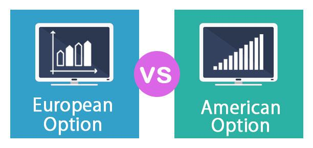

Financial derivatives are sophisticated financial instruments that derive their value from an underlying asset, benchmark, or index. These derivatives play a pivotal role in today's trading world as they offer investors and traders a mechanism for hedging risk, speculating on future price movements, and enhancing portfolio returns. Among the vast array of derivatives, options stand out as a fundamental type, with two primary variations being European options and American options. 

European options are distinctive in that they can only be exercised at the expiration date. This restriction in the exercise period contrasts with American options, which provide the flexibility to be exercised at any point up to and including the expiration date. These two types of options are essential tools in financial markets, with each offering unique benefits and constraints that cater to different trading strategies and market conditions.



In recent years, algorithmic trading (algo trading) has gained prominence in the trading of financial derivatives, including both European and American options. Algorithmic trading involves the use of computer algorithms to automate complex trading decisions at speeds and frequencies that are impossible for human traders. The rise of algo trading has transformed how derivatives are traded, offering increased efficiency, precision, and the ability to exploit market opportunities as they arise.

The purpose of this article is to explore the distinctive characteristics, differences, and implications of European and American options within the context of algorithmic trading. By understanding the nuances of these derivatives and the role of algo trading, traders and investors can make informed decisions in an increasingly competitive and technologically advanced marketplace.

## Table of Contents

## Understanding Financial Derivatives

Financial derivatives are financial instruments whose value derives from the price of underlying assets, which can include stocks, bonds, commodities, and market indices. These instruments play a critical role in modern financial markets by allowing participants to hedge risk, speculate, and enhance leverage. Derivatives come in various forms, including options, futures, forwards, and swaps, with each type serving distinct purposes and offering unique benefits.

Options, a prominent class of derivatives, grant the holder the right, but not the obligation, to buy or sell an underlying asset at a predetermined price (known as the strike price) before or on a specific date. The basic functionalities of options as derivatives involve two primary actions: the ability to lock in a purchase price for an asset (call options) or to secure a selling price (put options), thereby providing strategic advantages in various market conditions. Traders utilize options not only for hedging against adverse price movements but also for gaining directional plays based on movements of the underlying asset without possessing it directly.

Among the numerous varieties of options, European and American options stand out as the two most fundamental categories. European options can only be exercised at the expiration date, providing a framework that simplifies pricing models due to their singular point of exercise. Conversely, American options offer greater flexibility, as they can be exercised at any point up to and including the expiration date, thus requiring more sophisticated valuation methods like the Binomial Options Pricing Model or algorithms based on finite difference methods.

Financial derivatives function as indispensable tools for risk management and speculative activities. Through options and other derivatives, market participants can effectively manage exposure to various risks, including price [volatility](/wiki/volatility-trading-strategies), [interest rate](/wiki/interest-rate-trading-strategies) changes, and currency fluctuations. For instance, an investor holding a large portfolio of stocks may use put options to hedge against potential downturns in the market, while speculators might buy call options to profit from anticipated upward movements in asset prices. Thus, derivatives enable a broader range of strategic financial planning and are integral to dynamic market environments where risk and speculation are pivotal.

## European Options: Features and Characteristics

European options are a fundamental type of financial derivative that grants the holder the right, but not the obligation, to buy or sell an underlying asset at a predetermined price, known as the strike price, on a specific expiration date. Unlike American options, European options can only be exercised on this expiration date. This characteristic offers both simplicity and a specific strategic utility to traders, as it eliminates the possibility of early exercise and aligns the option's value closely with theoretical pricing models.

European options are primarily traded in over-the-counter (OTC) markets and centralized exchanges across Europe and other parts of the world, where standardized options are prevalent. The European derivatives markets such as Euronext and the Eurex Exchange are among the prominent venues for trading these options. These markets provide [liquidity](/wiki/liquidity-risk-premium) and established regulatory frameworks that benefit both institutional and individual traders.

The benefits of European options stem from their predictable exercise date, which allows for straightforward implementation of pricing models like the Black-Scholes model. This predictability simplifies hedging strategies and pricing models, making risk management more transparent for traders. Moreover, these options typically come with lower premiums compared to their American counterparts due to the restriction on exercise, which may be attractive for cost-conscious investors.

However, the inability to exercise European options before the expiration date also presents a notable drawback. Traders cannot capitalize on favorable market movements by exercising the option early, which can be a disadvantage if the underlying asset's price moves significantly before the expiration date. This lack of flexibility can limit strategies that depend on price volatility over short-time horizons or unexpected market shifts.

In conclusion, European options serve as a vital tool in the toolbox of both speculators and hedgers. While they offer benefits such as lower premiums and simplified pricing, they also impose restrictions that may deter certain traders. Understanding these characteristics helps market participants effectively incorporate European options into their trading strategies and risk management practices.

## American Options: Features and Characteristics

American options are a type of financial derivative that grants the holder the right, but not the obligation, to buy or sell an underlying asset at a predetermined price on or before a specified expiration date. This distinct characteristic differentiates American options from European options, which can only be exercised precisely at the expiration date. The flexibility inherent in American options allows traders to capitalize on favorable market movements at any point up until the option's expiration, offering strategic advantages under certain market conditions.

The flexibility to exercise an American option at any time before expiration can be advantageous. This feature can be particularly beneficial if the underlying asset experiences significant price movements. For example, if a trader holds an American call option and the asset's price rises considerably above the strike price, the trader can exercise the option early to capture the profits, offsetting the potential for price declines. Consequently, American options provide a means of leveraging early favorable positions, thus allowing for more dynamic risk management and profit-taking strategies.

Common markets for American options trading include stock exchanges in the United States, where equity options are predominantly American-style. The Chicago Board Options Exchange (CBOE) is one such prominent platform that offers a wide array of American options on individual stocks, indexes, and ETFs. Given the size and diversity of the U.S. stock market, American options are integral to many trading and hedging strategies.

American options present several advantages for traders. Their primary advantage lies in the ability to exercise the option early, which can be particularly useful in securing profits or minimizing losses when significant events that might affect the asset's price occur. Additionally, American options are well-suited for hedging strategies, as they offer greater timing flexibility, allowing traders to dynamically adjust their position in response to market conditions. This adaptability can be crucial in volatile or rapidly changing markets, where the ability to quickly respond to new information is paramount.

However, American options also have limitations. One notable drawback is their typically higher premium compared to European options, primarily due to the extra flexibility afforded by the early exercise feature. This can make American options more costly for short-term strategies or when the likelihood of early exercise is low. Additionally, determining the optimal time to exercise an American option can introduce complexity, requiring more sophisticated decision-making frameworks and sometimes resulting in suboptimal exercise strategies if traders misjudge market movements.

In summary, American options provide traders with the flexibility to exercise at any time before expiration, which can offer strategic advantages in volatile markets. While this flexibility comes with higher premiums and requires careful consideration of exercise timing, the ability to capitalize on short-term market conditions makes American options an essential tool in a trader's arsenal.

## Comparative Analysis: European vs American Options

European options and American options are two primary categories of financial derivatives with distinct characteristics that influence their pricing and trading strategies. The fundamental difference between the two lies in the exercise flexibility: European options can only be exercised at their expiration date, whereas American options can be exercised at any time before or at expiration. This flexibility affects various aspects of their use in trading and impacts the valuation models utilized by traders and investors.

### Pricing and Valuation Differences

The flexibility inherent in American options typically makes them more valuable compared to their European counterparts. This is because the holder of an American option has more opportunities to capitalize on favorable market movements. Consequently, the pricing models for American and European options differ, with the Black-Scholes model commonly used for European options, while more complex methodologies like the Binomial model or simulation methods, such as the Monte Carlo simulation, are often applied to American options.

For example, consider the Black-Scholes formula, which calculates the price of a European call option as follows:

$$
C = S_0 \cdot N(d_1) - X \cdot e^{-rT} \cdot N(d_2)
$$

where:
- $C$ is the call option price,
- $S_0$ is the current stock price,
- $X$ is the strike price,
- $T$ is the time to expiration,
- $r$ is the risk-free interest rate,
- $N(\cdot)$ denotes the cumulative distribution function of the standard normal distribution,
- $d_1$ and $d_2$ are intermediate calculations based on the inputs.

In contrast, the valuation of American options often requires accounting for the possibility of early exercise, which is particularly important when the option is deep in-the-money, the underlying asset pays dividends, or in falling interest rate environments.

### Trading Strategies and Preferences

The choice between European and American options depends on the trader's strategy and outlook on the market. For instance, in a volatile market where a trader anticipates significant price movements before the expiration date, American options might be preferred due to their exercise flexibility. Conversely, if a trader is primarily focused on cost efficiency and a longer-term bullish or bearish position is intended, European options may be more suitable due to their simpler valuation and generally lower premiums.

A practical trading scenario involves dividend-paying stocks: American options are advantageous since the holder can exercise the option before the stock goes ex-dividend to capture the dividend payment, which can be factored into strategic planning.

### Market Conditions and Impact on Choice

Market conditions significantly influence the choice between European and American options. In periods of high volatility and uncertainty, traders often gravitate towards American options for their increased strategic opportunities. Conversely, stable market conditions with predictable price movements may lead traders to prefer European options, relying on their simplicity and typically lower premiums.

Moreover, the structure and behavior of the options markets themselves can influence which type of option is favored. For instance, many index options are European, which avoids complications related to early exercise, whereas individual stock options tend to be American, allowing for a broader range of strategic maneuvers.

In summary, while both European and American options serve as vital tools for risk management and speculation, their distinct exercise policies, pricing complexities, and strategic applications define their suitability based on market conditions and trading objectives. Understanding these differences equips traders to make informed decisions aligned with their market forecasts and risk tolerance preferences.

 to Algorithmic Trading

Algorithmic trading refers to the use of computer algorithms to automate trading decisions and execute orders in the financial markets. This method leverages predefined rules and mathematical models to facilitate transactions at speeds and frequencies that are beyond human capability. Algorithmic trading has become increasingly prevalent across global markets, playing a pivotal role in enhancing market efficiency and liquidity.

At the core of [algorithmic trading](/wiki/algorithmic-trading) is the use of sophisticated technology and methodologies. These algorithms can be designed to undertake a variety of tasks, ranging from simple rule-based systems to complex strategies involving high-frequency trading. Key technologies include data analytics platforms, [machine learning](/wiki/machine-learning) models, and high-performance computing systems. Algorithms are often categorized based on their function, such as statistical [arbitrage](/wiki/arbitrage), [trend following](/wiki/trend-following), market-making, and execution strategies. Each category employs specific technological tools to achieve optimal performance and minimize trading costs.

One of the primary benefits of algorithmic trading is the speed and efficiency it offers. By automating decisions and using real-time data, algorithmic strategies can quickly adapt to market movements, ensuring that traders can capitalize on fleeting opportunities. This speed is particularly advantageous in options markets, where price movements can be volatile and rapid. Algorithms can execute trades faster than human traders, reducing latency and slippage, which can lead to more favorable pricing and reduced market impact.

In options trading, several common algorithms are used to enhance trading strategies. These include Delta hedging algorithms, which are employed to manage the risk of an options portfolio, and volatility arbitrage strategies, which exploit differences between implied and historical volatility. Another common application is the implementation of Gamma [scalping](/wiki/gamma-scalping) techniques, which help manage an option's gamma risk by adjusting exposure to the underlying asset.

Overall, algorithmic trading has transformed the landscape of modern financial markets, enabling more efficient and systematic strategies. As technology continues to advance, the use of algorithms is expected to grow, further increasing their prominence and impact in options trading.

## Algo Trading with European and American Options

Algorithmic trading has revolutionized how European and American options are traded, enabling traders to execute complex strategies with speed and precision. Algorithmic trading, or algo trading, involves using computer programs to trade financial instruments based on pre-defined criteria. In the context of options, these algorithms are tailored to account for the nuances and specificities of both European and American options.

### Algorithmic Strategies for Options Trading

Various algorithms are specifically suited for options trading due to the complexity of pricing and managing options portfolios. Some of these include:

1. **Delta-neutral strategies**: These algorithms maintain a position where the overall delta (rate of change of the option's price with respect to the underlying asset's price) is zero. This involves dynamically adjusting positions in options and the underlying securities. Here is a basic example of a delta-neutral trading strategy in Python:

   ```python
   def delta_neutral_strategy(option_delta, underlying_position):
       # target overall delta should be zero
       delta_target = 0
       position_adjustment = delta_target - (option_delta * underlying_position)
       return position_adjustment
   ```

2. **Volatility arbitrage**: As options are particularly sensitive to volatility, algorithms that exploit discrepancies between implied volatility (the market's forecast of a likely movement) and actual volatility can be employed. Algorithms can identify and act on these arbitrage opportunities faster than human traders.

3. **Pairs trading**: This strategy involves identifying and exploiting relationships between different options or groups of options. By using historical data and statistical models, algorithms can identify pairs of options that historically move together and trade when those relationships deviate.

### Challenges and Opportunities

Trading options algorithmically presents unique challenges. The complex Greek variables (delta, gamma, theta, vega) that affect options pricing make modeling and prediction difficult. Additionally, the liquidity in options markets can vary significantly, impacting the effectiveness of certain strategies.

However, algorithmic trading also offers significant opportunities. The ability to process large volumes of data enables traders to identify patterns that would be impossible to discern manually. Moreover, the computational power and speed allow for near-instantaneous execution of trades, which is crucial in the often-volatile options markets.

### Successful Strategies in Algo Trading

One successful example of an algorithmic strategy is the **straddle strategy**. This involves buying both a call and a put option on the same underlying asset with the same strike price and expiration date. The profit comes from large movements in the underlying asset's price, regardless of direction. An algorithm can systematically implement and optimize this strategy, constantly recalibrating based on market conditions.

Another effective approach is **algorithmic [market making](/wiki/market-making)**, where the algorithm continuously provides buy and sell quotes to capitalize on the bid-ask spread. This requires sophisticated models to assess risk and adjust for factors such as time decay and volatility shifts.

In conclusion, the intersection of algorithmic trading and options—both European and American—represents a dynamic and challenging field. The ability to leverage speed, data, and sophisticated algorithms affords traders distinctive advantages, although it necessitates robust strategies to manage the inherent complexities and risks.

## Risks and Limitations of Algo Trading in Options Markets

Algorithmic trading, while providing speed and efficiency in options markets, also introduces several risks and limitations. Understanding these risks can be crucial for traders aiming to optimize their strategies while minimizing potential losses.

### Market Volatility

Market volatility poses a significant risk to algorithmic trading in options markets. Algorithms rely on historical data and predefined parameters to execute trades. However, sudden market movements or unexpected news can drastically alter price dynamics, leading to substantial losses. Volatile conditions can cause algorithms to trigger excessive trades, increasing transaction costs and potentially resulting in market impact where the trades themselves affect the asset price. For example, a sharp increase in market volatility can cause an algorithm to execute a high [volume](/wiki/volume-trading-strategy) of trades based on outdated or irrelevant data, leading to suboptimal trading outcomes.

### Liquidity Concerns

Liquidity is another critical [factor](/wiki/factor-investing) that can constrain algorithmic trading. In less liquid markets, executing large orders can substantially impact prices, making it difficult to enter or [exit](/wiki/exit-strategy) positions without slippage. This is particularly relevant for options markets where certain strikes or expiration dates might have limited trading activity. Less liquid markets increase the risk of holding positions that cannot be unwound quickly, leading to potential losses if market conditions change unfavorably. For instance, an algorithm designed to trade an illiquid option may struggle to execute trades at the desired price points, resulting in higher execution costs and increased risk exposure.

### Technological Failures

Technological failures represent a significant risk, as algorithmic trading is heavily reliant on complex software and hardware systems. Any disruptions, such as server outages, network issues, or software bugs, can lead to missed trading opportunities or erroneous trade executions. These failures can have severe financial repercussions if not managed promptly. For instance, a system crash during a critical market movement may result in missed profits or unintentional losses if the algorithm fails to execute intended trades.

### Differences Between European and American Options

The risks associated with algorithmic trading can vary depending on whether European or American options are being traded. European options can only be exercised at expiration, which reduces the complexity of trade execution algorithms but limits flexibility in volatile markets. Conversely, American options can be exercised at any time before expiration, requiring algorithms to incorporate additional decision-making criteria, potentially increasing the risk of premature exercise or unnecessary transaction costs. Algorithms must be tailored to account for these differences, as improperly configured strategies may lead to suboptimal decision-making and increased risk.

### Recommendations for Risk Management

1. **Enhanced Algorithm Design**: Implement adaptive algorithms capable of adjusting to changing market conditions. Incorporating machine learning techniques can improve the algorithm's ability to predict market movements and adjust strategies accordingly.

2. **Robust Backtesting**: Conduct comprehensive backtesting using a wide range of historical data, including periods of high volatility, to ensure the algorithm performs well across different market conditions. This helps identify potential weaknesses in the strategy and make necessary adjustments before deployment.

3. **Liquidity Monitoring**: Establish mechanisms to monitor market liquidity in real-time and adjust trading strategies to accommodate shifts in trading volume and market depth. This can help mitigate the impact of liquidity-related risks and prevent excessive slippage.

4. **Redundancy and Failover Systems**: Develop and implement redundant systems and failover protocols to minimize the impact of technological failures. Regular system tests and updates can further reduce the likelihood of unexpected disruptions.

5. **Risk Limits and Alerts**: Set predefined risk limits and implement alert systems to notify traders of unusual trading activity or excessive risk exposure. This enables timely intervention and corrective actions to prevent substantial losses.

By understanding and addressing these risks, traders can more effectively utilize algorithmic trading strategies in options markets, enhancing their ability to capture opportunities while minimizing potential downsides.

## Future Trends in Options Trading and Algorithmic Techniques

Predicting future developments in the landscape of options trading, particularly within the framework of algorithmic techniques, involves a nuanced understanding of emerging technological advancements and regulatory considerations. The integration of [artificial intelligence](/wiki/ai-artificial-intelligence) (AI) and machine learning (ML) represents a major frontier that will likely alter the mechanics of trading strategies. These technologies are increasingly applied to analyze vast datasets, identify trading patterns, and execute strategies with unparalleled speed and precision. Machine learning algorithms, such as [reinforcement learning](/wiki/reinforcement-learning), are specifically tailored to improve decision-making processes by learning optimal trading actions through simulated environments.

One Python example of using reinforcement learning for trading could involve using libraries such as TensorFlow or PyTorch to design a [neural network](/wiki/neural-network) that forecasts the best trading actions for options based on historical data:

```python
import numpy as np
import tensorflow as tf
from tensorflow.keras.models import Sequential
from tensorflow.keras.layers import Dense, LSTM
from sklearn.preprocessing import MinMaxScaler

# Data preprocessing
data = np.random.rand(1000, 1)  # Example data
scaler = MinMaxScaler(feature_range=(0, 1))
scaled_data = scaler.fit_transform(data)

# Build LSTM model
model = Sequential([
    LSTM(units=50, return_sequences=True, input_shape=(scaled_data.shape[1], 1)),
    LSTM(units=50, return_sequences=False),
    Dense(units=25),
    Dense(units=1)
])

model.compile(optimizer='adam', loss='mean_squared_error')
# Model training would proceed here
```

In addition to technological advancements, regulatory changes could significantly impact options trading and algorithmic activities. Regulatory bodies are gradually recognizing the need to oversee algorithmic trading to mitigate risks such as market manipulation and systemic failures. Future regulations may mandate greater transparency in algorithmic strategies, necessitating detailed audits of algorithmic models and real-time reporting systems.

Investors and traders are showing an increasing preference for environmentally sustainable and socially responsible investment strategies. This shift creates a demand for algorithms that can evaluate stocks and options not only on financial metrics but also on environmental, social, and governance ([ESG](/wiki/esg-investing)) criteria. As this trend gains [momentum](/wiki/momentum), AI and ML will be pivotal in developing ESG-centric trading models that align with evolving market preferences.

In summary, the future of options trading in the context of algorithmic techniques will be shaped by rapid technological advancements in AI and ML, evolving regulatory landscapes, and changing investor values. The ability to adapt to these changes will define the success of market participants in pursuing strategic and compliant trading operations.

## Conclusion

In conclusion, understanding both European and American options is crucial for participants in financial markets looking to leverage these derivatives for investment and risk management strategies. European options, which can only be exercised at expiration, offer simplicity and typically involve fewer premiums, making them suitable for certain trading environments. In contrast, American options provide the flexibility of being exercised at any point before expiration, offering traders additional opportunities and adaptability at the cost of potentially higher pricing. This foundational knowledge aids in forming efficient strategies tailored to market conditions and individual risk preferences.

The integration of algorithmic trading with options trading presents significant advantages, including speed, efficiency, and the potential for executing complex strategies that are not viable through manual trading. Algorithms can swiftly analyze large datasets and execute trades with precision, thereby enhancing the decision-making process. However, these advantages come with inherent risks, such as increased market volatility, liquidity concerns, and the potential for technological failures. The risks vary between European and American options, necessitating robust risk management and mitigation strategies to fortify trading practices.

As the financial landscape evolves, continuous exploration and learning in this field remain essential. Emerging technologies, including artificial intelligence and machine learning, are expected to significantly influence the future of algorithmic options trading. These advancements may lead to more sophisticated trading strategies and potentially alter market dynamics and regulatory frameworks. Therefore, staying informed and adaptable will be key to successfully navigating the complexities of options trading in this era of rapid technological advancement.

## References & Further Reading

[1]: Hull, J. C. (2018). ["Options, Futures, and Other Derivatives."](https://www.semanticscholar.org/paper/Options%2C-Futures%2C-and-Other-Derivatives-Hull/89bdee500c8623864fc9eb7a471546aa713acc44) Pearson Education.

[2]: Black, F., & Scholes, M. (1973). ["The Pricing of Options and Corporate Liabilities."](https://www.cs.princeton.edu/courses/archive/fall09/cos323/papers/black_scholes73.pdf) Journal of Political Economy, 81(3), 637-654.

[3]: Cox, J. C., Ross, S. A., & Rubinstein, M. (1979). ["Option Pricing: A Simplified Approach."](https://www.sciencedirect.com/science/article/pii/0304405X79900151) Journal of Financial Economics, 7(3), 229-263.

[4]: Lopez de Prado, M. (2018). ["Advances in Financial Machine Learning."](https://www.amazon.com/Advances-Financial-Machine-Learning-Marcos/dp/1119482089) Wiley.

[5]: Jansen, S. (2020). ["Machine Learning for Algorithmic Trading: Second Edition."](https://www.amazon.com/Machine-Learning-Algorithmic-Trading-alternative/dp/1839217715) Packt Publishing.

[6]: Chan, E. P. (2009). ["Quantitative Trading: How to Build Your Own Algorithmic Trading Business."](https://github.com/ftvision/quant_trading_echan_book) Wiley.

[7]: Gatheral, J. (2006). ["The Volatility Surface: A Practitioner's Guide."](https://github.com/PlamenStilyianov/Quant/blob/master/Gatheral%20J.%20The%20volatility%20surface..%20A%20practitioner%27s%20guide%20(Wiley%2C%202006)(ISBN%200471792519)(210s)_FD_.pdf) Wiley.

[8]: Aronson, D. R. (2007). ["Evidence-Based Technical Analysis: Applying the Scientific Method and Statistical Inference to Trading Signals."](https://onlinelibrary.wiley.com/doi/book/10.1002/9781118268315) Wiley.