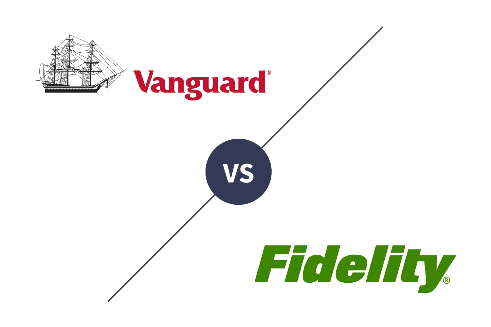

## Table of Contents

## What are American Funds and Vanguard Group?

American Funds is a company that manages mutual funds. They help people invest their money in different ways. They have been around since 1931 and are known for their long-term investment approach. People often choose American Funds because they offer a variety of funds that can fit different investment goals. They are part of a larger company called Capital Group.

Vanguard Group is another company that manages mutual funds and other types of investments. They started in 1975 and are famous for creating the first index fund for individual investors. Vanguard is known for keeping their fees low, which means investors get to keep more of their money. They focus on helping people save for retirement and other long-term goals. Many people trust Vanguard because of their reputation for being investor-friendly.

## How do the investment philosophies of American Funds and Vanguard Group differ?

American Funds focuses on active management. This means their fund managers pick specific stocks and bonds they think will do well. They believe that by carefully choosing investments, they can beat the market over time. American Funds often uses a team of experts to make these choices, and they aim to create a diverse mix of investments to spread out risk. Their approach is about trying to do better than average, and they think that their research and expertise can help them achieve this goal.

Vanguard Group, on the other hand, is known for its focus on passive management. They are famous for their index funds, which try to match the performance of a market index, like the S&P 500, instead of trying to beat it. Vanguard believes that over the long term, it's hard to consistently beat the market, so it's better to keep costs low and just follow the market's performance. Their approach is about keeping fees low and making investing simple and accessible for everyone. This means investors pay less in fees and can keep more of their returns over time.

## What types of investment products do American Funds and Vanguard Group offer?

American Funds offers different kinds of mutual funds. They have funds that invest in stocks, which are called equity funds. They also have funds that invest in bonds, called fixed-income funds. Some of their funds mix both stocks and bonds, and these are called balanced funds. They also have funds that focus on certain parts of the world, like international funds. American Funds tries to help people save for retirement with funds like target date funds, which change their mix of investments as you get closer to retiring.

Vanguard Group also offers a variety of investment products. They are well-known for their index funds, which track the performance of a market index. They have index funds for stocks and bonds. Vanguard also offers actively managed funds, where their managers pick specific investments. They have mutual funds and exchange-traded funds (ETFs), which are like mutual funds but trade like stocks. Vanguard also offers target date funds for retirement and other funds that help people save for different goals, like college savings plans.

## How do the fee structures compare between American Funds and Vanguard Group?

American Funds usually charge higher fees than Vanguard. Their fees are called expense ratios, and they can be around 0.5% to 1% of the money you invest every year. These fees pay for the fund managers who pick the stocks and bonds. American Funds might also charge other fees, like sales charges when you buy or sell shares. These are called loads, and they can make investing more expensive.

Vanguard is known for having low fees. Their expense ratios are often much lower, sometimes as low as 0.04% for some of their index funds. Vanguard focuses on keeping costs down because they believe it helps investors keep more of their money over time. They don't usually charge loads, so there are fewer extra costs when you buy or sell their funds. This makes Vanguard a popular choice for people who want to save on fees.

## What are the performance histories of American Funds and Vanguard Group?

American Funds have a long history of performance that goes back to the 1930s. They have done well over the years because they use active management. This means their fund managers pick specific stocks and bonds they think will do better than the market. Over long periods, like 10 or 20 years, many of their funds have beaten the market. But, their performance can change a lot from year to year. Sometimes they do better than the market, and sometimes they do worse. The fees they charge can also affect how much money investors keep.

Vanguard Group has been around since the 1970s and is known for their index funds. These funds try to match the market's performance instead of beating it. Over long periods, Vanguard's index funds have done well because they keep fees very low. This means investors get to keep more of their money. Their actively managed funds have also done well, but they usually don't beat the market as often as American Funds. Vanguard's focus on low costs helps their funds perform better over time, even if they don't always beat the market.

## How do the asset sizes of American Funds and Vanguard Group compare?

American Funds manages a lot of money. They have about $2 trillion in assets. This makes them one of the biggest investment companies in the world. They have grown a lot over the years because many people trust them to help with their investments.

Vanguard Group manages even more money than American Funds. They have around $8 trillion in assets. This makes Vanguard the largest mutual fund company in the world. People like Vanguard because they keep fees low and offer many different ways to invest.

## What are the key differences in fund management strategies between American Funds and Vanguard Group?

American Funds uses a strategy called active management. This means their fund managers choose specific stocks and bonds they think will do well. They believe that by doing a lot of research and using their expertise, they can pick investments that will beat the market. American Funds has teams of experts who work together to make these choices. They aim to spread out risk by having a mix of different investments. This approach can lead to higher returns if their picks do well, but it also comes with higher fees because managing the funds this way costs more.

Vanguard Group, on the other hand, is known for its passive management strategy. They are famous for their index funds, which try to match the performance of a market index, like the S&P 500, instead of trying to beat it. Vanguard believes that it's hard to consistently beat the market over time, so it's better to keep costs low and follow the market's performance. This means their fees are much lower because they don't need to pay for a lot of research and active decision-making. Vanguard's approach is about making investing simple and affordable, which helps investors keep more of their money over time.

## How do the tax efficiency of funds from American Funds compare to those from Vanguard Group?

American Funds' active management can sometimes lead to less tax efficiency. When their fund managers buy and sell stocks and bonds to try to beat the market, it can create more capital gains. These gains are passed on to investors and can lead to higher taxes. The higher turnover in their funds means there might be more taxable events each year. So, if you're investing in a regular account (not a tax-sheltered one like an IRA), you might end up paying more in taxes with American Funds.

Vanguard Group's focus on index funds generally makes their funds more tax efficient. Index funds have less buying and selling because they just try to match the market. This lower turnover means fewer capital gains are realized, which can lead to lower taxes for investors. Vanguard also offers tax-managed funds that are designed to minimize the taxes you pay. So, if keeping your taxes low is important, Vanguard's funds might be a better choice, especially in a regular investment account.

## What are the minimum investment requirements for funds offered by American Funds and Vanguard Group?

American Funds usually asks for a minimum of $250 to start investing in their funds. But if you want to invest in their funds through a retirement account like a 401(k), there might be no minimum at all. Some of their funds might need more money to start, like $1,000, but it depends on the specific fund. If you choose to work with a financial advisor to buy their funds, the minimum might be higher, sometimes around $2,500.

Vanguard Group has different minimums depending on the type of fund and how you want to invest. For their index funds and some of their other funds, you can start with just $3,000. But if you choose to invest in their ETFs, you can buy them for the price of one share, which can be much less than $3,000. Vanguard also offers lower minimums if you sign up for their automatic investment plan, where you can start with as little as $100 a month.

## How do the customer service and investor education resources differ between American Funds and Vanguard Group?

American Funds offers good customer service. You can call them and talk to someone if you have questions about your investments. They also have a website where you can find information and tools to help you. American Funds focuses a lot on working with financial advisors, so if you have one, they can help you learn about their funds. They also have some resources on their website to teach people about investing, like articles and videos. But, their main focus is on helping financial advisors help their clients.

Vanguard Group is known for its strong customer service too. They have a big team of people you can call if you need help with your investments. Vanguard's website is full of tools and information to help you understand investing better. They have a lot of articles, videos, and even classes you can take to learn about saving for retirement and other goals. Vanguard wants to help people learn how to invest on their own, so they put a lot of effort into making their educational resources easy to use and understand.

## What are the retirement planning options available through American Funds and Vanguard Group?

American Funds offers a few different ways to help people plan for retirement. They have something called target date funds, which are easy to use because they change the mix of investments as you get closer to retiring. This means they start with more stocks when you're young and move to more bonds as you get older. American Funds also works with a lot of companies to help with their 401(k) plans, so if you have a retirement account through your job, it might be with American Funds. They try to make it easy for people to save for retirement by offering different funds that fit different goals and ages.

Vanguard Group also has a lot of options for retirement planning. They offer target date funds too, which adjust the mix of stocks and bonds as you get closer to retiring. Vanguard's target date funds are popular because they keep fees low, so you get to keep more of your money. They also help a lot of companies set up 401(k) plans, so you might have a Vanguard account through your job. Vanguard has tools and resources on their website to help you figure out how much to save and how to invest for retirement, making it easier for people to plan for their future.

## How do the risk management approaches of American Funds and Vanguard Group differ?

American Funds uses active management to handle risk. Their fund managers pick specific stocks and bonds they think will do well. They try to spread out the risk by having a mix of different investments. This means they might invest in different types of companies, in different countries, and in different kinds of bonds. By doing a lot of research, they think they can find investments that will help them beat the market while also keeping risk under control. But because they are always buying and selling, their funds can sometimes be more risky and have more ups and downs.

Vanguard Group focuses on passive management to manage risk. They use index funds that follow the market instead of trying to beat it. This means they invest in a wide range of stocks or bonds to match a market index, like the S&P 500. By doing this, they spread out risk across many different investments. Because they don't buy and sell as much, their funds usually have less ups and downs. Vanguard's approach is about keeping things simple and keeping costs low, which helps keep risk in check over the long term.

## References & Further Reading

[1]: ["The Vanguard Experiment: John Bogle's Quest to Transform the Mutual Fund Industry"](https://www.amazon.com/John-Bogle-Vanguard-Experiment-Transform/dp/0786305592) by Robert Slater

[2]: ["Common Sense on Mutual Funds"](https://www.amazon.com/Common-Sense-Mutual-Funds-Anniversary/dp/0470138130) by John C. Bogle

[3]: Tsay, Ruey S. (2010). ["Analysis of Financial Time Series"](https://onlinelibrary.wiley.com/doi/book/10.1002/9780470644560) Wiley Series in Probability and Statistics.

[4]: Aldridge, Irene (2013). ["High-Frequency Trading: A Practical Guide to Algorithmic Strategies and Trading Systems"](https://www.ahmetbeyefendi.com/wp-content/uploads/2020/07/High-Frequency-Trading-Irene-Aldridge.pdf) Wiley.

[5]: O'Shaughnessy, James P. (2005). ["What Works on Wall Street: A Guide to the Best-Performing Investment Strategies of All Time"](https://www.amazon.com/What-Works-Wall-Street-Best-Performing/dp/0071452257) McGraw-Hill Education.