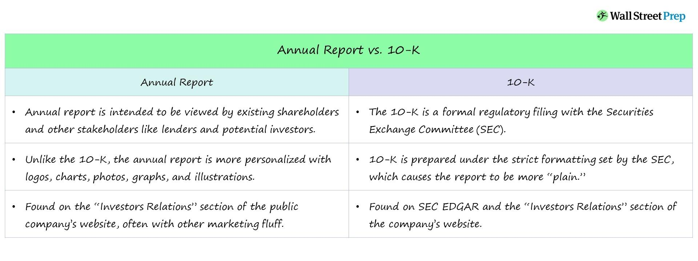

## Table of Contents

## What is an Annual Report?

An Annual Report is a detailed document that companies create every year to share information about their business. It tells people how the company did over the past year, including how much money they made or lost, and what they plan to do in the future. Companies give this report to their shareholders, who are people that own part of the company, so they can see if the company is doing well.

The report usually has parts like a letter from the CEO, financial statements, and information about the company's goals and achievements. It helps shareholders decide if they want to keep investing in the company. Annual Reports are also useful for anyone interested in the company, like potential investors or employees, because they give a clear picture of the company's health and direction.

## What is a Form 10-K?

A Form 10-K is a detailed report that public companies in the United States have to file with the Securities and Exchange Commission (SEC) every year. It's like a big, official version of the company's annual report. The Form 10-K has all the important information about the company's finances, operations, and risks. It's really helpful for investors because it gives them a clear picture of how the company is doing and what might happen in the future.

The Form 10-K is divided into different sections. The first part usually talks about the company's business, what they do, and any big changes that happened during the year. The second part is all about the money, with detailed financial statements and notes that explain them. There's also a section on the company's management and how much they get paid. Because it's so detailed and official, the Form 10-K is a key document for anyone who wants to understand a company better.

## Who is required to file an Annual Report?

Companies that are publicly traded, meaning their stocks are sold on the stock market, have to file an annual report. This rule comes from the government and stock market rules. The report is important because it tells everyone how the company did in the past year, how much money it made or lost, and what it plans to do next. Shareholders, who own parts of the company, need this information to decide if they want to keep their investment or sell it.

Some private companies also have to file annual reports, but it depends on the rules in the state where they are located. For example, in some places, all businesses have to file a report every year to stay in good standing with the state. These reports might not be as detailed as the ones from public companies, but they still have important information about the company's finances and activities.

## Who is required to file a Form 10-K?

Public companies in the United States have to file a Form 10-K with the Securities and Exchange Commission (SEC) every year. These are companies that sell their stocks on the stock market. The Form 10-K is a very detailed report that tells everyone about the company's finances, what it did during the year, and any risks it might face. It's important because it helps investors understand if the company is doing well and if they should keep their money in it.

Not all companies have to file a Form 10-K. Only those that are publicly traded need to do this because the government and stock market rules say so. Private companies, which are not sold on the stock market, do not have to file a Form 10-K. This report is a big deal for investors because it gives them a lot of clear information about the company, helping them make smart choices about their investments.

## What is the main purpose of an Annual Report?

The main purpose of an Annual Report is to give shareholders and the public a clear picture of how a company did in the past year. It tells them how much money the company made or lost, what it did well, and what challenges it faced. This information helps shareholders decide if they want to keep their investment in the company or if they should sell it. Shareholders are people who own parts of the company, so they need to know if the company is doing well or not.

Annual Reports also help the company share its plans for the future. They talk about new projects, goals, and what the company wants to achieve next. This helps everyone understand where the company is heading and if it has good ideas for growing and making more money. By reading the Annual Report, people can see if the company is being run well and if it's a good place to keep their money.

## What is the main purpose of a Form 10-K?

The main purpose of a Form 10-K is to give investors and the public a detailed look at how a public company in the United States did over the past year. It's a big report that the company has to file with the Securities and Exchange Commission (SEC) every year. The Form 10-K tells everyone about the company's money, what it did during the year, and any risks it might face. This helps investors decide if they want to keep their money in the company or if they should sell their shares.

The Form 10-K is really important because it has a lot of information that investors need to make smart choices. It talks about the company's business, its financial statements, and even how much the company's leaders get paid. By reading the Form 10-K, people can understand if the company is doing well and what it plans to do in the future. This helps them know if the company is a good place to keep their money or if they should look for other investments.

## What are the key components of an Annual Report?

An Annual Report has several important parts that help people understand how a company did in the past year. The first part is usually a letter from the CEO or another top leader. This letter talks about the big things that happened during the year, what the company did well, and what challenges it faced. It also shares the company's plans for the future. This part is important because it gives a personal view from the top of the company.

The second part of the Annual Report is all about the money. It has financial statements like the income statement, balance sheet, and cash flow statement. These statements show how much money the company made or lost, what it owns and owes, and how it used its cash. There are also notes that explain these numbers in more detail. This part is crucial for shareholders because it helps them see if the company is making money and if it's a good investment.

The third part of the Annual Report might talk about other important things like the company's goals, achievements, and any big projects it's working on. It can also include information about the company's leaders, how they are paid, and any risks the company might face. All these parts together give a complete picture of the company's health and direction, helping shareholders and others make smart decisions about the company.

## What are the key components of a Form 10-K?

A Form 10-K is a detailed report that public companies in the United States have to file with the Securities and Exchange Commission (SEC) every year. It has several important parts that help people understand how the company did in the past year. The first part is called "Business," and it talks about what the company does, any big changes that happened during the year, and how the company makes money. This section also discusses the company's products, services, and any risks it faces. It's really helpful for investors because it gives them a clear picture of what the company is all about.

The second part of the Form 10-K is all about the money. It includes financial statements like the income statement, balance sheet, and cash flow statement. These statements show how much money the company made or lost, what it owns and owes, and how it used its cash. There are also notes that explain these numbers in more detail. This part is very important because it helps investors see if the company is doing well financially and if it's a good place to keep their money. The third part of the Form 10-K talks about the company's leaders, how much they get paid, and any legal issues the company might have. All these parts together give a complete picture of the company's health and direction, helping investors make smart decisions.

## How does the content of an Annual Report differ from a Form 10-K?

An Annual Report and a Form 10-K both give information about a company's performance over the past year, but they are a bit different. An Annual Report is made by the company itself and is meant for shareholders and the public. It often has a letter from the CEO that talks about the big things that happened during the year and the company's plans for the future. The report also has financial statements, but it might not be as detailed as a Form 10-K. The Annual Report can be more like a story, showing the company in a good light and using pictures and graphs to make it easier to understand.

A Form 10-K, on the other hand, is a very detailed report that public companies have to file with the Securities and Exchange Commission (SEC). It has to follow strict rules about what information it includes. The Form 10-K has sections like "Business," which explains what the company does and any risks it faces, and detailed financial statements with lots of notes. It also includes information about the company's leaders and how much they get paid. The Form 10-K is more formal and official than an Annual Report, and it's meant to give investors all the information they need to make smart decisions about their investments.

## How are the filing deadlines for Annual Reports and Form 10-Ks different?

The deadline for filing an Annual Report can be different for each company. It depends on the company's rules and when their fiscal year ends. Usually, companies send out their Annual Reports to shareholders soon after the fiscal year is over. This can be anywhere from a few weeks to a few months after the year ends. The exact date is set by the company itself, so it can vary a lot.

On the other hand, the deadline for filing a Form 10-K is set by the SEC and is the same for all public companies. Companies have to file their Form 10-K within 60 days after the end of their fiscal year if they are a large accelerated filer, or within 75 days if they are an accelerated filer. Smaller reporting companies have up to 90 days. This means that no matter what, the SEC knows when to expect the Form 10-K, making it more predictable than the Annual Report.

## What are the implications of non-compliance with filing an Annual Report versus a Form 10-K?

Not filing an Annual Report on time can cause problems for a company. If a company doesn't send out its Annual Report to shareholders, it might make them worried about the company's health. Shareholders might lose trust in the company and decide to sell their shares, which can make the stock price go down. Also, some states have rules that say companies have to file an Annual Report to stay in good standing. If a company doesn't follow these rules, it might have to pay fines or even lose its right to do business in that state.

Not filing a Form 10-K on time is a bigger deal because it's a rule set by the SEC. If a company misses the deadline for filing a Form 10-K, the SEC can make them pay big fines. The company might also get in trouble with the stock exchange where its shares are traded, which could lead to the company being removed from the exchange. This can make investors very nervous and cause the stock price to drop a lot. So, it's really important for companies to file their Form 10-K on time to avoid these serious problems.

## How do investors use information from Annual Reports and Form 10-Ks in their decision-making process?

Investors use information from Annual Reports and Form 10-Ks to make smart choices about where to put their money. When they read an Annual Report, they look at the letter from the CEO to understand what big things happened in the company during the year and what the company plans to do next. They also check the financial statements to see how much money the company made or lost. This helps them decide if the company is doing well and if it's a good place to keep their investment. The Annual Report can also show them if the company is growing and has good ideas for the future, which is important for deciding whether to buy more shares or sell the ones they have.

Form 10-Ks give investors even more detailed information. They look at the "Business" section to learn about what the company does, any risks it might face, and how it makes money. The financial statements in the Form 10-K are very detailed, so investors can see exactly how the company is doing financially. They also check the parts about the company's leaders and how much they get paid, which can tell them if the company is being run well. By using all this information, investors can make better decisions about whether to keep their money in the company or invest it somewhere else.

## What are the key disclosures in Form 10-K that are relevant for trading?

Form 10-K is a vital document for traders, offering a comprehensive overview of a company's financial health and operational strategies. Among the wealth of information contained in a 10-K, several financial metrics and disclosures are particularly relevant for making informed trading decisions.

### Financial Metrics: Revenue, Profit Trends, and Cash Flow Statements

**Revenue and Profit Trends:** One of the primary metrics investors scrutinize in the Form 10-K is the company's revenue and profit trends. An upward trend in revenue and profits suggests robust business performance and can lead to a positive market reaction. Conversely, declining trends might indicate operational challenges, possibly resulting in negative sentiment among investors. A common method to assess these trends is to examine the year-over-year (YoY) growth rates, calculated as:

$$
\text{Growth Rate} = \left(\frac{\text{Revenue}_{\text{current}} - \text{Revenue}_{\text{previous}}}{\text{Revenue}_{\text{previous}}}\right) \times 100\%
$$

**Balance Sheet Strength:** The balance sheet strength of a company as documented in the Form 10-K reveals its financial stability. Key metrics evaluated include the current ratio, quick ratio, and debt-to-equity ratio. For instance, a high debt-to-equity ratio may raise red flags about a company's leverage and potential inability to meet its obligations, impacting trading decisions.

**Cash Flow Statements:** The cash flow statement provides insights into the company’s liquidity by detailing cash inflows and outflows from operating, investing, and financing activities. Positive operating cash flow, which reflects the net cash generating capacity of the company, is usually a healthy sign. Free cash flow, obtained by subtracting capital expenditures from operating cash flow, is particularly significant as it indicates the funds available for expansion, dividends, or debt reduction.

### Management Discussions and Risk Factors

**Management Discussion and Analysis (MD&A):** The MD&A section offers qualitative insights that complement quantitative data. It includes management's perspective on the financial results, future plans, and existing challenges. Traders look for statements regarding strategic initiatives, market expansions, or cost-cutting measures that could influence stock performance.

**Risk Factors:** This section outlines the potential risks that could impact the company's business operations and financial condition. Understanding these risks helps traders assess the potential volatility and risk-reward profile of investing in the company. For example, a food company's disclosure about reliance on a single supplier could be a concern for traders anticipating supply chain disruptions.

### Case Studies and Market Reactions

Historically, significant market movements have followed the release of Form 10-K disclosures. For instance, a notable case involved Company X, whose detailed operational risks highlighted in the Form 10-K led to a sharp decline in stock price after investors reassessed its risk exposure. Conversely, Company Y experienced a stock surge after its Form 10-K revealed promising future revenue streams and strong profitability metrics.

These financial metrics and disclosures in the Form 10-K are critical for traders as they provide a comprehensive overview of a company's financial health and strategies, informing better trading decisions.

 to Algorithmic Trading

Algorithmic trading, commonly known as algo trading, refers to the use of computer algorithms to automate trading decisions. These algorithms analyze market data at high speeds and execute orders based on predefined criteria, extending the capacity of traders to execute complex strategies while reducing human intervention. The prevalence of [algorithmic trading](/wiki/algorithmic-trading) has significantly transformed modern financial markets, contributing to increased market [liquidity](/wiki/liquidity-risk-premium) and diminishing trading costs.

Algorithms employ an array of data inputs to make informed trading decisions. Critical among these inputs are financial disclosures, like the Form 10-K, which provide comprehensive insights into a company's financial health. By integrating this data, algorithms can identify trends and anomalies, enabling them to execute trades that capitalize on emerging opportunities or protect against potential losses. For instance, significant changes in revenue trends or risk factors highlighted in Form 10-K can trigger buy or sell orders automatically.

Several types of algorithmic trading strategies exist, each designed to exploit different market conditions. Trend following strategies aim to capitalize on the [momentum](/wiki/momentum) of stock prices by buying stocks that are trending upward or selling those trending downward. Arbitrage strategies exploit price discrepancies across different markets or instruments to secure a profit. Meanwhile, [market making](/wiki/market-making) strategies involve placing simultaneous buy and sell limits to capitalize on the bid-ask spread, thereby providing liquidity to the market.

The technology and data analytics infrastructure underpinning algorithmic trading is complex and robust. High-frequency trading ([HFT](/wiki/high-frequency-trading-strategies)) systems operate on powerful computer networks capable of executing thousands of trades in fractions of a second. These systems harness data analytics tools, such as [machine learning](/wiki/machine-learning) and [artificial intelligence](/wiki/ai-artificial-intelligence), to rapidly process extensive datasets, including real-time market data and historical financial disclosures. The ability to decode and analyze this data quickly is crucial, allowing algorithms to adapt to ever-changing market dynamics efficiently.

Moreover, advanced computational techniques like Natural Language Processing (NLP) are employed to convert qualitative data—such as management commentary found in financial disclosures—into quantitative signals that can guide trading decisions. By understanding and quantitatively interpreting the nuances of textual data, algorithmic systems can derive actionable insights with a high degree of precision, significantly enhancing their predictive accuracy and overall effectiveness.

Python is widely used in algorithmic trading for its simplicity and the vast array of libraries available for data manipulation and analysis. Here is a simplistic example of how one might begin developing an algorithmic trading strategy using Python:

```python
import pandas as pd
import numpy as np
from sklearn.linear_model import LinearRegression

# Fetch historical stock data
data = pd.read_csv('stock_data.csv')

# Calculate moving averages
data['MovingAvg'] = data['Close'].rolling(window=20).mean()

# Simple trading strategy using moving averages
def trading_signal(row):
    if row['Close'] > row['MovingAvg']:
        return 'Buy'
    elif row['Close'] < row['MovingAvg']:
        return 'Sell'
    else:
        return 'Hold'

data['Signal'] = data.apply(trading_signal, axis=1)

# Perform linear regression to predict future prices
model = LinearRegression()
model.fit(data.index.values.reshape(-1, 1), data['Close'].values)

# Predict future stock price
future_index = np.array([len(data)]).reshape(-1, 1)
predicted_price = model.predict(future_index)

print(f'Predicted future price: {predicted_price[0]}')
```

This code provides a basic framework for implementing a trend-following strategy, wherein a moving average is used to signal trading decisions, and linear regression is employed to predict future prices. As algorithmic trading continues to evolve, the integration of real-time data analytics, advanced algorithms, and robust computational infrastructures will remain pivotal in navigating the rapid pace and complexity of financial markets.

## References & Further Reading

[1]: U.S. Securities and Exchange Commission. ["Form 10-K."](https://www.sec.gov/search-filings)

[2]: Lopez de Prado, M. (2018). ["Advances in Financial Machine Learning."](https://www.amazon.com/Advances-Financial-Machine-Learning-Marcos/dp/1119482089) Wiley.

[3]: Zhang, Y., & Zhou, X. (2019). ["A survey of algorithmic trading strategies."](https://dl.acm.org/doi/10.5555/2381019) IEEE Transactions on Computational Social Systems.

[4]: Chan, E. (2009). ["Quantitative Trading: How to Build Your Own Algorithmic Trading Business."](https://github.com/ftvision/quant_trading_echan_book) Wiley.

[5]: Jansen, S. (2018). ["Machine Learning for Algorithmic Trading."](https://www.amazon.com/Hands-Machine-Learning-Algorithmic-Trading/dp/178934641X) Packt Publishing.