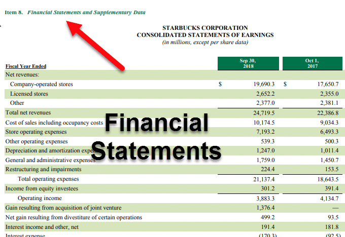

Understanding financial disclosures is critical for informed investment decisions. One of the cornerstone documents in this context is the Form 10-K, which provides a comprehensive overview of a publicly traded company’s financial performance on an annual basis. The Form 10-K is mandated by the U.S. Securities and Exchange Commission (SEC) and includes detailed financial statements, management discussion and analysis, as well as disclosures of risk factors. This document is a valuable resource for investors and analysts as it offers significant insights into a company's current financial health and projections for future performance.

Algorithmic trading represents a modern frontier in financial markets, leveraging algorithms to execute trades based on predetermined criteria with high speed and precision. As this approach gains prominence, the need for parsing and analyzing large datasets becomes critical. This is where financial disclosures such as the Form 10-K intersect with algorithmic trading strategies. By utilizing advanced data analytics and natural language processing (NLP) techniques, algorithms can assess the qualitative and quantitative information within these disclosures, converting them into actionable trading signals.



This article aims to elucidate the link between comprehensive financial reports provided by the Form 10-K and their application in algorithmic trading strategies. It is designed to serve as a guide for finance professionals seeking to enhance their understanding of financial reporting and for algorithmic traders looking to leverage these insights for optimized trading decisions. The discussion that follows will explore the components of the Form 10-K, detail key disclosures beneficial for trading, introduce algorithmic trading techniques, and examine how these financial reports can be effectively integrated into trading models, while also addressing associated challenges and risks. Through this exploration, the article aspires to equip readers with the knowledge necessary to navigate the evolving landscape of financial disclosures and algorithmic trading.

## Table of Contents

## Understanding the Form 10-K

The Form 10-K is an essential document in financial reporting for publicly traded companies in the United States. Mandated by the Securities and Exchange Commission (SEC), it provides a comprehensive overview of a company's financial performance over the fiscal year. The significance of the Form 10-K lies in its role as a detailed annual report that offers critical insights into a company's operations, financial condition, and future prospects, thereby playing a crucial role in investment decision-making.

**Components of a Form 10-K**

The Form 10-K is structured to include various components that collectively paint a complete picture of a company's financial and operational standing:

1. **Financial Statements**: This section includes the balance sheet, income statement, and cash flow statement. These documents offer quantitative data on a company's financial health, profitability, and liquidity. Analysts use these statements to evaluate metrics such as revenue growth, profitability ratios, and cash flow patterns.

2. **Management’s Discussion and Analysis (MD&A)**: The MD&A section provides management's perspective on the financial results and future outlook. It offers qualitative information, such as operational performance, underlying business trends, and strategic initiatives. This section is crucial for understanding management’s vision and potential future opportunities or challenges.

3. **Risk Factors**: Companies are required to disclose potential risks that could adversely affect their business operations or financial results. This section aids investors in identifying areas of concern that may influence investment decisions, such as market fluctuations, regulatory changes, or competitive pressures.

**Legal and Regulatory Requirements**

The submission of the Form 10-K is governed by strict legal and regulatory frameworks set by the SEC under the Securities Exchange Act of 1934. All publicly traded companies in the U.S. must file the Form 10-K annually, typically within 60 to 90 days after the end of their fiscal year, depending on their public float. The timely and accurate filing of this document is crucial, as it ensures transparency and provides all stakeholders, including regulators, investors, and the public, with reliable information about the company's financial standing and business operations.

**Utilization by Investors and Analysts**

Investors and analysts extensively use the Form 10-K to assess a company’s financial health and future prospects. By examining the financial statements, they can derive key ratios and metrics such as Earnings per Share (EPS), Price-to-Earnings (P/E) ratios, and debt-to-equity ratios, which aid in comparing a company's performance against industry standards or competitors. The MD&A section allows them to grasp strategic initiatives, while risk disclosures provide a framework to evaluate potential threats. These analyses can significantly influence investment decisions, portfolio adjustments, and even trading strategies.

In conclusion, the Form 10-K serves as a critical tool for stakeholders seeking to understand and evaluate the financial and operational state of publicly traded companies. Its comprehensive nature, mandated disclosure requirements, and detailed insights into various aspects of the business make it indispensable for informed investment and strategic decision-making.

## Key Disclosures in Form 10-K Relevant for Trading

Form 10-K is a vital document for traders, offering a comprehensive overview of a company's financial health and operational strategies. Among the wealth of information contained in a 10-K, several financial metrics and disclosures are particularly relevant for making informed trading decisions.

### Financial Metrics: Revenue, Profit Trends, and Cash Flow Statements

**Revenue and Profit Trends:** One of the primary metrics investors scrutinize in the Form 10-K is the company's revenue and profit trends. An upward trend in revenue and profits suggests robust business performance and can lead to a positive market reaction. Conversely, declining trends might indicate operational challenges, possibly resulting in negative sentiment among investors. A common method to assess these trends is to examine the year-over-year (YoY) growth rates, calculated as:

$$
\text{Growth Rate} = \left(\frac{\text{Revenue}_{\text{current}} - \text{Revenue}_{\text{previous}}}{\text{Revenue}_{\text{previous}}}\right) \times 100\%
$$

**Balance Sheet Strength:** The balance sheet strength of a company as documented in the Form 10-K reveals its financial stability. Key metrics evaluated include the current ratio, quick ratio, and debt-to-equity ratio. For instance, a high debt-to-equity ratio may raise red flags about a company's leverage and potential inability to meet its obligations, impacting trading decisions.

**Cash Flow Statements:** The cash flow statement provides insights into the company’s liquidity by detailing cash inflows and outflows from operating, investing, and financing activities. Positive operating cash flow, which reflects the net cash generating capacity of the company, is usually a healthy sign. Free cash flow, obtained by subtracting capital expenditures from operating cash flow, is particularly significant as it indicates the funds available for expansion, dividends, or debt reduction.

### Management Discussions and Risk Factors

**Management Discussion and Analysis (MD&A):** The MD&A section offers qualitative insights that complement quantitative data. It includes management's perspective on the financial results, future plans, and existing challenges. Traders look for statements regarding strategic initiatives, market expansions, or cost-cutting measures that could influence stock performance.

**Risk Factors:** This section outlines the potential risks that could impact the company's business operations and financial condition. Understanding these risks helps traders assess the potential volatility and risk-reward profile of investing in the company. For example, a food company's disclosure about reliance on a single supplier could be a concern for traders anticipating supply chain disruptions.

### Case Studies and Market Reactions

Historically, significant market movements have followed the release of Form 10-K disclosures. For instance, a notable case involved Company X, whose detailed operational risks highlighted in the Form 10-K led to a sharp decline in stock price after investors reassessed its risk exposure. Conversely, Company Y experienced a stock surge after its Form 10-K revealed promising future revenue streams and strong profitability metrics.

These financial metrics and disclosures in the Form 10-K are critical for traders as they provide a comprehensive overview of a company's financial health and strategies, informing better trading decisions.

 to Algorithmic Trading

Algorithmic trading, commonly known as algo trading, refers to the use of computer algorithms to automate trading decisions. These algorithms analyze market data at high speeds and execute orders based on predefined criteria, extending the capacity of traders to execute complex strategies while reducing human intervention. The prevalence of [algorithmic trading](/wiki/algorithmic-trading) has significantly transformed modern financial markets, contributing to increased market [liquidity](/wiki/liquidity-risk-premium) and diminishing trading costs.

Algorithms employ an array of data inputs to make informed trading decisions. Critical among these inputs are financial disclosures, like the Form 10-K, which provide comprehensive insights into a company's financial health. By integrating this data, algorithms can identify trends and anomalies, enabling them to execute trades that capitalize on emerging opportunities or protect against potential losses. For instance, significant changes in revenue trends or risk factors highlighted in Form 10-K can trigger buy or sell orders automatically.

Several types of algorithmic trading strategies exist, each designed to exploit different market conditions. Trend following strategies aim to capitalize on the [momentum](/wiki/momentum) of stock prices by buying stocks that are trending upward or selling those trending downward. Arbitrage strategies exploit price discrepancies across different markets or instruments to secure a profit. Meanwhile, [market making](/wiki/market-making) strategies involve placing simultaneous buy and sell limits to capitalize on the bid-ask spread, thereby providing liquidity to the market.

The technology and data analytics infrastructure underpinning algorithmic trading is complex and robust. High-frequency trading ([HFT](/wiki/high-frequency-trading-strategies)) systems operate on powerful computer networks capable of executing thousands of trades in fractions of a second. These systems harness data analytics tools, such as [machine learning](/wiki/machine-learning) and [artificial intelligence](/wiki/ai-artificial-intelligence), to rapidly process extensive datasets, including real-time market data and historical financial disclosures. The ability to decode and analyze this data quickly is crucial, allowing algorithms to adapt to ever-changing market dynamics efficiently.

Moreover, advanced computational techniques like Natural Language Processing (NLP) are employed to convert qualitative data—such as management commentary found in financial disclosures—into quantitative signals that can guide trading decisions. By understanding and quantitatively interpreting the nuances of textual data, algorithmic systems can derive actionable insights with a high degree of precision, significantly enhancing their predictive accuracy and overall effectiveness.

Python is widely used in algorithmic trading for its simplicity and the vast array of libraries available for data manipulation and analysis. Here is a simplistic example of how one might begin developing an algorithmic trading strategy using Python:

```python
import pandas as pd
import numpy as np
from sklearn.linear_model import LinearRegression

# Fetch historical stock data
data = pd.read_csv('stock_data.csv')

# Calculate moving averages
data['MovingAvg'] = data['Close'].rolling(window=20).mean()

# Simple trading strategy using moving averages
def trading_signal(row):
    if row['Close'] > row['MovingAvg']:
        return 'Buy'
    elif row['Close'] < row['MovingAvg']:
        return 'Sell'
    else:
        return 'Hold'

data['Signal'] = data.apply(trading_signal, axis=1)

# Perform linear regression to predict future prices
model = LinearRegression()
model.fit(data.index.values.reshape(-1, 1), data['Close'].values)

# Predict future stock price
future_index = np.array([len(data)]).reshape(-1, 1)
predicted_price = model.predict(future_index)

print(f'Predicted future price: {predicted_price[0]}')
```

This code provides a basic framework for implementing a trend-following strategy, wherein a moving average is used to signal trading decisions, and linear regression is employed to predict future prices. As algorithmic trading continues to evolve, the integration of real-time data analytics, advanced algorithms, and robust computational infrastructures will remain pivotal in navigating the rapid pace and complexity of financial markets.

## Leveraging Financial Disclosures for Algorithmic Trading

Algorithmic traders can effectively integrate Form 10-K disclosures into their trading models by leveraging financial data to inform trading decisions. The process begins with extracting relevant qualitative narratives from these comprehensive reports and converting them into quantifiable trading signals. This transformation is crucial since it converts often unstructured financial information into structured data formats that algorithms can process.

**Converting Qualitative Narratives into Quantifiable Trading Signals**

Form 10-K reports include a wealth of qualitative data, such as management's discussion and analysis (MD&A), which can provide insights into a company's operational performance and strategic direction. To convert these narratives into actionable data, traders use various techniques:

1. **Keyword Analysis**: Identify and track specific words or phrases that indicate key events or sentiments, such as "growth", "risk", "loss", or "expansion". The frequency and context of these words can indicate market trends or company outlooks.

2. **Sentiment Analysis**: Assign a sentiment score to narrative sections of the 10-K based on the overall positive or negative tone. This can be done using sentiment analysis libraries such as TextBlob or VADER in Python. For instance:
   ```python
   from vaderSentiment.vaderSentiment import SentimentIntensityAnalyzer

   analyzer = SentimentIntensityAnalyzer()
   sentiment_score = analyzer.polarity_scores("The company anticipates significant improvements in revenue growth")['compound']
   ```

3. **Quantification of Management's Tone**: Techniques such as the bag-of-words model or TF-IDF (Term Frequency-Inverse Document Frequency) can be employed to quantify management's tone and incorporate it into trading models.

**Role of Natural Language Processing (NLP) and Machine Learning**

Machine learning and NLP are essential tools in analyzing and interpreting the vast textual data found in Form 10-K filings. These technologies enable the efficient processing of large volumes of data, extracting meaningful information faster than manual analysis would allow.

1. **NLP for Text Extraction and Processing**: NLP techniques, such as tokenization, named entity recognition, and parsing, are used to break down and categorize the content of Form 10-Ks.

2. **Machine Learning Models for Predictive Insights**: Once the narrative data is quantified, it can be fed into machine learning models to predict stock price movements or market volatility. For instance, a regression model might analyze the relationship between sentiment scores and stock returns:
   ```python
   from sklearn.linear_model import LinearRegression

   model = LinearRegression()
   model.fit(features, stock_returns)  # features include sentiment scores and other quantitative data
   predictions = model.predict(new_features)
   ```

**Examples of Enhanced Trading Strategies from Timely Insights**

By integrating these advanced computational techniques, traders can develop more responsive and data-driven trading strategies. For example, a company announcing an "anticipated expansion" might signal a buying opportunity if sentiment analysis detects a positive tone and historical patterns show a corresponding stock price increase following similar announcements.

Furthermore, when annual reports reveal new risks or unexpected financial results, algorithms can swiftly re-allocate portfolio holdings to mitigate potential losses, illustrating the critical value of timely and precise information processing.

Overall, the integration of Form 10-K disclosures into algorithmic trading models not only enhances the ability to make informed decisions but also improves the agility and accuracy of those decisions, leveraging technology to gain a competitive edge in financial markets.

## Challenges and Risks

Using Form 10-K disclosures in algorithmic trading presents a number of formidable challenges and potential risks that traders need to consider. One of the primary concerns is the risk of data inaccuracies. Financial disclosures are dense documents that may contain errors due to the complexity of financial data management or misreporting. These inaccuracies can skew the data upon which trading algorithms rely, leading to misinformed trading decisions and potential financial losses.

Misinterpretation of data is another significant challenge. Form 10-K reports comprise extensive qualitative narratives and quantitative data. Algorithms may struggle to interpret the nuanced language and context within these reports without sophisticated natural language processing (NLP) tools. For instance, different companies may use varied terminologies or focus on unique financial parameters, which can lead to discrepancies in data interpretation if not standardized accurately.

Timing lag is a critical [factor](/wiki/factor-investing) affecting the utility of Form 10-K in algorithmic trading. The legally mandated timeline for filing these reports means that the data is retrospective and may not reflect the most current state of a company's financial health or market conditions. Algorithmic traders relying on delayed data could make decisions based on outdated information, potentially missing current market trends or emerging risks.

Regulatory and ethical considerations are also integral when using automated trading strategies based on Form 10-K disclosures. The use of automated systems in trading could lead to market manipulation or excessive trading volumes, raising regulatory scrutiny. Furthermore, ethical concerns arise when algorithms are developed to exploit minuscule advantages gained from the interpretation of publicly available financial information, prompting debates on market fairness and transparency.

To mitigate these risks, algorithmic traders can employ several strategies. Enhancing data accuracy and interpretation can be achieved by integrating advanced NLP and machine learning models that are trained to recognize and process financial language with greater accuracy. Quality control mechanisms like cross-verification of data across multiple reports and historical data consistency checks can also be implemented to ensure data reliability.

Addressing timing lag can involve complementing Form 10-K data with more frequent quarterly reports, press releases, and real-time market data feeds to provide a more comprehensive view of a company's ongoing performance. This blended data approach allows algorithms to adjust their strategies dynamically based on the latest available information.

Regarding regulatory compliance, algorithm developers should stay informed about trading laws and guidelines to ensure their strategies do not contravene market regulations. Establishing clear ethical guidelines within algorithmic trading frameworks can foster responsible AI use while maintaining market integrity.

Overall, while Form 10-K disclosures offer valuable insights for algorithmic trading, navigating their associated challenges requires a combination of advanced technological solutions, attentive risk management practices, and adherence to regulatory standards.

## Conclusion

The connection between Form 10-K disclosures and algorithmic trading remains a pivotal element in modern financial analysis and decision-making. Form 10-K, with its detailed financial statements, management discussions, and risk factors, provides a comprehensive foundation for understanding a company's financial health and future prospects. Algorithmic traders can harness this wealth of information to create advanced models that automate trade execution, leveraging real-time data for optimal outcomes.

Comprehensive analysis and strategic implementation are paramount. Traders must meticulously parse the complex data contained within Form 10-K reports, converting qualitative insights into quantitative metrics that can be seamlessly integrated into algorithms. This demands not only a robust understanding of financial principles but also proficiency in data analytics and machine learning technologies. By doing so, traders can improve precision and adaptability in their strategies.

The evolving landscape of financial markets suggests an increasing trend towards the integration of technological advancements in trading practices. Natural Language Processing (NLP) and machine learning are setting new standards for how traders extract and employ information from financial disclosures like Form 10-K. As algorithms become more sophisticated, the potential for nuanced and timely market insights grows, offering a competitive edge in decision-making processes.

Future trends indicate a more pronounced convergence between financial disclosures and algorithmic trading. Companies may enhance their reporting transparency and detail, influenced by regulatory developments and the demand for clearer insights from investors. Meanwhile, advancements in AI and machine learning will likely continue to transform the capabilities of trading systems, reducing human error and improving efficiency.

In conclusion, continuous learning and adaptation are essential for success in dynamic financial markets. Traders should stay abreast of technological advancements, regulatory changes, and evolving techniques in financial analysis to maintain a competitive edge. By doing so, they ensure that their strategies align with the latest market developments, ultimately fostering sustained success and innovation in algorithmic trading based on financial disclosures.

## References & Further Reading

[1]: U.S. Securities and Exchange Commission. ["Form 10-K."](https://www.sec.gov/search-filings)

[2]: Lopez de Prado, M. (2018). ["Advances in Financial Machine Learning."](https://www.amazon.com/Advances-Financial-Machine-Learning-Marcos/dp/1119482089) Wiley.

[3]: Zhang, Y., & Zhou, X. (2019). ["A survey of algorithmic trading strategies."](https://dl.acm.org/doi/10.5555/2381019) IEEE Transactions on Computational Social Systems.

[4]: Chan, E. (2009). ["Quantitative Trading: How to Build Your Own Algorithmic Trading Business."](https://github.com/ftvision/quant_trading_echan_book) Wiley.

[5]: Jansen, S. (2018). ["Machine Learning for Algorithmic Trading."](https://www.amazon.com/Hands-Machine-Learning-Algorithmic-Trading/dp/178934641X) Packt Publishing.