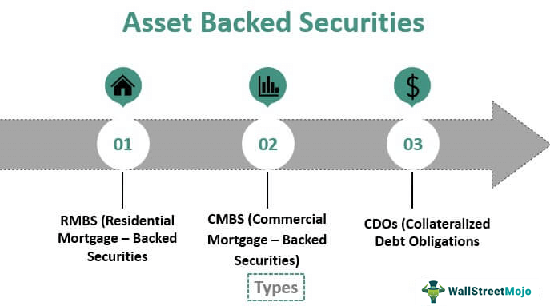

Financial instruments play a crucial role in modern markets, catering to diverse investment needs by offering a variety of risk-return profiles. These instruments include traditional shares and bonds, as well as complex structured products like derivatives, mortgage-backed securities (MBS), and asset-backed securities (ABS). MBS and ABS have become integral components of capital markets, reflecting their diversity and ability to cater to specific investment objectives.

Mortgage-backed securities emerged from the need to provide liquidity in housing finance by pooling large sets of home loans into tradable securities. They allow lenders to reduce risk and enhance their capital for further lending. MBS are characterized by their reliance on cash flows from mortgage repayments. The significance of these instruments was highlighted during the 2008 financial crisis, during which they were scrutinized for their role in exacerbating financial instability.



Asset-backed securities, while similar to MBS in terms of structure, have a broader asset base. ABS can be backed by various asset types, including auto loans, student loans, and credit card debt. This diversity offers investors distinct investment exposures compared to traditional equity or fixed-income products. Both MBS and ABS serve as essential tools for risk management and liquidity provision within financial systems.

The advent of algorithmic trading has markedly transformed financial markets, including the trading of MBS and ABS. Algorithmic trading involves the use of automated and pre-programmed trading instructions accounting for variables such as timing, price, and volume. This technology has enhanced the market's efficiency by enabling high-frequency trading and reducing the spread between bid and ask prices. The ability of algorithms to process large volumes of complex data and execute trades at high speed has led to significant changes in how MBS and ABS are traded, offering potential for increased liquidity and better price discovery.

This article aims to explore the intricate relationships between MBS, ABS, and algorithmic trading. In subsequent sections, we will examine the defining characteristics and historical contexts of these securities, their benefits and risks, and how algorithmic trading continues to shape these markets. Regulatory considerations and future trends will also be discussed to provide a comprehensive understanding of these financial instruments and their evolving market impact. Through this examination, readers will gain insights into the complexities and strategic significance of integrating these components within investment and trading frameworks.

## Table of Contents

## Understanding Mortgage-Backed Securities (MBS)

Mortgage-backed securities (MBS) are complex financial instruments designed to provide liquidity and investment avenues through the securitization of mortgage loans. An MBS is essentially a type of asset-backed security that is secured by a collection of residential or commercial mortgage loans. The process of creating an MBS involves aggregating numerous mortgages from various lenders into a pool, which is then sold to a government agency, government-sponsored enterprise, or a private entity. This entity subsequently issues securities backed by the principal and interest payments from the pool of mortgages, distributing the associated cash flows among investors.

Historically, MBS emerged in the United States during the 1970s, with the Government National Mortgage Association (Ginnie Mae) pioneering their development. The creation of MBS allowed for greater capital flow into the housing market, ultimately enabling lenders to extend more mortgage loans while reducing risk exposure. Through this mechanism, MBS contributed to the expansion and stability of housing finance by connecting mortgage borrowers to investors in capital markets.

The benefits of MBS include enhanced [liquidity](/wiki/liquidity-risk-premium), risk diversification, and potential for stable cash flows due to the regular payment structures of underlying mortgages. They allow mortgage lenders to offload risk from their balance sheets, improve capital reserves, and offer investors an attractive yield relative to other fixed-income securities, particularly during periods of low-interest rates.

However, MBS also entail significant risks. They are subject to [interest rate](/wiki/interest-rate-trading-strategies) risk, as variations in interest rates can affect the prepayment behavior of underlying mortgage holders. Prepayment risk arises when borrowers pay off their loans early, impacting the expected cash flow to MBS investors. Additionally, MBS are exposed to credit risk, especially when the securities consist of subprime or non-conventional mortgages. The complexity of these securities can also lead to pricing and valuation challenges, as was evident during the financial turmoil of 2008.

The 2008 financial crisis highlighted the systemic vulnerabilities associated with MBS, particularly those backed by subprime mortgages. The widespread defaults on mortgage payments led to a collapse in the value of MBS, causing significant financial distress for investors and financial institutions holding these securities. The crisis underscored the critical need for robust risk assessment practices, regulatory oversight, and transparency in the securitization process.

In recent years, the MBS market has shown signs of recovery and evolution. The demand for mortgage-backed securities remains robust due to their yield profile and relative safety, especially those guaranteed by government-sponsored enterprises like Fannie Mae and Freddie Mac. Technological advances in data analytics and risk management systems have enhanced the valuation and trading of MBS, contributing to the market's stability. Moreover, there is a growing emphasis on environmental, social, and governance ([ESG](/wiki/esg-investing)) considerations in the securitization process, with mortgage-backed green bonds gaining traction among environmentally-conscious investors. 

Overall, MBS continue to play a vital role in the global financial market, providing critical funding to the housing sector while offering diversified investment opportunities to institutional and individual investors.

## Exploring Asset-Backed Securities (ABS)

Asset-Backed Securities (ABS) are financial instruments whose value and income payments are derived from and collateralized by a specified pool of underlying assets. These assets typically consist of loans or receivables that are owed to the issuer. An ABS structure allows for the cash flows from these assets to be passed through to security holders, thus providing an investment opportunity backed by these specified assets.

### Comparison between ABS and MBS

While both Mortgage-Backed Securities (MBS) and ABS share structural similarities as they are both securities backed by pools of loans, the key differentiator lies in the nature of the underlying assets. MBS are specifically backed by mortgages, primarily residential or commercial real estate loans. In contrast, ABS can be backed by a wider array of assets such as credit card receivables, auto loans, student loans, or other types of receivables.

### Diverse Types of Assets Backing ABS

The diversity of underlying assets in ABS ranges widely:
- **Credit Card Receivables:** These ABS involve pools of credit card debt, providing investors with exposure to consumer credit markets.
- **Auto Loans:** Backed by car loans, these securities generate cash flow from borrower payments on vehicle financing.
- **Student Loans:** This type of ABS is collateralized by student loan payments.
- **Trade Receivables and Leases:** These ABS are based on payments owed to companies from sales or services provided and lease agreements.

### Benefits, Challenges, and Risk Factors of Investing in ABS

**Benefits:**
1. **Diversification:** Given the range of assets that can back ABS, investors can achieve diversification across different economic sectors and consumer markets.
2. **Yield Opportunities:** ABS often offer higher yields compared to traditional debt instruments, reflecting their associated risks.

**Challenges and Risks:**
1. **Credit Risk:** The risk of default on the underlying assets, which can affect the payments to the ABS holders.
2. **Complexity:** ABS structures can be complex, involving various tranches with different risk and return profiles, making them difficult to evaluate for some investors.
3. **Market Risks:** Changes in economic conditions can impact the performance of ABS, particularly those backed by consumer credit.

### The Role of ABS in Diversifying Investment Portfolios

Asset-Backed Securities play a critical role in diversifying investment portfolios by allowing investors to gain exposure to a variety of financial assets beyond traditional equity and bond markets. This inclusion can potentially reduce portfolio risk through diversification and offer returns that are potentially uncorrelated with other asset classes.

ABS remain an essential component for those looking to balance risk and potential return, diversify exposure across various financial products, and participate in sectors that may not be accessible through direct investments. By understanding the complexities and dynamics of ABS, investors can better position themselves to take advantage of these investment vehicles within a balanced and diversified portfolio approach.

## The Intersection of MBS and ABS with Algo Trading

Algorithmic trading, also known as algo trading, involves the use of complex algorithms to execute trading orders at speeds and frequencies that far exceed human capabilities. These algorithms, typically programmed to follow stated strategies and analyze market conditions, play a crucial role in modern trading environments. This form of trading is characterized by its ability to process massive amounts of data to identify favorable trading opportunities, execute orders based on predetermined conditions, and minimize the impact of market inefficiencies.

The integration of [algorithmic trading](/wiki/algorithmic-trading) with mortgage-backed securities (MBS) and asset-backed securities (ABS) has markedly transformed the landscape of trading these structured finance products. Traditionally, MBS and ABS have been traded through over-the-counter markets, involving intricate pricing and extensive negotiation processes. With algorithms, the complexity surrounding these trades is reduced significantly, allowing for faster execution and increased liquidity. This transformation is partly achieved through the automation of analytical tasks and optimization of execution strategies, which enhance the market efficiency of these financial instruments.

The adoption of algorithmic approaches in the trading of MBS and ABS offers several advantages. Firstly, it maximizes speed and accuracy, enabling traders to capitalize on fleeting market opportunities. Algorithms also enhance liquidity, as they facilitate the continuous buying and selling of these securities. Furthermore, using algorithms allows for sophisticated risk management strategies, employing tools such as [backtesting](/wiki/backtesting) and scenario analysis to anticipate potential risks and mitigate them effectively.

However, the deployment of algorithmic trading strategies in the context of MBS and ABS is not without challenges and risks. One primary concern is the susceptibility to market [volatility](/wiki/volatility-trading-strategies). Algorithms, while efficient, can amplify price swings during market turmoil, as they might withdraw liquidity when it's needed the most. Furthermore, the over-reliance on complex algorithms can lead to systemic risks—specifically, those associated with model errors or unexpected market behavior that the algorithms were not designed to handle. 

An insightful case study highlighting the efficacy of algorithmic trading in these markets is the utilization of [machine learning](/wiki/machine-learning) models in predicting prepayment risks associated with MBS. By assessing vast datasets that include borrower characteristics and economic indicators, algorithms can forecast the likelihood of mortgage prepayments, subsequently informing trading strategies that optimize returns. Another notable example involves the use of high-frequency trading algorithms to [arbitrage](/wiki/arbitrage) minor pricing disparities in ABS, exploiting speed to achieve gains that accumulate significantly over numerous transactions.

Overall, while algorithmic trading offers profound benefits in terms of efficiency and market participation in trading MBS and ABS, it necessitates careful oversight and robust risk management systems to mitigate the potential challenges inherent to its use.

## Regulatory Considerations and Market Implications

The regulation of Mortgage-Backed Securities (MBS) and Asset-Backed Securities (ABS) is crucial in ensuring market stability and protecting investors. Both MBS and ABS are subject to a range of regulatory frameworks that aim to enhance transparency, mitigate systemic risk, and prevent financial crises similar to those experienced in the past, such as the 2008 financial crisis.

Regulatory Frameworks Governing MBS and ABS

The regulation of MBS and ABS primarily involves oversight by financial regulatory bodies such as the Securities and Exchange Commission (SEC) in the United States, which enforces disclosure requirements on issuers. These regulations mandate that issuers provide comprehensive information on the underlying assets, credit enhancements, and potential risks. In addition, the Dodd-Frank Wall Street Reform and Consumer Protection Act, enacted in response to the 2008 crisis, introduced stricter rules for securitization, including risk retention requirements whereby issuers must retain a portion of the credit risk associated with the assets.

Impact of Regulations on Trading and Development

Regulations significantly influence the trading and development of MBS and ABS by imposing standards that ensure the integrity of these securities. Stricter disclosure requirements and risk retention rules can reduce informational asymmetries, leading to more informed investment decisions and potentially reducing market volatility. However, regulatory compliance can also increase the operational costs for issuers, potentially affecting the supply and pricing of these securities.

Influence of Regulations on Algorithmic Trading

In the context of algorithmic trading, regulations play a pivotal role in shaping the strategies and systems used for trading MBS and ABS. Regulatory compliance necessitates that algorithmic trading systems incorporate robust risk management and compliance checks to ensure adherence to trading rules and guidelines. This can involve implementing real-time monitoring algorithms that verify the legality and regulatory compliance of trades before execution.

Potential Reforms and Anticipated Consequences

Potential regulatory reforms may focus on enhancing transparency further, improving the oversight of rating agencies, and addressing technological advancements in trading practices. For example, reforms may include requirements for more granular data on asset performance and cash flows in MBS and ABS. While these reforms could enhance investor confidence and market stability, they might also introduce additional costs and complexities for issuers and traders.

Speculation on Future Regulatory Trends

Future regulatory trends may increasingly focus on integrating technological advancements such as blockchain for enhanced transparency and security in securitization. Additionally, as algorithmic and high-frequency trading become more prevalent, regulations may evolve to include more specific guidelines on the ethical and equitable use of algorithms in financial markets. This could involve establishing standards for algorithmic accountability and transparency, ensuring that these technologies do not unfairly disadvantage certain market participants or exacerbate market volatility.

Overall, the regulatory landscape for MBS and ABS is set to continue evolving, with an emphasis on safeguarding the financial system while accommodating technological innovations. These regulatory measures are necessary to maintain investor trust, market integrity, and financial stability in the ever-evolving financial markets.

## Future Trends in Financial Instruments and Algo Trading

The landscape of financial instruments, including mortgage-backed securities (MBS) and asset-backed securities (ABS), is poised for significant transformation in global markets. These changes are driven by technological advancements, innovative trading strategies, and evolving market dynamics. Emerging technologies like [artificial intelligence](/wiki/ai-artificial-intelligence) (AI) and machine learning (ML) are at the forefront, offering unprecedented capabilities to enhance trading practices and optimize investment decisions.

### Predictions on the Evolution of MBS and ABS

The global market for MBS and ABS is expected to grow, fueled by increasing demand for diversified investment products and the continual development of financial markets in emerging economies. The evolution of these securities will likely include more innovative structuring to address market demands and regulatory changes. Additionally, environmental, social, and governance (ESG) considerations are anticipated to influence the structuring of these securities, integrating sustainable finance principles.

### Innovations in Algorithmic Trading Technologies and Strategies

Algorithmic trading continues to revolutionize the trading of structured financial products by leveraging data analytics and sophisticated algorithms to execute trades at superior speeds and with enhanced precision. Innovations in trading technology include the development of more complex algorithms capable of processing vast amounts of data to predict market trends and optimize trading strategies. One such advancement is the adoption of quantum computing, which promises to exponentially increase computation power and speed for complex financial calculations. 

### Impact of AI and Machine Learning on Trading Practices

AI and ML technologies are transforming trading practices by enabling predictive analytics to assess risk and forecast future movements of MBS and ABS. Machine learning algorithms improve over time by learning from historical data, thus enhancing their predictive accuracy and efficacy. Tools like Natural Language Processing (NLP) are also being utilized to analyze market sentiment from news articles and social media, potentially yielding insights that influence trading decisions.

### Strategic Approaches for Investors

Investors aiming to leverage MBS and ABS need to incorporate advanced technologies in their market strategies. This includes utilizing algorithmic tools for high-frequency trading and risk management. Portfolio diversification can be enhanced by integrating AI-driven analytics to assess asset performance and macroeconomic factors. Investors should also consider engaging in partnerships with fintech firms to access cutting-edge trading tools and platforms.

Python Code Example to Demonstrate Simple Algorithmic Trading Strategy:

```python
import numpy as np

historical_prices = np.array([10, 11, 12, 13, 12, 14, 15])
weights = np.array([0.1, 0.2, 0.3, 0.4])

def moving_average(prices, weights):
    return np.convolve(prices, weights, 'valid')

# Calculate moving average
ma = moving_average(historical_prices, weights)
print(ma)
```

This simple example calculates a moving average over a set of historical prices, a basic strategy used in algorithmic trading.

### Future Landscape of Financial Markets

The financial markets are likely to witness increased integration of AI and machine learning, redefining traditional trading paradigms. Personalized investment strategies informed by data-driven insights will become more prevalent. Moreover, regulatory frameworks may evolve to accommodate these technological innovations while ensuring market stability and transparency.

Overall, the convergence of MBS, ABS, and algorithmic trading, propelled by technological advancements, provides significant opportunities for investors. Staying informed and adaptable to these trends will be crucial for maximizing returns and mitigating risks in an increasingly complex financial landscape.

## Conclusion

In reviewing the diverse and interconnected world of modern financial instruments, this article has illuminated the intricate workings and substantial impact of mortgage-backed securities (MBS) and asset-backed securities (ABS), alongside the transformative role of algorithmic trading. Understanding these complex instruments is critical, given their intrinsic technicalities and the broad spectrum of opportunities and risks they present. The intertwined nature of MBS, ABS, and algo trading underscores their strategic importance in contemporary financial markets. 

The synthesis of MBS and ABS within the arena of algorithmic trading offers a potent mechanism to optimize trading strategies, enhance liquidity, and manage risk in real time. Such integration exemplifies the strategic value these instruments bring to both individual investors and larger institutional entities. It is crucial for investors and market participants to stay informed about the developments and advancements in these areas. Knowledge of how regulatory frameworks are evolving and the potential impact of emerging technologies like AI and machine learning is pivotal. 

Market participants are encouraged to constantly engage with these financial components, fostering a deeper understanding that will aid in capitalizing on their potential benefits while mitigating inherent risks. As the landscape of financial markets continues to evolve, proactive engagement and education in these areas will remain indispensable. The future promises continued innovation and complexity, emphasizing the importance of staying informed and adaptable to sustain a competitive edge in the dynamic world of financial markets.

## References & Further Reading

[1]: Fabozzi, F. J., Bhattacharya, A. K., & Berliner, W. S. (2007). ["Mortgage-Backed Securities: Products, Structuring, and Analytical Techniques."](https://archive.org/details/mortgagebackedse0000fabo) Wiley Finance.

[2]: Gorton, G. B. (2010). ["Slapped by the Invisible Hand: The Panic of 2007."](https://papers.ssrn.com/sol3/papers.cfm?abstract_id=1401882) Oxford University Press.

[3]: Kothari, V. (2006). ["Securitization: The Financial Instrument of the Future."](https://archive.org/details/securitizationfi0000koth) Wiley Finance.

[4]: Gomber, P., Arndt, B., Lutat, M., & Uhle, T. (2014). ["High-Frequency Trading."](https://papers.ssrn.com/sol3/papers.cfm?abstract_id=1858626) In: The Oxford Handbook of Computational Economics and Finance.

[5]: Tuckman, B., & Serrat, A. (2012). ["Fixed Income Securities: Tools for Today's Markets."](https://www.amazon.com/Fixed-Income-Securities-Todays-Markets/dp/0470891696) Wiley Finance.

[6]: Malkiel, B. G., & Saha, A. (2005). ["Hedge Funds: Risk and Return."](https://www.tandfonline.com/doi/abs/10.2469/faj.v61.n6.2775) Financial Analysts Journal.

[7]: Johnson, B., & Spatt, C. S. (2013). ["High-Frequency Trading: Background, Concerns, and Regulatory Developments."](https://sgp.fas.org/crs/misc/R43608.pdf) CFA Institute.