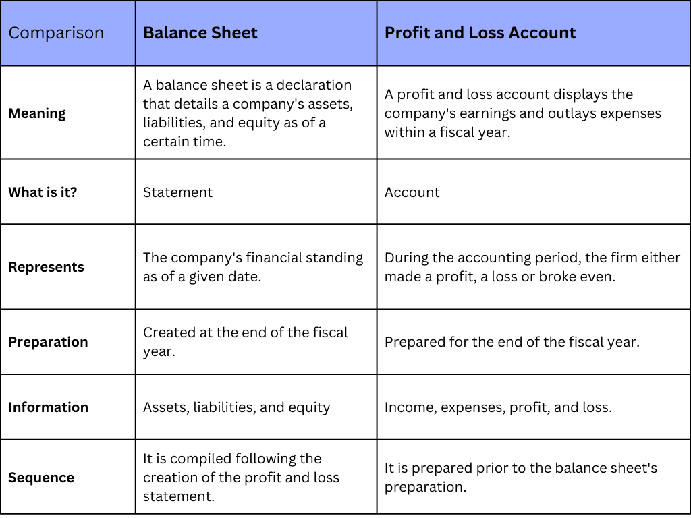

## Table of Contents

## What is a balance sheet?

A balance sheet is a financial statement that shows what a company owns and what it owes at a specific time. It is like a snapshot of the company's financial health. The balance sheet has three main parts: assets, liabilities, and equity. Assets are things the company owns, like cash, buildings, and equipment. Liabilities are what the company owes, like loans and bills. Equity is the value left for the owners after paying off all the liabilities.

The balance sheet follows a simple equation: Assets = Liabilities + Equity. This means that everything the company owns (assets) is equal to what it owes (liabilities) plus what is left for the owners (equity). By looking at a balance sheet, people can see if a company is financially stable or if it might have problems paying its debts. It helps investors, managers, and others understand the company's financial position at a glance.

## What is a profit and loss statement?

A profit and loss statement, often called a P&L statement, shows how much money a business made or lost over a certain time, like a month or a year. It lists all the money coming into the business from sales and other sources, which is called revenue. It also lists all the money the business spent, like paying for rent, salaries, and supplies, which are called expenses. By subtracting the total expenses from the total revenue, the P&L statement shows if the business made a profit or had a loss.

The P&L statement is important because it helps business owners and managers see where their money is coming from and going. It can show if a business is doing well by making more money than it spends, or if it needs to cut costs or find ways to increase sales. Investors and lenders also look at P&L statements to decide if they want to invest in or loan money to the business. By regularly reviewing the P&L statement, a business can make better decisions to improve its financial health.

## What are the main components of a balance sheet?

A balance sheet has three main parts: assets, liabilities, and equity. Assets are things the company owns that have value. This can include money in the bank, buildings, machines, and even things like patents or trademarks. Liabilities are what the company owes to others. This includes loans, money owed to suppliers, and other debts. Equity is what's left over after you subtract the liabilities from the assets. It represents the owner's share of the business.

These three parts work together to show the financial health of a company. The balance sheet follows a simple rule: Assets = Liabilities + Equity. This means everything the company owns is equal to what it owes plus what the owners have invested or earned. By looking at these components, anyone can see if a company has enough assets to cover its debts, or if it might be in financial trouble. It's a key tool for understanding a company's financial position at a specific time.

## What are the main components of a profit and loss statement?

A profit and loss statement has three main parts: revenue, expenses, and net profit or loss. Revenue is all the money a business earns from selling its products or services. This can also include other income, like interest from investments. Expenses are all the costs a business has to pay to keep running. This includes things like rent, salaries, utilities, and the cost of goods sold. By subtracting the total expenses from the total revenue, you get the net profit if the result is positive, or a net loss if it's negative.

The profit and loss statement is important because it shows if a business is making money or losing it over a specific time, like a month or a year. It helps business owners and managers see where their money is coming from and where it's going. If a business is making a profit, it's doing well. If it's losing money, it might need to cut costs or find ways to increase sales. Investors and lenders also use the profit and loss statement to decide if they want to invest in or loan money to the business. By looking at this statement, a business can make better decisions to improve its financial health.

## How does the balance sheet reflect a company's financial position?

The balance sheet shows a company's financial position by listing everything it owns and everything it owes at a specific time. It's like a snapshot that helps people see if the company is financially healthy. The balance sheet has three main parts: assets, liabilities, and equity. Assets are things the company owns, like cash, buildings, and equipment. Liabilities are what the company owes, like loans and bills. Equity is the value left for the owners after paying off all the liabilities. By looking at these parts, you can see if the company has enough assets to cover its debts.

The balance sheet follows a simple rule: Assets = Liabilities + Equity. This means that everything the company owns is equal to what it owes plus what the owners have invested or earned. If a company has more assets than liabilities, it's in a good financial position because it can pay its debts. But if the liabilities are higher than the assets, the company might have trouble paying what it owes. By looking at the balance sheet, investors, managers, and others can quickly understand if the company is financially stable or if it might have problems.

## How does the profit and loss statement show a company's financial performance?

The profit and loss statement, or P&L statement, shows a company's financial performance by listing all the money it made and all the money it spent over a certain time, like a month or a year. It starts with revenue, which is all the money the company earns from selling its products or services. It also includes other income, like interest from investments. Then, it lists all the expenses, which are the costs the company has to pay to keep running, like rent, salaries, and the cost of goods sold. By subtracting the total expenses from the total revenue, the P&L statement shows if the company made a profit or had a loss.

This statement is important because it helps everyone see if the company is doing well financially. If the company's revenue is higher than its expenses, it's making a profit, which means it's doing well. But if the expenses are higher than the revenue, the company is losing money, which might mean it needs to cut costs or find ways to increase sales. Investors and lenders look at the P&L statement to decide if they want to invest in or loan money to the company. By regularly reviewing this statement, a business can make better decisions to improve its financial health.

## What is the difference between assets, liabilities, and equity on a balance sheet?

Assets, liabilities, and equity are the three main parts of a balance sheet. Assets are everything a company owns that has value. This includes things like cash, buildings, machines, and even things like patents or trademarks. Liabilities are what the company owes to others. This can be loans, money owed to suppliers, or other debts. Equity is what's left over after you subtract the liabilities from the assets. It shows the owner's share of the business.

The balance sheet follows a simple rule: Assets = Liabilities + Equity. This means everything the company owns is equal to what it owes plus what the owners have invested or earned. By looking at these parts, you can see if a company has enough assets to cover its debts. If a company has more assets than liabilities, it's in a good financial position because it can pay its debts. But if the liabilities are higher than the assets, the company might have trouble paying what it owes.

## How do revenues and expenses differ on a profit and loss statement?

Revenues and expenses are the two main parts of a profit and loss statement. Revenues are all the money a company earns from selling its products or services. This can also include other income, like interest from investments. When you see the revenue part of the statement, it shows how much money the company made during a certain time, like a month or a year.

Expenses, on the other hand, are all the costs a company has to pay to keep running. This includes things like rent, salaries, utilities, and the cost of goods sold. The expenses part of the statement shows how much money the company spent during the same time period. By subtracting the total expenses from the total revenue, you can see if the company made a profit or had a loss. If the revenue is higher than the expenses, the company is making money. If the expenses are higher, the company is losing money.

## How often are balance sheets and profit and loss statements typically prepared?

Balance sheets are usually made at the end of a company's financial year. This is because they show what the company owns and owes at a specific time, like a snapshot. Sometimes, businesses also make balance sheets every month or quarter to keep a closer eye on their financial health. This helps them see if they have enough money to pay their bills and if they are growing or shrinking.

Profit and loss statements are often prepared more frequently than balance sheets. Many companies make them every month to see how much money they are making or losing. This helps them make quick decisions about spending and saving. Some businesses also make profit and loss statements every quarter or at the end of the year. This gives them a bigger picture of their financial performance over time.

## What insights can be gained by comparing balance sheets from different periods?

Comparing balance sheets from different periods can show how a company's financial health is changing over time. By looking at the assets, you can see if the company is growing its cash, buying more buildings, or getting new equipment. If the assets are going up, it might mean the company is doing well and expanding. But if the assets are going down, it could mean the company is selling things off or not doing as well.

Looking at the liabilities and equity can also give you important information. If the liabilities are going up faster than the assets, it might mean the company is taking on more debt and could have trouble paying it back. But if the equity is growing, it's a good sign because it shows the owners are keeping more money in the business. By comparing these numbers over time, you can see if the company is getting stronger or weaker financially.

## How can trends in profit and loss statements help in forecasting future performance?

Trends in profit and loss statements can help predict how a business might do in the future. By looking at how revenue and expenses have changed over time, you can see if the business is growing or shrinking. If revenue is going up every year, it might mean the business will keep making more money. But if expenses are going up faster than revenue, it could mean the business might have trouble making a profit in the future.

These trends also show where a business should focus its efforts. If the cost of goods sold is getting higher, the business might need to find cheaper suppliers or change how it makes its products. If sales are growing in one area but not another, the business might want to put more effort into the area that's doing well. By understanding these patterns, a business can make better plans and decisions to improve its future performance.

## What advanced analysis techniques can be used to compare balance sheets and profit and loss statements for strategic decision-making?

Advanced analysis techniques like ratio analysis can be used to compare balance sheets and profit and loss statements to help make strategic decisions. For the balance sheet, you can look at the current ratio, which is current assets divided by current liabilities. This shows if a company can pay its short-term debts. Another important ratio is the debt-to-equity ratio, which is total liabilities divided by total equity. This tells you how much the company relies on debt versus what the owners have invested. By comparing these ratios over time or with other companies, you can see if a business is getting better or worse at managing its money.

For the profit and loss statement, you can use the gross profit margin, which is revenue minus the cost of goods sold, divided by revenue. This shows how much money the business makes after paying for the things it sells. Another useful ratio is the net profit margin, which is net profit divided by revenue. This tells you how much profit the business makes after all expenses. By looking at these margins over different periods, you can see if the business is getting more efficient or if costs are going up too fast. These techniques help business owners and managers make smart choices about where to invest, how to cut costs, and how to grow the business.

## What is the key to understanding financial statements?

Financial statements provide an essential overview of a company's financial health, crucial for stakeholders, including investors, creditors, and management. Among the fundamental financial documents, the balance sheet, profit and loss (P&L) statement, and cash flow statement hold the most significance.

The balance sheet reflects the company's financial position at a specific point in time. It comprises three main components: assets, liabilities, and shareholders' equity, adhering to the accounting equation:

$$
\text{Assets} = \text{Liabilities} + \text{Shareholders' Equity}
$$

This equation ensures that the balance sheet always balances. Assets represent the resources owned by the company, liabilities are obligations owed to creditors, and shareholders' equity is the owner's claim on assets after liabilities are settled. Understanding the balance sheet is imperative for evaluating the capital structure and financial stability of a business, which is vital when determining investment viability.

The profit and loss statement, also known as the income statement, details the company's financial performance over a certain period. It reflects how revenue is transformed into net income, providing insights into operational efficiency and profitability. The equation for calculating net income is:

$$
\text{Net Income} = \text{Total Revenue} - \text{Total Expenses}
$$

This document helps in assessing whether a company is generating sufficient profits to sustain operations and provides a basis for comparing performance across different periods.

The cash flow statement, though not detailed in this section, is equally important as it illustrates how changes in the balance sheet and income statement affect cash and cash equivalents. It is segmented into cash flows from operating, investing, and financing activities, offering a perspective on the company’s [liquidity](/wiki/liquidity-risk-premium) and long-term solvency.

For algorithmic traders, these financial statements are indispensable. They form the raw data used in quantitative models to forecast market trends and make informed trading decisions. Traders analyze these documents to identify patterns such as revenue growth or debt accumulation, which are integrated into algorithms. These models can employ techniques like [machine learning](/wiki/machine-learning) to improve accuracy in predicting stock prices based on company performance metrics extracted from financial statements. For instance, a Python script using libraries such as pandas or numpy could be employed to automate the extraction and analysis of financial data to feed into a trading algorithm. Here is a basic example of how data from financial statements could be used to assess a company's profitability trend using Python:

```python
import pandas as pd

# Sample data: hypothetical revenue and expense data over three years
data = {'Year': [2020, 2021, 2022],
        'Revenue': [500000, 600000, 750000],
        'Expenses': [400000, 450000, 500000]}

# Create a DataFrame
df = pd.DataFrame(data)

# Calculate Net Income
df['Net Income'] = df['Revenue'] - df['Expenses']

# Analyze profitability trend
profitability_trend = df['Net Income'].pct_change().fillna(0)
print(f"Profitability Trend (Year over Year): {profitability_trend.tolist()}")
```

In conclusion, the balance sheet, P&L statement, and cash flow statement are not merely static reports; they are dynamic tools that provide deep insights into a company's financial stature and are essential components for [algorithmic trading](/wiki/algorithmic-trading) systems aiming to leverage financial data effectively.

## What does a Balance Sheet show about a company's financial position?

The balance sheet is a critical financial statement that reflects a company's financial position at a specific point in time. This document outlines the company's assets, liabilities, and shareholder equity, allowing stakeholders to understand how well the company manages its resources and obligations. 

Assets on a balance sheet include items that provide economic benefits to the company, classified typically as current and non-current assets. Current assets, such as cash, accounts receivable, and inventory, are expected to be liquidated or utilized within a year. Non-current assets, such as property, plant, and equipment, are long-term investments.

Liabilities consist of the company's financial obligations, categorized into current liabilities like accounts payable and long-term liabilities like bonds payable. The combination of these obligations reflects the company's debts that require settlement, impacting cash flow and financial planning.

Shareholder equity represents the residual interest in the assets of the company after deducting liabilities. It comprises components such as retained earnings and additional paid-in capital, indicating the net worth and financial health of the company. 

Analyzing the balance sheet is crucial in evaluating a company's capital structure, which is the mix of debt and equity financing. This evaluation often involves calculating financial ratios such as the debt-to-equity ratio, a key measure of financial leverage:

$$
\text{Debt-to-Equity Ratio} = \frac{\text{Total Liabilities}}{\text{Shareholder Equity}}
$$

Another crucial ratio is the current ratio, which assesses liquidity by dividing current assets by current liabilities:

$$
\text{Current Ratio} = \frac{\text{Current Assets}}{\text{Current Liabilities}}
$$

These ratios aid traders in assessing a company’s financial stability and resource management effectiveness. A stable capital structure and efficient resource management can signal a firm’s potential for sustained long-term performance, assisting in forecasting and strategic decision-making.

For traders, especially those involved in algorithmic trading, the balance sheet provides fundamental data to develop and refine trading algorithms. These algorithms rely on financial ratios and metrics deduced from the balance sheet to predict market trends and inform trading actions in real-time. Understanding these components allows traders to leverage financial statements effectively to enhance their investment strategies.

## What is a Profit and Loss Statement and How Does it Measure Profitability?

The Profit and Loss (P&L) statement is a critical financial document that provides a detailed summary of a company's revenues, costs, and expenses over a specific period, ultimately revealing the net profit or loss—commonly referred to as the "bottom line." This statement serves as a vital tool for traders and analysts to assess a company's operational efficiency and profitability. By analyzing a P&L statement, stakeholders can gain valuable insights into how well a company manages its financial resources and whether it is generating sufficient income to cover its operational costs.

The P&L statement typically consists of three main sections: revenue, expenses, and net income. Revenues, often positioned at the top, represent the total income generated from the sale of goods and services. Expenses, both operating and non-operating, include costs associated with production, sales, and administration, as well as taxes and interest. The net income is calculated by subtracting total expenses from total revenues, providing an indicator of the company's profitability.

Mathematically, the net income can be expressed as:

$$
\text{Net Income} = \text{Total Revenue} - \text{Total Expenses}
$$

This equation is central to understanding the profitability and financial health of a business. For traders and investors, P&L data is invaluable in signaling potential growth trends or warning signs. For instance, a consistent increase in revenue over several periods can indicate robust growth potential, while an escalating expense line may signal inefficiencies or potential operational issues.

Algorithmic trading strategies often leverage patterns found in P&L statements to predict future market movements. For example, a sustained increase in net income across multiple periods might be fed into an algorithm to forecast a bullish outlook for a company's stock. Conversely, a pattern of declining revenues or increasing losses could indicate a bearish trend, prompting traders to adjust their strategies accordingly.

Python, a popular programming language for algorithmic trading, can be effectively used to automate the analysis of P&L statements and integrate findings into trading models. Consider the following simple example in Python to calculate net income from a dataset:

```python
def calculate_net_income(revenue, expenses):
    return revenue - expenses

# Example data
revenue = 50000
expenses = 30000

net_income = calculate_net_income(revenue, expenses)
print(f"The net income is: {net_income}")
```

In summary, the P&L statement is an indispensable instrument for evaluating a company's financial performance. It provides a detailed view of profitability, which is crucial for traders aiming to craft informed and effective trading strategies. By interpreting the data within this statement, traders can better position themselves to take advantage of market opportunities and mitigate risks.

## What are the key differences between balance sheets and P&L statements?

Balance sheets and profit and loss (P&L) statements are cornerstone financial documents that offer valuable insights into a company's financial health, yet they serve different purposes and provide different types of information. Understanding the contrasts between these two statements is essential for algorithmic traders seeking to utilize financial data effectively in their models.

The balance sheet is a financial statement that captures a company's financial position at a specific point in time. It is akin to a snapshot, listing the company's assets, liabilities, and shareholder equity. Assets include everything the company owns, such as cash, inventory, and property, while liabilities encompass all obligations, including loans and accounts payable. Shareholder equity represents the net value after liabilities are deducted from assets. Mathematically, this can be expressed as:

$$
\text{Assets} = \text{Liabilities} + \text{Shareholder Equity}
$$

This equation, known as the accounting equation, provides a fundamental basis for the computation of many financial ratios used by traders to assess the stability and financial structure of a company.

Conversely, the P&L statement, also known as the income statement, summarizes a company's revenues, costs, and expenses over a specific period, such as a quarter or fiscal year. It shows how much money the company generated and spent, ultimately revealing the net profit or loss. The P&L statement aids traders in understanding a company's operational efficiency and profitability, as it reflects performance over time rather than at a single moment.

For algorithmic traders, recognizing these differences is crucial in determining the appropriate data to include in their trading algorithms. The time-bound nature of the P&L statement provides insights into trends and performance over periods, which can be invaluable for predicting future profitability and market behavior. In contrast, the balance sheet's static nature allows for the analysis of financial health and capital structure stability, which can inform risk assessments and asset evaluation models.

By clearly distinguishing these two financial statements, algorithmic traders can optimize their models by applying balance sheet information for stability metrics and P&L data for trend analyses. This distinction ensures the alignment of the financial data with the specific objectives of algorithmic strategies, maximizing the effectiveness of trading decisions.

## What is the Role of Financial Statements in Algorithmic Trading?

Algorithmic trading models utilize financial statements to gain insights that drive effective trading strategies. These models rely on a comprehensive analysis of historical financial data, which is primarily derived from the key financial statements such as the balance sheet, profit and loss (P&L) statement, and cash flow statement. By interpreting and processing data from these documents, algorithmic systems can extract patterns, trends, and potential anomalies that might influence market forecasts.

The importance of accurate and timely financial data cannot be overstated in algorithmic trading. Algorithms are designed to analyze vast amounts of data quickly, and any discrepancies in the data input can lead to significant deviations in trading outcomes. As a result, dependable financial data feeds are essential, as they provide the foundation upon which trading algorithms operate.

To harness the power of financial statements in algorithmic trading, models typically employ statistical methods and machine learning algorithms. For instance, using time-series analysis, traders can forecast future stock prices based on historical data. This involves analyzing past financial performance and extracting patterns that can be applied to predict future movements. Consider a simple linear regression model where the dependent variable $Y_t$ represents the stock price, and the independent variables $X_t$ embody key financial ratios derived from financial statements:

$$
Y_t = \beta_0 + \beta_1 X_{1t} + \beta_2 X_{2t} + \ldots + \beta_n X_{nt} + \epsilon_t
$$

Here, $\beta_0, \beta_1, \ldots, \beta_n$ are the coefficients that need to be estimated, and $\epsilon_t$ is the error term. Python's libraries such as NumPy, pandas, and scikit-learn can facilitate this analysis, providing tools for data manipulation, statistical computations, and machine learning.

Algorithmic models can also employ more advanced techniques like neural networks to detect complex, non-linear patterns from the financial statements. Neural networks are capable of learning intricate relationships between input variables (financial metrics) and outputs (market predictions), thus enhancing the predictive accuracy of the trading strategies.

Ultimately, the role of financial statements in algorithmic trading is to provide a reliable data source that algorithms can analyze to generate actionable insights. By maintaining high-quality data feeds and leveraging sophisticated analytical tools, traders can optimize their algorithmic models to adapt quickly to market dynamics and capitalize on emerging trends.

## References & Further Reading

[1]: ["Advances in Financial Machine Learning"](https://www.amazon.com/Advances-Financial-Machine-Learning-Marcos/dp/1119482089) by Marcos Lopez de Prado

[2]: ["Machine Learning for Algorithmic Trading"](https://github.com/PacktPublishing/Machine-Learning-for-Algorithmic-Trading-Second-Edition) by Stefan Jansen

[3]: ["Quantitative Trading: How to Build Your Own Algorithmic Trading Business"](https://www.amazon.com/Quantitative-Trading-Build-Algorithmic-Business/dp/1119800064) by Ernest P. Chan

[4]: ["Financial Statement Analysis and Security Valuation"](https://www.mheducation.com/highered/product/financial-statement-analysis-security-valuation-penman/M9780078025310.html) by Stephen Penman

[5]: ["Financial Modeling"](https://www.investopedia.com/terms/f/financialmodeling.asp) by Simon Benninga