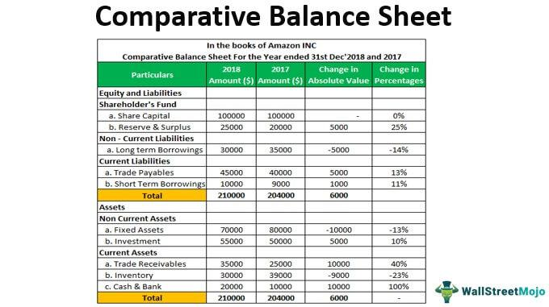

In the ever-evolving world of finance and investment, understanding complex financial documents is crucial for investors and traders alike. These documents are foundational to assessing a company's financial health and paving the way for informed decision-making. This article shines a spotlight on the essential financial statements—balance sheets and profit and loss (P&L) statements—and their direct implications for algorithmic trading. 

Algorithmic trading, a method that utilizes automated systems to execute trades based on predetermined criteria, is heavily reliant on data and comprehensive financial analysis. The accuracy and depth of this data, primarily sourced from financial statements, empower traders to craft algorithms that predict market movements with improved precision. Consequently, a solid grasp of these financial documents is invaluable for traders in optimizing their strategies and achieving competitive advantages in the financial market.



The synergy between financial reporting and algorithmic trading offers a robust framework for investment success. By exploring how these financial statements function, their interrelations, and their distinct characteristics, traders can enhance the efficacy of their algorithmic models. This exploration not only highlights the nuances of balance sheets and P&L statements but also underscores their integral role in formulating sophisticated trading strategies. Understanding and effectively utilizing these financial tools illuminates the path to potential market success, demonstrating their critical importance in modern finance.

## Table of Contents

## Understanding Financial Statements

Financial statements provide an essential overview of a company's financial health, crucial for stakeholders, including investors, creditors, and management. Among the fundamental financial documents, the balance sheet, profit and loss (P&L) statement, and cash flow statement hold the most significance.

The balance sheet reflects the company's financial position at a specific point in time. It comprises three main components: assets, liabilities, and shareholders' equity, adhering to the accounting equation:

$$
\text{Assets} = \text{Liabilities} + \text{Shareholders' Equity}
$$

This equation ensures that the balance sheet always balances. Assets represent the resources owned by the company, liabilities are obligations owed to creditors, and shareholders' equity is the owner's claim on assets after liabilities are settled. Understanding the balance sheet is imperative for evaluating the capital structure and financial stability of a business, which is vital when determining investment viability.

The profit and loss statement, also known as the income statement, details the company's financial performance over a certain period. It reflects how revenue is transformed into net income, providing insights into operational efficiency and profitability. The equation for calculating net income is:

$$
\text{Net Income} = \text{Total Revenue} - \text{Total Expenses}
$$

This document helps in assessing whether a company is generating sufficient profits to sustain operations and provides a basis for comparing performance across different periods.

The cash flow statement, though not detailed in this section, is equally important as it illustrates how changes in the balance sheet and income statement affect cash and cash equivalents. It is segmented into cash flows from operating, investing, and financing activities, offering a perspective on the company’s [liquidity](/wiki/liquidity-risk-premium) and long-term solvency.

For algorithmic traders, these financial statements are indispensable. They form the raw data used in quantitative models to forecast market trends and make informed trading decisions. Traders analyze these documents to identify patterns such as revenue growth or debt accumulation, which are integrated into algorithms. These models can employ techniques like [machine learning](/wiki/machine-learning) to improve accuracy in predicting stock prices based on company performance metrics extracted from financial statements. For instance, a Python script using libraries such as pandas or numpy could be employed to automate the extraction and analysis of financial data to feed into a trading algorithm. Here is a basic example of how data from financial statements could be used to assess a company's profitability trend using Python:

```python
import pandas as pd

# Sample data: hypothetical revenue and expense data over three years
data = {'Year': [2020, 2021, 2022],
        'Revenue': [500000, 600000, 750000],
        'Expenses': [400000, 450000, 500000]}

# Create a DataFrame
df = pd.DataFrame(data)

# Calculate Net Income
df['Net Income'] = df['Revenue'] - df['Expenses']

# Analyze profitability trend
profitability_trend = df['Net Income'].pct_change().fillna(0)
print(f"Profitability Trend (Year over Year): {profitability_trend.tolist()}")
```

In conclusion, the balance sheet, P&L statement, and cash flow statement are not merely static reports; they are dynamic tools that provide deep insights into a company's financial stature and are essential components for [algorithmic trading](/wiki/algorithmic-trading) systems aiming to leverage financial data effectively.

## Balance Sheet: A Snapshot of Financial Position

The balance sheet is a critical financial statement that reflects a company's financial position at a specific point in time. This document outlines the company's assets, liabilities, and shareholder equity, allowing stakeholders to understand how well the company manages its resources and obligations. 

Assets on a balance sheet include items that provide economic benefits to the company, classified typically as current and non-current assets. Current assets, such as cash, accounts receivable, and inventory, are expected to be liquidated or utilized within a year. Non-current assets, such as property, plant, and equipment, are long-term investments.

Liabilities consist of the company's financial obligations, categorized into current liabilities like accounts payable and long-term liabilities like bonds payable. The combination of these obligations reflects the company's debts that require settlement, impacting cash flow and financial planning.

Shareholder equity represents the residual interest in the assets of the company after deducting liabilities. It comprises components such as retained earnings and additional paid-in capital, indicating the net worth and financial health of the company. 

Analyzing the balance sheet is crucial in evaluating a company's capital structure, which is the mix of debt and equity financing. This evaluation often involves calculating financial ratios such as the debt-to-equity ratio, a key measure of financial leverage:

$$
\text{Debt-to-Equity Ratio} = \frac{\text{Total Liabilities}}{\text{Shareholder Equity}}
$$

Another crucial ratio is the current ratio, which assesses liquidity by dividing current assets by current liabilities:

$$
\text{Current Ratio} = \frac{\text{Current Assets}}{\text{Current Liabilities}}
$$

These ratios aid traders in assessing a company’s financial stability and resource management effectiveness. A stable capital structure and efficient resource management can signal a firm’s potential for sustained long-term performance, assisting in forecasting and strategic decision-making.

For traders, especially those involved in algorithmic trading, the balance sheet provides fundamental data to develop and refine trading algorithms. These algorithms rely on financial ratios and metrics deduced from the balance sheet to predict market trends and inform trading actions in real-time. Understanding these components allows traders to leverage financial statements effectively to enhance their investment strategies.

## Profit and Loss Statement: Measuring Profitability

The Profit and Loss (P&L) statement is a critical financial document that provides a detailed summary of a company's revenues, costs, and expenses over a specific period, ultimately revealing the net profit or loss—commonly referred to as the "bottom line." This statement serves as a vital tool for traders and analysts to assess a company's operational efficiency and profitability. By analyzing a P&L statement, stakeholders can gain valuable insights into how well a company manages its financial resources and whether it is generating sufficient income to cover its operational costs.

The P&L statement typically consists of three main sections: revenue, expenses, and net income. Revenues, often positioned at the top, represent the total income generated from the sale of goods and services. Expenses, both operating and non-operating, include costs associated with production, sales, and administration, as well as taxes and interest. The net income is calculated by subtracting total expenses from total revenues, providing an indicator of the company's profitability.

Mathematically, the net income can be expressed as:

$$
\text{Net Income} = \text{Total Revenue} - \text{Total Expenses}
$$

This equation is central to understanding the profitability and financial health of a business. For traders and investors, P&L data is invaluable in signaling potential growth trends or warning signs. For instance, a consistent increase in revenue over several periods can indicate robust growth potential, while an escalating expense line may signal inefficiencies or potential operational issues.

Algorithmic trading strategies often leverage patterns found in P&L statements to predict future market movements. For example, a sustained increase in net income across multiple periods might be fed into an algorithm to forecast a bullish outlook for a company's stock. Conversely, a pattern of declining revenues or increasing losses could indicate a bearish trend, prompting traders to adjust their strategies accordingly.

Python, a popular programming language for algorithmic trading, can be effectively used to automate the analysis of P&L statements and integrate findings into trading models. Consider the following simple example in Python to calculate net income from a dataset:

```python
def calculate_net_income(revenue, expenses):
    return revenue - expenses

# Example data
revenue = 50000
expenses = 30000

net_income = calculate_net_income(revenue, expenses)
print(f"The net income is: {net_income}")
```

In summary, the P&L statement is an indispensable instrument for evaluating a company's financial performance. It provides a detailed view of profitability, which is crucial for traders aiming to craft informed and effective trading strategies. By interpreting the data within this statement, traders can better position themselves to take advantage of market opportunities and mitigate risks.

## Key Differences Between Balance Sheets and P&L Statements

Balance sheets and profit and loss (P&L) statements are cornerstone financial documents that offer valuable insights into a company's financial health, yet they serve different purposes and provide different types of information. Understanding the contrasts between these two statements is essential for algorithmic traders seeking to utilize financial data effectively in their models.

The balance sheet is a financial statement that captures a company's financial position at a specific point in time. It is akin to a snapshot, listing the company's assets, liabilities, and shareholder equity. Assets include everything the company owns, such as cash, inventory, and property, while liabilities encompass all obligations, including loans and accounts payable. Shareholder equity represents the net value after liabilities are deducted from assets. Mathematically, this can be expressed as:

$$
\text{Assets} = \text{Liabilities} + \text{Shareholder Equity}
$$

This equation, known as the accounting equation, provides a fundamental basis for the computation of many financial ratios used by traders to assess the stability and financial structure of a company.

Conversely, the P&L statement, also known as the income statement, summarizes a company's revenues, costs, and expenses over a specific period, such as a quarter or fiscal year. It shows how much money the company generated and spent, ultimately revealing the net profit or loss. The P&L statement aids traders in understanding a company's operational efficiency and profitability, as it reflects performance over time rather than at a single moment.

For algorithmic traders, recognizing these differences is crucial in determining the appropriate data to include in their trading algorithms. The time-bound nature of the P&L statement provides insights into trends and performance over periods, which can be invaluable for predicting future profitability and market behavior. In contrast, the balance sheet's static nature allows for the analysis of financial health and capital structure stability, which can inform risk assessments and asset evaluation models.

By clearly distinguishing these two financial statements, algorithmic traders can optimize their models by applying balance sheet information for stability metrics and P&L data for trend analyses. This distinction ensures the alignment of the financial data with the specific objectives of algorithmic strategies, maximizing the effectiveness of trading decisions.

## The Role of Financial Statements in Algorithmic Trading

Algorithmic trading models utilize financial statements to gain insights that drive effective trading strategies. These models rely on a comprehensive analysis of historical financial data, which is primarily derived from the key financial statements such as the balance sheet, profit and loss (P&L) statement, and cash flow statement. By interpreting and processing data from these documents, algorithmic systems can extract patterns, trends, and potential anomalies that might influence market forecasts.

The importance of accurate and timely financial data cannot be overstated in algorithmic trading. Algorithms are designed to analyze vast amounts of data quickly, and any discrepancies in the data input can lead to significant deviations in trading outcomes. As a result, dependable financial data feeds are essential, as they provide the foundation upon which trading algorithms operate.

To harness the power of financial statements in algorithmic trading, models typically employ statistical methods and machine learning algorithms. For instance, using time-series analysis, traders can forecast future stock prices based on historical data. This involves analyzing past financial performance and extracting patterns that can be applied to predict future movements. Consider a simple linear regression model where the dependent variable $Y_t$ represents the stock price, and the independent variables $X_t$ embody key financial ratios derived from financial statements:

$$
Y_t = \beta_0 + \beta_1 X_{1t} + \beta_2 X_{2t} + \ldots + \beta_n X_{nt} + \epsilon_t
$$

Here, $\beta_0, \beta_1, \ldots, \beta_n$ are the coefficients that need to be estimated, and $\epsilon_t$ is the error term. Python's libraries such as NumPy, pandas, and scikit-learn can facilitate this analysis, providing tools for data manipulation, statistical computations, and machine learning.

Algorithmic models can also employ more advanced techniques like neural networks to detect complex, non-linear patterns from the financial statements. Neural networks are capable of learning intricate relationships between input variables (financial metrics) and outputs (market predictions), thus enhancing the predictive accuracy of the trading strategies.

Ultimately, the role of financial statements in algorithmic trading is to provide a reliable data source that algorithms can analyze to generate actionable insights. By maintaining high-quality data feeds and leveraging sophisticated analytical tools, traders can optimize their algorithmic models to adapt quickly to market dynamics and capitalize on emerging trends.

## The Intersection of Financial Analysis and Algo Trading

Combining financial analysis with algorithmic trading has proven to be a transformative strategy for investors seeking to enhance their decision-making processes and potentially maximize returns. This intersection exploits the detailed insights offered by financial statements, such as balance sheets and profit and loss (P&L) statements, and integrates them into trading algorithms to create robust and informed market strategies.

Understanding balance sheets and P&L statements is crucial for developing effective trading models. The balance sheet offers a snapshot of a company's assets, liabilities, and equity at a specific moment, providing an understanding of its financial position and stability. This information can be used to evaluate the company's capital structure, assess liquidity, and calculate key financial ratios. In contrast, the P&L statement provides a summary of the company's financial performance over a specified period, highlighting revenue, costs, and net income. This data is essential for understanding operational efficiency, profitability trends, and potential growth opportunities or risks.

Integrating these financial insights into algorithmic trading models optimizes their functionality. By incorporating balance sheet and P&L data, algorithmic models can perform enhanced predictive analysis and identify market opportunities or risks more accurately. These models, leveraging historical financial data, are equipped to detect patterns and extrapolate future trends with precision. For example, a trader could employ Python libraries such as pandas or NumPy to analyze financial ratios derived from balance sheets, while utilizing machine learning models from scikit-learn or TensorFlow to predict future stock prices based on P&L trends.

```python
import pandas as pd
from sklearn.linear_model import LinearRegression
import numpy as np

# Example of analyzing financial data using Python
financial_data = pd.DataFrame({
    'assets': [5000, 5200, 5400],
    'liabilities': [3000, 3100, 3200],
    'equity': [2000, 2100, 2200],
    'revenue': [7000, 8000, 7500],
    'expenses': [5000, 5300, 5200]
})

# Calculate financial ratios
financial_data['equity_ratio'] = financial_data['equity'] / financial_data['assets']
financial_data['profit_margin'] = (financial_data['revenue'] - financial_data['expenses']) / financial_data['revenue']

# Setup a simple regression model
X = np.array(financial_data['equity_ratio']).reshape(-1, 1)
y = np.array(financial_data['profit_margin'])
model = LinearRegression().fit(X, y)

# Predict future profit margins based on equity ratio
future_equity_ratio = np.array([[0.4]])
predicted_profit_margin = model.predict(future_equity_ratio)
print(f"Predicted Profit Margin: {predicted_profit_margin[0]}")
```

This powerful approach provides investors with a high degree of accuracy and efficiency. Algorithmic trading models, fueled by real-time financial data, can execute trades at speeds unattainable by human traders, ensuring that investors can capitalize on time-sensitive market opportunities. Furthermore, by continuously updating algorithms with the latest financial data, traders can maintain a competitive edge, making informed and strategic decisions in rapidly changing markets.

In conclusion, the synergy between comprehensive financial analysis and algorithmic trading can significantly amplify investment strategies. By mastering and integrating complex financial data into their models, traders and investors are equipped to navigate uncertainties and enhance their strategic planning and execution, thereby influencing market success.

## Conclusion

In summary, balance sheets and profit and loss (P&L) statements are indispensable tools for evaluating a company's financial health, providing crucial insight into its operational and financial efficiency. These documents are fundamental in algorithmic trading, where precise data analysis is paramount. The balance sheet offers a snapshot of a company’s assets, liabilities, and equity at a given time, helping traders assess financial stability and resource management. Meanwhile, the P&L statement reveals the periodic performance through its detailed depiction of income and expenses, underpinning operational efficiency and profitability.

Algorithmic trading, which automates trading decisions through pre-programmed strategies, continues to grow in importance. It leverages the systematic analysis of vast datasets to predict market movements and make informed investment choices. Mastery in interpreting financial statements equips traders and investors with essential tools, enhancing strategic planning by identifying trends and adjusting models to align with financial realities.

The integration of comprehensive financial analysis into algorithmic trading functions as a powerful synergy, enabling precision in execution and potentially maximizing returns. As financial markets evolve, combining financial statement expertise with advanced trading algorithms represents a sophisticated approach to navigating the complexities of modern investing, significantly impacting overall market success. By ensuring timely and accurate analysis of financial data, traders can develop robust trading algorithms that are reactive to market changes and positioned for optimized performance.

## References & Further Reading

[1]: ["Advances in Financial Machine Learning"](https://www.amazon.com/Advances-Financial-Machine-Learning-Marcos/dp/1119482089) by Marcos Lopez de Prado

[2]: ["Machine Learning for Algorithmic Trading"](https://github.com/PacktPublishing/Machine-Learning-for-Algorithmic-Trading-Second-Edition) by Stefan Jansen

[3]: ["Quantitative Trading: How to Build Your Own Algorithmic Trading Business"](https://www.amazon.com/Quantitative-Trading-Build-Algorithmic-Business/dp/1119800064) by Ernest P. Chan

[4]: ["Financial Statement Analysis and Security Valuation"](https://www.mheducation.com/highered/product/financial-statement-analysis-security-valuation-penman/M9780078025310.html) by Stephen Penman

[5]: ["Financial Modeling"](https://www.investopedia.com/terms/f/financialmodeling.asp) by Simon Benninga