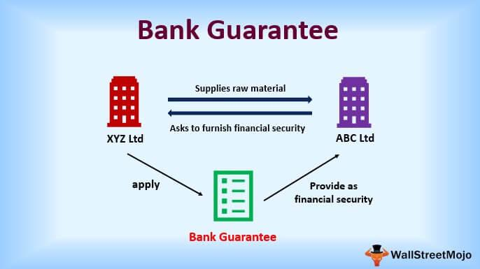

In the world of finance, various instruments and strategies are essential for managing risk, enhancing liquidity, and driving profitability. These tools include financial instruments like bonds and bank guarantees, as well as innovative trading methodologies such as algorithmic trading. 

This article examines the interplay between these components, offering insights into their purposes, mechanisms, and benefits. Financial instruments serve as vital components in the financial ecosystem, facilitating investment, capital raising, and risk management. Bonds, for instance, represent a form of debt instrument, allowing governments, corporations, and other entities to secure necessary funds. Meanwhile, bank guarantees provide a level of security in transactions, ensuring stakeholders are protected should a party default.

Algorithmic trading, on the other hand, signifies a transformative approach to market transactions. By employing complex algorithms, this method streamlines trading decisions and execution, enhancing market efficiency and liquidity.

By exploring these elements, we aim to illuminate the ways in which they are transforming financial markets. The definitions and functions of these terms will be discussed, along with their impacts on the broader financial ecosystem. Understanding these concepts is crucial for investors, business leaders, and enthusiasts to navigate today's fast-evolving financial landscape effectively. As we unpack each component in subsequent sections, the intricate connections and potential disruptions they bring to the industry will become apparent.

## Table of Contents

## Understanding Financial Instruments

Financial instruments are integral to financial markets, functioning as assets or packages of capital that can be traded, transferred, or converted into cash. These instruments play a vital role in investment, capital raising, risk management, and other financial activities. By facilitating the efficient allocation of resources, they contribute to overall economic growth and stability.

### Types of Financial Instruments

Financial instruments can be broadly categorized into equity, debt, and derivative instruments. Equity instruments, such as stocks, represent ownership in a corporation and come with the possibility of dividends and capital gains. Debt instruments, such as bonds, involve an agreement where the issuer is obligated to repay the principal amount along with interest at a future date. Derivatives, like options and futures, derive their value from underlying assets and are primarily used for hedging and speculative purposes.

### Bonds as a Primary Financial Instrument

Bonds are a quintessential debt instrument, representing a loan made by an investor to a borrower, typically a corporation or government. They serve the essential purpose of raising capital for various needs, such as operational expenses or large projects. The bond market is critical for both issuers seeking financing and investors looking for stable returns.

There are various types of bonds, including:
- **Government Bonds**: Issued by national governments and considered low-risk investments due to the backing of the issuing country's credit.
- **Corporate Bonds**: Issued by companies to fund operations, these offer higher yields than government bonds but come with higher risk.
- **Municipal Bonds**: Issued by municipalities, these bonds are often tax-exempt, making them attractive to certain investors.

The yield of a bond, largely influenced by interest rates, credit risk, and time to maturity, reflects its return on investment. Bond investors must be aware of these factors to assess the potential risks and returns.

### Bank Guarantees as Risk Management Tools

A bank guarantee functions as a risk management tool, providing assurance to stakeholders involved in financial transactions. Essentially, it is a promise by a bank to cover a loss if a borrower fails to fulfill contractual obligations. This assurance supports smooth transactions, especially in international trade, by ensuring that conditions agreed upon are met.

Businesses often utilize bank guarantees to enhance their creditworthiness and facilitate trade with confidence. There are several types of bank guarantees, including:
- **Performance Guarantees**: Ensure that contractual obligations are met by a contractor or service provider.
- **Financial Guarantees**: Assurance of payment for goods or services provided.

Obtaining a bank guarantee typically involves an assessment of the applicant's creditworthiness and entails certain costs, including a bank fee. By understanding and effectively using bank guarantees, businesses can enhance their risk management capabilities and strengthen their market position.

## Bonds: A Core Financial Instrument

Bonds serve as a foundational financial instrument in capital markets, functioning as debt securities where an investor, or bondholder, lends money to an issuer under a predetermined set of conditions. These issuers could encompass governments, corporations, or municipalities seeking to generate capital for a spectrum of projects or operational requirements.

**Types of Bonds**

1. **Government Bonds**: Issued by national governments, these bonds are typically denominated in the country's own currency. They are often considered low-risk since they are backed by the government's ability to tax its citizens or print currency. Examples include U.S. Treasury Bonds and UK Gilts.

2. **Corporate Bonds**: Issued by companies, these bonds tend to offer higher yields than government bonds to compensate for increased risk. Corporations leverage these bonds to fund activities like expansion, acquisitions, or operational improvements.

3. **Municipal Bonds**: Issued by states, cities, or other local government entities, these bonds finance public projects like infrastructure improvements and schools. In many cases, interest income from municipal bonds is exempt from federal taxes.

**Pricing and Rating of Bonds**

Bond pricing is determined by several factors, primarily the present value of its expected future cash flows, which consist of periodic interest payments and the principal at maturity. The bond price $P$ can be calculated using the formula:

$$
P = \sum_{t=1}^{n} \frac{C}{(1 + r)^t} + \frac{F}{(1 + r)^n}
$$

where:
- $C$ is the annual coupon payment.
- $F$ is the face value of the bond.
- $n$ is the total number of periods.
- $r$ is the discount rate or yield to maturity (YTM).

Bonds are rated by credit rating agencies such as Moody’s, Standard & Poor’s, and Fitch. These ratings assess the creditworthiness of the issuer, influencing investor confidence and aiding in determining the [interest rate](/wiki/interest-rate-trading-strategies) offered.

**Factors Affecting Bond Yields**

Bond yields are influenced by various factors, including interest rate environments, inflation expectations, and economic conditions. When interest rates rise, bond prices generally fall, and vice versa. Inflation erodes the purchasing power of future cash flows, prompting investors to demand higher yields.

**Risks and Mitigation**

Investing in bonds carries several risks:

- **Default Risk**: The possibility that the issuer may fail to make timely interest or principal payments. This risk is mitigated by investing in higher-rated bonds or diversifying the bond portfolio.

- **Interest Rate Risk**: The chance that rising interest rates will result in falling bond prices. Duration management, which involves adjusting bond maturities based on interest rate forecasts, can help mitigate this risk.

- **Inflation Risk**: The risk that inflation will diminish the real returns of a bond. Investing in inflation-protected securities, such as Treasury Inflation-Protected Securities (TIPS), can be a defensive measure.

Understanding these elements of bonds enables investors to better navigate the complexities of debt markets, balancing risk and return in their financial strategies.

## Bank Guarantees: Securing Financial Transactions

A bank guarantee is a financial product where a bank acts as a guarantor and provides assurance to a beneficiary that the bank will cover a loss if the applicant fails to fulfill contractual obligations. This instrument is widely used in both international and domestic commerce to bolster trust and facilitate seamless transactions.

### Types of Bank Guarantees

Bank guarantees come in various forms, each serving distinct purposes:

1. **Performance Guarantee**: Ensures the fulfillment of contractual obligations, typically in construction or service contracts.
2. **Financial Guarantee**: Provides assurance to lenders that their financial claims will be satisfied.
3. **Advance Payment Guarantee**: Assures refund of any advance payment made, should the contractual obligations not be fulfilled.
4. **Bid Bond Guarantee**: Protects against failure by a bidder to accept a contract if awarded or to furnish necessary security.

Businesses leverage these guarantees to secure transactions by reducing exposure to potential default risks. By transferring part of the risk to the bank, companies can enhance their creditworthiness and engage in high-stakes contracts with increased confidence.

### Obtaining a Bank Guarantee

The process to secure a bank guarantee involves:

1. **Application**: The applicant submits a detailed request to the bank, including all necessary information about the transaction.

2. **Assessment**: The bank conducts a rigorous evaluation of the applicant’s credit history, financial stability, and the transaction involved. This assessment determines the risk and the terms of the guarantee.

3. **Issuance**: Upon approval, the bank issues the guarantee document, outlining the terms and conditions, including the coverage amount, duration, and any fees.

### Associated Costs

Costs associated with bank guarantees can include:

- **Issuance Fees**: Generally, a percentage of the total guarantee amount, often ranging from 0.5% to 3%.
- **Commitment Fees**: Charged for reserving funds and resources.
- **Renewal Fees**: Applied if the guarantee is extended beyond its original term.

### Benefits for Businesses

Understanding bank guarantees allows businesses to manage risks more effectively and strengthen their market positions. By providing a financial fallback, these guarantees not only secure transactions but also enable companies to pursue more ambitious projects and partnerships. Overall, bank guarantees are pivotal in enhancing the financial credibility and operational capacities of businesses across various industries.

## Algorithmic Trading: The Future of Market Transactions

Algorithmic trading uses advanced algorithms to automate trading decisions, enabling execution at speeds and frequencies impractical for human traders. This approach leverages mathematical models and statistical analyses to determine the optimal timing, price, and quantity of trades, significantly enhancing efficiency in financial markets.

At its core, [algorithmic trading](/wiki/algorithmic-trading) involves pre-programmed instructions tailored to achieve specific objectives, such as reducing transaction costs or capturing timely market opportunities. Algorithms evaluate a myriad of market variables to make decisions. This method minimizes the need for human intervention, thus reducing emotional bias and errors in trading practices.

The advantages of algorithmic trading are substantial. Primarily, it enhances market [liquidity](/wiki/liquidity-risk-premium) and contributes to pricing efficiency. By executing trades at high speeds, algorithms can react to market changes faster than manual processes, ensuring that traders capitalize on [arbitrage](/wiki/arbitrage) opportunities and maintain competitive spreads.

One of the key benefits is the reduction in transaction costs. Algorithms can autonomously scavenge for the least expensive execution pathways, as well as implement complex strategies like iceberg orders and VWAP (Volume Weighted Average Price) trades to minimize market impact. Additionally, automated systems operate continuously across multiple markets and time zones, offering round-the-clock trading opportunities and thereby maximizing the potential for profitability.

However, algorithmic trading encompasses certain risks and challenges. The primary concern is the potential for market disruption. High-frequency trading, a subset of algorithmic trading, has been scrutinized for exacerbating flash crashes and contributing to market [volatility](/wiki/volatility-trading-strategies). Such events underscore the significance of robust risk management and the necessity for stringent regulatory frameworks to mitigate systemic risks.

Regulatory considerations play a crucial role in the practice of algorithmic trading. Financial regulators across the globe have established guidelines to ensure transparency and market integrity. For instance, markets impose circuit breakers and enforce order-to-trade ratios to prevent abusive practices and maintain stability. Compliance with these regulations is essential for firms engaged in high-frequency and algorithmic trading.

Additionally, the complexity of algorithms can result in unforeseen consequences. Algorithms are susceptible to coding errors or logical flaws, which can lead to significant financial losses. Therefore, rigorous testing and validation, often through [backtesting](/wiki/backtesting) methods, are paramount to ensure the efficacy and safety of trading algorithms before deployment.

In conclusion, while algorithmic trading presents a transformative advancement in market transactions, incorporating both significant benefits and challenges. Its future hinges on the continuous evolution of technology and the meticulous balancing of innovation with prudent risk and regulatory management.

## Interconnections Between Bonds, Bank Guarantees, and Algo Trading

In the dynamic financial ecosystem, the interplay between bonds, bank guarantees, and algorithmic trading forms a robust framework that enhances market functionality. These elements, when integrated, contribute significantly to market stability and investor confidence.

**Advanced Algorithms in Bond Trading**

Algorithmic trading has revolutionized the bond market by using sophisticated algorithms to automate and optimize trading processes. Algorithms can assess vast datasets, detect trading opportunities, and execute trades with precision and speed that human traders cannot match. For example, algorithms can identify price discrepancies across various bond markets and execute arbitrage strategies. This automation reduces transaction costs and minimizes human error, thereby increasing market efficiency.

A standard approach in algorithmic bond trading involves the use of statistical models to forecast future bond prices based on historical data and current market conditions. For instance, an algorithm might use a linear regression model to predict bond yields using inputs such as interest rates, inflation rates, and economic indicators. Python libraries like Pandas and NumPy can be instrumental in handling data and performing such analyses efficiently.

**The Role of Bank Guarantees in Facilitating Transactions**

Bank guarantees play a crucial role in mitigating risk and ensuring trust in financial transactions. By providing assurance that a borrower will meet their obligations, bank guarantees facilitate smoother transactions. In international and domestic trade, these guarantees are essential for parties who may be unfamiliar with each other, by reducing credit risk and enabling transactions that might otherwise be deemed too risky.

**Interconnectedness Enhancing Market Stability and Confidence**

The interconnection between these financial instruments and strategies amplifies their individual benefits. For example, algorithmic trading can enhance the liquidity of bonds by ensuring that trades are executed swiftly and efficiently, thereby making it easier for investors to buy and sell bonds without significantly affecting their market prices. At the same time, the presence of bank guarantees ensures that counterparties in these transactions have a safety net, reducing the risk of default.

When combined, these elements foster a more stable financial environment. The liquidity provided by algorithmic trading aids in the efficient pricing of bonds, while bank guarantees provide additional security that bolsters investor confidence. This confidence is crucial, particularly during market volatility, as it sustains trading volumes and market participation.

**Real-world Examples and Case Studies**

A real-world case study illustrating these interdependencies is the role these elements played during economic downturns. For example, during the financial crisis of 2008, algorithmic trading facilitated rapid adjustments in bond portfolios as market conditions evolved. Concurrently, bank guarantees provided much-needed confidence to sustain trade flows even when credit markets were severely constrained.

**Competitive Edge for Market Participants**

Understanding these interconnections can provide a competitive edge to market participants. Investors who leverage algorithmic trading strategies that are cognizant of the safety provided by bank guarantees can optimize their risk-return profiles. Moreover, by recognizing how these instruments can be used in concert, businesses and investors are better positioned to navigate complex financial markets, enhancing their ability to capitalize on emerging opportunities while managing associated risks effectively.

In conclusion, the synergistic use of bonds, bank guarantees, and algorithmic trading not only fortifies the financial system but also paves the way for innovation and efficiency in financial transactions. This interconnected approach is pivotal for ensuring market resilience and fostering an environment conducive to sustained economic growth.

## Conclusion

The financial landscape presents a multifaceted environment where diverse instruments and strategies significantly influence how markets function. Understanding key components such as bonds, bank guarantees, and algorithmic trading enables market participants to navigate this complex terrain with enhanced acumen. Bonds, as fundamental financial instruments, allow entities to raise capital while offering investors relatively stable returns. Bank guarantees provide a safety net for transactions by assuring stakeholders that commitments will be honored, thus reinforcing trust and reducing counterparty risk. Algorithmic trading, driven by sophisticated algorithms and high-speed execution, revolutionizes market interaction through increased efficiency and diminished transaction costs. Collectively, these elements not only improve the efficiency and security of financial transactions but also pave the way for innovative approaches within the industry. 

The future of finance hinges on the adept integration of these tools, leveraging their capabilities to optimize performance while proactively managing associated risks. As financial markets continue to advance, being well-versed in these developments will equip market participants to seize opportunities and mitigate potential drawbacks effectively. Staying informed and embracing these evolving strategies and instruments are essential for achieving long-term success in the financial sector.

## References & Further Reading

[1]: ["The Essentials of Risk Management"](https://books.google.com/books/about/The_Essentials_of_Risk_Management_Second.html?id=bwlPAgAAQBAJ) by Michel Crouhy, Dan Galai, Robert Mark

[2]: ["Bonds: An Introduction to the Core Concepts"](https://www.amazon.com/Bonds-Introduction-Concepts-Mark-Mobius/dp/0470821477) by John Hull

[3]: Chance, D. M., & Brooks, R. (2009). ["An Introduction to Derivatives and Risk Management."](https://books.google.com/books/about/Introduction_to_Derivatives_and_Risk_Man.html?id=b8PgBQAAQBAJ) South-Western Cengage Learning.

[4]: ["Financial Analytics with R: Building a Laptop Laboratory for Data Science"](https://assets.cambridge.org/97811071/50751/frontmatter/9781107150751_frontmatter.pdf) by Mark J. Bennett and Dirk L. Hugen

[5]: Narang, R. K. (2014). ["Inside the Black Box: The Simple Truth About Quantitative Trading."](https://onlinelibrary.wiley.com/doi/book/10.1002/9781118267738) Wiley.