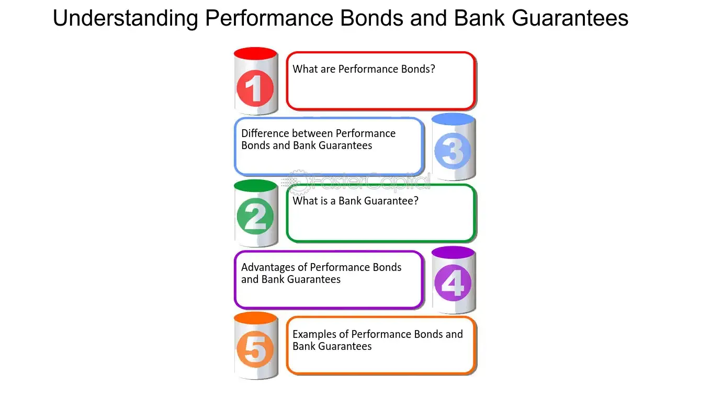

## Table of Contents

## What is a bank guarantee?

A bank guarantee is like a promise from a bank that it will cover a certain amount of money if someone doesn't do what they promised. For example, if a company agrees to build something for another company, a bank guarantee can make sure the first company finishes the job or pays back the money.

These guarantees are often used in business deals to make both sides feel safer. If one side doesn't keep their promise, the other side can get money from the bank instead of waiting or going to court. Banks charge a fee for providing these guarantees, but it can be worth it for the peace of mind and security it offers.

## What is a bond?

A bond is like a loan that you give to a big group, like a government or a company. When you buy a bond, you are lending them money. In return, they promise to pay you back the money you lent them, plus a little extra, over a certain amount of time. This extra money is called interest. Bonds are a way for these groups to borrow money from lots of people at once.

Bonds can be safe because they come with a promise to pay you back. But, there's still a small chance the group might not be able to pay you back if they run into money problems. That's why people check how safe a bond is before buying it. The safer the bond, the less interest it usually pays, because people are okay with less money if they feel more secure.

There are different kinds of bonds. Some are from the government, like U.S. Treasury bonds, which are seen as very safe. Others are from companies, called corporate bonds, and they might pay more interest but can be riskier. People buy bonds to grow their money slowly and safely, or to balance out riskier investments like stocks.

## How do bank guarantees and bonds function as financial instruments?

Bank guarantees and bonds are both financial tools that help make business deals safer. A bank guarantee is like a safety net from a bank. If one person or company doesn't do what they promised in a deal, the bank steps in and pays the other side instead. This makes people feel more secure when they're doing business with someone new or risky. For example, if a company promises to build a road but doesn't finish it, the bank can pay the money back to the one who paid for the road. Banks charge a fee for this service, but it's often worth it for the added security.

Bonds are a bit different. When you buy a bond, you're lending money to a big group like a government or a company. They promise to pay you back the money you lent them, plus some extra called interest, over time. This is a way for these groups to borrow money from lots of people at once. Bonds are seen as safer investments because they come with a promise to pay you back. But, there's still a small risk they might not be able to pay if they have money problems. People buy bonds to grow their money slowly and safely, or to balance out riskier investments like stocks.

## What are the primary purposes of using bank guarantees versus bonds?

Bank guarantees are mainly used to make business deals feel safer. When two parties are doing business, a bank guarantee acts like a safety net. If one party doesn't do what they promised, the bank will step in and pay the other party. This is helpful in situations where there's a risk that one side might not keep their word, like in construction projects or international trade. The bank charges a fee for this service, but it's often worth it because it reduces the risk for both sides and makes them more likely to trust each other.

Bonds, on the other hand, are used by big groups like governments or companies to borrow money from lots of people at once. When you buy a bond, you're lending money to these groups, and they promise to pay you back with interest over time. This is a way for them to get the money they need for big projects or to keep running their business. For the people buying the bonds, it's a way to grow their money slowly and safely. Bonds are seen as safer investments because they come with a promise to pay back, but there's still a small risk if the group can't pay due to financial problems.

## Who are the typical issuers of bank guarantees and bonds?

Bank guarantees are usually issued by banks. These can be big banks or smaller ones, but they need to be trusted by both sides in a deal. When a bank gives a guarantee, it's promising to pay money if one side doesn't do what they said they would. This makes businesses feel safer when they're working with new or risky partners. For example, if a company is building a bridge and doesn't finish it, the bank will pay the other side instead.

Bonds are mostly issued by governments and big companies. Governments, like the U.S. government, issue bonds to borrow money for things like building roads or schools. These are called government bonds and are seen as very safe. Companies also issue bonds, called corporate bonds, to get money for growing their business or other big projects. When you buy a bond, you're lending money to these groups, and they promise to pay you back with interest over time.

## What are the key differences in the legal obligations of bank guarantees and bonds?

Bank guarantees and bonds have different legal obligations that affect how they work. With a bank guarantee, the bank promises to pay money if one side of a deal doesn't do what they said they would. This means the bank has a direct legal obligation to the other side in the deal. If the company building a bridge doesn't finish it, the bank must pay the money to the one who paid for the bridge. The bank's obligation is clear and happens right away if the terms of the guarantee are not met.

Bonds, on the other hand, work differently. When you buy a bond, you are lending money to a government or a company. They promise to pay you back the money you lent them, plus interest, over time. The legal obligation here is between the bond issuer (like a government or company) and the bondholder (the person who bought the bond). If the issuer can't pay back the bond, they might go bankrupt, and bondholders might not get all their money back. Unlike a bank guarantee, there's no third party like a bank promising to pay if the issuer fails.

## How do the costs associated with obtaining bank guarantees compare to those of bonds?

The costs of getting a bank guarantee are usually a fee that the bank charges for providing the guarantee. This fee can be a percentage of the guarantee amount or a flat fee, and it's often paid upfront or over time. The exact cost depends on things like how risky the bank thinks the deal is, how long the guarantee lasts, and the bank's own fees. For businesses, these fees can add up, but they might be worth it because the guarantee makes the deal safer and more trustworthy.

The costs of getting bonds are different. When a government or company issues a bond, they have to pay interest to the people who buy the bonds. This interest is the cost of borrowing the money. The interest rate depends on how safe the bond is seen to be. Safer bonds, like those from the U.S. government, usually have lower interest rates because people are okay with less money if they feel more secure. Riskier bonds, like those from smaller companies, might have to offer higher interest rates to attract buyers. So, the cost of bonds is mainly in the interest payments, which can be spread out over many years.

## In what scenarios might a bank guarantee be more advantageous than a bond, and vice versa?

A bank guarantee might be more advantageous than a bond in situations where a business needs to show that they can be trusted to do something. For example, if a company is working on a big construction project, they might need to prove to the client that they'll finish the job. A bank guarantee can do this by promising to pay the client if the company doesn't finish. This makes the client feel safer and more likely to work with the company. Bank guarantees are also good for short-term deals where the focus is on making sure both sides keep their promises, not on borrowing money for a long time.

On the other hand, bonds might be more advantageous when a government or a company needs to borrow a lot of money for a long time. For example, if a government wants to build new schools, they can issue bonds to get the money they need. People who buy the bonds are lending money to the government and will get their money back plus interest over many years. Bonds are good for long-term projects because they help spread out the cost of borrowing over time. They're also useful for investors who want a safe way to grow their money slowly, since bonds usually come with a promise to pay back the money.

## How do the processes of obtaining a bank guarantee and a bond differ?

Getting a bank guarantee involves a few steps. First, the person or company needing the guarantee goes to a bank and asks for it. They have to show the bank that they can pay if the guarantee is used. The bank checks how risky the deal is and decides if they will give the guarantee. If they agree, the bank and the person or company sign a contract. The person or company pays a fee to the bank, which can be a percentage of the guarantee amount or a flat fee. The bank then gives the guarantee to the other side of the deal, promising to pay if the person or company doesn't do what they promised.

Getting a bond works differently. First, a government or company decides they need to borrow money and issues bonds. They set the terms of the bond, like how much money they need, how long they will take to pay it back, and the interest rate they will pay. Then, they sell the bonds to people or other companies who want to invest. Investors buy the bonds, giving their money to the government or company. In return, the government or company promises to pay back the money with interest over time. This process can take longer because it involves selling bonds to many people and setting up a system to pay them back.

## What are the risks associated with bank guarantees and bonds for both the issuer and the beneficiary?

For bank guarantees, the risks are different for the bank and the person getting the guarantee. For the bank, the big risk is that they might have to pay money if the person they guaranteed doesn't do what they promised. This can happen if the person can't pay back the bank, which could be bad for the bank's money. For the person getting the guarantee, the risk is that they have to pay a fee to the bank, and if they don't do what they promised, their relationship with the bank might get worse. But, the guarantee makes the deal safer because the other side knows the bank will step in if needed.

For bonds, the risks depend on whether you are the one issuing the bond or the one buying it. If you're the government or company issuing the bond, the main risk is that you might not be able to pay back the money you borrowed, plus interest. This could happen if you run into money problems, and it could make people trust you less in the future. If you're the person buying the bond, your risk is that the government or company might not pay you back. This risk is bigger with riskier bonds, like those from smaller companies. But, if the bond is safe, like a U.S. Treasury bond, the risk is much smaller, and you can feel more secure about getting your money back.

## How do international regulations and standards impact the use of bank guarantees and bonds?

International regulations and standards can make a big difference in how bank guarantees and bonds are used around the world. For bank guarantees, rules like those from the International Chamber of Commerce (ICC) help make sure that banks and businesses understand each other no matter where they are. These rules set out how guarantees should be written and what they should cover. This makes it easier for companies in different countries to trust each other and do business together. Without these rules, it might be hard for a company in one country to know if a bank guarantee from another country is good enough.

For bonds, international standards also play a big role. Organizations like the International Organization for Standardization (ISO) and credit rating agencies help set rules and give ratings that show how safe a bond is. These ratings are important because they tell people all over the world how risky it is to buy a bond from a certain government or company. This makes it easier for investors to decide which bonds to buy. Without these standards and ratings, it would be harder for people to trust bonds from other countries, and it might be harder for governments and companies to borrow money from people around the world.

## What advanced strategies can businesses employ to optimize the use of bank guarantees and bonds in their financial planning?

Businesses can use bank guarantees smartly to make their deals safer and grow their business. One way is to use bank guarantees to show they can be trusted when working with new partners or on big projects. This can help them win more deals because the other side feels safe. Another way is to shop around for the best deal on bank guarantees. Different banks might charge different fees, so finding the right bank can save money. Businesses can also use bank guarantees to get better terms in their contracts, like longer payment times, because the other side knows the bank will step in if needed.

For bonds, businesses can use them to borrow money in a smart way. If a business needs money for a big project, they can issue bonds instead of taking out a big loan. This can be cheaper because the interest on bonds might be lower than loan interest. Businesses can also use bonds to manage their money over time. They can issue bonds with different lengths, some short and some long, to spread out when they have to pay back the money. This helps them plan their money better. Also, by keeping a good credit rating, businesses can get lower interest rates on their bonds, which saves them money in the long run.

## What are Bonds and why are they considered a Core Financial Instrument?

Bonds serve as a foundational financial instrument in capital markets, functioning as debt securities where an investor, or bondholder, lends money to an issuer under a predetermined set of conditions. These issuers could encompass governments, corporations, or municipalities seeking to generate capital for a spectrum of projects or operational requirements.

**Types of Bonds**

1. **Government Bonds**: Issued by national governments, these bonds are typically denominated in the country's own currency. They are often considered low-risk since they are backed by the government's ability to tax its citizens or print currency. Examples include U.S. Treasury Bonds and UK Gilts.

2. **Corporate Bonds**: Issued by companies, these bonds tend to offer higher yields than government bonds to compensate for increased risk. Corporations leverage these bonds to fund activities like expansion, acquisitions, or operational improvements.

3. **Municipal Bonds**: Issued by states, cities, or other local government entities, these bonds finance public projects like infrastructure improvements and schools. In many cases, interest income from municipal bonds is exempt from federal taxes.

**Pricing and Rating of Bonds**

Bond pricing is determined by several factors, primarily the present value of its expected future cash flows, which consist of periodic interest payments and the principal at maturity. The bond price $P$ can be calculated using the formula:

$$
P = \sum_{t=1}^{n} \frac{C}{(1 + r)^t} + \frac{F}{(1 + r)^n}
$$

where:
- $C$ is the annual coupon payment.
- $F$ is the face value of the bond.
- $n$ is the total number of periods.
- $r$ is the discount rate or yield to maturity (YTM).

Bonds are rated by credit rating agencies such as Moody’s, Standard & Poor’s, and Fitch. These ratings assess the creditworthiness of the issuer, influencing investor confidence and aiding in determining the [interest rate](/wiki/interest-rate-trading-strategies) offered.

**Factors Affecting Bond Yields**

Bond yields are influenced by various factors, including interest rate environments, inflation expectations, and economic conditions. When interest rates rise, bond prices generally fall, and vice versa. Inflation erodes the purchasing power of future cash flows, prompting investors to demand higher yields.

**Risks and Mitigation**

Investing in bonds carries several risks:

- **Default Risk**: The possibility that the issuer may fail to make timely interest or principal payments. This risk is mitigated by investing in higher-rated bonds or diversifying the bond portfolio.

- **Interest Rate Risk**: The chance that rising interest rates will result in falling bond prices. Duration management, which involves adjusting bond maturities based on interest rate forecasts, can help mitigate this risk.

- **Inflation Risk**: The risk that inflation will diminish the real returns of a bond. Investing in inflation-protected securities, such as Treasury Inflation-Protected Securities (TIPS), can be a defensive measure.

Understanding these elements of bonds enables investors to better navigate the complexities of debt markets, balancing risk and return in their financial strategies.

## References & Further Reading

[1]: ["The Essentials of Risk Management"](https://books.google.com/books/about/The_Essentials_of_Risk_Management_Second.html?id=bwlPAgAAQBAJ) by Michel Crouhy, Dan Galai, Robert Mark

[2]: ["Bonds: An Introduction to the Core Concepts"](https://www.amazon.com/Bonds-Introduction-Concepts-Mark-Mobius/dp/0470821477) by John Hull

[3]: Chance, D. M., & Brooks, R. (2009). ["An Introduction to Derivatives and Risk Management."](https://books.google.com/books/about/Introduction_to_Derivatives_and_Risk_Man.html?id=b8PgBQAAQBAJ) South-Western Cengage Learning.

[4]: ["Financial Analytics with R: Building a Laptop Laboratory for Data Science"](https://assets.cambridge.org/97811071/50751/frontmatter/9781107150751_frontmatter.pdf) by Mark J. Bennett and Dirk L. Hugen

[5]: Narang, R. K. (2014). ["Inside the Black Box: The Simple Truth About Quantitative Trading."](https://onlinelibrary.wiley.com/doi/book/10.1002/9781118267738) Wiley.