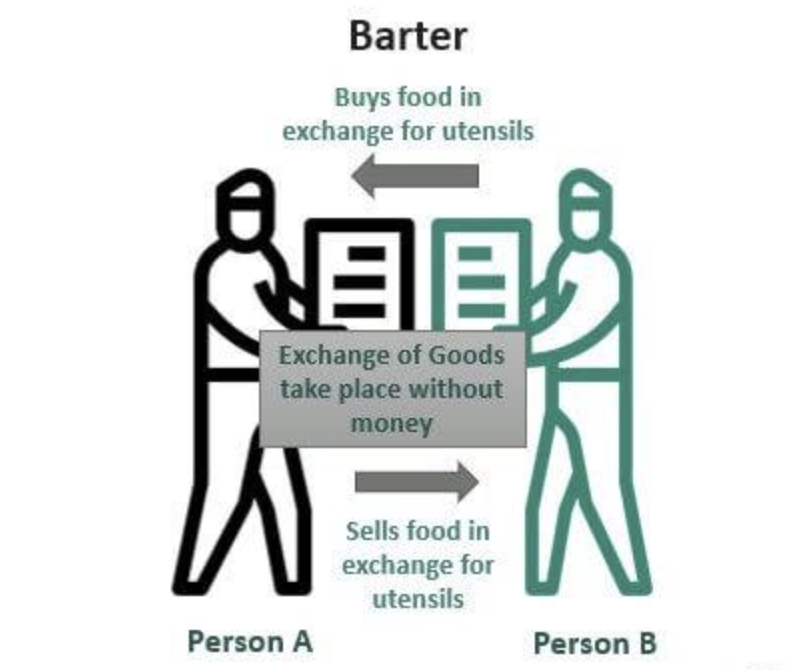

## Table of Contents

## What is a barter system?

A barter system is a way of trading goods or services without using money. Instead of buying things with dollars or coins, people exchange what they have for what they need. For example, if you have extra apples and your neighbor has extra bread, you might trade apples for bread. This system was used a long time ago before money was invented, and it's still used in some places today.

Bartering can be simple, but it also has some challenges. One big problem is finding someone who wants what you have and has what you want at the same time. This is called a "double coincidence of wants." Also, it can be hard to decide how much of one thing is worth compared to another thing. If you think your apples are worth more than your neighbor's bread, you might not agree on a trade. Despite these challenges, bartering can help people get what they need without using money.

## What is a currency system?

A currency system is a way of using money to buy and sell things. Instead of trading goods directly like in a barter system, people use money as a middle step. Money can be coins, paper bills, or even digital numbers in a bank account. When you want something, you give money to the person who has it, and they give you the thing you want. This makes trading easier because everyone agrees on what money is worth.

Using a currency system solves some problems of bartering. With money, you don't need to find someone who wants exactly what you have and has exactly what you want at the same time. You can sell your apples for money and then use that money to buy bread from someone else. Money also makes it easier to decide how much things are worth. If a loaf of bread costs one dollar and your apples are worth two dollars, you know you can buy two loaves of bread with your apples. This makes trading smoother and more fair for everyone.

## How does barter differ from using currency?

Barter and using currency are two different ways to trade things. In a barter system, people trade goods or services directly without using money. For example, if you have extra apples and your neighbor has extra bread, you might trade apples for bread. The big challenge with bartering is finding someone who wants what you have and has what you want at the same time. It can also be hard to agree on how much one thing is worth compared to another.

Using a currency system is different because it uses money to buy and sell things. Instead of trading apples for bread directly, you sell your apples for money and then use that money to buy bread. Money makes trading easier because everyone agrees on what it's worth. You don't need to find someone who wants your apples and has bread; you can sell to anyone and then buy from anyone else. This makes trading smoother and more fair for everyone.

## What are the historical origins of barter and currency systems?

The barter system is very old, going back thousands of years. Before people used money, they traded things they had for things they needed. For example, if a farmer had too many cows but needed wheat, he might trade a cow for wheat with another farmer. This way of trading worked well in small groups where people knew each other and what they needed. But as societies grew bigger and more complex, bartering became harder because it was tough to find someone who wanted what you had and had what you needed at the same time.

The idea of using currency started a long time ago too, but it came after bartering. The first kinds of money were things like shells, beads, or even cattle. Later, people started using metal coins, which were easier to [carry](/wiki/carry-trading) and use. The first coins were made in places like ancient Lydia, around 600 BCE. Using money made trading much easier because everyone agreed on what the coins were worth. Over time, paper money and then digital money were invented, making trading even simpler and helping economies grow bigger and more connected.

## What are the advantages of using a barter system?

Using a barter system has some good points. One big advantage is that it doesn't need money. This can be helpful in places where money is hard to get or not used at all. If you have something someone else wants, and they have something you want, you can just trade without needing to find money. This makes it easier for people to get what they need, especially in small communities where everyone knows each other.

Another good thing about bartering is that it can help people feel more connected. When you trade with someone, you often talk to them and learn more about what they need and what they can offer. This can build stronger relationships and make the community closer. Plus, bartering can be a good way to get rid of things you don't need anymore and get something useful in return, without spending any money.

## What are the disadvantages of using a barter system?

One big problem with bartering is that it can be hard to find someone who wants what you have and has what you want at the same time. This is called a "double coincidence of wants." For example, if you have apples and you want bread, you need to find someone who has bread and wants apples. If you can't find that person, you can't make a trade. This makes bartering slow and tricky, especially in big groups of people.

Another problem is deciding how much things are worth. If you think your apples are worth more than someone else's bread, you might not agree on a trade. This can lead to a lot of arguing and make it hard to trade fairly. Without money to help decide value, bartering can be confusing and frustrating.

## What are the advantages of using a currency system?

Using a currency system makes trading a lot easier. With money, you don't need to find someone who wants what you have and has what you want at the same time. You can sell your apples for money and then use that money to buy bread from someone else. This solves the big problem of bartering called the "double coincidence of wants." Money helps everyone agree on what things are worth, so trading is smoother and more fair.

Another good thing about using money is that it helps the economy grow. When people use money, it's easier to save, borrow, and invest. This means businesses can start and grow, and people can buy more things. Money also helps people in different places trade with each other, making the economy bigger and more connected. Overall, using a currency system makes life easier and helps everyone get what they need.

## What are the disadvantages of using a currency system?

One problem with using money is that it can lose its value over time. This is called inflation. When inflation happens, the same amount of money can buy less stuff than before. This can be hard for people who save money because their savings might not be worth as much later. Also, if the economy is not doing well, money might lose value quickly, which can cause big problems for everyone.

Another issue is that not everyone has the same amount of money. Some people might have a lot, while others might not have enough to buy what they need. This can make life unfair and cause big differences between people. When money is not shared well, it can lead to problems like poverty and inequality. Money can help the economy grow, but it can also make life harder for some people if it's not managed well.

## How have barter and currency systems evolved over time?

Barter systems started a long time ago when people traded things they had for things they needed. For example, a farmer with too many cows might trade a cow for wheat with another farmer. This way of trading worked well in small groups where people knew each other. But as societies grew bigger, bartering became harder because it was tough to find someone who wanted what you had and had what you needed at the same time. Over time, people started using things like shells, beads, or even cattle as early forms of money to make trading easier. 

The use of money, or currency systems, began to replace bartering because it solved some big problems. The first coins were made around 600 BCE in places like ancient Lydia. Coins were easier to carry and use than trading goods directly. Over time, paper money was invented, which was even easier to use and helped economies grow bigger. Now, we also have digital money, like the money in your bank account, which makes trading even simpler. Using money has helped people trade with others far away and has made the world more connected, but it also has its own challenges, like inflation and inequality.

## In what scenarios might a barter system be more effective than a currency system?

A barter system might be more effective than a currency system in small communities where people know each other well. In these places, people can easily find others who want what they have and have what they need. For example, if you have extra apples and your neighbor wants apples and has bread to trade, you can quickly make a deal without needing money. This can help build stronger relationships in the community because people talk to each other more when they trade.

Bartering can also be useful in situations where money is hard to get or not used at all. In some remote areas or during times of economic trouble, people might not have easy access to money. Trading goods directly can help them get what they need without worrying about having enough money. This way, even if the economy is not doing well, people can still help each other and get by.

## How do modern technologies influence barter and currency systems?

Modern technologies have changed how we use barter and currency systems. For bartering, there are now websites and apps where people can trade things online. These platforms help people find others who want what they have and have what they need, even if they live far away. This makes bartering easier and more common than before. People can trade things like clothes, furniture, or even services like tutoring or dog-walking without needing to meet in person.

For currency systems, technology has brought big changes too. Now, we have digital money that we can use online or with our phones. This makes it easy to buy things from anywhere in the world without using cash. Banks and payment apps help us send and receive money quickly and safely. Also, new kinds of money like cryptocurrencies have been created, which people can use to trade without a bank. These changes make using money faster and more convenient, but they also bring new challenges like keeping digital money safe.

## What are the future prospects for barter and currency systems in a global economy?

In the future, barter systems might become more popular again, especially with new technology. Websites and apps make it easier for people to trade things they don't need for things they want, even if they live far away. This could be helpful in places where money is hard to get or during times when the economy is not doing well. People might use bartering more to help each other and build stronger communities, especially if they can do it online.

Currency systems will keep changing too. Digital money, like the money in your bank account or cryptocurrencies, will become even more common. This makes it easy to buy things from anywhere in the world without using cash. But, it also brings new problems, like keeping your money safe from hackers. As the world gets more connected, using money will help the economy grow, but people will need to find ways to make sure everyone can use it fairly and safely.

## References & Further Reading

[1]: Davies, Glyn (1996). *A History of Money: From Ancient Times to the Present Day*. University of Wales Press.

[2]: Einzig, Paul (1966). *Primitive Money: In its Ethnological, Historical and Economic Aspects*. Pergamon Press.

[3]: Bergstra, J., Bardenet, R., Bengio, Y., & Kégl, B. (2011). ["Algorithms for Hyper-Parameter Optimization."](https://dl.acm.org/doi/10.5555/2986459.2986743) Advances in Neural Information Processing Systems 24.

[4]: ["Advances in Financial Machine Learning"](https://www.amazon.com/Advances-Financial-Machine-Learning-Marcos/dp/1119482089) by Marcos Lopez de Prado

[5]: ["Evidence-Based Technical Analysis: Applying the Scientific Method and Statistical Inference to Trading Signals"](https://www.amazon.com/Evidence-Based-Technical-Analysis-Scientific-Statistical/dp/0470008741) by David Aronson

[6]: ["Machine Learning for Algorithmic Trading"](https://github.com/stefan-jansen/machine-learning-for-trading) by Stefan Jansen

[7]: ["Quantitative Trading: How to Build Your Own Algorithmic Trading Business"](https://www.amazon.com/Quantitative-Trading-Build-Algorithmic-Business/dp/1119800064) by Ernest P. Chan