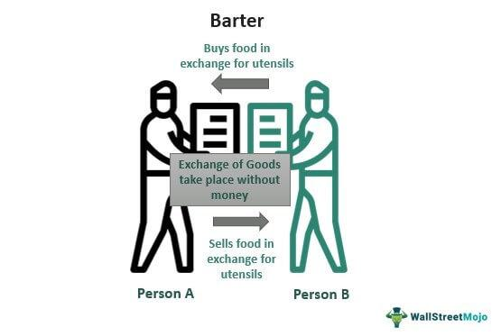

Economic systems have been pivotal in the development of trade and finance, significantly impacting how societies manage the exchange of goods and services. Historically, these systems have transitioned from the straightforward direct exchanges of the barter system to more complex structures involving currency and, more recently, sophisticated algorithmic trading. Each stage in this progression has brought about unique transformations and efficiencies in how marketplaces operate.

The barter system, foundational in the earliest human exchanges, facilitated trade through direct swaps of goods and services. While effective in simple economies, it presented challenges such as the double coincidence of wants—where both parties had to have precisely what the other desired at the same time. This inherent inefficiency led to the development of currencies, which functioned as a medium of exchange, unit of account, and store of value, thus overcoming the limitations of barter by enabling broader and more efficient trade across regions and societies.



In contemporary times, technology has further revolutionized the trading landscape through algorithmic trading systems. These systems automate trading strategies using complex algorithms, increasing the speed and efficiency of transactions and reducing the potential for human error. Algorithmic trading exemplifies how traditional trading methodologies can be enhanced by technological innovation, offering unprecedented precision and capability in financial markets.

This article examines the historical journey from barter to algorithmic trading, elucidating how these varying systems operate and interact within today's global economy. This exploration underscores the coexistence and integration of traditional and modern elements in contemporary economic systems, which continue to adapt in response to technological advancements and changing market demands. By tracing this evolution, we gain insights into not only the past and present dynamics of trade but also the future possibilities as economic systems evolve further.

## Table of Contents

## Understanding Economic Systems

Economic systems serve as foundational frameworks essential for organizing the production and exchange of goods and services within societies. At their core, these systems are mechanisms that guide how resources are allocated and how various entities, such as individuals, businesses, and governments, participate in trading activities. By determining who produces what, how resources are allocated, and who receives the output, economic systems play a vital role in ensuring societal needs and wants are met efficiently.

Central to the functioning of economic systems are the structures and rules that coordinate economic activity. These include market-based mechanisms, such as supply and demand forces, as well as institutionally driven directives, such as centrally planned economies. In market economies, prices set by supply and demand interactions serve as signals that guide resource allocation. When demand for a product increases, prices tend to rise, incentivizing producers to increase supply. Conversely, excess supply typically leads to price decreases, prompting producers to reduce output.

The barter system, recognized as one of the first economic systems, operated on simple principles of reciprocal exchange. It required a double coincidence of wants, meaning that for a transaction to occur, each party had to possess something the other wanted. The barter system, while rudimentary, laid the groundwork for trade by facilitating direct exchanges and addressing immediate consumption needs.

However, as societies grew and economic transactions became more complex, the limitations of the barter system became apparent. To overcome these constraints, currency systems evolved to introduce a medium of exchange, thereby improving the efficiency of trade. Currency systems allow for indirect exchange, where money serves not only as a medium of exchange but also as a unit of account and a store of value. By offering a common measure for assessing the value of disparate goods and services, currency systems streamline economic transactions, facilitate savings, and enable the accumulation of capital, thus fostering economic growth.

Economic systems are inherently dynamic, adapting to technological advancements and changing societal needs. They incorporate diverse entities such as financial institutions, which act as intermediaries in the currency systems, further enhancing market efficiency. By providing platforms for saving, investing, and lending, financial institutions deepen markets and support economic development.

Despite the shift from barter to currency systems, both systems reflect the underlying principles of economic organization—namely, resource allocation and trade facilitation. Each system, although distinct in operation, is united by the objective of driving economic efficiency and growth, ensuring that society’s material needs are met in a structured and sustainable manner.

## The Barter System

The barter system represents one of the most primitive methods of trade, allowing for the direct exchange of goods and services without the intermediary of money. This system's roots trace back to ancient civilizations where trade primarily depended on the reciprocal need for one another's commodities. In a typical barter transaction, a farmer might exchange a bushel of wheat for a neighbor's woven textiles, provided both parties mutually desired the offered products.

Historically, the barter system has played a crucial role in early economies, as evidenced by records from Mesopotamia, Egypt, and indigenous societies. For example, Mesopotamian tribes traded or bartered goods such as grain and pottery for tools and weapons long before coins were invented [1]. Similarly, in Egypt, barley and other agricultural products often served as a medium of exchange before the advent of money [2].

Despite its significance in early trade, the barter system has inherent limitations. One prominent challenge is the "double coincidence of wants." This term describes the necessity for each party in the transaction to possess exactly what the other desires, simultaneously. For instance, if an artisan who produced footwear required food, they would need to find a farmer interested in exchanging surplus grain specifically for footwear, complicating the process of finding suitable trading partners.

Another limitation is the system's inefficiency as a store of value. Unlike currency, which can be saved and accumulated, goods involved in barter transactions may perish or depreciate over time, making it difficult to store wealth. For example, perishable items such as fruits or vegetables cannot easily be held as assets across seasons, restricting their usability in long-term economic planning.

Overall, while the barter system was fundamental to early human societies, fulfilling basic needs and fostering trade relationships, its operational limitations led to the development of more sophisticated economic systems. These new systems introduced currency as a medium of exchange, thereby overcoming the inherent obstacles of barter and paving the way for more efficient and expansive trade networks.

**References:**
1. Davies, Glyn (1996). *A History of Money: From Ancient Times to the Present Day*. University of Wales Press.
2. Einzig, Paul (1966). *Primitive Money: In its Ethnological, Historical and Economic Aspects*. Pergamon Press.

## The Evolution to Currency Systems

The transition from barter systems to currency systems marked a pivotal transformation in economic history. The inefficiencies of barter, such as the necessity of a double coincidence of wants, drove the search for a more effective solution. Communities sought a more practical medium for transactions, leading to the creation of currency.

Currency served as a standardized medium of exchange, facilitating trade by eliminating the need for direct exchanges of goods and services. This development allowed currency to become a unit of account, enabling societies to assign a consistent value to various goods and services. Unlike barter, where the value of an item could vary widely depending on the context or the parties involved, currency introduced a uniform metric that eased comparisons and exchanges.

Furthermore, currency provided a reliable store of value. Without a tangible measure, barter systems struggled with the storage of wealth over time, as many goods were perishable or could lose value. Currency, initially in the form of durable items like metal coins, enabled wealth to be preserved and accumulated, fostering long-term economic growth and stability.

The expansion of trade routes and empires further accelerated the adoption of currency systems. As societies interacted with diverse cultures and economies, the need for easily recognized and transferable forms of money became more pronounced. This led to the widespread use of coins, minted by sovereign authorities to guarantee weight and purity, ensuring acceptance across different regions.

In modern times, currency has evolved into digital forms, maintaining its core functions while integrating sophisticated technologies to facilitate even more efficient trading mechanisms. Digital currencies, including electronic fiat and cryptocurrencies, continue to shift the landscape of how economies operate, but the fundamental attributes first established by traditional currency systems remain central to commerce today.

The evolution from barter to currency thus represents a significant leap toward enhanced economic efficiency and growth. By enabling more complex financial transactions and accumulations of wealth, currency systems laid the groundwork for the intricate global economies we navigate today.

## Algorithmic Trading: A Modern Advancement

Algorithmic trading has emerged as a transformative force in modern financial markets, utilizing advanced computational algorithms to automate trading decisions and execution. This method of trading capitalizes on the speed and precision of computers to evaluate complex datasets, identify market opportunities, and execute trades at speeds unattainable by human traders alone.

At its core, [algorithmic trading](/wiki/algorithmic-trading) operates by processing vast quantities of market data to detect patterns and predict price movements. This capability is powered by algorithms that can range from simple rule-based systems to complex, artificially intelligent models. A key feature of algorithmic trading is its ability to execute high-frequency trades ([HFT](/wiki/high-frequency-trading-strategies)), where thousands of orders are placed in fractions of a second, optimizing the potential for profit through minute price differentials.

Speed is one of the primary advantages of algorithmic trading. The millisecond timeframes allow traders to exploit ephemeral market opportunities before they vanish. Moreover, the precision with which algorithms can analyze market conditions and execute trades minimizes the influence of human emotions, such as fear or greed, which often lead to suboptimal trading decisions.

Efficiency is another hallmark of algorithmic trading. By automating the trading process, algorithms reduce transaction costs, allow for greater market [liquidity](/wiki/liquidity-risk-premium), and lower the bid-ask spreads. This efficiency has democratized access to markets, enabling not only institutional investors but also individual traders to participate with lower barriers.

Artificial intelligence (AI) and [machine learning](/wiki/machine-learning) (ML) have significantly shaped the algorithmic trading landscape. These technologies enhance the predictive capacity of trading algorithms, enabling them to learn and adapt to changing market conditions over time. For instance, ML algorithms can identify non-linear patterns and correlations that may not be visible through traditional statistical methods. This adaptability is crucial for maintaining a competitive edge in the fast-paced and volatile financial markets.

In practice, a simple algorithmic trading strategy might be based on moving averages. For example, a Python-based implementation could look like this:

```python
def moving_average_strategy(prices, short_window, long_window):
    signals = pd.DataFrame(index=prices.index)
    signals['signal'] = 0.0

    # Create short simple moving average
    signals['short_mavg'] = prices['price'].rolling(window=short_window, min_periods=1, center=False).mean()

    # Create long simple moving average
    signals['long_mavg'] = prices['price'].rolling(window=long_window, min_periods=1, center=False).mean()

    # Generate signals
    signals['signal'][short_window:] = np.where(signals['short_mavg'][short_window:] 
                                                > signals['long_mavg'][short_window:], 1.0, 0.0)   

    # Generate trading orders
    signals['positions'] = signals['signal'].diff()
    return signals
```

In this example, the algorithm generates buy or sell signals based upon the crossover of short-term and long-term moving averages, automating the decision-making process.

Overall, algorithmic trading represents a significant advancement from traditional trading methods, leveraging the power of technology to enhance market participation and efficiency. Its ongoing evolution, fueled by AI and ML, continues to revolutionize how trading strategies are developed and executed, highlighting the importance of innovation in the financial industry.

## Special Considerations: Digital Currencies

Digital currencies, notably cryptocurrencies like Bitcoin and Ethereum, are revolutionizing the economic landscape by incorporating attributes from both barter and traditional currency systems. Unlike fiat currencies, which are regulated by central authorities like governments or central banks, digital currencies operate on decentralized networks using blockchain technology. This decentralized control offers transparency, security, and resistance to censorship, distinguishing them from conventional financial systems.

The encryption inherent in digital currencies ensures secure transactions, protecting against theft and fraud. Each transaction is recorded on a blockchain, a distributed ledger that maintains an immutable and verifiable record of all exchanges. This addresses one of the challenges faced by electronic transactions historically— the double-spending problem—by ensuring that digital currencies cannot be duplicated or counterfeited. 

Digital currencies are reshaping international transactions and global trade. Their cross-border nature and lower transaction costs present a robust alternative to traditional financial systems, which often involve significant fees and processing delays. This is particularly beneficial for remittances and international business transactions, where digital currencies can facilitate faster and more cost-effective exchanges.

Furthermore, the emergence of digital currencies presents a formidable challenge to existing fiat currency systems. As adoption increases, these currencies threaten to undermine the monopoly that national currencies have held for centuries. Central banks worldwide are exploring Central Bank Digital Currencies (CBDCs) as a countermeasure, aiming to merge the secure, efficient aspects of digital currencies with the stability and trust associated with government backing.

Trading opportunities have also expanded with digital currencies. The rise of [cryptocurrency](/wiki/cryptocurrency) exchanges has enabled both retail and institutional investors to trade digital assets around the clock, offering new avenues for investment. This has increased market liquidity, though it has also introduced [volatility](/wiki/volatility-trading-strategies) and regulatory challenges.

In summary, digital currencies are forging a path that integrates the simplicity of barter with the complexity of modern financial systems. Their potential to disrupt traditional currency models and catalyze new trading opportunities marks them as significant players in the evolution of economic systems.

## Comparative Analysis

In comparing barter systems, traditional currency frameworks, and algorithmic trading, several distinct characteristics emerge regarding ease of use, economic efficiency, and potential for growth. Each system presents unique attributes and constraints, making it suitable for different economic settings and purposes.

Barter systems represent the earliest form of trade, characterized by the direct exchange of goods and services without the use of money. The primary strength of this system is its simplicity—it requires no currency or financial infrastructure, making it easy to understand and accessible in economies where financial systems are underdeveloped. However, its limitations, such as the double coincidence of wants and the lack of a standardized value measurement, hinder its economic efficiency. These challenges make barter less suitable for large-scale or complex economies where diverse goods and services need to be exchanged.

In contrast, traditional currency frameworks significantly enhance trade efficiency by introducing a stable medium of exchange, unit of account, and store of value. By overcoming the limitations of barter, currency systems facilitate more straightforward transactions and support economic growth. Currency provides a universal measure of value, enabling participants to engage in a broader array of economic activities without the direct exchange constraints seen in barter. Nonetheless, currency systems require a regulatory framework and infrastructure, which can pose challenges in regions with weak financial governance.

Algorithmic trading marks a modern advancement that leverages mathematical models and computer algorithms to execute trades with high speed and precision. This system epitomizes economic efficiency, automating processes that would otherwise be labor-intensive and time-consuming. Algorithmic trading offers potential growth through its capacity to analyze vast amounts of data swiftly, adapt to market conditions, and execute optimal trading strategies. Such functionality is particularly appealing in global markets, where rapid decision-making can yield significant advantages. However, the complexity and technological requirements of algorithmic trading limit its applicability to well-developed financial markets, often excluding smaller or emerging economies.

In conclusion, the choice between barter, currency, and algorithmic trading systems depends largely on the economic context. Barter suits small, localized economies where simplicity and direct exchanges suffice. Currency systems empower larger economies with formalized trade practices that support growth and development. Algorithmic trading, at the forefront of technological innovation, caters to sophisticated markets where speed and efficiency are paramount. Understanding these comparative dynamics is crucial for optimizing economic and trading systems suited to specific needs and goals.

## The Future of Economic and Trading Systems

With technology rapidly transforming financial markets, the future of economic systems remains dynamic. The integration of [artificial intelligence](/wiki/ai-artificial-intelligence) (AI) and machine learning (ML) in trading algorithms represents a significant shift towards more automated, data-driven decision-making processes. AI technologies are being used to analyze vast quantities of market data, identify patterns, and make trading decisions at speeds and accuracies that surpass human capability. This automation not only increases efficiency but also minimizes human error and emotional biases, potentially enhancing market stability.

Algorithmic trading systems are increasingly incorporating [deep learning](/wiki/deep-learning) techniques, enabling them to improve their predictive accuracy over time. For instance, [reinforcement learning](/wiki/reinforcement-learning), a type of machine learning where algorithms learn optimal strategies through trial and error interactions with the environment, shows promise in refining trading strategies. The Python code snippet below demonstrates a simplified use of reinforcement learning for a trading strategy:

```python
import gym
import numpy as np

# Create trading environment
env = gym.make('StockTradingEnv-v0')

# Initialize values
num_episodes = 1000
learning_rate = 0.01

# Dummy Q-table for simplicity
Q_table = np.zeros((env.observation_space.n, env.action_space.n))

# Reinforcement learning algorithm
for episode in range(num_episodes):
    state = env.reset()
    done = False

    while not done:
        action = np.argmax(Q_table[state, :] + np.random.randn(1, env.action_space.n) * (1./(episode+1)))
        next_state, reward, done, info = env.step(action)

        # Update Q-table
        Q_table[state, action] = Q_table[state, action] + learning_rate * (reward + np.max(Q_table[next_state, :]) - Q_table[state, action])
        state = next_state
```

Meanwhile, digital currencies, particularly cryptocurrencies like Bitcoin and Ethereum, are gaining mainstream acceptance. These decentralized currencies offer an alternative to traditional fiat money, promising faster, cheaper, and more secure transactions, especially for international exchanges. Cryptocurrencies leverage blockchain technology, ensuring transparency and immutability in transactions, which could revolutionize traditional banking and financial systems.

Despite the promise of cryptocurrencies, they face challenges such as regulatory scrutiny, scalability issues, and market volatility. However, initiatives like central bank digital currencies (CBDCs) indicate official recognition of the potential benefits of digital currencies, suggesting a future of hybrid systems that combine the advantages of traditional fiat and digital currencies.

Additionally, the tokenization of assets, facilitated by blockchain technology, is poised to transform how assets are traded, enabling fractional ownership and increasing market liquidity. This trend could democratize access to investment opportunities, allowing broader participation from small investors.

As technological advancements continue to blur the lines between different economic and trading systems, staying informed about these developments is crucial. Participants in the global economy need to adapt to these changes, which can offer substantial opportunities for growth and resilience in the ever-evolving financial landscape. The convergence of AI, digital currencies, and asset tokenization heralds a future where economic systems are not only more interconnected but also more innovative and efficient.

## Conclusion

The evolution from barter systems to modern algorithmic trading illustrates the adaptive nature of human societies in optimizing trade and financial practices. From early barter exchanges, where individuals directly traded goods and services, to the adoption of currency systems that introduced a standardized medium of exchange, human economic systems have consistently evolved to overcome existing limitations and enhance the efficiency of trade. This progression continues into today’s world, where algorithmic trading employs cutting-edge technology to execute complex financial strategies with precision and speed, underscoring a distinct shift from manual to automated processes.

While each economic system—barter, currency, and algorithmic trading—has its respective place in history, addressing specific needs of its time, technological advancements promise even greater shifts in how trade and economic exchanges are conducted going forward. The rise of digital currencies exemplifies this trend by offering decentralized alternatives to traditional fiat money, potentially redefining currency systems once again. Similarly, the integration of artificial intelligence and machine learning into trading algorithms suggests future enhancements in decision-making and predictive capabilities.

The balance of leveraging tradition with innovation will define the resilience and growth of future economic systems. As technologies evolve, the successful integration of novel solutions with existing frameworks will be crucial to sustaining economic development and addressing global trading challenges. Thus, the continual adaptation and evolution of economic systems not only highlight past achievements but also set the groundwork for future advancements in the ever-changing landscape of global finance and trade.

## References & Further Reading

[1]: Davies, Glyn (1996). *A History of Money: From Ancient Times to the Present Day*. University of Wales Press.

[2]: Einzig, Paul (1966). *Primitive Money: In its Ethnological, Historical and Economic Aspects*. Pergamon Press.

[3]: Bergstra, J., Bardenet, R., Bengio, Y., & Kégl, B. (2011). ["Algorithms for Hyper-Parameter Optimization."](https://dl.acm.org/doi/10.5555/2986459.2986743) Advances in Neural Information Processing Systems 24.

[4]: ["Advances in Financial Machine Learning"](https://www.amazon.com/Advances-Financial-Machine-Learning-Marcos/dp/1119482089) by Marcos Lopez de Prado

[5]: ["Evidence-Based Technical Analysis: Applying the Scientific Method and Statistical Inference to Trading Signals"](https://www.amazon.com/Evidence-Based-Technical-Analysis-Scientific-Statistical/dp/0470008741) by David Aronson

[6]: ["Machine Learning for Algorithmic Trading"](https://github.com/stefan-jansen/machine-learning-for-trading) by Stefan Jansen

[7]: ["Quantitative Trading: How to Build Your Own Algorithmic Trading Business"](https://www.amazon.com/Quantitative-Trading-Build-Algorithmic-Business/dp/1119800064) by Ernest P. Chan