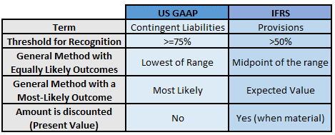

## Table of Contents

## What is a barter transaction?

A barter transaction is when people trade goods or services without using money. Imagine you have apples and your friend has bread. You both want what the other has, so you swap your apples for their bread. This is a simple way to get things you need without spending money.

In the past, before money was common, barter was how people often got what they needed. It can still be useful today, especially if you have something someone else wants, and they have something you want. Barter can help people save money and build stronger relationships by helping each other out.

## What are IFRS and US GAAP?

IFRS stands for International Financial Reporting Standards. These are a set of rules that companies around the world use to keep their financial records. The goal is to make it easier for people to understand and compare financial information from different countries. IFRS is used in many places, like Europe, Australia, and parts of Asia. It helps keep things clear and consistent when companies report their money matters.

US GAAP, which stands for Generally Accepted Accounting Principles, is the set of rules used in the United States for financial reporting. It's like a detailed guidebook that companies in the US must follow to show their financial health accurately. US GAAP can be different from IFRS in some ways, which can make it tricky for companies that do business in both the US and other countries. But it's important because it helps investors and others trust the financial information they see from American companies.

Both IFRS and US GAAP aim to make financial reporting clear and trustworthy, but they have some differences. For example, IFRS might give companies more choices in how they report certain things, while US GAAP can be more specific and strict. These differences can affect how a company's financial situation looks on paper, so it's good to know which rules are being used when you look at financial reports.

## Why is it important to recognize barter transactions under accounting standards?

Recognizing barter transactions under accounting standards is important because it helps keep financial records accurate and clear. When companies trade goods or services without using money, they still need to show these trades in their [books](/wiki/algo-trading-books). This way, everyone can see the true value of what's being exchanged. If barter transactions were not recognized, the financial statements might not show the full picture of a company's activities, which could mislead investors, creditors, and other people who use the financial information.

Accounting standards like IFRS and US GAAP have rules on how to record barter transactions. These rules make sure that both sides of the trade are valued fairly and reported correctly. By following these standards, companies can maintain trust and transparency. This is especially important in today's global market, where businesses might use barter to save money or to do business in places where cash is hard to use. Recognizing barter transactions helps everyone understand the real financial health of a company.

## How does IFRS define and recognize barter transactions?

IFRS defines barter transactions as exchanges of goods or services without using money. When a company trades something it has for something it needs, IFRS says it should record the value of what it's getting and what it's giving away. This helps everyone see the real value of the trade on the company's financial statements. The value should be based on what the goods or services would cost if they were bought with money.

Recognizing barter transactions under IFRS is important because it keeps the financial records honest and clear. If a company doesn't show these trades, people might think the company is doing better or worse than it really is. By following IFRS rules, companies make sure that everyone can trust their financial reports. This is especially helpful for businesses that often use barter to get what they need, making sure their financial health is shown correctly.

## How does US GAAP define and recognize barter transactions?

US GAAP defines barter transactions as the exchange of goods or services without using money. When a company trades something it has for something it needs, US GAAP says it should record the fair value of what it's getting and what it's giving away. The fair value is what the goods or services would cost if they were bought with money. This helps everyone see the true value of the trade in the company's financial statements.

Recognizing barter transactions under US GAAP is important because it keeps the financial records accurate and clear. If a company doesn't show these trades, people might think the company is doing better or worse than it really is. By following US GAAP rules, companies make sure that everyone can trust their financial reports. This is especially helpful for businesses that often use barter to get what they need, making sure their financial health is shown correctly.

## What are the key differences in the recognition of barter transactions between IFRS and US GAAP?

Both IFRS and US GAAP want companies to show the real value of barter transactions in their financial records. They both say that when a company trades something for something else, it should record the value of what it gets and what it gives away. This value should be what the goods or services would cost if they were bought with money. The main goal is to keep the financial statements clear and honest, so everyone can trust the information.

The key difference between IFRS and US GAAP in recognizing barter transactions is how they define fair value. IFRS gives companies a bit more freedom in deciding what the fair value is. They can use different methods to figure out the value, as long as it makes sense. On the other hand, US GAAP is more strict. It has specific rules about how to find the fair value, which can make it easier for everyone to understand but can also be more limiting for companies. This difference can affect how a company's financial situation looks on paper, depending on which set of rules they follow.

## Can you provide examples of barter transactions that would be treated differently under IFRS and US GAAP?

Imagine a company that makes furniture and another company that provides advertising services. They decide to trade: the furniture company gives a set of chairs to the advertising company, and in return, the advertising company provides a month of advertising services to the furniture company. Under IFRS, the furniture company might value the chairs at what they normally sell for and value the advertising services at what similar services would cost if they paid for them. They have some freedom in choosing how to find these values. But under US GAAP, the furniture company would have to follow strict rules to find the fair value of both the chairs and the advertising services. This might mean using specific methods that US GAAP says they must use, which could result in different numbers on their financial statements.

Another example could be a farm trading vegetables for a truck from a car dealer. Under IFRS, the farm might value the vegetables at what they usually sell them for and the truck at what similar trucks cost in the market. They can choose a method that makes sense to them. However, under US GAAP, the farm would need to follow strict rules to find the fair value of both the vegetables and the truck. These rules might lead to different values being recorded, which could change how the farm's financial situation looks on paper. The difference in how they find the fair value can affect what people see when they look at the farm's financial statements.

## What are the challenges companies face in recognizing barter transactions under both standards?

Companies can find it hard to recognize barter transactions under both IFRS and US GAAP because they need to figure out the fair value of what they are trading. This means they have to decide what their goods or services would cost if they were bought with money. It's not always easy to find this out, especially if the goods or services are unique or if there's not a clear market price. Both standards want the values to be fair and accurate, but this can be tricky when the things being traded are different from what's usually bought and sold.

Another challenge is that IFRS and US GAAP have different rules for finding the fair value. IFRS gives companies more choices in how they do this, which can make it easier but also more confusing. Companies have to pick a method that makes sense and explain why they chose it. On the other hand, US GAAP is stricter and has specific steps that companies must follow. This can make it easier to understand but harder for companies to find the right value if the steps don't fit their situation well. Both ways can lead to different numbers on the financial statements, which can be confusing for people trying to understand the company's financial health.

## How do the principles of revenue recognition apply to barter transactions under IFRS?

Under IFRS, the principles of revenue recognition for barter transactions are about making sure the value of what a company gets and gives away is shown correctly in their financial records. When a company trades goods or services without using money, they need to figure out the fair value of what they are getting. This fair value is what the goods or services would cost if they were bought with money. The company then records this value as revenue, just like they would if they had sold the goods or services for cash. This helps everyone see the true value of the trade on the company's financial statements.

The challenge with barter transactions is finding the right fair value. IFRS gives companies some freedom to choose how they find this value, as long as it makes sense. They might look at what similar goods or services cost in the market or use other methods that show a fair price. It's important that the method they choose is clear and can be explained well. This way, the financial statements stay honest and clear, and everyone can trust the information they see about the company's financial health.

## How do the principles of revenue recognition apply to barter transactions under US GAAP?

Under US GAAP, when a company trades goods or services without using money, they need to figure out the fair value of what they are getting and giving away. This fair value is what the goods or services would cost if they were bought with money. The company then records this value as revenue, just like they would if they had sold the goods or services for cash. This helps everyone see the true value of the trade on the company's financial statements.

Finding the right fair value can be tricky under US GAAP because it has strict rules about how to do this. Companies must follow specific steps to find the fair value, which can make it harder if the steps don't fit their situation well. But these rules help make sure the financial statements are clear and accurate, so everyone can trust the information they see about the company's financial health.

## What are the implications for financial reporting when choosing between IFRS and US GAAP for barter transactions?

When a company chooses between IFRS and US GAAP for barter transactions, it can affect how their financial statements look. IFRS gives companies more choices in figuring out the value of what they trade. This can make it easier for them to find a fair price, but it might also make their financial reports look different from another company using a different method. On the other hand, US GAAP has strict rules that companies must follow. This can make it harder to find the right value, but it makes the financial statements easier for everyone to understand because they know the same rules were used.

These differences can change how investors and others see the company's financial health. If a company uses IFRS, their financial statements might show higher or lower values for barter trades depending on the method they choose. This can make it harder for people to compare the company's financials with others that use US GAAP. But if a company uses US GAAP, their financial statements will be more consistent with other US companies, making it easier for people to trust and understand the numbers. In the end, the choice between IFRS and US GAAP can affect how clear and trustworthy a company's financial reports seem to be.

## How have recent updates to IFRS and US GAAP affected the recognition of barter transactions?

Recent updates to IFRS and US GAAP have made some changes to how companies recognize barter transactions. For IFRS, the main change came with the new revenue recognition standard, IFRS 15, which was introduced in 2018. This standard says that companies need to figure out the fair value of what they trade and record it as revenue. It gives companies more freedom to choose how they find this value, as long as it makes sense. This means companies can use different methods to find a fair price, which can help them show the real value of the trade on their financial statements.

For US GAAP, the main change also came with the new revenue recognition standard, ASC 606, which was introduced around the same time as IFRS 15. This standard is stricter about how companies find the fair value of what they trade. Companies must follow specific steps to find this value, which can make it harder if the steps don't fit their situation well. But these rules help make sure the financial statements are clear and accurate, so everyone can trust the information they see about the company's financial health. Both updates aim to make sure barter transactions are shown correctly in financial reports, but they do it in slightly different ways.

## References & Further Reading

[1]: ["IFRS 15: Revenue from Contracts with Customers"](https://www.ifrs.org/content/dam/ifrs/publications/pdf-standards/english/2021/issued/part-a/ifrs-15-revenue-from-contracts-with-customers.pdf), International Financial Reporting Standards (IFRS).

[2]: ["EITF Issue No. 99-17: Accounting for Advertising Barter Transactions"](https://www.sciencedirect.com/science/article/pii/S0882611010000179), Financial Accounting Standards Board (FASB).

[3]: ["SIC-31: Revenue – Barter Transactions Involving Advertising Services"](https://www.ifrs.org/issued-standards/list-of-standards/sic-31-revenue-barter-transactions-involving-advertising-services/), International Accounting Standards Board (IASB).

[4]: ["IAS 18: Revenue"](https://www.ifrs.org/issued-standards/list-of-standards/ias-18-revenue/), International Accounting Standards Board (IASB) - historical reference as it has been superseded by IFRS 15.

[5]: PwC. (2020). ["In Depth: Accounting for Revenue under IFRS 15"](https://viewpoint.pwc.com/dt/uk/en/pwc/revenue/revenue/revenue.html). PricewaterhouseCoopers.

[6]: ["Barter Exchanges and the Tax Issues Involved"](https://www.irs.gov/taxtopics/tc420), Journal of Accountancy.

[7]: ["An Analysis of Bartering and Economic Systems"](https://accountend.com/understanding-barter-definition-examples-and-significance/), The Manchester School.