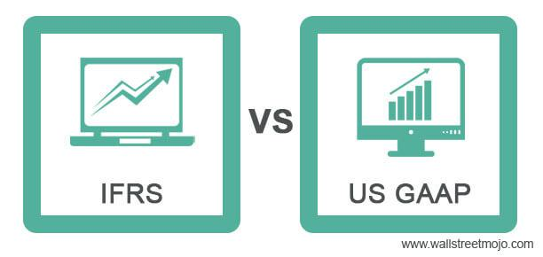

This article explores the intricacies of barter transactions under two major accounting frameworks: US GAAP and IFRS. Barter transactions represent non-monetary exchanges of goods or services, a practice rooted in history but still relevant today. These transactions differ from traditional sales and purchases as they do not utilize currency, posing unique accounting challenges. Accurately recording barter transactions is crucial, as they can significantly impact financial statements, especially in industries where such exchanges are prevalent.

Understanding barter transactions within the framework of US GAAP and IFRS is essential for businesses and investors. Each framework provides guidelines that determine how these transactions should be valued and recorded. Identifying fair market value, often based on historical transactions of similar nature, is a common requirement in both standards. However, complexities arise in the absence of historical data, necessitating the use of different evaluation criteria.

Barter transactions also intersect with modern technological advances, such as algorithmic trading. In this context, the exchange might involve software tools or trading strategies rather than physical goods. Accounting for algorithmic barter exchanges remains a challenge, as it requires accurately reflecting the economic essence of non-monetary transactions in financial statements.

Navigating the differences in how US GAAP and IFRS handle barter transactions enables businesses to maintain transparent and compliant financial reporting. This understanding is pivotal not only for ensuring accurate record-keeping but also for strategic business analysis and decision-making. As the financial landscape evolves, keeping abreast of these accounting nuances becomes increasingly important for all stakeholders involved.

## Table of Contents

## Understanding Barter Transactions

Barter transactions occur when goods or services are exchanged directly for other goods or services, without the involvement of monetary payment. This practice dates back to ancient civilizations where money was not yet established as a medium of exchange. Even in modern economies, barter systems hold importance, especially in situations where currency exchange is impractical or when businesses aim to maximize their resource utilization. 

Today, barter transactions remain significant in various sectors, most notably in advertising. Companies often exchange advertising space or airtime, providing a cost-effective means to promote products without traditional cash transactions. This approach can be advantageous for businesses looking to collaborate without affecting their cash flow directly.

One of the principal challenges in accounting for barter transactions is the absence of conventional purchase receipts or monetary valuation. This predicament requires businesses to employ alternative methods for valuation, emphasizing the importance of assigning a fair market value to the exchanged goods or services. The valuation must be reliable to ensure that financial statements accurately reflect the transaction's economic impacts.

To achieve this, historical data from comparable non-barter transactions is often used. When such data is not available, companies may face complexities in establishing a credible valuation method. Consequently, this necessitates the use of creative yet justifiable approaches to ensure compliance with applicable accounting standards, aiming to reflect the true economic value of barter exchanges on financial statements.

## US GAAP on Barter Transactions

Under US Generally Accepted Accounting Principles (GAAP), the accounting for barter transactions necessitates a careful estimation of fair market value, primarily derived from historical data associated with similar non-barter transactions. This method ensures that the economic substance of these exchanges is adequately captured in the financial statements, even though no actual monetary payment occurs.

In practice, determining the fair market value involves comparing the barter transaction to similar exchanges where monetary consideration was present. This comparison often relies on the historical sale prices of the goods or services involved in the barter. The aim is to approximate what the cash exchange value would be if the transaction were not barter-based.

However, in scenarios where there is an absence of historical data to inform the fair market value, US GAAP stipulates that the transaction should be documented at the carrying value of the asset being exchanged. This carrying value could be significantly lower than the perceived value of the asset, and in certain instances, it might be defaulted to zero. This conservative approach ensures that financial statements do not overstate the value of assets exchanged in barter transactions when reliable valuation evidence is lacking.

The Emerging Issues Task Force (EITF), in its Issue No. 99-17, reinforced the importance of estimating fair market value, particularly highlighting circumstances where no historical purchase or sale transactions exist as a reference. The EITF's guidance emphasizes that entities should use all available means to ascertain a reasonable estimate of fair market value, thereby ensuring that the reporting of barter transactions remains consistent with other types of financial transactions in terms of reliability and transparency.

## IFRS on Barter Transactions

The International Financial Reporting Standards (IFRS) provide specific guidelines for the accounting of barter transactions. IFRS requires that these transactions should be recorded at the fair value of similar non-barter transactions. This fair value must be derived using data from transactions involving unrelated parties to ensure objectivity and avoid bias in valuation.

The International Accounting Standards Board (IASB) issued SIC-31, which focuses on barter transactions involving advertising services, providing a comprehensive framework for their recognition. According to SIC-31, a barter transaction can only be recognized if the fair value of the transaction can be reliably measured. This measurement is deemed reliable when similar services have been exchanged for cash in comparable circumstances, allowing an entity to estimate the fair value reasonably and accurately.

Moreover, IAS 18, which has been superseded by IFRS 15 but holds historical significance, emphasized that revenue from barter transactions is recognized only when the fair value can be reliably estimated. This principle necessitated the presence of an active market for the goods or services exchanged, ensuring that the exchange’s value is reflective of market conditions. The requirement for reliable estimation ensures that companies present a true and fair view of their financial performance and position.

In practice, if no reliable measure of fair value can be determined, IFRS standards suggest that entities should not recognize revenue from barter transactions, thereby ensuring conservatism in financial reporting. This approach underscores the importance of objectivity and credibility in financial documentation, particularly when monetary exchanges are absent.

## Comparison Between US GAAP and IFRS

When examining the accounting treatment of barter transactions, both US GAAP (Generally Accepted Accounting Principles) and IFRS (International Financial Reporting Standards) emphasize the need to estimate the fair market value. However, they diverge in how they handle situations where historical data is unavailable to establish this fair market value.

Under US GAAP, when a reliable measure of fair value is elusive due to an absence of comparable market transactions or historical data, entities are permitted to record the barter transaction at the carrying value of the asset given up. This often results in a valuation of zero if the carrying value does not exist or is not easily determined. This approach allows for a pragmatic solution in scenarios where no clear market evidence is available, thus providing companies with flexibility in their reporting.

Contrastingly, IFRS demands a more stringent approach. The framework insists on using fair value estimates derived from observable market transactions involving unrelated parties, even in the absence of direct historical comparisons. According to SIC-31 (Service Concession Arrangements: Revenue), IFRS requires that an entity look to market transactions that do not involve barter to secure a reliable estimate, ensuring that the revenue recognized for barter transactions is as comparable as possible to monetary transactions. This can add complexity for entities that need to seek out comparable external data before recording the transaction.

These differences underscore the importance for businesses operating internationally or preparing financial statements under both sets of standards, to comprehend the nuances and requirements. While US GAAP provides a more flexible framework that can ease the reporting burden in data-scarce circumstances, IFRS's stringent requirements can enhance the comparability and reliability of financial statements. Hence, companies must assess their specific circumstances and available data to apply the appropriate accounting treatment under each standard, ensuring transparency and compliance in their financial reporting.

## Algorithmic Trading and Barter Transactions

Algorithmic trading involves the use of computer algorithms to automate trading decisions and execute trades at speeds and frequencies that are impossible for human traders. In this highly automated environment, barter transactions may occur when entities exchange trading strategies or software tools instead of payment through traditional monetary means. As such, these non-monetary exchanges require careful attention in accounting to ensure that financial statements accurately represent the economic position and performance of the trading entities involved.

The application of accounting principles to these transactions involves estimating the fair market value of the exchanged goods or services. For instance, if two entities exchange [algorithmic trading](/wiki/algorithmic-trading) strategies, each strategy should be valued based on comparable market data or historical transactions involving similar assets. This assessment is vital, as it underpins the recording of these transactions in financial statements and influences subsequent financial analysis and decision-making.

One of the challenges in accounting for barter transactions in algorithmic trading is the intangible nature of the exchanged assets—such as software or intellectual property. These intangibles often lack a clearly defined market value, complicating the valuation process. To address this, financial professionals might analyze peer transactions or apply valuation techniques such as discounted cash flows, which can quantify the expected future benefits of using a particular trading strategy or tool.

In practical terms, suppose two firms agree to exchange software solutions for algorithmic trading. The accounting treatment would involve identifying comparable transactions or market data to estimate the fair value of the exchanged software and recording it under the appropriate assets or expenses in the financial statements. Python can be utilized to automate aspects of this process, such as data analysis and valuation modeling, using libraries like NumPy and pandas for numerical operations and data manipulation.

Ultimately, accurate accounting for barter transactions in algorithmic trading is crucial. It not only ensures compliance with accounting standards such as US GAAP and IFRS but also reflects the true economic substance of the transactions, providing transparency and aiding stakeholders in making informed decisions.

## Conclusion

In conclusion, the accounting treatment of barter transactions under US GAAP and IFRS plays a vital role in ensuring the transparency and compliance of financial reporting. Although barter transactions occur less frequently than monetary transactions, their impact is significant in particular industries, such as advertising and emerging fields like algorithmic trading. As businesses engage in these non-monetary exchanges, they must grasp the distinct methodologies prescribed by US GAAP and IFRS to determine the fair value of goods or services exchanged.

US GAAP allows for greater flexibility in scenarios where historical data is absent by permitting the use of the carrying value. On the other hand, IFRS emphasizes a more stringent approach, requiring comparisons with unrelated parties to obtain reliable estimates. Understanding these nuances is crucial for businesses to maintain precision in financial reporting and valuation.

Staying informed on these accounting standards ensures accurate and consistent record-keeping, ultimately strengthening the reliability and comparability of financial statements. As the landscape of barter transactions evolves with advancements in technology and trading, the ability to proficiently account for these transactions remains essential for businesses and investors seeking to gain a comprehensive view of their economic activities.

## References & Further Reading

[1]: ["IFRS 15: Revenue from Contracts with Customers"](https://www.ifrs.org/content/dam/ifrs/publications/pdf-standards/english/2021/issued/part-a/ifrs-15-revenue-from-contracts-with-customers.pdf), International Financial Reporting Standards (IFRS).

[2]: ["EITF Issue No. 99-17: Accounting for Advertising Barter Transactions"](https://www.sciencedirect.com/science/article/pii/S0882611010000179), Financial Accounting Standards Board (FASB).

[3]: ["SIC-31: Revenue – Barter Transactions Involving Advertising Services"](https://www.ifrs.org/issued-standards/list-of-standards/sic-31-revenue-barter-transactions-involving-advertising-services/), International Accounting Standards Board (IASB).

[4]: ["IAS 18: Revenue"](https://www.ifrs.org/issued-standards/list-of-standards/ias-18-revenue/), International Accounting Standards Board (IASB) - historical reference as it has been superseded by IFRS 15.

[5]: PwC. (2020). ["In Depth: Accounting for Revenue under IFRS 15"](https://viewpoint.pwc.com/dt/uk/en/pwc/revenue/revenue/revenue.html). PricewaterhouseCoopers.

[6]: ["Barter Exchanges and the Tax Issues Involved"](https://www.irs.gov/taxtopics/tc420), Journal of Accountancy.

[7]: ["An Analysis of Bartering and Economic Systems"](https://accountend.com/understanding-barter-definition-examples-and-significance/), The Manchester School.